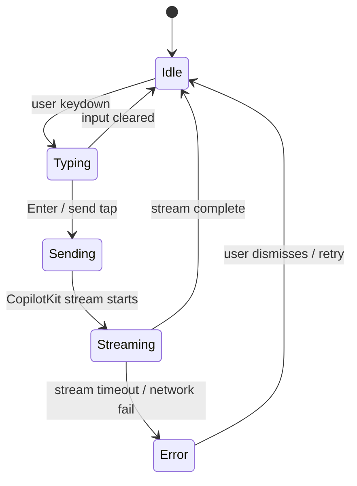

# MOB-CHAT-001 — Mobile Chat Composer + Keyboard UX

## Goal
Sticky composer stays above the virtual keyboard on iOS/Android; textarea grows to max 5 lines; send button always reachable; no layout shift on keyboard open.

## User story
As **Camila** on iPhone, I type a rental query and the composer stays visible above the keyboard while messages scroll naturally above it.

## Screen / path
`/` — chat route, `<390px` viewport

## Current status
**Not Started** — depends on SCREEN-018 mobile shell (FAB, drawer, safe areas, dvh) being Done.

**Already implemented (2026-06-02, not yet evidenced):**
- `src/app/globals.css`: `font-size: 1rem !important` on `.copilotKitInput > textarea` (iOS zoom fix), `min-width/height: 44px` on send button, `max(15px, env(safe-area-inset-bottom))` on input container, `overscroll-behavior-y: contain` on messages
- `src/components/chat/concierge-chat-input.tsx`: `enterKeyHint="send"`, `inputMode="text"`, `scrollHeight`-based auto-grow (max 160px), height reset on clear

**Remaining work:** VisualViewport hook, `useCoAgent` `inProgress` disable, SCREEN-018 to Done state, Playwright spec.

## Build scope

### Frontend
- `src/components/chat/concierge-chat-input.tsx` — primary change surface (already exists; partial mobile fixes applied)
  - Apply `useVisualViewport()` hook: track `window.visualViewport.height` and set a CSS var `--vvh` to avoid stale `100vh` on iOS Safari
  - Verify `enterKeyHint="send"` and `inputMode="text"` props on `<textarea>` (✅ done)
  - Verify `font-size: 1rem` override in `globals.css` (✅ done)
  - Auto-grow via `scrollHeight` up to max 160px (✅ done); extend max to 5 lines (5 × 24px ≈ `max-height: 120px`)
  - Send button: `min-h-[44px] min-w-[44px]` override via `globals.css` (✅ done)
  - `Shift+Enter` inserts newline; bare `Enter` submits (already wired via `onKeyDown`)
  - `Escape` on desktop clears / blurs input
- `src/components/chat/concierge-chat-messages.tsx` — auto-scroll (already exists)
  - Verify `useEffect` on messages array length: `scrollRef.current?.scrollIntoView({ behavior: "smooth" })`
  - Wrap in `prefers-reduced-motion` check: instant scroll when motion reduced
- `src/components/chat/concierge-thinking-indicator.tsx` — streaming skeleton (already exists)
  - Verify 3-line pulse skeleton visible during AI stream

### CopilotKit (v1.55.2 — use `@copilotkit/react-core` v1 imports only)
- Send button disabled while `inProgress` prop is true (already wired via `ConciergeChatInputProps.inProgress`)
- `useCopilotChatInternal()` from `@copilotkit/react-core` — do NOT use v2 import path `@copilotkit/react-core/v2`
- Do NOT call `.append()` — v1 uses `appendMessage` from `useCopilotChat()` in `@copilotkit/react-core`

### Mastra / Supabase
- None

## Acceptance criteria
- [ ] Composer visible above iOS virtual keyboard (VisualViewport API used, not `window.innerHeight`)
- [ ] Textarea `font-size` ≥ 16px verified (no iOS auto-zoom triggered)
- [ ] Textarea grows from 1 line to max 5 lines, then scrolls internally
- [ ] Send button tap target ≥ 44×44px (`data-testid="chat-send-button"`)
- [ ] No layout shift (CLS = 0) when virtual keyboard opens
- [ ] New message auto-scrolls into view after each AI turn
- [ ] Loading skeleton (`data-testid="ai-loading-skeleton"`) visible while AI streams
- [ ] Send button disabled (`aria-disabled="true"`) while streaming
- [ ] `Escape` key clears / blurs composer on desktop
- [ ] `Enter` sends message; `Shift+Enter` adds newline
- [ ] Safe-area bottom padding applied — composer not obscured by iPhone home indicator
- [ ] No horizontal overflow at 390px viewport width
- [ ] Focus ring visible on textarea (`outline` or `ring` token from design system)
- [ ] Send button disabled state styled distinctly (opacity or color change)
- [ ] Chat history scrollable above composer with no overlap — 0 console errors

## Tests
```bash
cd mdeapp && npm test -- --run
npm run lint
npm run typecheck
npm run build
npm run verify:console
npm run floor
PW_SKIP_WEBSERVER=1 npx playwright test e2e/screens/MOB-CHAT-001-mobile-chat-composer.spec.ts --project=chromium
```

## Evidence required
- [ ] Screenshot: composer visible above iOS keyboard (390×844 viewport)
- [ ] Playwright mobile spec pass (chromium + webkit)
- [ ] `npm run floor` exit 0

## Dependencies
- SCREEN-018 (shell with safe areas and dvh — not yet Done)

## Runtime proof (dev restart + Browser)

### Step 1 — Restart dev server
```bash
lsof -ti :3001 | xargs -r kill -9
cd mdeapp && npm run dev
```
Wait for `[ui] ✓ Ready` on `:3001`. Probe:
```bash
curl -s -o /dev/null -w "MOB-CHAT-001 → %{http_code}\n" --max-time 15 -L http://localhost:3001/
```

### Step 2 — Browser MCP proof
| Step | Action | Pass |
|------|--------|------|
| 1 | Navigate `http://localhost:3001/` at 390×844 | 200 + composer visible |
| 2 | Snapshot | `data-testid="chat-composer"`, `chat-send-button`, `ai-loading-skeleton` present |
| 3 | Simulate keyboard open (resize viewport height to 500) | Composer still visible |
| 4 | Type multi-line message | Textarea grows ≤ 5 lines |
| 5 | Console check | 0 errors |
| 6 | Screenshot | Save to `mdeapp/tmp/screenshots/MOB-CHAT-001/` |

### Step 3 — Playwright proof
```bash
cd mdeapp
PW_SKIP_WEBSERVER=1 npx playwright test e2e/screens/MOB-CHAT-001-mobile-chat-composer.spec.ts --project=webkit
```

---

## Composer state machine



## Common failure points
1. **iOS VisualViewport not tracked** — if `window.innerHeight` is used instead of `visualViewport.height`, the composer disappears behind the keyboard on Safari; fix: subscribe to `visualViewport.resize` event.
2. **Font-size < 16px triggers iOS auto-zoom** — even 15.9px causes zoom; always set `font-size: 1rem` on the textarea element, not just a parent.
3. **Android Chrome viewport resize differs from iOS** — Android resizes `window.innerHeight`; iOS does not. The `VisualViewport` API normalizes this but requires a polyfill check.
4. **PWA standalone keyboard** — in PWA mode, `env(safe-area-inset-bottom)` is still needed but keyboard handling may differ; test with `display: standalone` simulation.
5. **Landscape keyboard height** — landscape virtual keyboard on iPhone takes ~50% of visible height; composer must still be visible; test at 844×390 (rotated) viewport.

## Done gate (all required)
- [ ] Dev server restarted clean
- [ ] Browser MCP: navigate + snapshot + console clean + screenshot
- [ ] Playwright spec pass (chromium + webkit mobile)
- [ ] `npm run floor` exit 0
- [ ] No broken network calls on happy path
- [ ] Screenshots under `mdeapp/tmp/screenshots/MOB-CHAT-001/`

## Do not do
- Do not use `window.innerHeight` for keyboard detection on iOS
- Do not set `font-size < 16px` on any touch input
