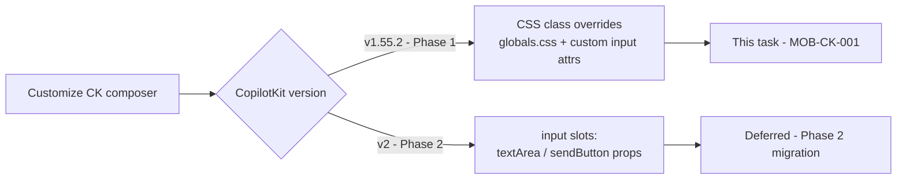
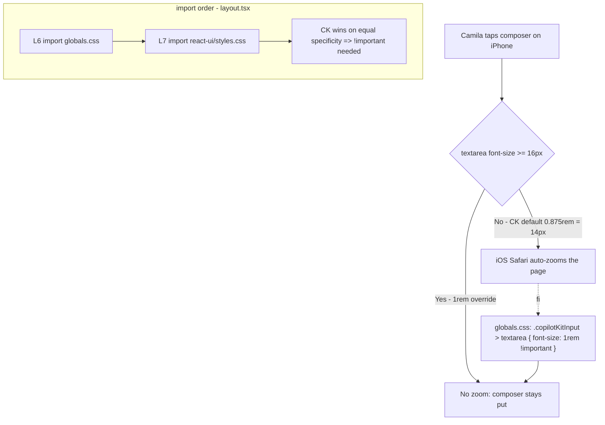
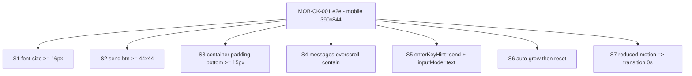

# MOB-CK-001 — CopilotKit v1 Mobile Best Practices

## Goal

Make the CopilotKit **v1.55.2** chat composer meet iOS/Android mobile standards:
no auto-zoom on input focus, a 44px send-button touch target, safe-area padding
on the input container, reduced-motion respect for streaming animations, mobile
keyboard hints, and an auto-growing textarea.

## User story

As **Camila** on iPhone, I tap the chat input and the page does **not** zoom — the
composer stays at the same scale, the send button is easy to hit with a thumb, the
input is not hidden behind the home bar, and the box grows as I type a longer message.

## Screen / path

`/` — chat surface, all mobile viewports (primary target 390×844, iPhone 12/13/14).

---

## Why this is a v1 CSS-override task (not a v2 slot task)

CopilotKit **v1.55.2 exposes no input slot API**. The `input={{ textArea, sendButton }}`
slots that would normally let you wrap the composer are **v2 only**
(`@copilotkit/react-core/v2` — verified against `.claude/skills/copilotkit/references/slots.md`).
mdeapp is hard-pinned to v1.55.2 for Phase 1, so:

- The composer is a **custom** textarea (`src/components/chat/concierge-chat-input.tsx`)
  that reuses CopilotKit's class names — CK's `Input` is not exported in 1.55.2.
- The only way to restyle it is **CSS class selectors** in `globals.css`.
- Input-level behavior (`enterKeyHint`, `inputMode`, auto-grow) is plain web-platform
  code on the custom textarea — no CopilotKit API involved.



### The cascade trap (why `!important` is required)

`layout.tsx` imports `globals.css` **before** `@copilotkit/react-ui/styles.css`, so on
equal specificity CK's bundled rules win. Properties CK already sets (textarea
`font-size`, container `padding-bottom`) therefore need `!important` to override.
Properties CK does **not** set (`min-width/height`, `overscroll-behavior-y`) do not.



---

## Implementation (shipped 2026-06-03 — this task)

> The earlier revision of this file claimed these were "already implemented." They
> were **not** on disk (only `viewportFit:"cover"` existed). They were implemented
> as part of MOB-CK-001 on 2026-06-03 and proven by the Playwright spec below.

### `src/app/globals.css` — MOB-CK-001 block

| Fix | Selector | What it does |
|-----|----------|-------------|
| `font-size: 1rem !important` | `.copilotKitInput > textarea` | iOS Safari auto-zooms inputs < 16px; CK ships 0.875rem (14px) |
| `min-width: 44px; min-height: 44px` | `.copilotKitInputControlButton` | WCAG 2.5.5 touch target; CK ships 24×24px |
| `padding-bottom: max(15px, env(safe-area-inset-bottom)) !important` | `.copilotKitInputContainer` | Keeps composer above the iOS home indicator; preserves CK's 15px floor |
| `overscroll-behavior-y: contain` | `.copilotKitMessages` | Stops page pull-to-refresh firing when scrolling messages |
| `transition/animation/transform: none !important` | `.copilotKitInputControlButton`, `.copilotKitActivityDot1/2/3` under `prefers-reduced-motion: reduce` | Honors reduced-motion for button + typing dots |

### `src/components/chat/concierge-chat-input.tsx`

| Fix | What it does |
|-----|-------------|
| `enterKeyHint="send"` on `<textarea>` | Mobile keyboard shows a "Send" action key |
| `inputMode="text"` on `<textarea>` | Explicit text keyboard (no numeric/email guess) |
| `scrollHeight` auto-grow, capped 160px, in `onChange` | Box expands with content; scrolls past 160px |
| height reset to `auto` on send | Collapses back to one row after a message is sent |

### `src/app/layout.tsx` (pre-existing, confirmed)

| Fix | What it does |
|-----|-------------|
| `viewportFit: "cover"` in `export const viewport` | Enables `env(safe-area-inset-*)` on notched iOS devices |

### ⬜ Deferred to Phase 2 (CopilotKit v2 migration)

| Fix | Why blocked |
|-----|-------------|
| `input={{ textArea, sendButton }}` slot override | v2 slot system not in v1.55.2 |
| Headless UI via `useAgent` + `useFrontendTool` | v2 primitives only |

---

## Implementation steps (repeatable)

1. **Verify the gate** — confirm v1.55.2 has no input slots (`copilotkit` skill →
   `references/slots.md`); confirm the composer is the custom
   `concierge-chat-input.tsx`, not CK's `Input`.
2. **Read CK defaults** — `node_modules/@copilotkit/react-ui/src/css/input.css` to get
   the exact selectors/values to override (textarea 0.875rem, button 24px, container 15px).
3. **Check import order** — `layout.tsx`: is `globals.css` before `react-ui/styles.css`?
   If yes, add `!important` on properties CK sets.
4. **Add the `globals.css` MOB-CK-001 block** — the 5 rules above, each commented with WHY.
5. **Patch the custom input** — `enterKeyHint`, `inputMode`, auto-grow in `onChange`,
   height reset on send.
6. **Write/refresh the Playwright spec** — `MOB-CK-001-mobile-composer.spec.ts` (7 assertions).
7. **Gate** — `npm run build` → `npm test -- --run` → run the e2e spec on a **fresh**
   dev server (kill stale :3001 first).
8. **Evidence** — screenshot at 390×844 + green spec output into the evidence file.

---

## Success criteria (measurable)

| # | Criterion | Measured by |
|---|-----------|-------------|
| S1 | Composer textarea computed `font-size` ≥ 16px at 390px | e2e assertion |
| S2 | Send button bounding box ≥ 44×44px | e2e assertion |
| S3 | Input container `padding-bottom` ≥ 15px (floor) | e2e assertion |
| S4 | Messages `overscroll-behavior-y` === `contain` | e2e assertion |
| S5 | Textarea `enterkeyhint="send"` and `inputmode="text"` | e2e assertion |
| S6 | Textarea grows with 5+ lines, collapses after clear | e2e assertion |
| S7 | Under `prefers-reduced-motion`, send-button `transition-duration` === `0s` | e2e assertion |
| S8 | `npm run build` exit 0 | CI / local |
| S9 | `npm test -- --run` all green (no regression) | CI / local |
| S10 | No critical console errors on mobile home load | e2e console hygiene |



---

## Tests

```bash
cd mdeapp

# unit + build gates
npm test -- --run
npm run build

# mobile composer e2e — run against a FRESH dev server (kill stale :3001 first)
./node_modules/.bin/next dev --webpack -p 3009 &   # fresh server with the edits
SMOKE_BASE_URL=http://localhost:3009 PW_SKIP_WEBSERVER=1 \
  npx playwright test e2e/screens/MOB-CK-001-mobile-composer.spec.ts --project=chromium
```

Spec: [`mdeapp/e2e/screens/MOB-CK-001-mobile-composer.spec.ts`](../../../mdeapp/e2e/screens/MOB-CK-001-mobile-composer.spec.ts)
— 7 assertions, one per success criterion S1–S7, plus console hygiene (S10).

---

## CopilotKit v1 API reference (mdeapp-specific)

```typescript
// v1 hooks — from @copilotkit/react-core (NOT @copilotkit/react-core/v2)
import { useCopilotChatInternal } from "@copilotkit/react-core";
// Composer is custom: @copilotkit/react-ui does NOT export Input in 1.55.2.

// Do NOT use (all v2):
//   useFrontendTool / useAgent / .append() / input={{ textArea }} slots
// Agent name must equal the Mastra agents key:
useCoAgent({ name: "conciergeAgent" });
```

---

## Production-ready checklist (Done gate — all required)

> Evidence: [`tasks/evidence/MOB-CK-001-evidence.md`](../../evidence/MOB-CK-001-evidence.md)
> — proven 2026-06-02 in isolated worktree `.worktrees/wt-san521` (branch
> `ai/san-521-mob-ck-001-mobile-composer`) on a fresh dev server `:3013`.

- [x] `globals.css` MOB-CK-001 block present: font-size 1rem, 44px target, safe-area,
      overscroll-contain, reduced-motion
- [x] `concierge-chat-input.tsx`: `enterKeyHint="send"`, `inputMode="text"`, auto-grow + reset
- [x] `layout.tsx` exports `viewport` with `viewportFit: "cover"`
- [x] `npm run build` exit 0 (`✓ Compiled successfully in 7.9s`)
- [x] `npm test -- --run` all green (**488/488**, exit 0)
- [x] `MOB-CK-001-mobile-composer.spec.ts` 7/7 green on a fresh server (:3013, 19.8s)
- [x] Screenshot at 390×844 (no zoom, send button tappable) in evidence file (`composer-390.png`)
- [x] Localhost runtime proof: dev server `:3013` 200 + compiled-CSS grep shows all 5 overrides
- [x] Regression: SCREEN-018 9/9 + restaurant fast-path 1/1 (SAN-462 soak scope) green
- [ ] **Manual mobile verification on real iOS+Android device** (no-zoom / no keyboard jump / tap / grow / scroll / reduced-motion) — requires human + device
- [ ] Linear SAN-521 comment with evidence link; flip Done only after the two boxes above

## Runtime proof (these greps must now PASS)

```bash
grep "viewportFit" mdeapp/src/app/layout.tsx
grep "font-size: 1rem" mdeapp/src/app/globals.css
grep "enterKeyHint" mdeapp/src/components/chat/concierge-chat-input.tsx
grep "overscroll-behavior-y" mdeapp/src/app/globals.css
curl -s -o /dev/null -w "MOB-CK-001 / -> %{http_code}\n" --max-time 15 -L http://localhost:3001/
```

## Soak-freeze note (SAN-462)

`concierge-chat-input.tsx` also hosts the rental/event/restaurant/grounded **fast-path**
calls (the SAN-462 nightly-soak scope). This task does **not** touch that routing — only
the textarea element (attributes + auto-grow) and CSS. Still, while the soak is < 3/3
green, **merge** of this branch should wait for soak clearance or explicit approval.

## Do not

- Do not import from `@copilotkit/react-core/v2` — Phase 2 only
- Do not use `useFrontendTool`, `useAgent`, `.append()`, or `input={{…}}` slots — v2 APIs
- Do not replace CSS overrides with inline `style=` on CK internals — fragile across upgrades
- Do not remove `!important` on font-size/padding-bottom — the import order makes CK win otherwise
