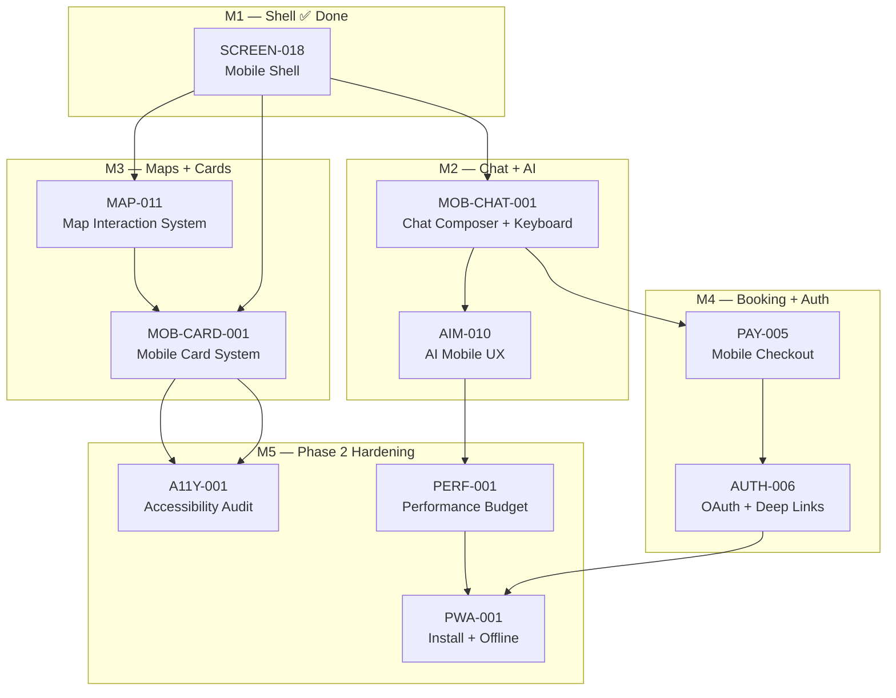
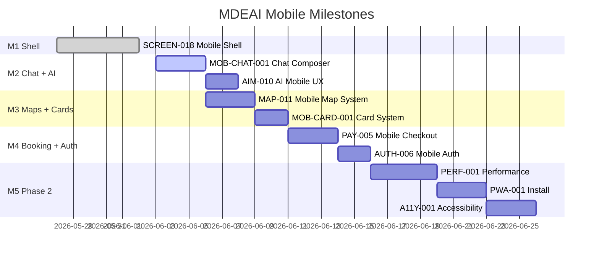

# MDEAI Mobile Production Strategy

> **Current mobile readiness: ~40% complete.** SCREEN-018 (shell foundation) shipped. Nine epics remain across five milestones to reach production mobile parity.

---

## 1. Executive Summary

MDEAI is an AI-first city concierge for Medellín. The product lives primarily in mobile hands — Camila searching rentals on her commute, Andrés buying event tickets from El Poblado, Roberto publishing a venue from his phone. Every interaction that fails on mobile is a lost conversion and a broken product promise.

**Current state:** The 3-panel desktop shell is solid. SCREEN-018 is **In Progress** — nav drawer, map FAB/sheet are on disk; Playwright 8/8 and `layout.tsx` viewport export still outstanding. That is the foundation, not the product.

**What remains:** Chat UX that survives the iOS keyboard. Cards designed for thumbs. Map gestures that don't fight page scroll. A checkout flow that works with Apple Pay. An AI experience that gives mobile users contextual chips, not a blank text box.

**Strategy:** Ship the mobile experience in five milestones. M1 is done. M2–M4 are MVP-blocking. M5 is Phase 2 hardening. Do not optimize before M3 ships — premature optimization of an incomplete product wastes cycles.

---

## 2. Mobile Maturity Audit

| Area | Coverage | Status | Blocking? |
|---|---|---|---|
| Shell / navigation | SCREEN-018 🟡 In Progress | FAB + drawer on disk; Playwright + viewport export outstanding | No |
| Chat composer + keyboard | None | iOS keyboard pushes form | **Yes — M2** |
| Map interactions | Partial | Pinch-zoom, tap-to-detail missing | **Yes — M3** |
| Card system | Partial | Desktop-first sizing | M3 |
| Checkout / payments | None tested on mobile | Stripe Elements mobile untested | **Yes — M4** |
| Auth / session | Partial | OAuth redirects untested on Safari | M4 |
| AI mobile UX | None | No chips, no location context | M2 |
| Performance | None audited | No LCP target, no skeleton loading | Phase 2 |
| PWA / installability | None | No manifest, no service worker | Phase 2 |
| Accessibility | Partial | Safe areas + reduced-motion only | Phase 2 |

---

## 3. Mobile Architecture

### Layer stack



### Component responsibilities

| Layer | Component | Owner Task |
|---|---|---|
| Shell | `ChatCanvas`, `MapMobileSheet`, `ChatNavDrawer` | SCREEN-018 ✅ |
| Composer | `MobileChatComposer`, `useVisualViewport` | MOB-CHAT-001 |
| Map | `ChatMap` with `gestureHandling: "greedy"`, snap points | MAP-011 |
| Cards | `RentalCard`, `EventCard`, `RestaurantCard` mobile variants | MOB-CARD-001 |
| Checkout | Stripe Elements mobile + Apple/Google Pay | PAY-005 |
| Auth | Supabase PKCE flow + deep-link recovery | AUTH-006 |
| AI UX | Quick-action chips + streaming skeleton | AIM-010 |
| Performance | `next/image`, dynamic map import, skeletons | PERF-001 |
| PWA | `manifest.json`, service worker, install prompt | PWA-001 |
| A11Y | ARIA labels, axe-core, focus management | A11Y-001 |

### Key design invariants

- **`viewport-fit=cover`** already set in `layout.tsx` → `env(safe-area-inset-*)` works everywhere
- **`100dvh` not `100vh`** → accounts for mobile browser chrome collapse
- **`position: sticky; bottom: env(safe-area-inset-bottom)`** on all bottom-fixed UI
- **Font-size ≥ 16px on all inputs** → prevents iOS auto-zoom
- **Touch targets ≥ 44×44px** → all interactive elements
- **`gestureHandling: "greedy"`** on all Google Maps instances → prevents scroll conflict
- **`prefers-reduced-motion`** guard on all transitions → already in `globals.css`

---

## 4. Milestone Roadmap



### M1 — Shell Foundation ✅
**Shipped:** SCREEN-018 — nav drawer, map FAB, sheet, safe areas, dvh, reduced-motion.

### M2 — Chat + AI UX (MVP P0)
**Goal:** Chat works on mobile. Keyboard doesn't break the layout. Chips reduce friction.

| Task | Priority | Effort | Owner |
|---|---|---|---|
| MOB-CHAT-001 Mobile Chat Composer + Keyboard UX | P0 | 3h | Sofía |
| AIM-010 Mobile AI Concierge UX | P1 | 2h | Sofía |

**Done when:** Camila can type a rental query on iPhone with the keyboard up and the send button is visible.

### M3 — Maps + Discovery (MVP P0)
**Goal:** Pins are tappable. Carousels work. Cards are thumb-sized.

| Task | Priority | Effort |
|---|---|---|
| MAP-011 Mobile Map Interaction System | P0 | 4h |
| MOB-CARD-001 Mobile Card System | P1 | 3h |

**Done when:** Camila pinch-zooms the map, taps a rental pin, sees a detail sheet — all without triggering page scroll.

### M4 — Booking + Payments (MVP P0)
**Goal:** Andrés pays on iPhone. Roberto can log in from Safari.

| Task | Priority | Effort |
|---|---|---|
| PAY-005 Mobile Checkout UX | P0 | 4h |
| AUTH-006 Mobile Auth Stability | P1 | 3h |

**Done when:** Andrés completes an Apple Pay checkout from the event detail sheet on iPhone Safari.

### M5 — Performance + PWA + A11Y (Phase 2)
**Goal:** Lighthouse ≥ 80. App installable. VoiceOver usable.

| Task | Priority | Effort |
|---|---|---|
| PERF-001 Mobile Performance Optimization | P1 | 5h |
| PWA-001 Mobile Install Experience | P1 | 4h |
| A11Y-001 Mobile Accessibility Audit | P2 | 4h |

---

## 5. Linear-Ready Tasks

All tasks use the prefix system from `linear.md`. New prefixes introduced: `PERF-*`, `PWA-*`, `A11Y-*`. Existing prefixes extended: `SCREEN-*`, `MAP-*`, `PAY-*`, `AIM-*`, `AUTH-*`.

| Linear ID | Task | Prefix | Milestone | Priority | Phase |
|---|---|---|---|---|---|
| SAN-TBD | Mobile Chat Composer + Keyboard UX | MOB-CHAT-001 | M2 | P0 | phase:mvp |
| SAN-TBD | Mobile AI Concierge UX | AIM-010 | M2 | P1 | phase:mvp |
| SAN-TBD | Mobile Map Interaction System | MAP-011 | M3 | P0 | phase:mvp |
| SAN-TBD | Mobile Card System | MOB-CARD-001 | M3 | P1 | phase:mvp |
| SAN-TBD | Mobile Checkout UX | PAY-005 | M4 | P0 | phase:mvp |
| SAN-TBD | Mobile Auth Stability | AUTH-006 | M4 | P1 | phase:mvp |
| SAN-TBD | Mobile Performance Optimization | PERF-001 | M5 | P1 | phase:launch |
| SAN-TBD | Mobile Install Experience | PWA-001 | M5 | P1 | phase:launch |
| SAN-TBD | Mobile Accessibility Audit | A11Y-001 | M5 | P2 | phase:launch |

**Labels to apply:** `track:ux`, `platform:mobile`, plus milestone label.

---

## 6. Testing Strategy

### Playwright viewports

```ts
// From screen-evidence.ts — already defined
export const MOBILE_VIEWPORT = { width: 390, height: 844 };   // iPhone 14
export const TABLET_VIEWPORT = { width: 768, height: 1024 };   // iPad
export const DESKTOP_VIEWPORT = { width: 1280, height: 900 };  // Desktop
```

Additional viewports to add per task spec:
```ts
export const ANDROID_VIEWPORT = { width: 412, height: 915 };   // Pixel 7
export const IPHONE_SE_VIEWPORT = { width: 375, height: 667 }; // iPhone SE (small)
export const LANDSCAPE_VIEWPORT = { width: 844, height: 390 }; // Landscape
```

### Test categories per task

| Category | Tool | What it proves |
|---|---|---|
| Layout / overflow | Playwright `evaluate(scrollWidth > innerWidth)` | No horizontal overflow |
| Touch target size | Playwright `boundingBox()` | ≥ 44×44px |
| CSS state | Playwright `toHaveCSS('display', 'none')` | Responsive hiding |
| Portal mounting | Playwright `toBeAttached({ timeout: 10000 })` | Sheet/drawer mounts |
| iOS zoom prevention | Playwright `toHaveCSS('font-size', ...)` | Input ≥ 16px |
| Performance | Playwright + Lighthouse | LCP < 2.5s |
| Accessibility | `@axe-core/playwright` | AA violations |

### Helpers to add in `e2e/helpers/mobile-utils.ts`

```ts
export async function gotoShell(page, route = '/') {
  // Lightweight nav — no waitForResponse listener
  // Waits for chat-canvas + textarea visible
}

export async function emulateIOS(page) {
  await page.emulateMedia({ features: [{ name: 'prefers-color-scheme', value: 'dark' }] });
  // Add touch event simulation
}

export async function assertNoOverflow(page) {
  const overflow = await page.evaluate(() =>
    document.documentElement.scrollWidth > window.innerWidth + 2);
  expect(overflow).toBe(false);
}

export async function assertTouchTarget(locator, minSize = 44) {
  const box = await locator.boundingBox();
  expect(box?.height).toBeGreaterThanOrEqual(minSize);
  expect(box?.width).toBeGreaterThanOrEqual(minSize);
}
```

---

## 7. Risk Audit

| Risk | Impact | Likelihood | Mitigation |
|---|---|---|---|
| iOS keyboard pushes composer off-screen | HIGH | CERTAIN | `visualViewport` API, sticky composer |
| Google Maps touch events conflict with page scroll | HIGH | LIKELY | `gestureHandling: "greedy"` |
| Stripe Elements iOS zoom on card input | HIGH | CERTAIN | `font-size: 16px` on Stripe appearance |
| Apple Pay blocked on non-HTTPS | HIGH | CERTAIN | Vercel HTTPS enforced |
| Safari ITP blocks OAuth cookies | MEDIUM | LIKELY | PKCE flow in Supabase |
| CopilotKit SSE keeps React busy, delays Sheet mounts | MEDIUM | OBSERVED | `gotoShell` helper (no waitForResponse) |
| Sheet portal doesn't mount within 10s in test suite | MEDIUM | OBSERVED | Per-test fresh page context, no serial mode |
| PWA service worker intercepts `/api/*` SSE routes | HIGH | LIKELY | Exclude API routes from SW fetch handler |
| `100vh` mobile browser chrome shows scrollbar | MEDIUM | CERTAIN | Use `100dvh` everywhere |
| VoiceOver announces portal content before it mounts | LOW | POSSIBLE | `aria-hidden` during mount transition |

---

## 8. Implementation Order

Execute strictly in this order within each milestone. Tasks in the same milestone can run in parallel if staffed.

```
M1 ✅  SCREEN-018 (shell, FAB, drawer, safe areas)

M2     MOB-CHAT-001 (chat composer) — BLOCKS AIM-010
       AIM-010 (AI chips, location context) — after MOB-CHAT-001

M3     MAP-011 (mobile map interactions) — parallel with MOB-CHAT-001
       MOB-CARD-001 (card system) — after MAP-011

M4     PAY-005 (checkout UX) — after MOB-CARD-001
       AUTH-006 (auth stability) — parallel with PAY-005

M5     PERF-001 (performance) — after M3
       PWA-001 (install) — after PERF-001 + AUTH-006
       A11Y-001 (accessibility) — after MOB-CARD-001
```

**Critical path to MVP mobile parity:** MOB-CHAT-001 → MAP-011 → PAY-005

---

## 9. MVP Mobile Launch Criteria

Before declaring mobile production-ready:

- [ ] MOB-CHAT-001: Chat composer visible above iOS keyboard (verified on real device or BrowserStack)
- [ ] MAP-011: Pinch-zoom in map sheet without page scroll conflict
- [ ] MOB-CARD-001: Cards full-width at 390px, CTAs ≥ 44px
- [ ] PAY-005: Stripe Elements renders at 390px, Apple Pay button visible on Safari
- [ ] AUTH-006: Google OAuth redirects back to app on iPhone Safari
- [ ] AIM-010: Quick-action chips trigger concierge queries
- [ ] 0 console errors on `/` at 390px viewport
- [ ] No horizontal overflow at 375px, 390px, 412px
- [ ] All touch targets ≥ 44×44px (Playwright `boundingBox` assertions)
- [ ] `prefers-reduced-motion` removes all sheet/drawer transitions
- [ ] `npm run floor` exits 0 (Vitest + lint + build + audit)
- [ ] Playwright mobile spec passes all 3 browsers (chromium/firefox/webkit)

---

## 10. Advanced Mobile Roadmap (Phase 3–4)

Post-MVP enhancements — do not implement before M4 is shipped.

| Feature | Prefix | Phase | Notes |
|---|---|---|---|
| Voice input for concierge queries | AIM-011 | Phase 3 | `speechRecognition` API |
| Biometric auth (FaceID/fingerprint) | AUTH-007 | Phase 3 | WebAuthn |
| Offline itinerary viewing | PWA-002 | Phase 3 | Service worker cache |
| Native app share sheet | SCREEN-021 | Phase 3 | Web Share API |
| Push notification for events | PWA-003 | Phase 3 | Web Push + Supabase realtime |
| Haptic feedback on map interactions | AIM-012 | Phase 4 | `navigator.vibrate` |
| Augmented reality venue preview | AIM-013 | Phase 4 | WebXR |
| Mobile host dashboard | SCREEN-022 | Phase 4 | Roberto on mobile |
| Location-aware smart routing | MAP-012 | Phase 4 | Google Directions API |

---

## Skills reference

| Area | Skill |
|---|---|
| Mobile layout + Tailwind | `tailwind-responsive-ui` |
| Testing | `responsive-design` (refs/testing-playwright.md) |
| Maps | `mde-maps` |
| CopilotKit (v1.55.2) | `copilotkit` |
| Supabase / auth | `mde-supabase` |
| Task lifecycle | `mde-task-lifecycle` |

> Use **`responsive-design`** for layout + Playwright proof; **`tailwind-responsive-ui`** for Tailwind-only refactors — do not list both plus archived skill names.

External references used in planning:
- Google Maps Mobile Best Practices: https://developers.google.com/maps/documentation/javascript/best-practices
- Google Maps Web Components: https://mapsplatform.google.com/resources/blog/build-maps-faster-web-components/
- shadcn/ui components: https://ui.shadcn.com/docs/components
- CopilotKit: https://github.com/CopilotKit/CopilotKit
