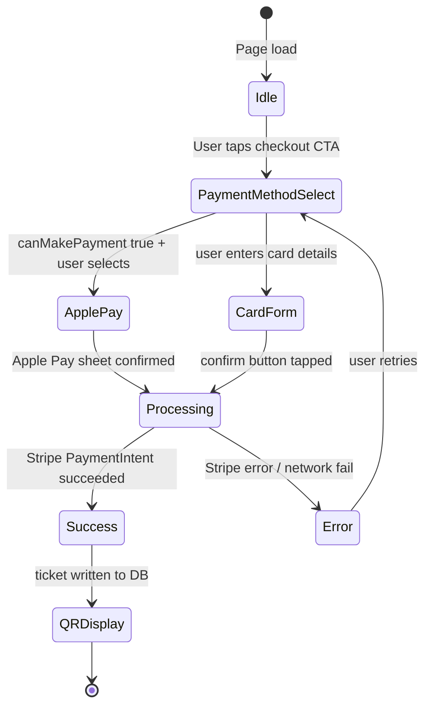

# PAY-005 — Mobile Checkout UX — Stripe + QR + Apple/Google Pay

## Goal
Stripe Elements renders correctly at 390px; Apple Pay / Google Pay Payment Request buttons visible when supported; QR ticket code legible at 390px; form fields prevent iOS auto-zoom; checkout flow works in Safari on iPhone.

## User story
As **Andrés** on iPhone, I pay for an event ticket using Apple Pay in 2 taps without the form zooming or the confirm button being out of reach.

## Screen / path
`/events/[slug]` — checkout modal/page; `/me/tickets` — QR ticket view

## Current status
**Not Started** — depends on SCREEN-018 (safe areas), MOB-CHAT-001 (chat context), and existing Stripe payment foundation.

## Build scope

### Frontend
- `src/components/checkout/checkout-form.tsx`
  - Stripe `<Elements>` appearance: `variables: { fontSizeBase: "16px", fontFamily: "inherit" }` — prevents iOS auto-zoom on card number iframe
  - `<PaymentElement>` or separate `<CardElement>` — verify renders in Stripe iframes at 390px
  - All non-Stripe inputs: `font-size: 1rem`, `autocomplete` attributes (name, email, billing)
  - `inputmode="numeric"` on card number field (Stripe handles internally, but verify)
  - Confirm button: `w-full h-12 min-h-[44px] rounded-lg` with `data-testid="checkout-confirm-button"`
  - Error messages: `text-sm` (≥ 14px), `role="alert"` for accessibility
  - `data-testid="checkout-form"`
- `src/components/checkout/payment-request-button.tsx`
  - `@stripe/stripe-js` `PaymentRequest` API: `new stripe.paymentRequest({ country: "CO", currency: "cop", ... })`
  - Check `paymentRequest.canMakePayment()` → show `<PaymentRequestButtonElement>` if truthy
  - Hide button on unsupported browsers (Firefox mobile, most Android browsers without GPay)
  - `data-testid="payment-request-button"` — visible only when supported
- `src/components/tickets/ticket-qr.tsx`
  - QR code: `w-full max-w-[280px] mx-auto` — legible at 390px
  - `data-testid="ticket-qr"` — present on success screen
  - Add `aria-label="QR code for your ticket"` on QR container
- `src/app/me/tickets/page.tsx`
  - Full-screen success confirmation: centered QR + order summary
  - Back navigation preserved — no `router.replace` that drops history

### Supabase
- `orders` table write on success: idempotency key via `stripe_payment_intent_id`
- Service role key usage: only in `/api/stripe/webhook` — never in client component

## Acceptance criteria
- [ ] Stripe card input fields render at 390px without horizontal overflow (`data-testid="checkout-form"`)
- [ ] No iOS auto-zoom on Stripe card number input (Stripe `fontSizeBase: "16px"` applied)
- [ ] Apple Pay button (`data-testid="payment-request-button"`) visible on Safari/iOS when supported
- [ ] Google Pay button visible on Chrome Android when supported
- [ ] Confirm CTA button ≥ 44px height, full-width at 390px
- [ ] QR code (`data-testid="ticket-qr"`) legible and full-width at 390px on `/me/tickets`
- [ ] Form validation errors visible at 390px — no text truncation
- [ ] Back navigation preserved after checkout (browser back returns to event page)
- [ ] Success confirmation renders full-screen with QR after payment
- [ ] Order confirmation email triggered (Supabase edge function or Stripe webhook)
- [ ] No CORS or network errors during Stripe Elements init
- [ ] 0 console errors on checkout form render + payment submission

## Tests
```bash
cd mdeapp && npm test -- --run
npm run lint
npm run typecheck
npm run build
npm run verify:console
npm run floor
PW_SKIP_WEBSERVER=1 npx playwright test e2e/screens/PAY-005-mobile-checkout.spec.ts --project=webkit
```

## Evidence required
- [ ] Screenshot: checkout form at 390px with Stripe fields visible
- [ ] Screenshot: ticket QR code on `/me/tickets` at 390px
- [ ] Playwright mobile webkit spec pass

## Dependencies
- SCREEN-018 ✅ (safe areas)
- MOB-CHAT-001 ✅ (chat composer)
- Stripe payment foundation (existing integration)

## Runtime proof (dev restart + Browser)

### Step 1 — Restart dev server
```bash
lsof -ti :3001 | xargs -r kill -9
cd mdeapp && npm run dev
```
Probe:
```bash
curl -s -o /dev/null -w "PAY-005 events → %{http_code}\n" --max-time 15 -L http://localhost:3001/events/test-event
curl -s -o /dev/null -w "PAY-005 tickets → %{http_code}\n" --max-time 15 -L http://localhost:3001/me/tickets
```

### Step 2 — Browser MCP proof
| Step | Action | Pass |
|------|--------|------|
| 1 | Navigate `/events/[slug]` at 390×844 | Checkout form renders |
| 2 | Inspect Stripe iframe font | `fontSizeBase` = 16px |
| 3 | Check Payment Request button | Visible if Apple Pay supported |
| 4 | Navigate `/me/tickets` | QR renders ≤ 280px wide |
| 5 | Console check | 0 errors |

---

## Checkout flow state machine



## Common failure points
1. **Safari blocks Apple Pay on non-HTTPS** — `canMakePayment()` always returns false on `http://`; in local dev use ngrok or Stripe test mode which bypasses HTTPS requirement for test cards.
2. **Payment Request API unavailable on Firefox mobile** — `stripe.paymentRequest()` returns null; always guard with `canMakePayment()` check and hide the button conditionally.
3. **Stripe iframe auto-zoom** — Stripe renders card inputs in `<iframe>` tags; setting `fontSizeBase: "16px"` in `appearance.variables` propagates into the iframe and prevents iOS zoom.
4. **iOS keyboard pushes checkout form** — the Stripe card input field is in an iframe; the `VisualViewport` trick from MOB-CHAT-001 applies here too; confirm button must remain in viewport when keyboard opens.
5. **Autofill conflicts with Stripe iframe** — browser password managers may try to autofill Stripe's card number iframe; set `autocomplete="cc-number"` hints on wrapper elements and let Stripe handle the rest.

## Done gate (all required)
- [ ] Dev server restarted clean
- [ ] Browser MCP: navigate + snapshot + console clean + screenshot
- [ ] Playwright webkit mobile spec pass
- [ ] `npm run floor` exit 0
- [ ] No service-role key in client components (hook `no-service-role-in-src.mjs` passes)
- [ ] Screenshots under `mdeapp/tmp/screenshots/PAY-005/`

## Do not do
- Do not set `font-size < 16px` on any payment form input or Stripe appearance variable
- Do not use service-role key outside `/api/stripe/webhook` or Mastra server-only routes
