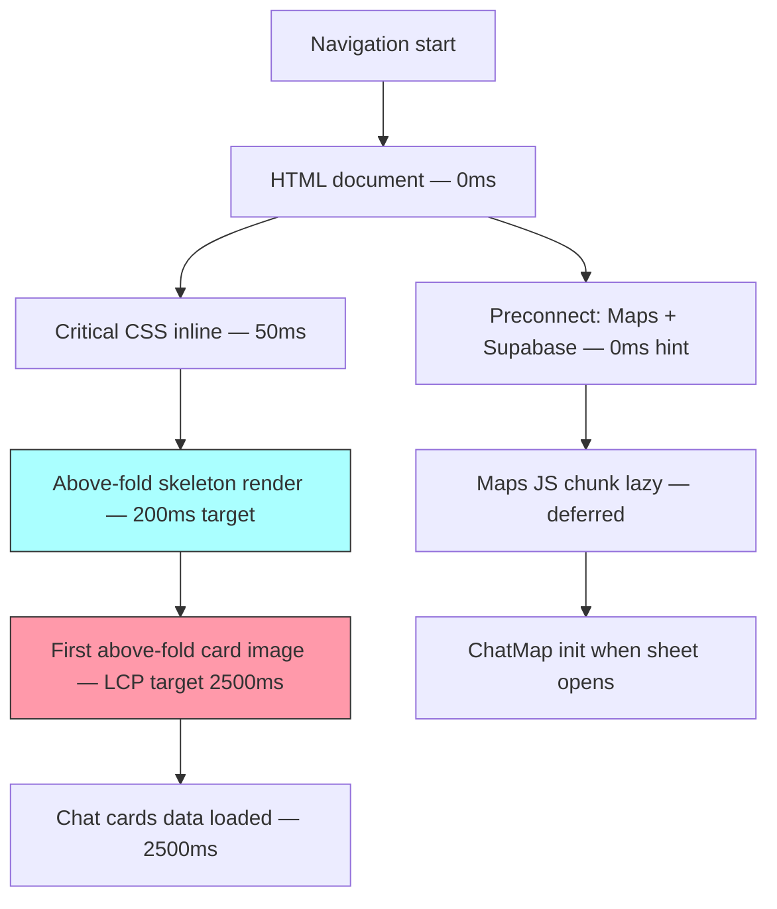

# PERF-001 — Mobile Performance Optimization — LCP, CLS, FID Targets

## Goal
LCP < 2.5s on 4G mobile; CLS < 0.1; INP < 200ms; bundle split for map JS; image optimization with `next/image`; skeleton loading for all data-fetched content.

## User story
As **Camila** on 4G mobile, the home page renders with a visible skeleton in <1s and fully loaded cards appear within 2.5s — not a blank white screen.

## Screen / path
`/` and `/chat` — primary discovery surfaces, mobile viewport

## Current status
**Not Started** — Phase 2 task; depends on MOB-CHAT-001, MAP-011, and MOB-CARD-001 being complete.

## Build scope

### Frontend — Images
- All card images (`rental-card`, `event-card`, `restaurant-card`): replace `` with `next/image`
  - `sizes="(max-width:768px) 100vw, 320px"` — tells browser which image to fetch
  - `loading="lazy"` on all below-fold cards
  - `priority` prop only on the first visible card above-fold
  - Aspect-ratio wrapper `div` prevents CLS (already in MOB-CARD-001 — verify carry-through)

### Frontend — Code Splitting
- `src/components/map/chat-map.tsx`: wrap in `dynamic(() => import(...))`
  - `const ChatMap = dynamic(() => import('@/components/map/chat-map'), { ssr: false, loading: () => <MapSkeleton /> })`
  - `loading` prop: `<MapSkeleton />` — `animate-pulse bg-muted h-full w-full rounded`
  - `data-testid="map-skeleton"` on loading fallback
- Verify ChatMap is NOT in initial bundle: run `npm run build` + check `.next/static/chunks/` — no `google` or `@googlemaps` in initial JS

### Frontend — Resource Hints
- `src/app/layout.tsx`: add `<link rel="preconnect">` tags in `<head>`:
  - `https://maps.googleapis.com`
  - `https://maps.gstatic.com`
  - Supabase project URL (`NEXT_PUBLIC_SUPABASE_URL`)
- `<link rel="dns-prefetch">` for CopilotKit remote runtime (if used)

### Frontend — Skeletons
- Verify all data-fetched surfaces have skeletons before first data arrives:
  - `data-testid="rental-card-skeleton"`, `data-testid="event-card-skeleton"`
  - `data-testid="ai-loading-skeleton"` (from MOB-CHAT-001)
- Skeleton: `animate-pulse bg-muted rounded` using oklch muted token — no hardcoded grays

### Build verification
- `npm run build` → check bundle output; maps chunk should be separate
- `next-bundle-analyzer` if installed: `ANALYZE=true npm run build`
- Target: maps-related chunk < 80kb gzip

## Acceptance criteria
- [ ] LCP < 2.5s on Chrome DevTools "Slow 4G" throttle (measured via Lighthouse)
- [ ] CLS < 0.1 — no layout shifts on card image load or skeleton → content swap
- [ ] INP < 200ms on tap (chip tap, card CTA tap) — measured via Lighthouse
- [ ] `ChatMap` lazy-loaded — not present in initial JS bundle
- [ ] All card images use `next/image` with correct `sizes` attribute
- [ ] Skeletons shown before data loads on all 3 card types
- [ ] No blocking `<script>` or `<link rel="stylesheet">` in `<head>` (Lighthouse check)
- [ ] Bundle analyzer shows maps chunk separate from main app chunk
- [ ] Lighthouse mobile performance score ≥ 80 on `/` route
- [ ] 0 console errors on page load + scroll

## Tests
```bash
cd mdeapp && npm test -- --run
npm run lint
npm run typecheck
npm run build
npm run verify:console
npm run floor
PW_SKIP_WEBSERVER=1 npx playwright test e2e/perf/PERF-001-mobile-performance.spec.ts --project=chromium
```

## Evidence required
- [ ] Lighthouse mobile report: LCP, CLS, INP values passing targets
- [ ] Bundle output showing maps chunk separate
- [ ] Playwright Lighthouse spec pass

## Dependencies
- MOB-CHAT-001 ✅ (composer — streaming skeleton)
- MAP-011 ✅ (ChatMap component)
- MOB-CARD-001 ✅ (card images + aspect ratios)

## Runtime proof (dev restart + Browser)

### Step 1 — Production build (performance testing requires prod build)
```bash
cd mdeapp && npm run build && npm run start
```
Probe:
```bash
curl -s -o /dev/null -w "PERF-001 → %{http_code}\n" --max-time 15 -L http://localhost:3000/
```

### Step 2 — Lighthouse via Browser MCP
| Step | Action | Pass |
|------|--------|------|
| 1 | Navigate `http://localhost:3000/` | Page loads |
| 2 | Throttle to "Slow 4G" in DevTools | Network throttled |
| 3 | Run Lighthouse mobile | LCP < 2.5s, CLS < 0.1 |
| 4 | Check bundle output | Maps chunk separate |
| 5 | Console check | 0 errors |

---

## LCP waterfall — performance budget



## Common failure points
1. **Turbopack dev vs prod bundle size** — `npm run dev` with Turbopack does not reflect production bundle splitting; always use `npm run build` + `npx next-bundle-analyzer` to verify map chunk separation.
2. **`AdvancedMarker` constructor fires before Maps library ready** — when `ChatMap` loads lazily, there's a race between the `@googlemaps/markerclusterer` init and the Maps JS loading; use `useJsApiLoader`'s `isLoaded` flag before constructing any marker.
3. **`next/image` remote domain missing from config** — if Supabase storage or Places API photo URLs are not listed in `next.config.ts` `images.remotePatterns`, Next.js returns a 400 and the image fails to load, impacting CLS (image collapses).
4. **Skeleton uses hardcoded gray** — `bg-gray-200` is a regression per CLAUDE.md; use `bg-muted` oklch token instead; this also affects dark mode correctness.
5. **`preconnect` in `<body>` not `<head>`** — resource hints must be in `<head>` to take effect before parsing; Next.js metadata API places them correctly only when added via the `<head>` tag in layout, not in page components.

## Done gate (all required)
- [ ] Production build clean (`npm run build` exit 0)
- [ ] Lighthouse mobile: LCP < 2.5s, CLS < 0.1, INP < 200ms
- [ ] Bundle: maps chunk separate, < 80kb gzip
- [ ] Playwright Lighthouse spec pass
- [ ] `npm run floor` exit 0
- [ ] Screenshots under `mdeapp/tmp/screenshots/PERF-001/`

## Do not do
- Do not test performance metrics against `npm run dev` build — use `npm run build && npm run start`
- Do not use `bg-gray-*` for skeletons — use oklch `bg-muted` token
