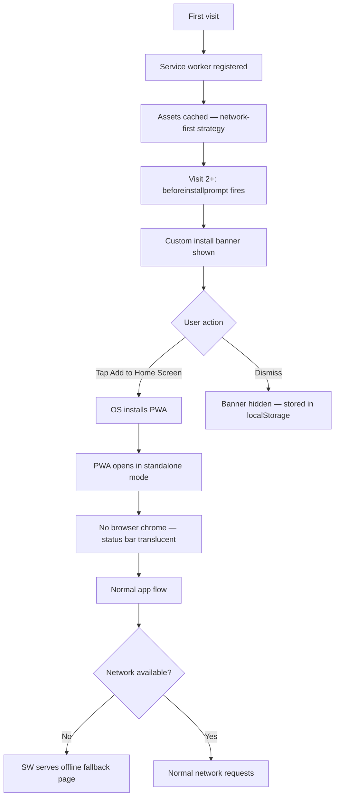

# PWA-001 — Mobile PWA Install Experience — Manifest, Offline, Splash

## Goal
Chrome/Safari install prompt available; offline fallback page renders; app icons correct; standalone mode removes browser chrome; push notification permission prompt implemented (MVP: permission only, no actual sends).

## User story
As **Camila** on iPhone, I install MDEAI to my home screen and it opens in standalone mode without Safari's address bar — the splash screen shows the MDEAI logo while the app boots.

## Screen / path
`/` — all routes; install prompt appears after 2+ qualifying visits

## Current status
**Not Started** — Phase 2 task. Depends on MOB-CHAT-001 (composer), AUTH-006 (session stability), and PERF-001 (performance budget).

## Build scope

### Manifest
- `src/app/manifest.ts` (Next.js 16 manifest API) or `public/manifest.json`
  - `name: "MDEAI — Medellín Concierge"`
  - `short_name: "mdeai"`
  - `display: "standalone"`
  - `start_url: "/"`
  - `theme_color`: read from CSS `--background` oklch token → convert to hex for manifest
  - `background_color`: same
  - `icons`: `[{ src: "/icons/icon-192.png", sizes: "192x192", type: "image/png" }, { src: "/icons/icon-512.png", sizes: "512x512", type: "image/png", purpose: "any maskable" }]`
  - `orientation: "portrait-primary"`

### App Icons
- `public/icons/icon-192.png` — 192×192 MDEAI logo
- `public/icons/icon-512.png` — 512×512 MDEAI logo (maskable safe-zone: 80% of canvas)
- `src/app/layout.tsx` head: `<link rel="apple-touch-icon" href="/icons/icon-192.png">`
- `<meta name="apple-mobile-web-app-capable" content="yes">`
- `<meta name="apple-mobile-web-app-status-bar-style" content="black-translucent">`

### Service Worker
- `public/sw.js` (custom) or integrate `next-pwa` package
  - Cache strategy:
    - **Network-first** for `/api/*` routes — never cache SSE or copilotkit responses
    - **Cache-first** for static assets (`/_next/static/**`, fonts, icons)
    - **Network-first with offline fallback** for page routes
  - Offline fallback: serve `/offline` when navigation fails
  - CRITICAL: `fetch` event handler must NOT intercept `/api/copilotkit` — SSE streams break if cached
  - Register in `src/app/layout.tsx`: `navigator.serviceWorker.register('/sw.js')`
  - `data-testid` N/A (service worker is non-DOM)

### Offline Page
- `src/app/offline/page.tsx`
  - Full-screen centered layout: MDEAI logo + "You're offline" heading + "Try again" button
  - `data-testid="offline-page"`, `data-testid="offline-retry-button"`
  - Uses only CSS + static assets (no data fetches)
  - Cache last-viewed page shell in service worker for partial offline experience

### Install Prompt (Android Chrome)
- `src/hooks/use-pwa-install.ts`
  - Listen for `beforeinstallprompt` event → store in state
  - Show custom install banner after 2nd qualifying visit: `data-testid="pwa-install-banner"`
  - Banner: dismiss (stored in `localStorage`) + "Add to home screen" CTA button

## Acceptance criteria
- [ ] `manifest.json` valid — Lighthouse PWA audit passes
- [ ] App icons present: 192×192 and 512×512 (`public/icons/`)
- [ ] `display: standalone` confirmed — no browser chrome on Android after install
- [ ] Offline page (`data-testid="offline-page"`) renders without network
- [ ] Install prompt (`data-testid="pwa-install-banner"`) fires on Android Chrome after 2+ visits
- [ ] `apple-mobile-web-app-capable` meta tag present in `<head>`
- [ ] `theme-color` matches dark mode background (no white flash)
- [ ] `start_url: "/"` returns HTTP 200
- [ ] Service worker registered on page load
- [ ] Service worker does NOT intercept `/api/copilotkit` or any `/api/*` SSE route
- [ ] 0 console errors on page load + offline simulation

## Tests
```bash
cd mdeapp && npm test -- --run
npm run lint
npm run typecheck
npm run build
npm run verify:console
npm run floor
PW_SKIP_WEBSERVER=1 npx playwright test e2e/pwa/PWA-001-install.spec.ts --project=chromium
```

## Evidence required
- [ ] Lighthouse PWA audit: all checks pass
- [ ] Screenshot: offline page at 390px
- [ ] Screenshot: app icon on simulated home screen
- [ ] Playwright spec pass

## Dependencies
- MOB-CHAT-001 ✅
- AUTH-006 ✅ (session survives standalone mode)
- PERF-001 ✅ (performance budget for service worker caching)

## Runtime proof (dev restart + Browser)

### Step 1 — Production build (service workers require HTTPS or localhost)
```bash
cd mdeapp && npm run build && npm run start
```
Probe:
```bash
curl -s -o /dev/null -w "PWA manifest → %{http_code}\n" --max-time 15 -L http://localhost:3000/manifest.json
```

### Step 2 — Browser MCP proof
| Step | Action | Pass |
|------|--------|------|
| 1 | Navigate `http://localhost:3000/` | SW registers |
| 2 | DevTools → Application → Manifest | Valid, icons listed |
| 3 | Simulate offline (DevTools Network → Offline) | `/offline` page renders |
| 4 | Check SW fetch handler | `/api/*` not intercepted |
| 5 | Console check | 0 errors |

---

## PWA install flow



## Common failure points
1. **iOS Safari does not support `beforeinstallprompt`** — on iOS, there is no programmatic install prompt; users must use "Add to Home Screen" manually from the Share menu; the install banner should only show on Android Chrome where the event fires.
2. **Service worker intercepts SSE (CopilotKit)** — a `fetch` event handler that matches `/*` will intercept the `/api/copilotkit` SSE stream; add an explicit `if (url.pathname.startsWith('/api/')) return;` early return in the fetch handler.
3. **`display: standalone` broken on older iOS** — iOS 16.4+ fully supports `display: standalone` via Web App Manifest; older iOS ignores the manifest and requires `apple-mobile-web-app-capable` meta tag; include both.
4. **Chrome install criteria: HTTPS required** — `beforeinstallprompt` only fires on HTTPS or `localhost`; in staging use a real domain or ngrok; the service worker registration itself works on localhost.
5. **Maskable icon safe zone** — Google requires maskable icons to have the main content within 80% of the canvas (center 80%×80% safe zone); icons that extend to the edge get clipped in circle/squircle masks on Android; verify the 512px icon has correct safe zone.

## Done gate (all required)
- [ ] Production build clean
- [ ] Lighthouse PWA audit: all items pass
- [ ] Offline page verified in DevTools Network Offline mode
- [ ] Service worker does not intercept `/api/*`
- [ ] `npm run floor` exit 0
- [ ] Screenshots under `mdeapp/tmp/screenshots/PWA-001/`

## Do not do
- Do not cache `/api/copilotkit` or any SSE endpoint in service worker
- Do not show `beforeinstallprompt` banner on iOS — it never fires there
