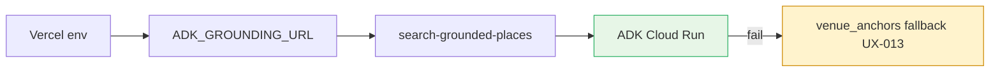

# UX-018 — Set `ADK_GROUNDING_URL` on Vercel

## Plain-English problem

Café tool tries ADK first; on Vercel the URL is `http://localhost:8000` → instant fail → fallback. UX-013 fixes fallback with anchors; this task enables **live Google grounding** on prod.

## User impact

- **Tourist:** richer live pins + fresher POIs when ADK is up; anchors remain backup.

## Implementation steps

1. Deploy ADK grounding service (see `tasks/evidence/ADK/`).
2. Set `ADK_GROUNDING_URL` in Vercel project env (preview + production).
3. Smoke: grounding path returns pins without localhost error in logs.
4. Verify cost/field-mask rules per `mde-maps`.

## Acceptance criteria

- [ ] Vercel prod has non-localhost `ADK_GROUNDING_URL`.
- [ ] Grounding smoke passes on preview deploy.
- [ ] Fallback to `venue_anchors` still works when ADK errors.

## Do not overbuild

- No ADK service implementation in this task — env + verify only.

## Flow diagram

## Verification (2026-05-31)

| Claim | Result |
|-------|--------|
| Env var name | ✅ `ADK_GROUNDING_URL` in adk-grounding-client.ts |
| Default localhost | ✅ Confirmed — prod broken without override |
| Depends UX-013 | ✅ Fallback must work when ADK fails |
