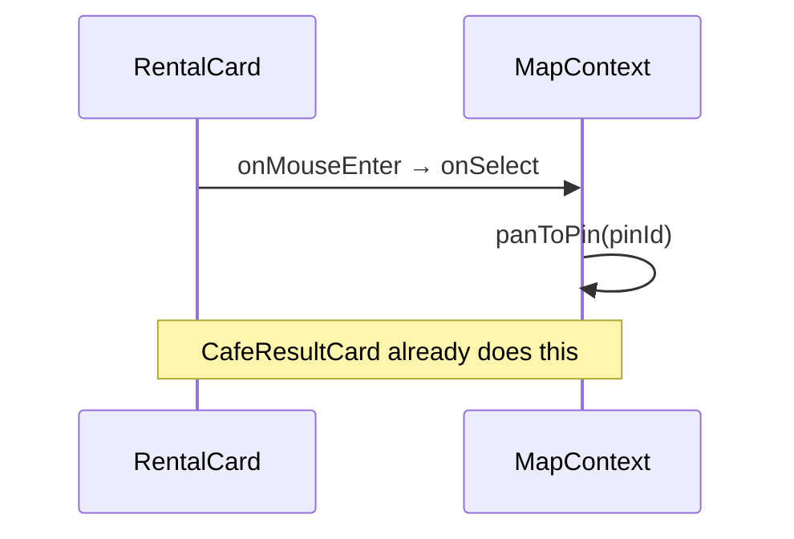

# UX-024 — Hover→pin parity (R-02)

## Purpose

Map feels connected when hovering list cards — matches Google Maps / Airbnb list behavior.

## Affected files

- `rental-card.tsx` — add `onMouseEnter`/`onFocus`; normalize `onSelect?: () => void` (callers close over id)
- `event-card.tsx` — same
- `search-tool-renders.tsx` — update call sites if signature changes

## Tests

- Vitest: mock `onSelect`, fire `mouseEnter`, assert called once.
- Playwright (optional in UX-030): hover card → pin attribute changes.

## Acceptance

- [ ] Hover rental/event card calls `panToPin` without opening detail panel.
- [ ] Click still opens detail when configured.
- [ ] `npm run floor` green.

## Flow diagram

## Verification (2026-05-31)

| Claim | Result |
|-------|--------|
| Cafe hover→pin | ✅ onMouseEnter |
| Rental hover→pin | 🔴 missing |
| onSelect signature | 🟡 rental uses id param |
