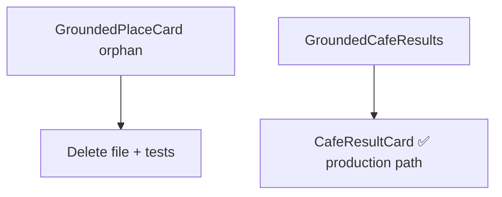

# UX-029 — Retire GroundedPlaceCard (M4)

## Purpose

Reduce bundle noise and test maintenance for dead code.

## Files to remove or archive

- `grounded-place-card.tsx`
- `__tests__/grounded-place-card.test.tsx`
- `GroundingAttribution.tsx` if still unmounted (verify grep)
- Dead helpers in `parse-grounded-tool-result.ts` if only referenced by removed components

## Decision

**Default: delete.** Repurpose only if product wants compact POI card — then wire explicitly in `DomainResults`.

## Acceptance

- [ ] No orphaned imports.
- [ ] Cafe grounded path still uses `CafeResultCard`.
- [ ] `npm run floor` green.

## Flow diagram

## Verification (2026-05-31)

| Claim | Result |
|-------|--------|
| Orphan confirmed | ✅ no JSX importers except tests |
| Cafe path | ✅ CafeResultCard |
