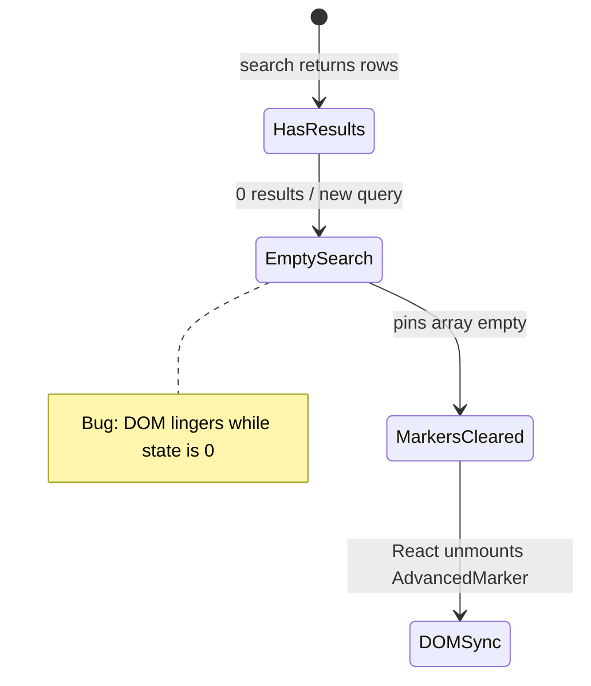

# UX-033 — Stale map markers (from UX-007)

## Purpose

Map says "5 places" while list says "no results" — trust break for **Camila** and **Tourist**.

## Approach (verify-first)

1. Reproduce: `"1BR in Laureles under $1/night"` → empty results.
2. Inspect marker count vs `mergePinsByCategory` state.
3. If bug gone → add regression e2e only.
4. If reproduces → fix in `ChatMap.tsx` / `ClusteredCategoryMarkers.tsx` on category clear.

## Files

- `src/components/maps/ChatMap.tsx`
- `src/components/maps/ClusteredCategoryMarkers.tsx`
- `src/platform/maps/merge-pins-by-category.ts`
- `e2e/` marker-count assertion (extend `rich-card-dedup` or new spec)

## Acceptance

- [ ] Empty search → 0 visible markers == 0 pin state.
- [ ] E2e locks behavior.

## Flow diagram

## Verification (2026-05-31)

| Claim | Result |
|-------|--------|
| F-4 from May-28 QA | Not re-verified on current branch |
| Fix before test | ❌ verify-first per UX-007 |
