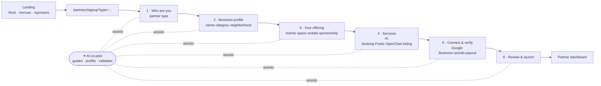
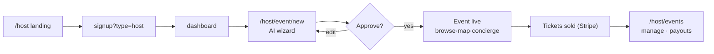
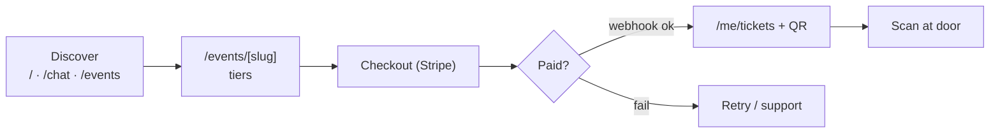
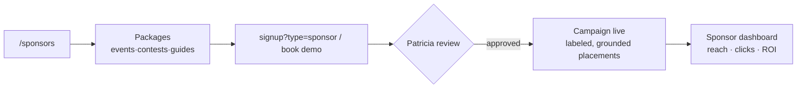
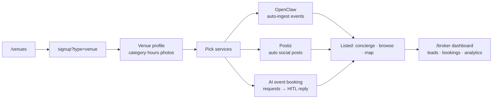
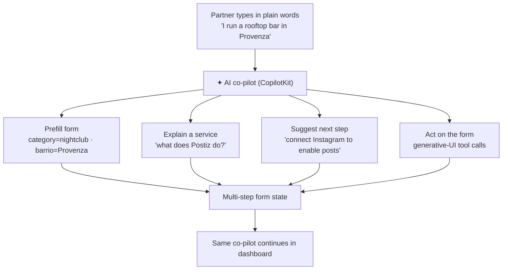

# Partner & marketplace journeys

> ⚠️ **Status (2026-06-06): early draft — superseded in part by the numbered blueprint.** This was the first pass. Canonical now: **PRD → [`prd-partners.md`](./prd-partners.md)** · journeys → [`04-journey-maps.md`](./04-journey-maps.md) (10 diagrams) · signup → [`05-signup-wizard.md`](./05-signup-wizard.md) (**10 steps, per-partner-type config**) · dashboards → [`06-dashboards.md`](./06-dashboards.md). The stakeholders, URL map, and AI-interaction diagram below remain accurate; the **6-step signup** and **"dashboard undecided"** notes here are stale (see corrections inline).

> **One line:** mdeai is a multi-sided marketplace. Demand (Camila/Andrés/Tourist) is mostly built; this doc designs the **supply + B2B sign-up side** — partners (hosts, venues, brokers, sponsors, AI-services clients) onboard through **one signup engine with per-type steps + an AI chat co-pilot**, then land in a **partner dashboard**.

## 1. Stakeholders

| # | Stakeholder | Side | Wants | Enters via |
|---|---|---|---|---|
| 1 | **Camila** — apartment seeker | Demand | Find + view rentals | `/`, `/rentals`, `/chat` |
| 2 | **Andrés / Miguel** — ticket buyer | Demand | Buy event tickets | `/events`, `/events/[slug]`, checkout |
| 3 | **Tourist** — discovery | Demand | Restaurants/cafés/nightlife | `/`, `/chat`, browse |
| 4 | **Roberto** — event host | Supply | Publish + sell events | `/host` → signup → `/host/event/new` |
| 5 | **Venue owner** (restaurant·café·nightclub) | Supply | Get listed + fill the venue | `/venues` → signup → dashboard |
| 6 | **Rental broker** | Supply | List units, get leads | `/partners/rentals` → signup |
| 7 | **Sponsor / brand** | B2B revenue | Reach via events/contests | `/sponsors` → signup |
| 8 | **Company** (AI-services client) | B2B revenue | Buy AI builds / automation | `/business/ai` → signup/demo |
| 9 | **Channel partner** (tourism board, hotel) | B2B | Integrate / co-promote | `/partners` → signup |
| 10 | **Patricia** — admin/ops | Internal | Approve, moderate, observe | `/admin/*` |

## 2. Pages for each stakeholder

| Stakeholder | Marketing | Sign-up | Logged-in app |
|---|---|---|---|
| Camila | `/`, `/rentals` | `/signup` | `/chat`, `/rentals`, `/saved`, `/trips` |
| Andrés | `/events` | `/signup` | `/events/[slug]`, checkout, `/me/tickets` |
| Tourist | `/`, guides | — | `/chat`, `/restaurants`, `/cafes`, `/nightlife` |
| Roberto (host) | `/host` | `/partners/signup?type=host` | `/host/event/new`, `/host/events`, dashboard |
| Venue owner | `/venues`, `/venues/features` | `/partners/signup?type=venue` | `/broker/*` dashboard (listings·leads·marketing) |
| Broker | `/partners/rentals` | `/partners/signup?type=broker` | `/broker/listings`, `/broker/leads` |
| Sponsor | `/sponsors`, `/contests` | `/partners/signup?type=sponsor` | sponsor dashboard (campaigns·analytics) |
| Company (AI) | `/business/ai`, `/business/social` | `/partners/signup?type=agency` or demo | project dashboard |
| Channel partner | `/partners` | `/partners/signup?type=partner` | partner dashboard |
| Patricia | — | internal | `/admin/leads`, `/admin/listings`, `/admin/events`, `/admin/cost` |

## 3. Service URL map (the "url context for services")

```
MARKETING (top of funnel)
  /                      home
  /about  /how-it-works  /pricing  /contact
  /host                  → event hosts
  /venues                → venues (restaurants/cafés/nightclubs)
    /venues/features
  /partners              → partnerships hub
    /partners/rentals    → brokers ("Rentals AI")
  /business/ai           → AI services / agency
  /business/social       → Postiz social-media management
  /business/event-marketing
  /sponsors  /contests

SIGN-UP (one wizard, typed)
  /partners/signup?type=host|venue|broker|sponsor|agency|partner
  /signup  /login        → consumers
  /auth/callback

LOGGED-IN APP (delivery)
  /dashboard             → partner home (role-aware)
  /broker/{listings,leads,payouts}
  /host/{event/new,events}
  /admin/{leads,listings,events,users,cost}
  /chat /rentals /events /restaurants /cafes /nightlife /saved /trips /me/tickets
```

## 4. Journeys (mermaid)

### 4a. Partner signup — multi-step form + AI co-pilot



### 4b. Event host (Roberto)



### 4c. Ticket buyer (Andrés)



### 4d. Sponsor / brand



### 4e. Venue listing (restaurant · café · nightclub)



### 4f. How the AI interacts (concierge across surfaces)



## 5. The professional multi-step signup + AI chat (flagship design)

> **Canonical spec is [`05-signup-wizard.md`](./05-signup-wizard.md): 10 steps + a per-partner-type matrix** (the wizard differs by type). The 6-step table below is the simplified MVP view — keep it as the minimum; the 10-step version adds Pricing · Photos · Location · Goals split out.

**Layout:** split — **stepper + form (left, ~62%)** │ **AI co-pilot chat (right, ~38%)**. Top = progress bar. The chat is not decoration: it **reads and writes the form** (generative UI), so a partner can either fill fields or just talk.

| Step | Fields | AI co-pilot does |
|---|---|---|
| 1 · Who are you | Partner type (Host·Venue·Broker·Sponsor·Agency) | Detects type from a sentence; sets `?type=` |
| 2 · Business profile | Name · category · neighborhood · contact | Prefills category/barrio from NL; validates phone/email |
| 3 · Your offering | What you list (events·space·rentals·sponsorship) | Suggests offering from category |
| 4 · Services | AI event booking · Postiz · OpenClaw · listing · ticketing · reporting (multi-select) | Explains each; recommends a bundle |
| 5 · Connect & verify | Google Business · Instagram/socials · payout | Explains why; flags what unlocks which service |
| 6 · Review & launch | Summary + submit | Recaps, confirms, routes to dashboard |

**Patterns (reuse, don't rebuild):** CopilotKit input + `renderAndWaitForResponse` for the co-pilot acting on the form; shadcn `form`, `progress`/stepper (custom), `select`, `checkbox`/`toggle-group`, `tabs`. Save draft between steps (resume later). Mobile → chat collapses to a bottom sheet; form is single-column.

**States:** per step — empty, in-progress (autosave), validation error; submit — loading, success → dashboard, error → retry. A11y: each step is a labeled fieldset; chat is announce-on-update; keyboard-navigable.

## 6. Partner dashboard (post-signup delivery)

> **Decided:** new role-aware **`/dashboard`**; `/broker/*` folds in as a redirect/alias (rationale in [`06-dashboards.md`](./06-dashboards.md)). Linear: SAN-690.

Role-aware home (`/dashboard`). Tabs:
**Overview** (status, next steps) · **Listings/Events** · **Leads & bookings** (HITL approve/send) · **Marketing** (Postiz scheduled posts) · **Analytics** (views·leads·revenue) · **✦ AI assistant** (same co-pilot — "draft a post for Friday", "reply to this lead").

## 7. Signup process as cards + scrolling marquee

For the marketing landings (`/host`, `/venues`, `/sponsors`): show the signup as a **horizontal scrolling marquee of step-cards** — `1 Tell us about you → 2 Pick services → 3 Connect → 4 Go live`. Calm, slow auto-scroll; **pauses on hover**; honors `prefers-reduced-motion` (static grid fallback). Component: 21st `cta-with-marquee` pattern restyled to tokens, or a custom CSS marquee of shadcn `card`s.

## 8. Per-page design notes (Linear registry)

> Full sitemap + milestones: [`index-partners.md`](./index-partners.md) · [`revenue/07-linear-structure.md`](./revenue/07-linear-structure.md). Dashboard = **SAN-690** (SAN-666 canceled).

| Page | Route | Layout | Key components | Linear |
|---|---|---|---|---|
| Partner hub | `/partners` | hero + partner-type cards + marquee | card · marquee | [SAN-692](https://linear.app/sanjiovani/issue/SAN-692) |
| **Partner signup** | `/partners/signup` | **stepper + form │ AI chat** | form · progress · CopilotKit · select · toggle-group | [SAN-665](https://linear.app/sanjiovani/issue/SAN-665) (wireframe ready; blockedBy SAN-683) |
| Partner dashboard | `/dashboard` · `/broker/*` → alias | sidebar + tabs | sidebar · tabs · table · chart | [SAN-690](https://linear.app/sanjiovani/issue/SAN-690) (blockedBy SAN-683) |
| Contact / demo | `/contact` | short form | form | [SAN-693](https://linear.app/sanjiovani/issue/SAN-693) |
| For Hosts | `/host` | Mindtrip-style landing | — | [SAN-660](https://linear.app/sanjiovani/issue/SAN-660) |
| For Venues | `/venues` | Mindtrip-style B2B (`?v=`) | — | [SAN-661](https://linear.app/sanjiovani/issue/SAN-661) |
| Venue features | `/venues/features` | feature deep-dive | card grid | [SAN-703](https://linear.app/sanjiovani/issue/SAN-703) |
| Rentals / brokers | `/partners/rentals` | B2B landing | — | [SAN-691](https://linear.app/sanjiovani/issue/SAN-691) |
| AI services | `/business/ai` | B2B landing | — | [SAN-663](https://linear.app/sanjiovani/issue/SAN-663) |
| Event marketing | `/business/event-marketing` | service landing | — | [SAN-701](https://linear.app/sanjiovani/issue/SAN-701) |
| Postiz / social | `/business/social` | service landing | — | [SAN-697](https://linear.app/sanjiovani/issue/SAN-697) |
| Sponsors | `/sponsors` | B2B landing | — | [SAN-664](https://linear.app/sanjiovani/issue/SAN-664) |
| Contests | `/contests` | consumer + sponsor hub | — | [SAN-694](https://linear.app/sanjiovani/issue/SAN-694) |
| Pricing | `/pricing` | plans matrix | — | [SAN-695](https://linear.app/sanjiovani/issue/SAN-695) |
| Creator program | `/partners/creator` | affiliate landing | — | [SAN-696](https://linear.app/sanjiovani/issue/SAN-696) |
| Marketplace vendor | `/partners/vendor` | vendor landing | — | [SAN-702](https://linear.app/sanjiovani/issue/SAN-702) |

## 9. Open questions

1. ✅ **Resolved** — **one engine, per-partner-type config** (the wizard differs by type; see `05-signup-wizard.md` matrix).
2. ✅ **Resolved** — co-pilot **acts on the form** (generative UI), not advice-only — it's the differentiator.
3. ✅ **Resolved** — new unified **`/dashboard`**; `/broker/*` becomes an alias (`06-dashboards.md`).
4. ⏳ **Open** — verification depth: how much (Google Business / payout) gates "go live" vs after. Recommend: minimal to list as *draft*, verify to *go live*.
