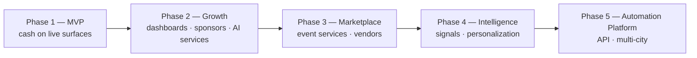

# Part 12 — Final Roadmap

> **Canonical PRD:** [`prd-partners.md`](./prd-partners.md) — this roadmap is its §9. Milestones (M1 Acquire → M5 Expand): [`revenue/07-linear-structure.md`](./revenue/07-linear-structure.md).

Realistic, reuse-first. Track A (consumer North Star) always leads; partner work layers on.

## Phase table

| Phase | Theme | Key features | Stakeholders | Revenue | KPIs | Risks | Dependencies |
|---|---|---|---|---|---|---|---|
| **1 — MVP** | Demand + first supply + first cash | concierge · browse · tickets (live) · rentals catalog · `/host` · `/venues` landings + **one signup wizard** | Consumers · hosts · brokers · venues | ticket fees · rental leads | GMV · tickets sold · leads · partners onboarded | thin supply at launch | D-08 card · `/api/partners` · Stripe webhook |
| **2 — Growth** | Monetize + B2B | partner dashboards · featured/subscriptions · sponsors · AI-services (Postiz) · marketing automation | + sponsors · agencies | subs · sponsorship · retainers | MRR · partner retention · sponsor $ | sales capacity | dashboards · automation engine |
| **3 — Marketplace** | Services + vendors | event-services bundle · vendor storefronts · creator program | + vendors · creators | commissions · vendor subs | marketplace GMV · take rate | quality/trust | COMM/Medusa track |
| **4 — Intelligence** | Data moat | venue/event/rental signals · semantic recall · personalization · AI ranking | all | better conversion (lifts all) | conversion lift · session depth | data quality | MIS/INT tracks |
| **5 — Automation Platform** | Self-driving partners | end-to-end partner automations · embeds/API · multi-city template | partners · channel · cities | platform/API fees · expansion | automation adoption · new-city ramp | over-automation w/o HITL | mature agents · ops |

## Sequence (Mermaid)

## Success metrics (north stars per phase)
- **P1:** weekly GMV + #active partners. **P2:** MRR + partner 90-day retention. **P3:** marketplace take. **P4:** conversion lift from signals. **P5:** new-city time-to-revenue.

## What NOT to build yet (anti-overengineering)
Marketplace cart, multi-city, public API, heavy BI — all Phase 3+. Phase 1–2 is **landing pages + one signup wizard + one dashboard shell + configuration of existing agents**, not new platforms.

## Linear mapping
PTR epic + workstream tasks → see `00-INDEX.md`. Page tasks live: SAN-660/661/663/664/665/690. Phase-2+ workstreams (revenue config, AI-services packaging, automation, sponsors, marketplace) are filed as PTR tasks.
