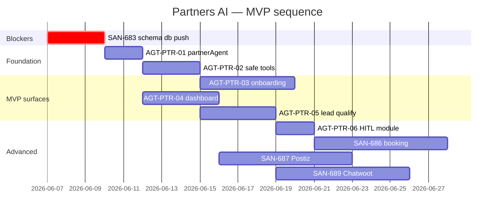
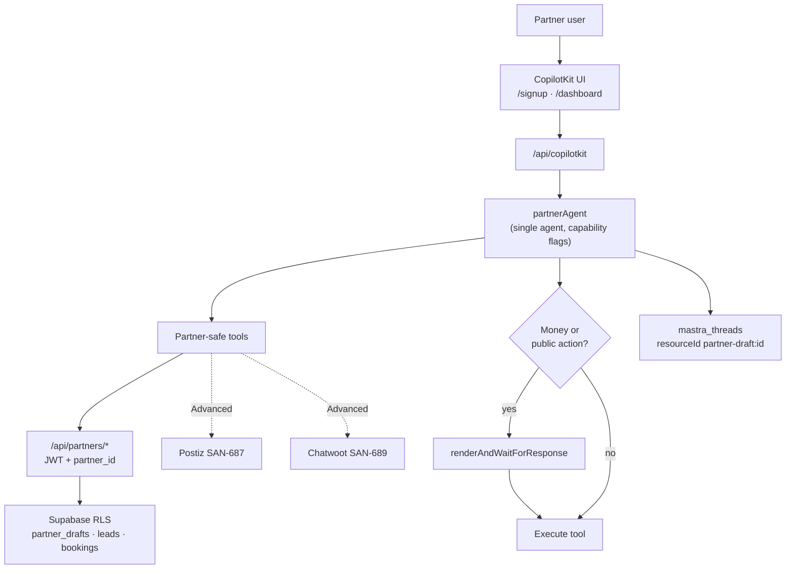
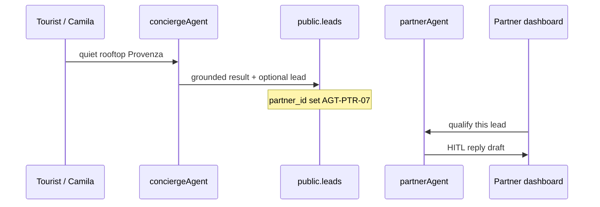

# AI & Intelligence × Partners — forensic audit

> **One-line verdict:** [AI & Intelligence](https://linear.app/sanjiovani/project/ai-and-intelligence-fe206edb90b2/issues) has **80 issues, zero partner-specific** — all Camila/Tourist + AGT hygiene. [Partners](https://linear.app/sanjiovani/project/partners-032df556f9f9/issues) owns partner AI in **SAN-665/685/673** but they're **M4 Backlog** while schema (**SAN-683**) is still unapplied. **Do not over-build:** one `partnerAgent`, scoped tools, HITL from `hostEventAgent` — not 18 copilots.

## Executive Summary

| Question | Answer |
|---|---|
| Is the AI & Intelligence plan correct for **Consumers**? | 🟢 **Yes** — VEC/DATA/SEARCH/INT/AGT track is coherent |
| Does it cover **Partners**? | 🔴 **No** — partner AI lives only in Partners project prose |
| Partner AI production-ready? | **~5%** — `hostEventAgent` + HITL bridge exist; no `/partners/*`, no `partnerAgent`, no partner tools |
| Consumer AI production-ready? | **~72%** — `conciergeAgent` ships; AGT-00 safety done; INT-009 in progress |
| What must fix first? | **SAN-683 db push** → **AGT-PTR-01** agent foundation → **AGT-PTR-02** safe tools → **SAN-665** onboarding copilot |
| Best first focus | Partner Agent Foundation → Safe Supabase Tools → Onboarding Copilot → Dashboard Copilot → Lead Qualification |

**Do not:** spin up AGT-403 multi-agent router, AGT-604 WhatsApp, SAN-670 lifecycle automation, or separate copilots per vertical before Roberto completes one host path through unified signup.

---

## Current Linear Task Audit — AI & Intelligence (80 issues)

Legend: **Partner relevance** = how directly it unblocks Partners supply-side AI.

| Task | Purpose | Partner Relevance | Risk | Grade | Score | Action |
|---|---|---|:---:|:---:|---:|---|
| SAN-589 AGT-00C Telemetry | `ai_runs` + tool spans | 🟢 Indirect — ops for partner agents too | Low | A | 95 | **Keep Done** |
| SAN-590 AGT-00A Faithfulness | Scorer measurement | 🟢 Reuse for partner reply drafts | Low | A | 92 | **Keep Done** |
| SAN-591 AGT-00D Allowlist | Runtime agent exposure | 🟢 **Critical** — must add `partnerAgent` to allowlist | Med | A | 90 | **Extend** when partner agent ships |
| SAN-605 AGT-00B Grounding | Coverage scorer | 🟢 Partner marketing copy guard | Low | A | 90 | **Keep Done** |
| SAN-426 MASTRA-MIS-001 | Concierge-only routing | 🟡 Consumer-only; partners need second agent key | Low | B+ | 85 | **Keep** — add `partnerAgent` alongside |
| SAN-412 INT-009 | CopilotKit ↔ agent state | 🟢 **Signup form fill** pattern for SAN-665 | Med | B+ | 82 | **Finish** — highest partner leverage in INT-* |
| SAN-413 INT-010 | Working memory sync | 🟢 Multi-turn onboarding | Low | B+ | 80 | **Keep Done** |
| SAN-595 AGT-01 | Native tool approval | 🟢 **HITL** for publish/checkout | Med | B | 78 | **Reuse** for partner money/public actions |
| SAN-597 AGT-02 | Resource-scoped memory | 🟢 `partner-draft:{id}` threads | Med | B | 75 | **Align** with `partner_drafts.thread_id` |
| SAN-602 AGT-12 | Host publish workflow | 🟡 Roberto only — not generic partner | Med | B | 72 | **Generalize** into partner onboarding submit |
| SAN-601 AGT-11 | Checkout workflow | 🟡 Overlaps SAN-686 booking | Med | B- | 68 | **Coordinate** with Partners — don't duplicate |
| SAN-606 AGT-04A | Grounding assertion | 🟢 Partner AI replies | Low | B | 70 | Phase 1 tail |
| SAN-588 AGT-00 epic | Mastra adoption umbrella | 🟡 No partner slice | Low | B | 65 | Add **AGT-PTR** sub-epic link |
| SAN-403 AI-003 | Multi-agent router | 🔴 Scope creep vs one partnerAgent | High | C | 40 | **Defer** — conflicts with SAN-685 "one copilot" |
| SAN-604 AGT-10 | WhatsApp channels | 🟡 SAN-689 owns partner comms | Med | C+ | 45 | **Later** — Chatwoot first |
| SAN-565 Sales agent | Upsell agent | 🔴 Not P1 partner | High | D | 25 | **Avoid now** |
| SAN-550 REV-C13 | Remove ping/router | 🟢 Hygiene | Low | B+ | 80 | Backlog OK |
| VEC-001–007 | pgvector / semantic | 🟡 SAN-669 tier gating only | Low | B | 60 | **Later** for partner KB |
| DATA-039–047 | Signals + evidence | 🟢 Concierge→partner demand quality | Low | A- | 85 | **Keep** — feeds SAN-673 |
| SEARCH-001–007 | Hybrid search | 🟢 Tourist finds partner inventory | Low | B+ | 75 | Consumer path |
| INT-011–023 | User prefs memory | 🟡 Camila personalization | Low | C+ | 50 | **Later** for partners |
| AI-001–020 | Discovery/itinerary jobs | 🔴 Not partner MVP | Med | C | 35 | **Later / avoid** |

**Summary:** 4 Done AGT-00 tasks are the best Partners foundation. **0/80** explicitly mention `partner_id`, `partner_drafts`, or `/partners/signup`.

---

## Current Linear Task Audit — Partners (AI-touching)

| Task | Purpose | Partner Relevance | Risk | Grade | Score | Action |
|---|---|---|:---:|:---:|---:|---|
| SAN-683 Schema + RLS | `partner_*` tables | 🔴 **Blocks all AI writes** | High | B+ spec / F ship | 40 | **db push first** |
| SAN-665 Signup wizard | Form + AI co-pilot | 🔴 Core MVP | High | B spec | 55 | Todo · blockedBy 683 |
| SAN-690 Dashboard | Tabs + assistant | 🟢 Core MVP | Med | B | 50 | blockedBy 683 |
| SAN-685 Partner copilot | ONE agent, capability sets | 🟢 **Canonical** but too broad | Med | B+ spec / F code | 45 | **Split** into AGT-PTR-01–05 |
| SAN-684 Lead engine | Channels → `leads` | 🟢 Broker MVP | Med | B | 50 | After schema + qualify tool |
| SAN-686 Booking HITL | Approve → pay | 🟡 Advanced MVP | Med | B | 48 | After dashboard |
| SAN-673 Concierge↔partner | Demand routing | 🟡 Needs live partners | Med | B | 42 | **M4** — after supply exists |
| SAN-669 AI services catalog | `partner_services` tiers | 🟡 Monetization | Low | B | 45 | **M4** after copilot works |
| SAN-670 Marketing automation | Lifecycle emails/posts | 🔴 Too early | High | C+ | 30 | **Later** |
| SAN-687 Postiz pipeline | Social automation | 🟡 Advanced | Med | C+ | 35 | **Advanced** |
| SAN-689 Chatwoot/WhatsApp | Partner comms | 🟡 Advanced | Med | C+ | 32 | **Advanced** |
| SAN-675 Host e2e | Roberto pilot | 🟢 Proves stack | Med | B | 52 | Reuse `hostEventAgent` until unified signup |

---

## Partners AI Architecture Needed

### Core MVP (build once — M1–M2)

| Capability | Exists today | Gap |
|---|---|---|
| **partner onboarding agent** | `hostEventAgent` (events only) | Single `partnerAgent` + type-specific prompts |
| **partner dashboard assistant** | None | Same agent, `capability=dashboard` flag |
| **lead qualification** | `leads` CRM + edge capture | Mastra tool: score + draft reply (HITL) |
| **partner-safe Supabase tools** | Consumer tools unscoped | All writes via API + `partner_id` RLS |
| **HITL approval gate** | `renderAndWaitForResponse` on host publish | Generalize for replies, bookings, posts |
| **Mastra memory/threads** | `mastra_threads` + working memory | `resourceId=partner-draft:{id}` |
| **CopilotKit generative UI** | Rental/event cards on concierge | `useCopilotAction` writes wizard fields (INT-009) |

**Disk today:** `conciergeAgent` + `hostEventAgent` in `mdeapp/src/mastra/index.ts`; **no** `src/app/partners/**`; CopilotKit allowlist = `conciergeAgent | hostEventAgent` only (`copilotkit-client-props.ts`).

### Advanced (M3–M4)

- Booking assistant (SAN-686 + AGT-01)
- Revenue insight agent (read `revenue_ledger` — read-only tool)
- Postiz content workflow (SAN-687)
- Chatwoot/WhatsApp handoff (SAN-689)
- Sponsor matching (reuse sponsor schema)
- Automation planner stub (`partners.settings` jsonb)

### Later / avoid for now

- Full autonomous campaigns (SAN-670)
- Multi-agent marketplace (AI-003, AGT-403)
- Self-driving partner ops
- Public API / white-label agent layer
- Per-vertical agents (18× fork)
- pgvector on all partner entities

---

## Linear tasks filed (2026-06-06)

> Parent [SAN-685](https://linear.app/sanjiovani/issue/SAN-685) · Disk specs: [`tasks/mastra/partners/AGT-PTR-INDEX.md`](../tasks/AGT-PTR-INDEX.md)

| Spec | Linear | Type | Priority | Disk spec |
|---|---|---|---|---|
| AGT-PTR-01 | [SAN-705](https://linear.app/sanjiovani/issue/SAN-705) | agent | Urgent | [01-foundation](../tasks/AGT-PTR-01-partner-agent-foundation.md) |
| AGT-PTR-02 | [SAN-706](https://linear.app/sanjiovani/issue/SAN-706) | tools | Urgent | [02-tools](../tasks/AGT-PTR-02-partner-supabase-tools.md) |
| AGT-PTR-03 | [SAN-709](https://linear.app/sanjiovani/issue/SAN-709) | UI+agent | High | [03-onboarding](../tasks/AGT-PTR-03-onboarding-copilot.md) |
| AGT-PTR-04 | [SAN-707](https://linear.app/sanjiovani/issue/SAN-707) | UI+agent | High | [04-dashboard](../tasks/AGT-PTR-04-dashboard-copilot.md) |
| AGT-PTR-05 | [SAN-708](https://linear.app/sanjiovani/issue/SAN-708) | workflow | High | [05-leads](../tasks/AGT-PTR-05-lead-qualification-hitl.md) |
| AGT-PTR-06 | [SAN-711](https://linear.app/sanjiovani/issue/SAN-711) | platform | Medium | [06-hitl](../tasks/AGT-PTR-06-hitl-policy-module.md) |
| AGT-PTR-07 | [SAN-710](https://linear.app/sanjiovani/issue/SAN-710) | routing | Medium | [07-attribution](../tasks/AGT-PTR-07-concierge-attribution.md) |

**Do not create yet:** separate nightclub/restaurant/broker agents, Postiz agent, WhatsApp agent, revenue ML agent.

---

## Recommended Execution Order

**Numbered plan (human):**

1. Audit existing Mastra/CopilotKit — **done in this doc**; reuse `host-event-copilot-bridge.tsx`
2. **SAN-683** `db push` — partner tables live
3. **AGT-PTR-01** — `partnerAgent` + `PartnerState` Zod + allowlist
4. **AGT-PTR-02** — Supabase tools via `/api/partners/*` (F13)
5. **AGT-PTR-03** + **SAN-665** — onboarding copilot
6. **AGT-PTR-04** + **SAN-690** — dashboard assistant (read-only first)
7. **AGT-PTR-05** + **SAN-684** — lead qualification + HITL
8. **AGT-PTR-06** — shared HITL policy (extract from host publish)
9. Revenue insights — read-only dashboard tool (SAN-668)
10. Chatwoot/WhatsApp — **SAN-689** (Advanced)
11. Postiz — **SAN-687** (Advanced)

**Reuse from AI & Intelligence (don't re-file):** SAN-589, 590, 591, 605, 412 (finish), 595 (HITL pattern).

---

## Mermaid Diagrams

### Partner AI System

### Core Workflow

```mermaid
flowchart LR
  Signup["/partners/signup\nSAN-665"] --> OnboardAgent["partnerAgent\ncap=onboarding"]
  OnboardAgent --> Draft["partner_drafts.payload"]
  Draft --> Submit["HITL activate?"]
  Submit --> Dashboard["/dashboard\nSAN-690"]
  Dashboard --> DashAgent["partnerAgent\ncap=dashboard"]
  DashAgent --> Leads["list_partner_leads"]
  Leads --> Qualify["draft reply"]
  Qualify --> HITL["Partner approves"]
  HITL --> Revenue["revenue_ledger\nSAN-668"]
```

### Consumer ↔ Partner bridge (M4)

---

## Red Flags Check

| Check | Status | Evidence |
|---|---|---|
| Agents too generic? | 🟡 | SAN-685 one copilot ✅ — but no `partnerAgent` on disk yet |
| Tools protected from unsafe writes? | 🔴 | Consumer tools lack `partner_id`; no `/api/partners/*` |
| Money/public actions gated by HITL? | 🟢 partial | Host publish HITL works; not generalized |
| Partner permissions scoped by `partner_id`? | 🔴 | Schema on disk; not applied; no tools |
| Mastra threads → `partner_drafts`? | 🔴 | Convention documented; not wired |
| CopilotKit updates forms, not just chat? | 🟡 | `host-event-copilot-bridge` proves pattern; INT-009 in progress |
| Duplicating Chatwoot/Postiz/Supabase? | 🟢 | PRD defers to edge fns + SAN-687/689 |
| Automating before core flow works? | 🔴 | SAN-670/687 in backlog OK — **don't start before ptr03** |

---

## Blockers · Duplicates · Scope Creep

| Issue | Severity | Note |
|---|---|---|
| **SAN-683 not on remote** | 🔴 | No partner AI persistence |
| **SAN-685 monolith in M4** | 🟡 | Split into AGT-PTR-01–05; keep SAN-685 as epic parent |
| **hostEventAgent vs partnerAgent** | 🟡 | Merge path: host = `type=host` prompt slice, not second runtime agent |
| **AGT-601 vs SAN-686** | 🟡 | One booking story — pick Mastra workflow OR Partners UI, not both blind |
| **AI-003 multi-agent router** | 🔴 | Conflicts with PRD "one assistant" |
| **18 vertical e2e before platform** | 🔴 | SAN-675 pilot only until ptr03 ships |

---

## Final Verdict

| Question | Answer |
|---|---|
| **Is the AI & Intelligence plan correct?** | **For consumers: yes (72%).** For partners: **wrong project** — partner AI is spec-only in Partners issues. |
| **What % production-ready for Partners AI?** | **~5%** — patterns exist (`hostEventAgent`, HITL, concierge); platform agent + tools + routes = 0. |
| **What must fix before Partners depends on it?** | 1) SAN-683 applied 2) AGT-PTR-01/02 3) Finish INT-009 4) Extend SAN-591 allowlist |
| **Exact tasks to create next?** | **AGT-PTR-01** then **AGT-PTR-02** in AI & Intelligence; link blockedBy SAN-683; SAN-665 blockedBy AGT-PTR-03 |

**First sprint slice:** `partnerAgent` + `upsert_partner_draft` tool + minimal `/partners/signup` copilot panel — **one vertical config (`type=host`)**, not eight.

---

## References

| Doc | Path |
|---|---|
| Partner schema audit | `audit/06b-supabase-audit.md` |
| AI services catalog | `08-ai-services.md` |
| Signup wizard spec | `05-signup-wizard.md` |
| Host HITL reference | `mdeapp/src/components/host/host-event-copilot-bridge.tsx` |
| CopilotKit v1 invariants | `.claude/skills/copilotkitV1/SKILL.md` |
| Mastra agents | `mdeapp/src/mastra/index.ts` |
| Partners index | `index-partners.md` |
