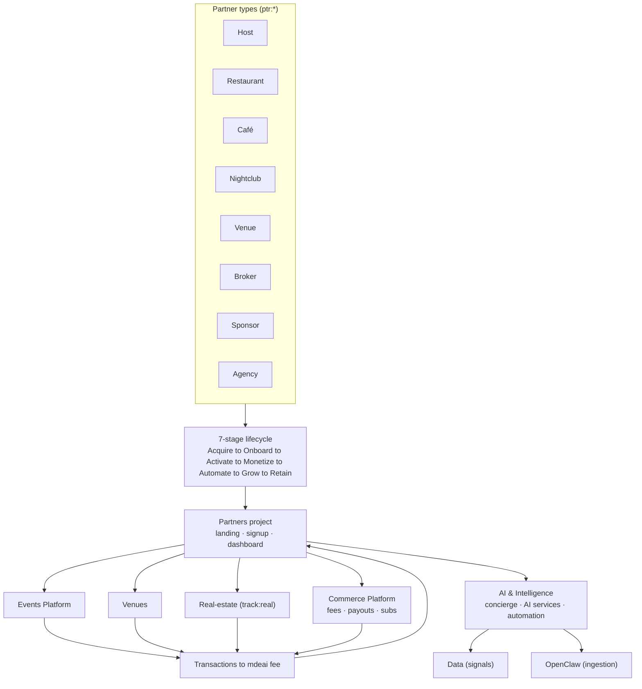
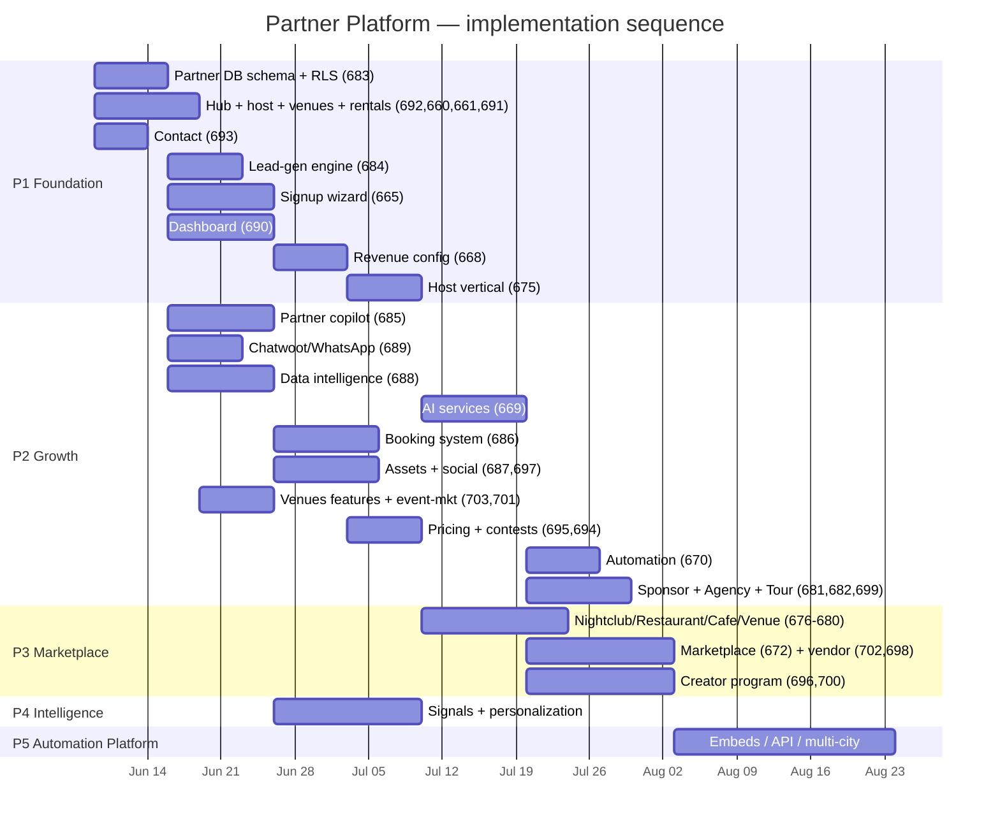

# Partners — index

> **One line:** every partner type runs the **same 7-stage lifecycle**; the *platform* (signup wizard, dashboard, revenue, AI/automation) is built **once** (horizontal workstreams), and each partner type is a thin **vertical** that configures those + a landing + launch. This index lists what each partner needs and which Linear issue owns it.

**Linear:** [Partners project](https://linear.app/sanjiovani/project/partners-032df556f9f9/issues) · Epic [SAN-667](https://linear.app/sanjiovani/issue/SAN-667) · **44 active issues** (SAN-666 canceled → use SAN-690 only).

## The full partner lifecycle (every type)

| # | Stage | What happens | Built by (horizontal) |
|---|---|---|---|
| 1 | **Acquire** | marketing landing + signup marquee | Partners (UX) |
| 2 | **Onboard** | signup wizard (per-type config) + AI co-pilot | [SAN-665](https://linear.app/sanjiovani/issue/SAN-665) |
| 3 | **Activate** | dashboard tabs + first listing/event live | [SAN-690](https://linear.app/sanjiovani/issue/SAN-690) |
| 4 | **Monetize** | revenue stream wired (fee/lead/sub) | [SAN-668](https://linear.app/sanjiovani/issue/SAN-668) → Commerce |
| 5 | **Automate** | AI services + marketing automation on | [SAN-669](https://linear.app/sanjiovani/issue/SAN-669)/[670](https://linear.app/sanjiovani/issue/SAN-670) → AI & Intelligence |
| 6 | **Grow** | contest/referral/loyalty | [SAN-671](https://linear.app/sanjiovani/issue/SAN-671) |
| 7 | **Retain** | analytics · renewal · win-back | SAN-690/670 |

## Per-partner plan (vertical = landing + config + launch)

For each type, the **net-new vertical task** = "landing variant → signup config → dashboard tabs → revenue → AI/automation → launch + first transaction". Horizontal deps in parens.

| Partner | Label | Landing (MKT) | Vertical e2e (PTR) | Owning project(s) | Phase |
|---|---|---|---|---|:--:|
| Event host | `ptr:host` | [SAN-660](https://linear.app/sanjiovani/issue/SAN-660) `/host` | [SAN-675](https://linear.app/sanjiovani/issue/SAN-675) | Events + Commerce | P0 |
| Restaurant | `ptr:restaurant` | [SAN-661](https://linear.app/sanjiovani/issue/SAN-661) `/venues?v=restaurant` | [SAN-678](https://linear.app/sanjiovani/issue/SAN-678) | Venues + Data | P1 |
| Café | `ptr:cafe` | SAN-661 `/venues?v=cafe` | [SAN-679](https://linear.app/sanjiovani/issue/SAN-679) | Venues + Data | P1 |
| Nightclub/Bar | `ptr:nightclub` | SAN-661 `/venues?v=nightclub` | [SAN-676](https://linear.app/sanjiovani/issue/SAN-676) | Venues + Events + OpenClaw | P0 |
| Venue/space | `ptr:venue` | SAN-661 `/venues?v=space` | [SAN-680](https://linear.app/sanjiovani/issue/SAN-680) | Venues + Events | P1 |
| Real-estate broker | `ptr:broker` | [SAN-691](https://linear.app/sanjiovani/issue/SAN-691) `/partners/rentals` | [SAN-677](https://linear.app/sanjiovani/issue/SAN-677) | Real-estate + Data | P0 |
| Sponsor | `ptr:sponsor` | [SAN-664](https://linear.app/sanjiovani/issue/SAN-664) `/sponsors` | [SAN-681](https://linear.app/sanjiovani/issue/SAN-681) | AI & Intelligence + Commerce | P1 |
| Agency/company | `ptr:agency` | [SAN-663](https://linear.app/sanjiovani/issue/SAN-663) `/business/ai` | [SAN-682](https://linear.app/sanjiovani/issue/SAN-682) | AI & Intelligence | P1 |
| Vendor | `ptr:vendor` | [SAN-702](https://linear.app/sanjiovani/issue/SAN-702) `/partners/vendor` | [SAN-698](https://linear.app/sanjiovani/issue/SAN-698) | Commerce Platform | P3 |
| Tour operator | `ptr:tour` | [SAN-692](https://linear.app/sanjiovani/issue/SAN-692) hub `?type=tour` | [SAN-699](https://linear.app/sanjiovani/issue/SAN-699) | Events/Trips | P2 |
| Influencer | `ptr:influencer` | [SAN-696](https://linear.app/sanjiovani/issue/SAN-696) `/partners/creator` | [SAN-700](https://linear.app/sanjiovani/issue/SAN-700) | AI & Intelligence | P3 |

## Marketing pages (MKT) — full sitemap registry

Maps `03-landing-pages.md` → Linear. All CTAs funnel to [SAN-665](https://linear.app/sanjiovani/issue/SAN-665) `/partners/signup?type=…`.

| Route | Linear | Status | Phase |
|---|---|---|:--:|
| `/partners` hub | [SAN-692](https://linear.app/sanjiovani/issue/SAN-692) | Todo · High | P0 |
| `/host` | [SAN-660](https://linear.app/sanjiovani/issue/SAN-660) | Todo · High | P0 |
| `/venues` | [SAN-661](https://linear.app/sanjiovani/issue/SAN-661) | Todo · High | P0 |
| `/venues/features` | [SAN-703](https://linear.app/sanjiovani/issue/SAN-703) | Backlog | P2 |
| `/partners/rentals` | [SAN-691](https://linear.app/sanjiovani/issue/SAN-691) | Todo · High | P0 |
| `/business/ai` | [SAN-663](https://linear.app/sanjiovani/issue/SAN-663) | Todo | P1 |
| `/business/social` | [SAN-697](https://linear.app/sanjiovani/issue/SAN-697) | Backlog | P3 |
| `/business/event-marketing` | [SAN-701](https://linear.app/sanjiovani/issue/SAN-701) | Backlog | P2 |
| `/sponsors` | [SAN-664](https://linear.app/sanjiovani/issue/SAN-664) | Todo | P1 |
| `/partners/creator` | [SAN-696](https://linear.app/sanjiovani/issue/SAN-696) | Backlog | P3 |
| `/partners/vendor` | [SAN-702](https://linear.app/sanjiovani/issue/SAN-702) | Backlog | P3 |
| `/partners/signup` | [SAN-665](https://linear.app/sanjiovani/issue/SAN-665) | Todo · High · **blockedBy 683** | P0 |
| `/dashboard` | [SAN-690](https://linear.app/sanjiovani/issue/SAN-690) | Todo · High · **blockedBy 683** | P0 |
| `/pricing` | [SAN-695](https://linear.app/sanjiovani/issue/SAN-695) | Backlog | P2 |
| `/contact` | [SAN-693](https://linear.app/sanjiovani/issue/SAN-693) | Todo · High | P0 |
| `/contests` | [SAN-694](https://linear.app/sanjiovani/issue/SAN-694) | Backlog | P2 |

## Linear task registry (all issues under SAN-667)

### Epic + UX

| ID | Title | Priority | Status |
|---|---|:--:|---|
| [SAN-667](https://linear.app/sanjiovani/issue/SAN-667) | Partner Ecosystem Master Plan (epic) | High | Backlog |
| [SAN-674](https://linear.app/sanjiovani/issue/SAN-674) | UX pack: wireframes + 30 mermaid SVGs | High | Todo |

### Foundation (schema-first)

| ID | Title | Priority | Status | Blocks |
|---|---|:--:|---|---|
| [SAN-683](https://linear.app/sanjiovani/issue/SAN-683) | Partner DB schema + RLS (ERD) | High | Backlog | **Start here** |
| [SAN-684](https://linear.app/sanjiovani/issue/SAN-684) | Lead-generation engine | High | Backlog | 683 |
| [SAN-685](https://linear.app/sanjiovani/issue/SAN-685) | Partner AI copilot (parent) | Med | Backlog | 683 |
| [SAN-705](https://linear.app/sanjiovani/issue/SAN-705)–[711](https://linear.app/sanjiovani/issue/SAN-711) | AGT-PTR-01–07 — split under 685 (+ PTR-00 CK arch) | Urgent–Med | Backlog | 683 · [disk specs](../../mastra/partners/AGT-PTR-INDEX.md) · [06d audit](./audit/06d-mastra-audit.md) |
| [SAN-686](https://linear.app/sanjiovani/issue/SAN-686) | Booking system | Med | Backlog | 683 · 690 |
| [SAN-687](https://linear.app/sanjiovani/issue/SAN-687) | Brand assets + Postiz pipeline | Med | Backlog | 683 |
| [SAN-688](https://linear.app/sanjiovani/issue/SAN-688) | Data intelligence / enrichment | Med | Backlog | 683 |
| [SAN-689](https://linear.app/sanjiovani/issue/SAN-689) | Chatwoot + WhatsApp comms | Med | Backlog | 683 |

### Horizontal platform (workstreams)

| ID | Title | Priority | Status |
|---|---|:--:|---|
| [SAN-668](https://linear.app/sanjiovani/issue/SAN-668) | Revenue architecture & monetization | High | Backlog |
| [SAN-669](https://linear.app/sanjiovani/issue/SAN-669) | AI services catalog & pricing tiers | Med | Backlog |
| [SAN-670](https://linear.app/sanjiovani/issue/SAN-670) | Marketing automation engine | Med | Backlog |
| [SAN-671](https://linear.app/sanjiovani/issue/SAN-671) | Contests & growth loops | Med | Backlog |
| [SAN-672](https://linear.app/sanjiovani/issue/SAN-672) | Marketplace expansion | Low | Backlog |
| [SAN-673](https://linear.app/sanjiovani/issue/SAN-673) | Concierge ↔ partner wiring | Med | Backlog |

### Vertical e2e cycles

| ID | Partner type | Priority | Status |
|---|---|:--:|---|
| [SAN-675](https://linear.app/sanjiovani/issue/SAN-675) | Event host | High | Backlog |
| [SAN-676](https://linear.app/sanjiovani/issue/SAN-676) | Nightclub/bar | High | Backlog |
| [SAN-677](https://linear.app/sanjiovani/issue/SAN-677) | Broker | High | Backlog |
| [SAN-678](https://linear.app/sanjiovani/issue/SAN-678) | Restaurant | Med | Backlog |
| [SAN-679](https://linear.app/sanjiovani/issue/SAN-679) | Café | Med | Backlog |
| [SAN-680](https://linear.app/sanjiovani/issue/SAN-680) | Venue/space | Med | Backlog |
| [SAN-681](https://linear.app/sanjiovani/issue/SAN-681) | Sponsor | Med | Backlog |
| [SAN-682](https://linear.app/sanjiovani/issue/SAN-682) | Agency | Med | Backlog |
| [SAN-698](https://linear.app/sanjiovani/issue/SAN-698) | Vendor (marketplace) | Low | Backlog |
| [SAN-699](https://linear.app/sanjiovani/issue/SAN-699) | Tour operator | Med | Backlog |
| [SAN-700](https://linear.app/sanjiovani/issue/SAN-700) | Influencer/creator | Low | Backlog |

### Retired

| ID | Note |
|---|---|
| ~~SAN-666~~ | Canceled — dashboard work is **SAN-690** only |

## How it fits the current setup (project map)

Partner work is **cross-project** — it threads through projects you already have. The Partners project owns the *partner-facing surface*; the verticals plug into the platform projects.

| Existing project / view | What it owns for partners |
|---|---|
| **Partners** (new) | landings · signup wizard · dashboard · this blueprint |
| **Events Platform** | host events, ticketing UI, nightlife events |
| **Venues** | venue listings, restaurant/café/nightclub profiles, leads/bookings |
| **AI & Intelligence** | concierge surfacing, AI services (menu/listing/match), automation, scorers |
| **Commerce Platform** | Stripe fees, payouts, subscriptions, marketplace |
| **Data** (view) | venue/event/rental signals feeding ranking + AI services |
| **OpenClaw** (view) | automated event ingestion (nightclub/venue recurring nights) |
| **Real-estate** (`track:real`) | rental listings + viewing leads (broker vertical) |

**Verdict:** no new platform needed — partners = **landings + one wizard + one dashboard + config of existing Events/Venues/AI/Commerce/Data/OpenClaw work.** That's the anti-overengineering line.

## "How it all maps together" (Mermaid)



## Tasks needed per partner (full-cycle checklist — same for each vertical)

1. Landing variant live (reuse `venues`/`host` shell) → `ptr:*`
2. Signup wizard config for the type (steps/fields) → dep SAN-665
3. Dashboard tabs enabled for the type → dep SAN-690
4. Revenue stream wired (fee/lead/sub) → dep SAN-668 / Commerce
5. AI services switched on (type-specific) → dep SAN-669 / AI&Intel
6. Marketing automation enabled → dep SAN-670
7. Growth loop (referral/contest) → dep SAN-671
8. Launch + first transaction proof (localhost + prod)

→ Filed as one **vertical cycle task per type** in the Partners project (see table above).

## Linear milestones (M1–M5 — live 2026-06-06)

| Milestone | Target | Phase | Goal |
|---|---|---|---|
| [M1 — Acquire](https://linear.app/sanjiovani/project/partners-032df556f9f9) | 2026-06-30 | P1 | Schema + landings + signup — partner can discover and start onboarding |
| M2 — Deliver | 2026-07-14 | P1 | Dashboard + host e2e — Roberto publishes + sees dashboard |
| M3 — Monetize | 2026-07-28 | P1–2 | Revenue tab shows real ticket % + lead fees |
| M4 — Augment | 2026-08-18 | P2 | AI copilot, Postiz, booking, pricing/contests pages |
| M5 — Expand | 2026-09-15 | P3 | Nightclub/broker stretch, venue verticals, marketplace, creator |

Detail + issue mapping: [`revenue/07-linear-structure.md`](./revenue/07-linear-structure.md).

## P0 execution order (start Monday)

```
SAN-683 (schema) → SAN-665 + SAN-690 (onboarding shell) → SAN-660 + SAN-692 + SAN-691 (landings)
  → SAN-668 (revenue) → SAN-675 (host e2e proof) → stretch: SAN-676 + SAN-677
```

**Blockers today:** zero partner routes in `mdeapp/src`; PRD still DRAFT; no partner testing evidence. Audit: `audit/06-june-partners-audit.md`.

## Implementation sequence (Gantt)

> Correct order: **schema first → onboarding/dashboard/leads + marketing → revenue → first vertical (host) → augment (AI/booking/automation/social/comms) → marketplace → intelligence.** SVG: `diagrams/index-partners-gantt-1.svg`.



## Future partner types (guardrailed — no Linear issues yet)

Do **not** file until M2 host e2e + M3 revenue prove GMV. Each new type = `ptr:*` label + landing variant + signup config — not a new platform.

| Type | Route (draft) | Revenue angle | Earliest phase |
|---|---|---|:--:|
| Hotels | white-label concierge embed | SaaS subscription | Phase 4+ |
| Coworking | `/partners/coworking` | Featured listing + nomad leads | Phase 4+ |
| Airbnb hosts | `/partners/hosts` | Rental lead extension | Phase 4+ |
| Tourism boards | `/partners/channel` | Co-promo · `type=partner` | Phase 4+ |
| Transportation | `/partners/transport` | Booking commission | Phase 4+ |
| Wellness / spas | `/venues?v=wellness` | Booking + featured | Phase 3+ |
| Relocation / legal | `/business/relocation` | B2B retainer | Phase 4+ |
| Coliving operators | `/partners/coliving` | Lead + subscription | Phase 4+ |

**Other revenue opportunities (no issues):** embed/API for partner sites · anonymized demand-data licensing · premium "verified" badges · bundled trip packages (cross-vertical commission).
