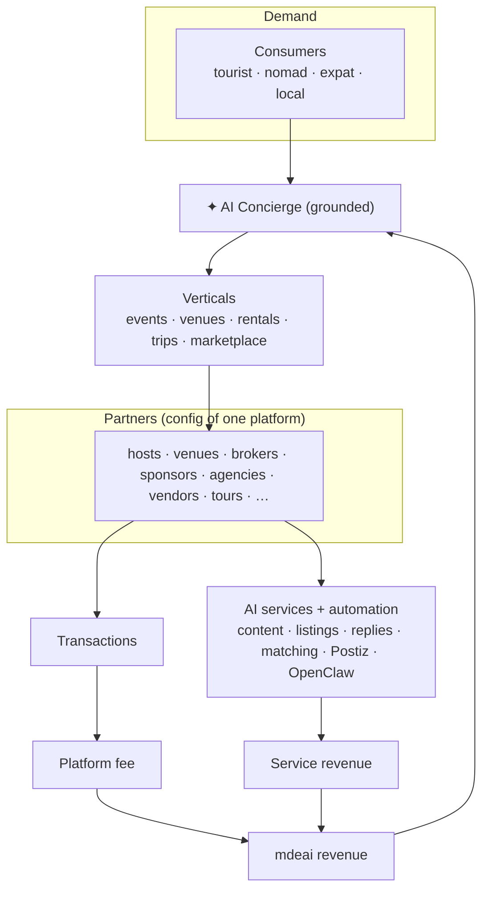
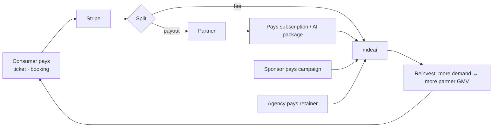
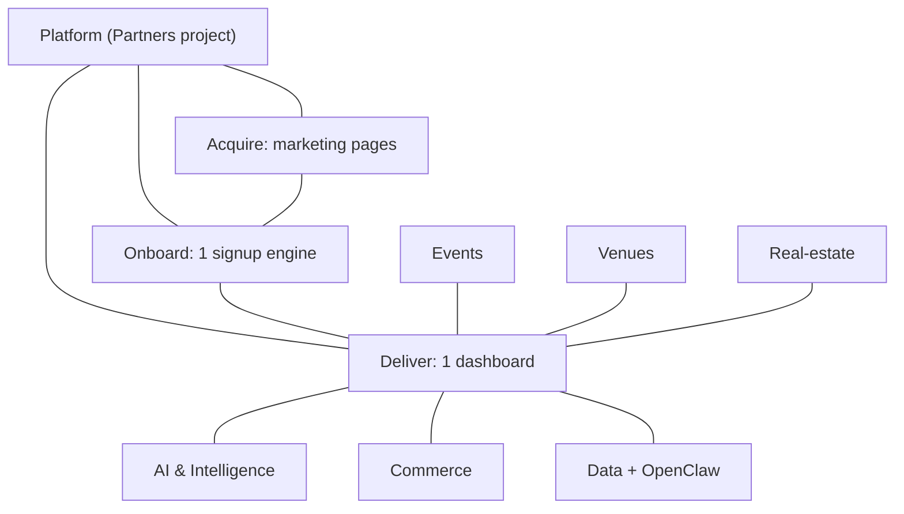

# Partner Revenue System — index

> **One line:** the revenue engine is **one reusable platform** (lead-gen → onboarding → dashboard → AI services → automation → payments) that every partner type *configures*. This folder writes the **new revenue-specific systems**; the lifecycle/AI-catalog/dashboard/automation/roadmap already exist in the parent blueprint (`../`) and are linked, not duplicated.

## Executive summary

mdeai is a **multi-sided marketplace + AI concierge**. Consumers (Camila/Andrés/Tourist) already generate demand; the revenue engine converts that demand into partner value and platform fees:

1. **Discover** — consumer asks the concierge → grounded results surface partners.
2. **Acquire** — partner lands on a marketing page → one signup wizard (per-type config).
3. **Generate** — leads/bookings/tickets flow to the partner's dashboard.
4. **Monetize** — platform takes a fee (ticket %, lead fee, booking commission, subscription, sponsorship, AI-service package).
5. **Augment** — partners buy AI services (content, listings, replies, matching) that increase their value → more revenue both sides.
6. **Deliver & retain** — AI + automation run the work (HITL on money/public); analytics + renewal keep them.

**How AI increases partner value:** it removes the work (draft the event, write the listing, reply to leads, post to social, match sponsors) — so a small venue gets agency-grade marketing for a subscription. That's the upsell engine.

### Ecosystem diagram

### Revenue flow diagram

### Partner relationship map

## Doc map (this folder)

| Doc | Covers (prompt part) | New vs ref |
|---|---|---|
| [01-revenue-prompt.md](./01-revenue-prompt.md) | brief | — |
| [02-lead-generation.md](./02-lead-generation.md) | 4 Lead-gen engine | **new** |
| [03-data-intelligence.md](./03-data-intelligence.md) | 6 Scraping & data | **new** |
| [04-commerce-payments.md](./04-commerce-payments.md) | 10 Commerce & payments | **new** |
| [05-service-delivery.md](./05-service-delivery.md) | 11 Service delivery | **new** |
| [06-assets-and-social.md](./06-assets-and-social.md) | 8 Assets + 9 Social automation | **new** |
| [07-linear-structure.md](./07-linear-structure.md) | 14 Linear hierarchy | **new** |

## Already covered in the parent blueprint (`../`) — linked, not duplicated

| Prompt part | Lives in |
|---|---|
| 1 Exec summary diagrams | this index |
| 2 Lifecycle (per-stage) | `../04-journey-maps.md` + `../index-partners.md` (7 stages) |
| 3 Marketing pages + funnels | `../03-landing-pages.md` + `../../docs/marketing-pages.md` |
| 5 AI services catalog + pricing | `../08-ai-services.md` |
| 7 Onboarding fields/verification | `../05-signup-wizard.md` (10-step, per-type matrix) |
| 12 Dashboard module × type matrix | `../06-dashboards.md` |
| 13 Automation architecture | `../09-marketing-automation.md` |
| 15 MVP → Phase 5 | `../13-roadmap.md` |

## Anti-overengineering recommendations

1. **One platform, configs per type** — never a new codebase per partner. Steps/tabs/services toggle by `type`.
2. **Monetize live surfaces first** — ticket fees + rental leads already work; wire those before new rails.
3. **Reuse, don't rebuild** — Stripe, CopilotKit, Mastra agents, Maps, `/api/leads`, Postiz, OpenClaw all exist.
4. **HITL on money/public; grounded only** — no fabricated stats, no silent auto-spend.
5. **Defer marketplace/white-label/embed to Phase 3+** — don't build the platform-platform before the marketplace has supply.
6. **Diagrams validated** — all Mermaid in this folder rendered to SVG via mermaid-cli (`diagrams/`).
