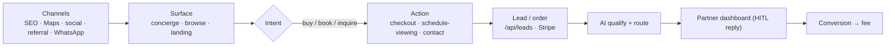
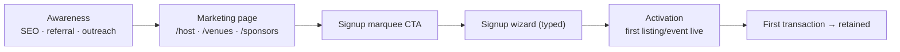

# Lead Generation Engine (Part 4)

How demand + partners enter the platform. Two funnels: **consumer acquisition** (creates GMV) and **partner acquisition** (creates supply). Both feed the same lead store.

## Channels

| Channel | Feeds | Mechanic | Cost | Priority |
|---|---|---|---|:--:|
| **SEO** | consumers + partners | neighborhood guides, blog, page indexing | low | P0 |
| **AI search / LLM citing** | consumers | be the grounded source AIs cite | low | P1 |
| **Google Maps / Places** | consumers | grounded place answers → partner profiles | per-call (FieldMask) | P0 |
| **Events** | consumers | published events are SEO + share surfaces | low | P0 |
| **Social media** | both | partner posts (Postiz) + mdeai channels | low | P1 |
| **Influencers** | consumers | creator guides + affiliate | rev-share | P2 |
| **Referrals** | partners | partner invites partner | credit | P1 |
| **Partnerships** | both | tourism boards, hotels co-promo | deal | P2 |
| **WhatsApp** | both | Chatwoot inbound + campaigns | low | P1 |
| **Email** | both | lifecycle sequences | low | P1 |
| **Content marketing** | consumers | guides/neighborhood intel | low | P1 |
| **Paid (later)** | both | search/social ads | $$ | P2 |

## How a lead enters (consumer → partner)

## Partner acquisition funnel

## Notes
- **One lead store** (`leads` + orders) — all channels normalize into it; dashboard "Leads" reads it.
- **Grounded surfacing** is the cheapest channel: every good concierge answer is free partner exposure.
- Attribution: tag lead `source` so dashboards + automation (re-engage) can act.
- Hard rules: `X-Goog-FieldMask` on Places, `mapId` on maps.
