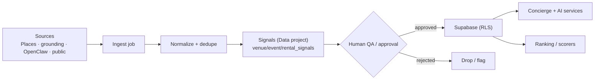

# Scraping & Data Intelligence (Part 6)

Powers listings, enrichment, and AI services with **grounded, approved** data. No grey-area scraping.

## Sources

| Source | Use | Approval |
|---|---|---|
| **Places API (New)** | venue/place facts, photos, hours, ratings | per-call, FieldMask-gated (cost) |
| **Search grounding (Gemini)** | events/web facts with citations | grounded, cited |
| **OpenClaw** | automated ingestion of public event listings (recurring nights) | partner-consented or public + HITL |
| **Public event data** | event calendars | public sources only |
| **Venue enrichment** | fill venue profiles | partner-consented |
| **Business enrichment** | partner profile autofill at signup | partner-consented (their own data) |
| **Social profile enrichment** | link partner socials for Postiz | partner OAuth consent |

## Data flow

## Compliance considerations
- **Consent or public** — enrich a partner's *own* data freely (they signed up); third-party scraping limited to public + ToS-compliant sources.
- **Attribution/citation** — grounded answers cite sources; never present scraped data as first-party fact.
- **PII** — redact emails/phones in public ingestion; partner contact only with consent.
- **Cost** — Places calls FieldMask-gated; cache; ingest on schedule, not per-request.

## Human approval requirements
- New venue/event from ingestion → **Patricia/admin QA gate** before it goes live (`venue_signals` sign-off pattern, DATA-041).
- AI-written public content (listings, posts, replies) → **partner HITL** before publish.
- Aligns to existing **Data** view + **OpenClaw** view; reuse, don't build a new pipeline.
