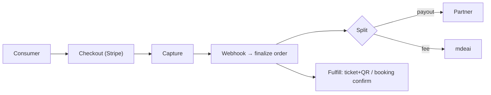
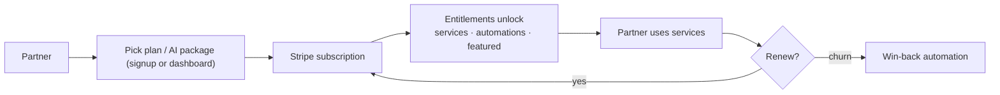
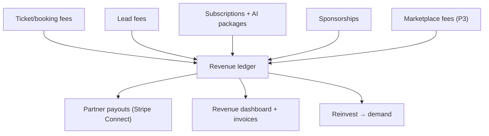

# Commerce & Payments (Part 10)

All money on **Stripe** (live for tickets). Revenue types unified; HITL on partner-initiated charges.

## Revenue types

| Type | Payer | Model | Status |
|---|---|---|---|
| Subscription fees | partner | recurring $/mo (Growth/Pro) | new |
| Lead fees | partner | per qualified lead | live path |
| Ticket fees | consumer | % per ticket | **live** |
| Booking fees | consumer | % / flat per booking | new |
| Marketplace fees | consumer | % of vendor sale | P3 |
| Sponsored placements | sponsor | flat / performance | new |
| AI service packages | partner | $/mo add-on | new |
| White-label services | B2B | contract | P4 |

## Consumer payment flow (live)

## Partner payment flow (subscriptions + AI packages)

## Platform revenue flow (consolidated)

## Notes
- **Reuse the live ticket rail** (Stripe + webhook finalize); add subscriptions + Connect payouts on top.
- **HITL** on partner-initiated charges; idempotent webhooks (existing pattern).
- Edge-function isolation for webhooks (service-role only there, per F13).
- Full stream table + flow detail: `../07-revenue.md`.
