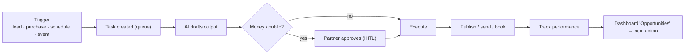
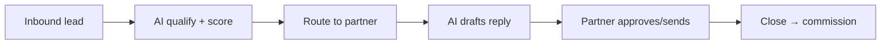
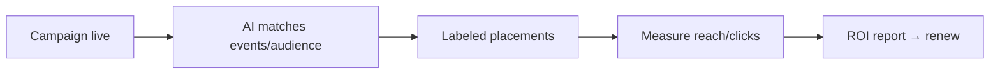
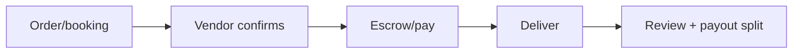

# Service Delivery System (Part 11)

How a purchased service actually gets done. Pattern = **trigger → task → AI drafts → HITL → execute → track**. One engine (Mastra workflows), many service types.

## Universal delivery loop

## Per-service workflows

**AI marketing package**

**AI concierge (hotel/venue embed)**

**Lead generation service**

**Sponsorship delivery**

**Marketplace order (P3)**

## Notes
- Every workflow is a **Mastra workflow** with retries + compensation (AGT-07/11/15 patterns).
- HITL gate is mandatory on anything public or money.
- Output + metrics logged → dashboard Analytics + Opportunities (closes the loop to upsell).
