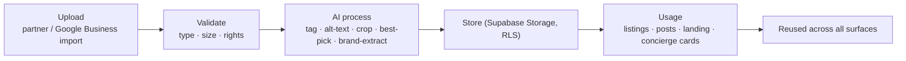
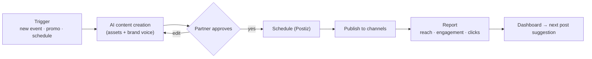

# Brand Assets + Social Automation (Parts 8 & 9)

Partner assets feed the AI content + Postiz social pipeline. One asset store, one publish pipeline.

## Brand asset management

Assets: logos · photos · videos · menus · brand guidelines · social accounts · marketing assets.

- **Brand guidelines extracted** (colors/voice) → AI content stays on-brand.
- Rights/consent recorded on upload; partner owns assets.
- One store; every surface (listing, Postiz post, card) references it — no re-upload.

## Social media automation (Postiz)

Channels: Instagram · Facebook · TikTok · LinkedIn · WhatsApp · Google Business Profile.

## Notes
- **Postiz** owns scheduling/publishing; mdeai owns content gen (Gemini) + approval (HITL) + assets.
- WhatsApp + Google Business Profile via existing Chatwoot/Places integrations.
- Cadence + channels set in signup step 8 / dashboard Marketing tab.
- All public posts are HITL — partner approves before anything goes live.
