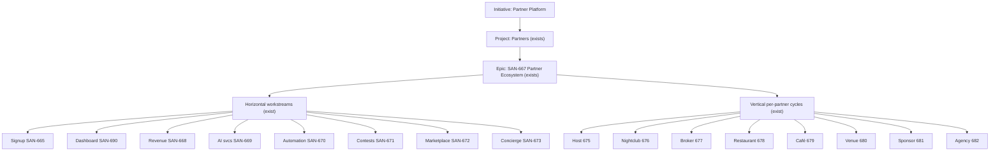

# Linear Structure (Part 14)

Hierarchy: **Initiative → Project → Epic → Milestone → Task**. Most is already created; this is the target shape + what's net-new.

## Target hierarchy

## Current state vs prompt's 10 projects

The prompt suggests 10 projects; we use **one Partners project + labeled workstreams** (less fragmentation, anti-overengineering). Mapping:

| Prompt project | Our home | Status |
|---|---|---|
| Partner Core Platform | Partners project / epic SAN-667 | ✅ |
| Marketing Pages | SAN-660/661/663/664 (`MKT`) | ✅ |
| Onboarding | SAN-665 | ✅ |
| Dashboard | SAN-690 | ✅ |
| Revenue Engine | SAN-668 | ✅ |
| AI Services | SAN-669 | ✅ |
| Automation | SAN-670 | ✅ |
| Asset Management | SAN-687 (+ MKT SAN-697) | ✅ |
| Lead-gen engine | SAN-684 | ✅ |
| Data intelligence | SAN-688 | ✅ |
| Commerce | SAN-668 + Commerce project | ✅/ref |
| Marketplace | SAN-672 (+ MKT SAN-702, e2e SAN-698) | ✅ |

**All net-new platform tasks filed 2026-06-06:** SAN-683–689 · marketing gaps SAN-691–703 · vertical e2e SAN-698–700.

## Milestones (live on Partners project — created 2026-06-06)

| Milestone | Target | Contains | Key issues |
|---|---|---|---|
| **M1 — Acquire** | 2026-06-30 | schema + marketing + signup | 683, 660, 661, 691, 692, 693, 665, 674 |
| **M2 — Deliver** | 2026-07-14 | dashboard + leads + host e2e | 690, 684, 675 |
| **M3 — Monetize** | 2026-07-28 | revenue config + subscriptions | 668 |
| **M4 — Augment** | 2026-08-18 | AI + automation + assets/social | 685, 669, 670, 686, 687, 688, 689, 673, 671, 694, 695, 697, 701, 703 |
| **M5 — Expand** | 2026-09-15 | more verticals + marketplace | 672, 676–682, 663, 664, 698–700, 696, 702 |

## Future partner types (guardrailed — no Linear issues yet)

Do **not** file until P0/P1 host + venue + broker prove GMV. Each new type = config + landing only.

| Type | Example route | Notes |
|---|---|---|
| Hotels | white-label concierge embed | SaaS line · Phase 4+ |
| Coworking | `/partners/coworking` | Nomad demand adjacency |
| Airbnb hosts | `/partners/hosts` | Rental supply extension |
| Tourism boards | `/partners/channel` | Co-promo · `type=partner` |
| Transportation | `/partners/transport` | Airport/intercity |
| Wellness / spas | `/venues?v=wellness` | Venue variant |
| Relocation / legal | `/business/relocation` | B2B services |

## Recommendation
Keep **one Partners project** — use `PTR` + `ptr:*` + `MKT`/`UX` labels and **M1–M5 milestones** for structure. Epic: SAN-667.
