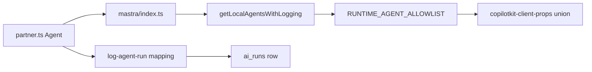

# AGT-PTR-01 — Partner agent foundation

## Purpose

Register **one** Mastra agent `partnerAgent` for all partner surfaces (signup, dashboard, leads). Capability flags in working memory — not separate agents per vertical.

**Persona:** Roberto — one assistant for onboarding and dashboard; memory follows `partner-draft:{id}` then `partner:{id}`.

## Agent registration flow



## Acceptance criteria

- [ ] `partnerAgent` in `mdeapp/src/mastra/agents/partner.ts` on `google("gemini-3.5-flash")`
- [ ] Zod `PartnerState` in agent + mirror in `mdeapp/src/lib/types.ts` (`capability`, `partnerType`, `draftId`, `partnerId`)
- [ ] Registered in `mdeapp/src/mastra/index.ts` alongside `conciergeAgent`, `hostEventAgent`
- [ ] `CopilotAgentName` union extended in `mdeapp/src/lib/copilotkit-client-props.ts`
- [ ] `RUNTIME_AGENT_ALLOWLIST` in `getLocalAgentsWithLogging` includes `partnerAgent` (restore SAN-591 filter if missing on disk)
- [ ] `log-agent-run.ts` maps `partnerAgent` → `agent_type: "sponsor"` until enum migration
- [ ] `resourceId` convention documented: `partner-draft:{uuid}` onboarding · `partner:{uuid}` dashboard
- [ ] Vitest smoke: agent instantiates; tools stub until PTR-02
- [ ] `npm run floor` green

## Workflows

| Step | File | Command |
|---|---|---|
| Create agent | `src/mastra/agents/partner.ts` | `npm test -- --run src/mastra/agents/partner` |
| Register | `src/mastra/index.ts` | `npm run check:mastra` |
| Allowlist | `src/mastra/copilotkit/logging-mastra-agent.ts` | expose only allowlisted keys |
| Client union | `src/lib/copilotkit-client-props.ts` | typecheck |

## Implementation notes

| Reuse | Do not |
|---|---|
| `hostEventAgent` instructions shape | Fork 18 vertical agents |
| Working-memory pattern (SAN-597) | Mount on `/` or `/chat` |
| SAN-591 allowlist | Service-role in client |

**Coexistence:** `/host/event/new` keeps `hostEventAgent` until SAN-675 migrates to unified signup (PTR-03 `type=host`). Deprecate host wizard agent in a later slice — not this task.

**Prompt sketch:** supply-side assistant for Medellín partners — onboarding form fill, dashboard KPIs, lead triage. English only. Never invent `partner_id`; tools enforce scope.

## Files (expected touch)

- `mdeapp/src/mastra/agents/partner.ts` (new)
- `mdeapp/src/mastra/agents/index.ts`
- `mdeapp/src/mastra/index.ts`
- `mdeapp/src/lib/types.ts`
- `mdeapp/src/lib/copilotkit-client-props.ts`
- `mdeapp/src/mastra/copilotkit/logging-mastra-agent.ts`
- `mdeapp/src/mastra/lib/log-agent-run.ts`
- `mdeapp/src/mastra/agents/partner.test.ts` (new)

## Verify

```bash
cd mdeapp && infisical run --silent --env=dev --path=/ -- npm run floor
npm test -- --run src/mastra/agents/partner
rg 'partnerAgent' mdeapp/src/mastra mdeapp/src/lib/copilotkit-client-props.ts
```

## Rollback

Remove agent from `mastra/index.ts` and allowlist; partner layouts (PTR-00) fall back to form-only.

## Blocks

SAN-665 AI layer · SAN-690 AI shell · AGT-PTR-02+
