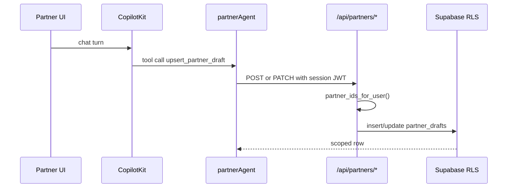

# AGT-PTR-02 — Partner-scoped Supabase tools

## Purpose

Mastra tools that read/write partner data **only** through server routes verifying JWT + `partner_ids_for_user()` RLS helpers. F13 carve-out for service-role in `/api/partners/*` only.

**Persona:** Partner user — drafts and leads never leak across tenants.

## Tools (MVP)

| Tool | Route | Method | Writes |
|---|---|:---:|:---:|
| `read_partner_draft` | `/api/partners/drafts/[id]` | GET | — |
| `upsert_partner_draft` | `/api/partners/drafts` | POST | create |
| `upsert_partner_draft` | `/api/partners/drafts/[id]` | PATCH | update |
| `list_partner_leads` | `/api/partners/leads` | GET | — |
| `get_partner_profile` | `/api/partners/me` | GET | — |

Phase 1.5: `update_lead_status`, `draft_partner_reply` (no send).

## Security flow



## Acceptance criteria

- [ ] All routes: `createClient()` auth first; reject if user ∉ `partner_members` for target `partner_id`
- [ ] POST creates draft; PATCH updates by id (aligns Linear SAN-706 + disk)
- [ ] No `SUPABASE_SERVICE_ROLE_KEY` imported by client components
- [ ] Tools registered on `partnerAgent` only; tool `name` matches Mastra tool id
- [ ] Vitest: anon → 401; wrong tenant → 403; member reads own draft
- [ ] Field masks minimal on list endpoints
- [ ] `database.types.ts` regenerated after SAN-683 push

## Security invariants

```text
Client → CopilotKit → partnerAgent → tool → /api/partners/* → createClient() → RLS
```

Never trust model-supplied `partner_id` without server verification against `partner_ids_for_user()`.

## Files (expected touch)

- `mdeapp/src/app/api/partners/drafts/route.ts`
- `mdeapp/src/app/api/partners/drafts/[id]/route.ts`
- `mdeapp/src/app/api/partners/leads/route.ts`
- `mdeapp/src/app/api/partners/me/route.ts`
- `mdeapp/src/mastra/tools/partner-*.ts`
- `mdeapp/src/mastra/agents/partner.ts`

## Verify

```bash
cd mdeapp && npm test -- --run src/app/api/partners
npm run floor
```

## Rollback

Disable tools on `partnerAgent`; routes return 501 until schema applied.

## Blocks

SAN-709 onboarding writes · SAN-708 lead tools · SAN-710 attribution
