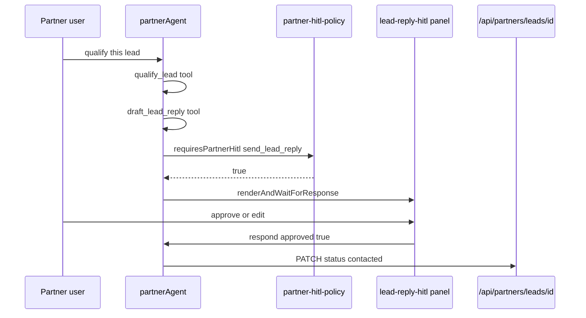

# AGT-PTR-05 — Lead qualification + HITL reply

## Purpose

`partnerAgent` scores inbound `leads`, drafts a reply, and **requires HITL** before any customer-visible send or status change to `contacted`.

**Persona:** Broker on `/dashboard` — AI drafts reply; human approves before tourist sees it.

## HITL sequence



## Acceptance criteria

- [ ] Tool `qualify_lead`: score + rationale in agent state
- [ ] Tool `draft_lead_reply`: draft in state or `leads.metadata`
- [ ] `useCopilotAction` + `renderAndWaitForResponse` before `send_lead_reply`
- [ ] `send_lead_reply` only after `respond({ approved: true })`
- [ ] Updates `leads.status` via `/api/partners/leads/[id]` with RLS
- [ ] `requiresPartnerHitl` from AGT-PTR-06 gates outbound send
- [ ] Vitest: send blocked without approval
- [ ] Optional: SAN-590 faithfulness scorer on draft

## HITL trigger

| Action | HITL |
|---|---|
| Outbound message to tourist | required |
| Internal note / qualify only | not required |

## Files (expected touch)

- `mdeapp/src/mastra/tools/partner-leads.ts`
- `mdeapp/src/app/api/partners/leads/[id]/route.ts`
- `mdeapp/src/components/partners/lead-reply-hitl.tsx`

## Verify

```bash
cd mdeapp && npm test -- --run src/mastra/tools/partner-leads
npm run floor
```

## Blocks

SAN-684 lead engine AI layer
