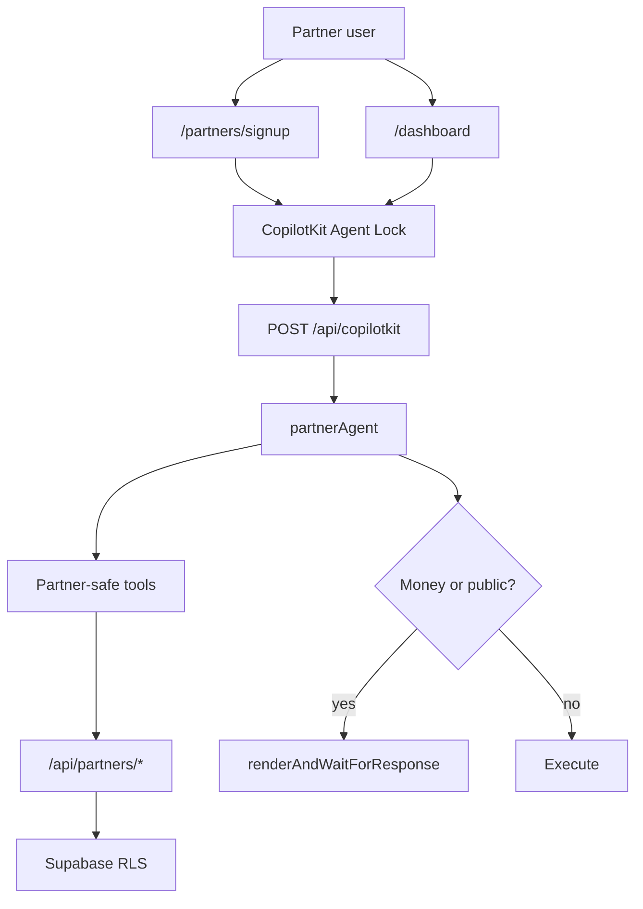
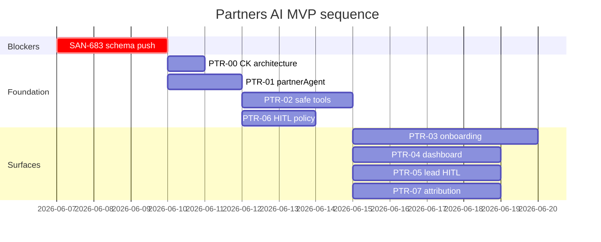

# AGT-PTR — Partners AI (MVP)

> One `partnerAgent` · scoped Supabase tools · HITL for money/public actions. **Not** 18 vertical agents.

## System overview



## Execution order



## Linear map

| Spec | Linear | Priority | Blocked by | Unblocks |
|------|--------|----------|------------|----------|
| AGT-PTR-00 | disk only | P0 | — | 709, 707 |
| AGT-PTR-01 | [SAN-705](https://linear.app/sanjiovani/issue/SAN-705) | Urgent | SAN-683 | 706, 709, 707, 711 |
| AGT-PTR-02 | [SAN-706](https://linear.app/sanjiovani/issue/SAN-706) | Urgent | 683, 705 | 709, 708, 710 |
| AGT-PTR-03 | [SAN-709](https://linear.app/sanjiovani/issue/SAN-709) | High | 705, 706, PTR-00, SAN-412 | SAN-665 |
| AGT-PTR-04 | [SAN-707](https://linear.app/sanjiovani/issue/SAN-707) | High | 705, 706, PTR-00 | SAN-690 |
| AGT-PTR-05 | [SAN-708](https://linear.app/sanjiovani/issue/SAN-708) | High | 706, 711 | SAN-684 |
| AGT-PTR-06 | [SAN-711](https://linear.app/sanjiovani/issue/SAN-711) | Medium | 705 | 708, 686 |
| AGT-PTR-07 | [SAN-710](https://linear.app/sanjiovani/issue/SAN-710) | Medium | 683, 706 | SAN-673, 684 |

## Disk specs

| File | Linear | Phase |
|------|--------|-------|
| [AGT-PTR-00-copilotkit-route-architecture.md](./AGT-PTR-00-copilotkit-route-architecture.md) | — | **Design gate** |
| [AGT-PTR-01-partner-agent-foundation.md](./AGT-PTR-01-partner-agent-foundation.md) | SAN-705 | Implement |
| [AGT-PTR-02-partner-supabase-tools.md](./AGT-PTR-02-partner-supabase-tools.md) | SAN-706 | Implement |
| [AGT-PTR-03-onboarding-copilot.md](./AGT-PTR-03-onboarding-copilot.md) | SAN-709 | Implement |
| [AGT-PTR-04-dashboard-copilot.md](./AGT-PTR-04-dashboard-copilot.md) | SAN-707 | Implement |
| [AGT-PTR-05-lead-qualification-hitl.md](./AGT-PTR-05-lead-qualification-hitl.md) | SAN-708 | Implement |
| [AGT-PTR-06-hitl-policy-module.md](./AGT-PTR-06-hitl-policy-module.md) | SAN-711 | Implement |
| [AGT-PTR-07-concierge-attribution.md](./AGT-PTR-07-concierge-attribution.md) | SAN-710 | Implement |

## Numbered plan

```text
SAN-683 db push
  → restore SAN-591 runtime allowlist
  → AGT-PTR-00 layout decision (signup + dashboard)
  → SAN-705 partnerAgent
  → SAN-706 /api/partners/* tools
  → SAN-711 HITL policy (parallel with 706)
  → SAN-709 signup copilot + SAN-665 UX
  → SAN-707 dashboard copilot + SAN-690 UX
  → SAN-708 lead qualify + HITL
  → SAN-710 concierge attribution
```

## Reuse (do not re-file)

- SAN-591 allowlist · SAN-589/590/605 scorers · SAN-412 INT-009 · `host-event-copilot-bridge.tsx`

## Verify (per task)

```bash
cd mdeapp && infisical run --silent --env=dev --path=/ -- npm run floor
npm test -- --run src/mastra/agents
```

## Audit corrections applied (2026-06-06)

See [06d-mastra-audit.md](../audit/06d-mastra-audit.md): PTR-00 added · PTR-04 deps fixed · POST+PATCH drafts · `partnerAgent` naming · lead path `/api/leads/schedule-viewing` · PTR-06 before PTR-05.
