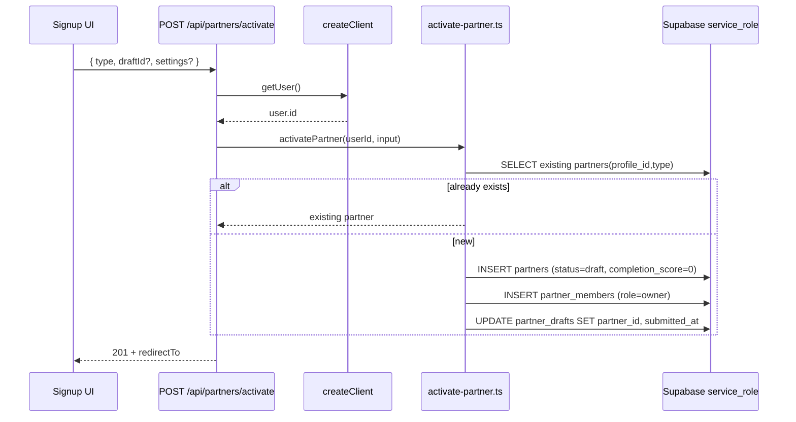

# SAN-665 — Partner activation API (plan only)

## Purpose

Roberto completes the signup wizard and needs a **`partners` row + `partner_members` owner row** created server-side. SAN-683 made `partners` INSERT **service_role-only**; browser clients cannot self-provision or self-elevate `status`/`tier`.

**North star for this PR:** one route, one service module, tests — no wizard UI, no Mastra tools yet.

## API contract

### `POST /api/partners/activate`

| Field | Type | Required | Notes |
|---|---|:---:|---|
| `type` | `partner_type` enum | ✅ | `host` \| `venue` \| `broker` \| `sponsor` \| `agency` \| `vendor` \| `tour` \| `creator` |
| `draftId` | `uuid` | ◑ | Link existing `partner_drafts` row; if omitted, create minimal draft or skip |
| `settings` | `json` | ◑ | Whitelisted keys only; never accept `status`, `tier`, `completion_score` from client |

**Auth:** `createClient()` → `getUser()` → **401** if missing.

**Response 201:**

```json
{
  "partnerId": "uuid",
  "type": "host",
  "status": "draft",
  "redirectTo": "/dashboard"
}
```

**Response 200 (idempotent):** same shape when `(profile_id, type)` already exists.

**Errors:** `400` invalid type/body · `401` unauthenticated · `409` optional conflict semantics · `503` service role unavailable.

## Server flow



## Security invariants

1. **Auth first** — `createClient()` + `getUser()` before service role (F13 carve-out).
2. **Never trust client for privileged columns** — server sets only:
   - `partners.status` = `'draft'` (never `'active'` / `'pending_review'` from client)
   - `partners.completion_score` = `0` or derived from draft server-side
   - `partner_services.tier` — not created in activate v1 (or insert with default `free` via service_role only)
3. **Unique `(profile_id, type)`** — `idx_partners_profile_type`; on conflict return existing (idempotent 200).
4. **Settings sanitize** — strip keys matching `/status|tier|completion_score|activated_at/i`.
5. **Service role** — `createServiceRoleClient()` only inside route/service module; never imported by client.
6. **No rollback migration** — forward-only; SAN-683 already live.

## Files to create / update

### Create (PR scope)

| File | Purpose |
|---|---|
| `mdeapp/src/lib/partners/partner-types.ts` | Zod enum mirror of `partner_type` + shared constants |
| `mdeapp/src/lib/partners/activate-schema.ts` | `activatePartnerInputSchema` (Zod) |
| `mdeapp/src/lib/partners/activate-partner.ts` | Core logic: idempotent insert, member row, draft link |
| `mdeapp/src/app/api/partners/activate/route.ts` | `POST` handler |
| `mdeapp/src/__tests__/api/partners-activate.test.ts` | Vitest route tests (mock service + auth) |

### Update (same PR or follow-up)

| File | Change |
|---|---|
| `tasks/design/partners/audit/06e-supabase-audit.md` | Link SAN-665 plan when in progress |
| `sitemap.md` | Add `POST /api/partners/activate` under API inventory when shipped |
| `tasks/commit/COMMIT-LEDGER.md` | Row `C-###` partners activate API |

### Out of scope (later PRs)

- `mdeapp/src/app/partners/signup/**` wizard UI (SAN-665 UI slice / SAN-690)
- `mdeapp/src/mastra/tools/partner-*.ts` (AGT-PTR-02 / SAN-706)
- `GET /api/partners/me`, drafts CRUD (AGT-PTR-02)
- `/dashboard` page shell (SAN-690) — activate returns `redirectTo`; page can 404 until dashboard PR

## Tests (Vitest)

| Case | Expect |
|---|---|
| Unauthenticated POST | **401** |
| Invalid `type` (`"hacker"`) | **400** |
| Valid `host` first call | **201**; `partnerId` set; `status` = `draft` |
| Duplicate same user+type | **200**; same `partnerId` (idempotent) |
| Owner member row | `partner_members.role` = `owner` for `profile_id` |
| Client cannot escalate via body | `settings: { status: "active" }` ignored; row stays `draft` |
| Service role mock insert | uses `createServiceRoleClient`; not called when 401 |
| Browser client simulation | `createClient()` insert to `partners` fails (RLS/grant) — document in test comment or integration stub |

Run:

```bash
cd mdeapp && npm test -- --run src/__tests__/api/partners-activate.test.ts
```

## Smoke checklist (post-merge, manual / Playwright later)

| # | Step | Assert |
|---|---|---|
| S1 | Roberto signs up / logs in as host | Session cookie present |
| S2 | Wizard autosave writes `partner_drafts` | Row for `profile_id` + `type=host` |
| S3 | `POST /api/partners/activate` with `{ type: "host" }` | 201 + `partnerId` |
| S4 | `GET /api/partners/me` (when built) or service_role spot-check | Own partner readable |
| S5 | Anon `select` on `partners` via REST | Empty / 401 — no leak |
| S6 | Authenticated UPDATE `partners.status='active'` via anon client | Permission denied (F1) |

Evidence path: `tasks/testing/evidence/YYYY-MM-DD/san665-activate-smoke.md`

## Verification (Done gate)

```bash
cd mdeapp
npm test -- --run src/__tests__/api/partners-activate.test.ts
npm run floor
# Optional prod smoke: curl POST with session cookie (Tier 2)
```

## PR scope (recommended)

**One PR:** `ai/san-665-partners-activate-api`

- ≤5 source files + 1 test file
- Single commit subject: `feat(partners): POST /api/partners/activate (SAN-665)`
- Closes SAN-665 (API slice only); wizard UI remains separate issue

## Linear updates (recommended)

| Issue | Action |
|---|---|
| **SAN-683** | → **Done** · comment: prod apply + MCP verification [`san683-prod-apply-RESULTS.md`](../../../testing/evidence/2026-06-07/san683-prod-apply-RESULTS.md) |
| **SAN-665** | → **In Progress** · scope = activate API only (this plan) |
| **SAN-690** | Keep Todo · add `blockedBy: SAN-665` until activate ships |
| **SAN-706** (AGT-PTR-02) | Todo · `blockedBy: SAN-665` for drafts/me routes |
| **SAN-709** (AGT-PTR-03) | Todo · onboarding copilot after activate + drafts API |

Branch naming: `ai/san-665-partners-activate-api`

## Open decisions (approve before implement)

1. **`redirectTo`:** `/dashboard` vs `/partners/dashboard` — sitemap has no live `/dashboard` yet; return `/dashboard` and add shell in SAN-690, or return `/partners/signup?activated=1` interim?
2. **Draft handling:** require `draftId` vs auto-link latest unsubmitted draft for `(profile_id, type)`?
3. **409 vs 200** on duplicate — recommend **200 idempotent** per unique index.

---

**Approval needed:** reply "approved" with redirect + draft decisions, then implement.
