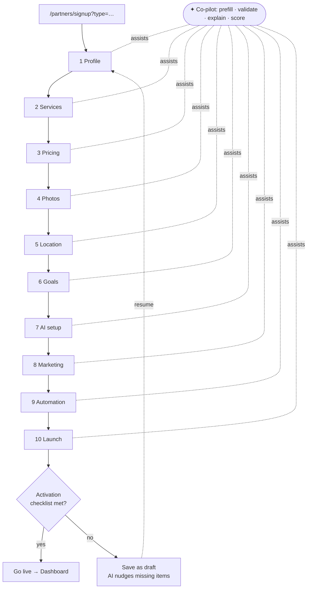

# Part 4 — Multi-Step AI Signup

**One typed wizard** for all partner types (`/partners/signup?type=…`). AI co-pilot reads & writes the form (generative UI). Steps adapt by type — a sponsor skips photos/hours; a venue gets them. Wireframe: `partner-signup-wireframe.html`.

## The 10 steps

| # | Step | Fields | Validation | AI suggestion |
|---|---|---|---|---|
| 1 | Business profile | type · name · category · neighborhood · contact | required; phone/email format | infer type/category/barrio from one sentence |
| 2 | Services | what you offer (events·space·rentals·sponsorship·products) | ≥1 | recommend bundle by type |
| 3 | Pricing | your prices / our plan tier | numeric ranges | suggest market-rate band (grounded) |
| 4 | Photos | upload / import (Google Business) | ≥1 image or skip | auto-pick best, alt-text, order |
| 5 | Location | map pin · address · area | valid pin (`mapId`) | geocode from name; confirm pin |
| 6 | Goals | fill nights · leads · ticket sales · reach | pick 1–3 | map goals → services to enable |
| 7 | AI setup | enable concierge surfacing · tone · do/don't | — | draft a sample concierge answer |
| 8 | Marketing prefs | Postiz channels · post cadence · audience | connect socials | suggest cadence + first post |
| 9 | Automation prefs | AI lead reply · auto-ingest (OpenClaw) · reminders · HITL gate | — | recommend safe defaults (HITL on for money) |
| 10 | Launch | review summary · verify (Google Business/payout) | required verifications | recap + activation checklist |

## Completion score + activation checklist

**Completion score (0–100)** shown live in the wizard + dashboard:
- Profile 20 · Photos 15 · Location 10 · Pricing 10 · Services 10 · AI setup 10 · Marketing 10 · Verify 15.
**Activation checklist** (gates "go live"): profile complete · ≥1 photo · valid pin · ≥1 service · verified (Google Business or payout). Below threshold → listed as "draft", AI nudges the missing items.

## Flow (Mermaid)

## Per-partner-type variants (the wizard IS different per partner)

One **engine**, a **per-type step config** — not 5 codebases, and not identical for everyone. Steps switch on/off and fields change by `type`. `●` = full step · `◐` = trimmed · `–` = skipped.

| Step | Host | Restaurant | Café | Nightclub | Broker | Sponsor | Vendor | Agency |
|---|:--:|:--:|:--:|:--:|:--:|:--:|:--:|:--:|
| 1 Business profile | ● | ● | ● | ● | ● | ● | ● | ● |
| 2 Services | ◐ events | ● | ◐ | ● | ◐ rentals | ◐ packages | ● | ● builds |
| 3 Pricing | ticket tiers | menu/$$ | $$ | tables/tickets | rent/fees | budget | product $ | retainer |
| 4 Photos | event art | venue+dishes | venue | venue | unit photos | brand assets | products | – |
| 5 Location | venue pin | ● | ● | ● | unit pins | – (audience geo) | ● | – |
| 6 Goals | sell tickets | reservations | foot traffic | fill nights | leads | reach/ROI | sales | outcomes |
| 7 AI setup | promo tone | menu/reviews | posts | event+Postiz | lead replies | match prefs | storefront | scope |
| 8 Marketing | Postiz | Postiz | Postiz | Postiz | listing boost | campaign | Postiz | – |
| 9 Automation | promo | reviews/promos | posts | ingest+booking | lead-qual/sched | optimize | restock | n/a |
| 10 Launch | publish | go live | go live | go live | go live | campaign live | storefront live | kickoff |

Extra/branch steps: **Sponsor** adds a *campaign brief* + Patricia-review gate; **Agency** adds a *project scoping* step and skips photos/location; **Broker** supports *bulk unit import*; **Nightclub** adds *recurring-night* setup (OpenClaw). The co-pilot reads `type` and only renders the relevant steps/fields.

## Build notes
- **Reuse** CopilotKit for the co-pilot (generative-UI tool calls write the form); Mastra agent `partnerOnboardingAgent` with tools `set_partner_profile` / `set_services` / `suggest_pricing` / `geocode_pin`.
- Autosave each step to `partner_drafts` (Supabase); resume by `?draft=`.
- Steps are a config array keyed by `type` — render only relevant steps. Don't fork per type.
- A11y: each step a `<fieldset>`; co-pilot announces field changes.
