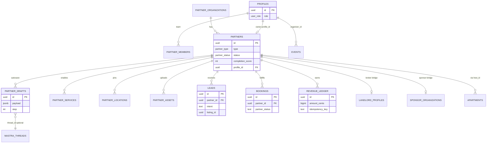
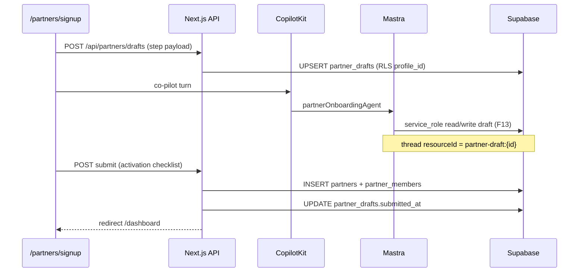
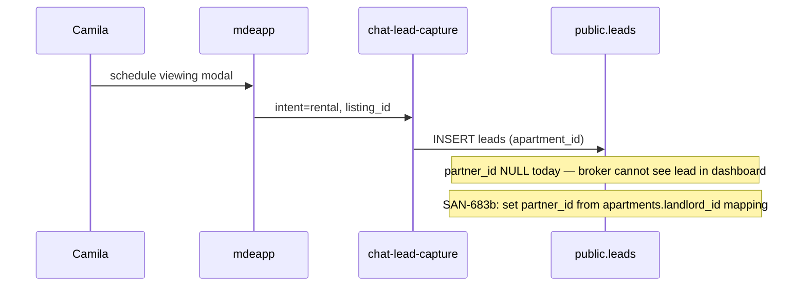
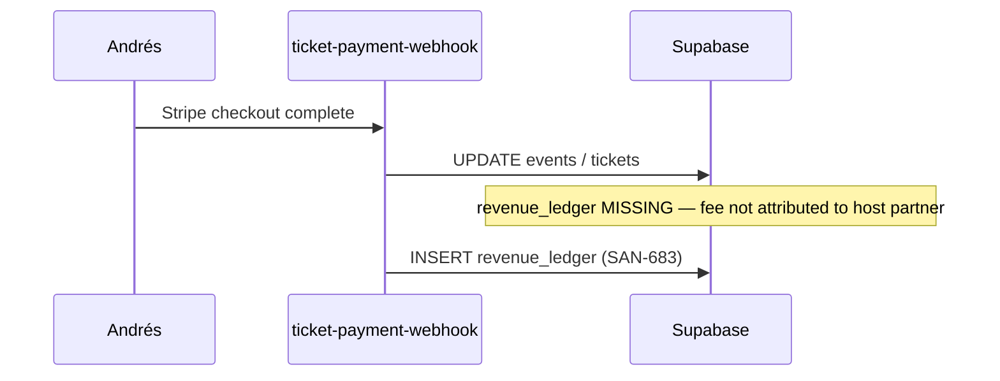
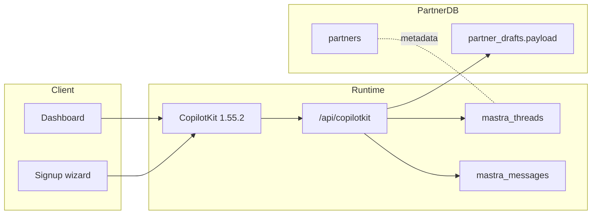

# SAN-683 — Partner database schema audit (live Supabase)

> **One-line verdict:** [SAN-683](https://linear.app/sanjiovani/issue/SAN-683) correctly identifies the blocker, but the PRD table list is **aspirational** — live DB has strong **rental CRM + events + sponsor** primitives and **zero** `partners` / `partner_drafts` / `revenue_ledger`. **Extend `leads` + `bookings`; add 8 net-new tables; bridge to `sponsor.*` and `landlord_profiles` — do not greenfield 15 tables.**

## Executive summary

| Check | Live (2026-06-06) | SAN-683 / PRD §7 | Verdict |
|---|---|---|---|
| `partners`, `partner_drafts`, `organizations` (public) | **Missing** | Required | 🔴 Gap — M1 |
| `public.leads` | **13 rows**, rental CRM shape | Listed as partner lead store | 🟡 **Extend** — add `partner_id`, generic listing FK |
| `public.bookings` | **0 rows**, consumer trip model | Partner booking/HITL | 🟡 **Extend** — add `partner_id`, approval columns |
| `events`, `apartments`, `venue_signals` | Live (49 / 44 / 30 rows) | Reuse | 🟢 Link via `partners` + existing owner columns |
| `sponsor.organizations` + 9 tables | Live, RLS | PRD `organizations` | 🟡 **Different model** — bridge, don't duplicate |
| `landlord_profiles` | Live (rental supply) | Broker vertical | 🟡 Bridge `partners` ↔ landlord |
| `mastra_threads` / `messages` | 431 / 1064 rows, service_role RLS | Partner copilot | 🟢 Reuse `resourceId` convention |
| Partner edge functions | `chat-lead-capture`, sponsor-*, postiz-* | SAN-684/687/689 | 🟡 Wire after schema |
| Migrations on disk for partner tables | **None** in `mdeapp/supabase/migrations/` | SAN-683 AC | 🔴 |

**SAN-683 is correct to block SAN-665/690/684.** The issue description is ~80% right; the implementation plan needs the corrections in §5–§7 below.

---

## Live inventory (queried via Supabase MCP)

### Tables touching partner domain

| Table | Schema | Rows | RLS | Partner relevance |
|---|---|---:|:---:|---|
| `leads` | public | 13 | ✅ 5 policies | Rental CRM; `intent`, `apartment_id`, `assigned_agent_id` — **no `partner_id`** |
| `bookings` | public | 0 | ✅ 4 policies | Consumer-owned (`user_id`); `booking_type` enum incl. restaurant/tour/showing — **no supply-side** |
| `events` | public | 49 | ✅ 11 policies | `organizer_id`, `created_by` — host supply |
| `apartments` | public | 44 | ✅ 3 policies | `host_id`, `landlord_id`, `created_by` — rental supply |
| `venue_signals` | public | 30 | ✅ 2 policies | Grounding cache — **no owner FK** |
| `landlord_profiles` | public | — | ✅ | Parallel broker profile stack |
| `profiles` | public | 13 | ✅ 3 policies | `user_role`: user/moderator/admin/super_admin — **no partner role** |
| `mastra_threads` | public | 431 | ✅ service_role only | `resourceId`, `metadata` jsonb |
| `mastra_messages` | public | 1064 | ✅ service_role only | CopilotKit runtime (F13 carve-out) |
| `ai_runs` | public | — | ✅ user-scoped | Agent observability |
| `organizations` | **sponsor** | — | ✅ 2 policies | Sponsor B2B — **not** PRD public org |
| `assets` | **sponsor** | — | ✅ 2 policies | Sponsor creatives |
| `applications`, `placements`, `contracts`, … | sponsor | — | ✅ | Full sponsor monetization stack |

**Confirmed missing (grep migrations + `information_schema`):**  
`partners`, `partner_drafts`, `partner_organizations`, `partner_services`, `partner_locations`, `partner_assets`, `partner_subscriptions`, `revenue_ledger`, `partner_campaigns`, `partner_automations`, `partner_conversations`, `partner_messages`.

### `public.leads` — current columns (extend target)

| Column | Notes for SAN-683 |
|---|---|
| `user_id` | Nullable (anonymous chat) — keep |
| `source` | Default `'web'` — **needs enum** (`web`, `chat`, `whatsapp`, `contact`, `concierge`, …) |
| `intent` | `rental` today — extend: `event`, `venue`, `sponsor`, `agency` |
| `apartment_id` | Rental-specific — add generic `listing_id` + `listing_kind` OR keep + add `partner_id` |
| `assigned_agent_id` | Patricia CRM — map to `partner_members` later |
| `metadata` jsonb | Escape hatch — don't rely for prod partner attribution |
| `trip_id` | Commerce linkage (DATA-029) — keep |

**Indexes (good):** `idx_leads_apartment_id`, `idx_leads_intent_apartment`, `idx_leads_pipeline`, `idx_leads_user_idempotency_unique`.  
**Missing for partners:** `partner_id`, `(partner_id, status, created_at)`.

**Triggers:** `leads_updated_at`, `trg_compute_lead_score` — keep; add optional `trg_leads_partner_notify` (P2).

**RLS gap:** Policies scope to `user_id` / `assigned_agent_id` / admin — **no partner-member read path**. Partners cannot see inbound leads today without service-role or new policies.

### `public.bookings` — current columns (extend target)

Consumer trip bookings (`user_id`, `resource_id`, `booking_type` enum: apartment/car/restaurant/event/tour/showing).  
**RLS:** owner SELECT/INSERT/UPDATE only + service_role — **no partner approval path** for SAN-686.

### Mastra integration (no new tables for M1)

| Surface | Pattern today | Partner onboarding |
|---|---|---|
| Threads | `mastra_threads.resourceId` (text) | `partner-draft:{draft_id}` or `partner:{partner_id}` |
| Messages | service_role via `/api/copilotkit`, `/api/threads` | Same — F13 carve-out OK |
| Working memory | LibSQL in-process + optional `mastra_resources` | Partner wizard state → **`partner_drafts.payload`** (source of truth) |

Do **not** duplicate chat history into `partner_messages` for M1 — Mastra already persists turns. Add `partner_conversations` only when Chatwoot (SAN-689) ships.

### Edge functions (partner-adjacent, live)

| Function | JWT | Feeds |
|---|---|---|
| `chat-lead-capture` | false | `public.leads` via `/api/leads/schedule-viewing` |
| `lead-from-form` | false | Contact/demo forms (SAN-693) |
| `lead-reminder-tick` | false | CRM follow-ups |
| `ticket-checkout` / `ticket-payment-webhook` | false | Event GMV — needs `revenue_ledger` row |
| `sponsor-*` (12+) | mixed | `sponsor.*` schema |
| `postiz-schedule-posts` / `postiz-approval-webhook` | mixed | SAN-687 pipeline |
| `openclaw-delivery-webhook` | false | SAN-688 ingestion |

**No edge function writes `partners` or `partner_drafts` today.**

---

## SAN-683 vs PRD §7 — what's correct, what's wrong

### Correct in SAN-683

- Foundational gate before signup/dashboard/leads/booking/copilot
- RLS-tight + service-role server-only (F13)
- Reuse `events`, rentals (`apartments`), `venue_signals`
- ERD concept: org → partner → locations/assets/services → leads/bookings → revenue
- `partner_drafts` for wizard autosave (05-signup-wizard.md)

### Corrections required before migration

| PRD / SAN-683 claim | Live reality | Recommended fix |
|---|---|---|
| Table `organizations` (public) | `sponsor.organizations` exists | Use **`partner_organizations`** in public to avoid name clash |
| Table `assets` (public) | `sponsor.assets` exists | Use **`partner_assets`** + Storage bucket `partner-assets` |
| Table `subscriptions` | Only `whatsapp_subscriptions` | Use **`partner_subscriptions`** (Stripe plan tier) |
| Table `leads` (new) | `public.leads` exists | **ALTER** — add `partner_id`, `listing_kind`, `listing_id` |
| Table `bookings` (new) | `public.bookings` exists | **ALTER** — add `partner_id`, `approved_by`, `approved_at`, `partner_notes` |
| Table `messages` / `conversations` | Mastra + future Chatwoot | **Defer to M2** (SAN-689) — optional `partner_conversations` |
| `campaigns` / `automations` | No table; Postiz/OpenClaw external | **Defer to M4** (SAN-670/687) — stub `partner_automations` jsonb on `partners` for M1 |
| `pgvector` on all entities | Overkill for M1 | **Only** if partner KB search in M4; skip in first migration |
| `rentals` table | **`apartments`** is the rental listing table | PRD wording → `apartments` FK |

### Additions missing from SAN-683

| Addition | Why |
|---|---|
| **`partner_members`** (partner_id, profile_id, role) | Team tab + RLS (`auth.uid()` → member → partner) |
| **`partner_type` enum** | Align with Linear `ptr:*` (host, venue, broker, sponsor, agency, vendor, tour, creator) |
| **`partners.profile_id`** + **`partners.sponsor_org_id`** | Auth user + sponsor bridge |
| **`partners.landlord_profile_id`** | Broker vertical reuse |
| **`partner_drafts.completion_score`** | Wizard + dashboard ring (05-signup-wizard.md) |
| **`revenue_ledger` idempotency** | Stripe webhook dedupe (ticket + lead fees) |
| **Storage RLS** on `partner-assets` bucket | SAN-687 dependency |
| **RLS helper** `partner_ids_for_user()` | Single `(SELECT auth.uid())` pattern per mde-supabase skill |

---

## Recommended schema — M1 migration slice (SAN-683 v1)

> **Scope:** minimum to unblock SAN-665 (drafts), SAN-690 (dashboard reads), SAN-684 (partner-scoped leads), SAN-675 (host links `events.organizer_id`).

### Net-new tables (8)

```sql
-- Enums (illustrative — finalize in migration)
CREATE TYPE partner_type AS ENUM (
  'host', 'venue', 'broker', 'sponsor', 'agency', 'vendor', 'tour', 'creator'
);
CREATE TYPE partner_status AS ENUM (
  'draft', 'pending_review', 'active', 'suspended', 'churned'
);

CREATE TABLE partner_organizations (
  id uuid PRIMARY KEY DEFAULT gen_random_uuid(),
  legal_name text NOT NULL,
  display_name text NOT NULL,
  tax_id text,
  metadata jsonb NOT NULL DEFAULT '{}',
  created_at timestamptz NOT NULL DEFAULT now(),
  updated_at timestamptz NOT NULL DEFAULT now()
);

CREATE TABLE partners (
  id uuid PRIMARY KEY DEFAULT gen_random_uuid(),
  organization_id uuid REFERENCES partner_organizations(id) ON DELETE SET NULL,
  profile_id uuid NOT NULL REFERENCES profiles(id) ON DELETE RESTRICT,
  type partner_type NOT NULL,
  status partner_status NOT NULL DEFAULT 'draft',
  completion_score smallint NOT NULL DEFAULT 0 CHECK (completion_score BETWEEN 0 AND 100),
  sponsor_organization_id uuid, -- FK → sponsor.organizations(id) when type=sponsor
  landlord_profile_id uuid REFERENCES landlord_profiles(id) ON DELETE SET NULL,
  settings jsonb NOT NULL DEFAULT '{}',  -- automation stubs M1
  activated_at timestamptz,
  created_at timestamptz NOT NULL DEFAULT now(),
  updated_at timestamptz NOT NULL DEFAULT now()
);

CREATE TABLE partner_members (
  partner_id uuid NOT NULL REFERENCES partners(id) ON DELETE CASCADE,
  profile_id uuid NOT NULL REFERENCES profiles(id) ON DELETE CASCADE,
  role text NOT NULL DEFAULT 'owner' CHECK (role IN ('owner', 'staff', 'billing')),
  created_at timestamptz NOT NULL DEFAULT now(),
  PRIMARY KEY (partner_id, profile_id)
);

CREATE TABLE partner_drafts (
  id uuid PRIMARY KEY DEFAULT gen_random_uuid(),
  partner_id uuid REFERENCES partners(id) ON DELETE CASCADE,
  profile_id uuid NOT NULL REFERENCES profiles(id) ON DELETE CASCADE,
  type partner_type NOT NULL,
  step int NOT NULL DEFAULT 1 CHECK (step BETWEEN 1 AND 10),
  payload jsonb NOT NULL DEFAULT '{}',
  completion_score smallint NOT NULL DEFAULT 0,
  thread_id text, -- mastra_threads.id optional
  submitted_at timestamptz,
  created_at timestamptz NOT NULL DEFAULT now(),
  updated_at timestamptz NOT NULL DEFAULT now()
);

CREATE TABLE partner_services (
  id uuid PRIMARY KEY DEFAULT gen_random_uuid(),
  partner_id uuid NOT NULL REFERENCES partners(id) ON DELETE CASCADE,
  service_key text NOT NULL,  -- e.g. 'ai_menu', 'postiz', 'lead_qual'
  tier text NOT NULL DEFAULT 'free',
  enabled boolean NOT NULL DEFAULT true,
  config jsonb NOT NULL DEFAULT '{}',
  UNIQUE (partner_id, service_key)
);

CREATE TABLE partner_locations (
  id uuid PRIMARY KEY DEFAULT gen_random_uuid(),
  partner_id uuid NOT NULL REFERENCES partners(id) ON DELETE CASCADE,
  label text,
  address text,
  neighborhood text,
  lat double precision,
  lng double precision,
  google_place_id text,
  is_primary boolean NOT NULL DEFAULT false,
  metadata jsonb NOT NULL DEFAULT '{}'
);

CREATE TABLE partner_assets (
  id uuid PRIMARY KEY DEFAULT gen_random_uuid(),
  partner_id uuid NOT NULL REFERENCES partners(id) ON DELETE CASCADE,
  kind text NOT NULL,  -- photo, logo, menu, contract
  storage_path text NOT NULL,
  mime_type text,
  metadata jsonb NOT NULL DEFAULT '{}',
  created_at timestamptz NOT NULL DEFAULT now()
);

CREATE TABLE revenue_ledger (
  id uuid PRIMARY KEY DEFAULT gen_random_uuid(),
  partner_id uuid NOT NULL REFERENCES partners(id) ON DELETE RESTRICT,
  source_kind text NOT NULL,  -- ticket, lead_fee, booking, subscription, sponsorship
  source_id uuid,             -- leads.id, bookings.id, events.id, etc.
  amount_cents bigint NOT NULL,
  currency text NOT NULL DEFAULT 'usd',
  platform_fee_cents bigint NOT NULL DEFAULT 0,
  stripe_reference text,
  idempotency_key text UNIQUE,
  metadata jsonb NOT NULL DEFAULT '{}',
  created_at timestamptz NOT NULL DEFAULT now()
);
```

### Extensions to existing tables (same migration or SAN-683b)

```sql
ALTER TABLE public.leads
  ADD COLUMN IF NOT EXISTS partner_id uuid REFERENCES partners(id) ON DELETE SET NULL,
  ADD COLUMN IF NOT EXISTS listing_kind text,
  ADD COLUMN IF NOT EXISTS listing_id uuid;

CREATE INDEX IF NOT EXISTS idx_leads_partner_status
  ON public.leads (partner_id, status, created_at DESC)
  WHERE partner_id IS NOT NULL;

ALTER TABLE public.bookings
  ADD COLUMN IF NOT EXISTS partner_id uuid REFERENCES partners(id) ON DELETE SET NULL,
  ADD COLUMN IF NOT EXISTS approved_by uuid REFERENCES profiles(id),
  ADD COLUMN IF NOT EXISTS approved_at timestamptz,
  ADD COLUMN IF NOT EXISTS partner_status text DEFAULT 'pending'
    CHECK (partner_status IN ('pending', 'approved', 'declined'));
```

### Deferred (M2–M4 — separate issues)

| Table | Issue | Phase |
|---|---|---|
| `partner_campaigns` | SAN-681/664 | M5 |
| `partner_automations` | SAN-670 | M4 |
| `partner_conversations` / `partner_messages` | SAN-689 | M4 |
| `partner_subscriptions` | SAN-668 | M3 |

---

## ERD — target state (M1 + extensions)



---

## Data flow diagrams

### 1. Partner signup (SAN-665) — M1



### 2. Rental lead → broker (existing path + gap)



### 3. Event ticket → revenue (SAN-668 dependency)



### 4. Mastra + partner copilot (SAN-685)



---

## RLS policy matrix (required for SAN-683 Done)

| Table | anon | authenticated partner | admin | service_role |
|---|---|---|---|---|
| `partner_drafts` | deny | CRUD own (`profile_id`) | read all | ALL (API routes) |
| `partners` | deny | SELECT/UPDATE via `partner_members` | ALL | ALL |
| `partner_members` | deny | SELECT own memberships | ALL | ALL |
| `partner_services` | deny | CRUD via partner membership | ALL | ALL |
| `partner_locations` | deny | CRUD via partner membership | ALL | ALL |
| `partner_assets` | deny | CRUD via partner membership | ALL | ALL |
| `revenue_ledger` | deny | SELECT own partner rows | ALL | INSERT (webhooks) |
| `leads` (extended) | insert via edge only | SELECT/UPDATE where `partner_id` in member set | ALL | ALL |
| `bookings` (extended) | deny | SELECT/UPDATE approve where `partner_id` in member set | ALL | ALL |

**Helper function (required):**

```sql
CREATE OR REPLACE FUNCTION partner_ids_for_user()
RETURNS SETOF uuid
LANGUAGE sql STABLE SECURITY DEFINER SET search_path = public
AS $$
  SELECT partner_id FROM partner_members
  WHERE profile_id = (SELECT auth.uid());
$$;
```

Use `(SELECT auth.uid())` pattern everywhere — per mde-supabase skill.

---

## Migration files on disk (SAN-683 — one file per table/group)

| # | File | Creates / alters | Unblocks |
|---|---|---|---|
| 1 | `20260606130000_ptr001_partner_enums_and_helpers.sql` | `partner_type`, `partner_status` enums | All |
| 2 | `20260606130100_ptr002_partner_organizations.sql` | `partner_organizations` + RLS (admin/service) | Identity |
| 3 | `20260606130200_ptr003_partners.sql` | `partners` + bridges (sponsor, landlord) | Verticals |
| 4 | `20260606130300_ptr004_partner_members.sql` | `partner_members` | Team + RLS anchor |
| 5 | `20260606130400_ptr005_partner_rls_helpers_and_member_policies.sql` | `partner_ids_for_user()`, member RLS | Dashboard reads |
| 6 | `20260606130500_ptr006_partner_drafts.sql` | `partner_drafts` | **SAN-665** |
| 7 | `20260606130600_ptr007_partner_services.sql` | `partner_services` | Dashboard services tab |
| 8 | `20260606130700_ptr008_partner_locations.sql` | `partner_locations` | Map pins |
| 9 | `20260606130800_ptr009_partner_assets_and_storage.sql` | `partner_assets` + `partner-assets` bucket | **SAN-687** |
| 10 | `20260606130900_ptr010_leads_partner_columns.sql` | ALTER `leads` | **SAN-684** |
| 11 | `20260606131000_ptr011_bookings_partner_columns.sql` | ALTER `bookings` | **SAN-686** |
| 12 | `20260606131100_ptr012_leads_bookings_partner_rls.sql` | Partner RLS on leads/bookings | Lead inbox |
| 13 | `20260606131200_ptr013_revenue_ledger.sql` | `revenue_ledger` | **SAN-668** |

Path: `mdeapp/supabase/migrations/`

### Implementation order (human + CI)

1. **Review** this audit + Linear SAN-683 description (corrected naming).
2. **Apply locally:** `cd mdeapp && supabase db reset` (shadow) or `supabase migration up` on branch DB.
3. **Regenerate types:** `npx supabase gen types typescript --project-id zkwcbyxiwklihegjhuql > src/lib/supabase/database.types.ts`
4. **RLS pen-test** (§ Testing below) — anon blocked, partner member scoped.
5. **Push remote:** `supabase db push` (human approval — irreversible in prod).
6. **Floor:** `infisical run --silent --env=dev --path=/ -- npm run floor`
7. **Unblock:** flip SAN-683 → In Review → Done; SAN-665/690 can start API wiring.

**Deferred (not in ptr001–013):** `partner_subscriptions`, `partner_campaigns`, `partner_automations`, `partner_conversations`, pgvector.

---

## SAN-683 acceptance criteria — revised (100% task spec)

### Schema (Done gate)

- [ ] All **13** ptr migrations in `list_migrations` (local + remote match)
- [ ] **Zero** name collisions with `sponsor.*` (`partner_organizations`, `partner_assets`)
- [ ] **Extend** not recreate: `leads`, `bookings` (13 existing lead rows preserved)
- [ ] Every new table: RLS enabled + ≥1 policy per role scenario (mde-supabase rule)
- [ ] `partner_ids_for_user()` uses `search_path = ''` + fully qualified names
- [ ] `partner_drafts` unique active draft per `(profile_id, type)` where `submitted_at is null`

### Integration (follow-on issues — not SAN-683 alone)

- [ ] `partner_drafts` API autosave (SAN-665); resume `?draft=`
- [ ] `leads.partner_id` set in `chat-lead-capture` (apartment → landlord → partner map)
- [ ] `revenue_ledger` insert from `ticket-payment-webhook` with `idempotency_key`
- [ ] `database.types.ts` regenerated from live schema

### Production-ready checklist

| Gate | Command / check | Pass |
|---|---|:---:|
| Migrations replay | `supabase db reset` on shadow | |
| Remote sync | `supabase migration list` 13/13 | |
| Floor | `cd mdeapp && infisical run -- npm run floor` | |
| RLS anon | `set role anon; select * from partners limit 1` → 0 rows | |
| RLS partner | member JWT selects own `partner_drafts` | |
| RLS cross-tenant | partner A cannot SELECT partner B `leads` | |
| Service role | edge fn insert lead with `partner_id` | |
| Advisors | Supabase MCP `get_advisors` — no new ERROR on partner tables | |
| Types | `database.types.ts` includes `partner_drafts`, `revenue_ledger` | |
| No regressions | existing `leads` RLS (user/agent/admin) still passes | |

### Testing — verify changes are correct

```bash
# 1. Shadow replay (from mdeapp/)
supabase db reset

# 2. Schema smoke (after types regen)
cd mdeapp && infisical run --silent --env=dev --path=/ -- npm run floor

# 3. RLS pen-test SQL (run as authenticated test user + anon)
# anon — must return 0 rows
set local role anon;
select count(*) from public.partners;
select count(*) from public.partner_drafts;

# partner member — must see own draft only
set local role authenticated;
set local request.jwt.claim.sub = '<profile_uuid>';
select count(*) from public.partner_drafts where profile_id = '<profile_uuid>';

# 4. Cross-tenant denial
select count(*) from public.leads
where partner_id is not null
  and partner_id not in (select public.partner_ids_for_user());
-- expect 0 for non-admin partner JWT

# 5. Idempotency
insert into public.revenue_ledger (partner_id, source_kind, amount_cents, idempotency_key)
values ('<partner_uuid>', 'ticket', 1000, 'test-key-1');
-- second insert same idempotency_key → unique violation (good)
```

**Vitest (add in SAN-683 or SAN-665 slice):** schema contract test asserting `partner_type` enum values match `ptr:*` Linear labels.

### Explicitly out of scope M1

- `partner_conversations` / `partner_messages` (SAN-689 + Mastra reuse)
- `partner_campaigns` / `partner_automations` (SAN-670/681)
- `partner_subscriptions` (SAN-668 billing slice)
- pgvector on partner tables

---

## Security advisor notes (project-wide)

Live security lint returns project-wide issues (e.g. `spatial_ref_sys` RLS, mutable `search_path` on legacy functions). **Not introduced by SAN-683** — but new functions must use `SET search_path = public` and `SECURITY DEFINER` only when wrapped with explicit checks.

---

## Verdict on [SAN-683](https://linear.app/sanjiovani/issue/SAN-683)

| Dimension | Grade | Notes |
|---|---|:---:|
| Problem identification | A | Correctly blocks partner program |
| PRD §7 table list | B | Right entities; wrong reuse strategy |
| Execution readiness | F | No migrations; collisions unaddressed |
| **Recommended action** | | Ship **683a** this week; update Linear description with §5–§7 |

**Update PRD §7 footnote:** `organizations` → `partner_organizations`; `assets` → `partner_assets`; `leads`/`bookings` → **extend** not recreate; `rentals` → `apartments`.

---

## Related evidence

| Artifact | Path |
|---|---|
| Partner program audit | `06-june-partners-audit.md` |
| PRD ERD source | `prd-partners.md` §7 · `diagrams/prd-partners-5.svg` |
| Signup draft contract | `05-signup-wizard.md` |
| Live lead API | `mdeapp/src/app/api/leads/schedule-viewing/route.ts` |
| Sponsor schema | `sponsor.organizations` (+ 9 tables) |
| Migrations root | `mdeapp/supabase/migrations/` |

---

## Opus live re-verification — 2026-06-06

> Re-ran the live Supabase MCP after the **ptr001–ptr013** migration files were written. **Audit is correct; migrations correctly implement its corrections; nothing over-engineered.**

**Live DB still matches the audit** (migrations are on disk, **not applied**): `partners`, `partner_organizations`, `revenue_ledger`, etc. = absent; `leads`/`bookings` have **no** `partner_id` yet. Existing `leads`, `bookings`, `landlord_profiles`, `sponsor.*`, `venue_booking_requests` confirmed present.

**Migrations correctly embody the §5–§7 corrections:**
- ✅ **Extend, don't duplicate** — ptr010 `ALTER public.leads` (+`partner_id`,`listing_kind`,`listing_id`); ptr011 `ALTER public.bookings` (+`partner_id`,`approved_by`,`approved_at`,`partner_notes`,`partner_status`). Grep confirms **no `CREATE TABLE` for leads/bookings/organizations**.
- ✅ **Namespaced** to avoid clashes — `partner_organizations` (not `organizations`), `partner_assets`, `partner_services`. Sponsor schema untouched.
- ✅ **Bridges, not copies** — `partners.sponsor_organization_id → sponsor.organizations`, `partners.landlord_profile_id → public.landlord_profiles`.
- ✅ **Not over-engineered** — `partners.settings jsonb` stub for automations (table deferred to M4); **no `partner_messages`** (reuse Mastra); `revenue_ledger` immutable with idempotency key.
- ✅ **RLS-tight** — every table `enable row level security` + owner/admin/service policies; service-role insert (F13).
- ✅ **Helpers/ordering valid** — `is_admin()`, `update_updated_at()` exist live; `partner_ids_for_user()` defined in ptr005; FK targets created before use (partners @130200 before leads-ALTER @130900).

**RLS correctness confirmed:** `profiles` has **no separate `user_id`** — `id` is the PK (= `auth.users.id`), so the migrations' `profile_id = (select auth.uid())` is **correct**.

**One audit nit (cosmetic):** §"Live inventory" calls the profiles column `user_role`; the live column is **`role`** (USER-DEFINED enum). `is_admin()` abstracts it, so no code impact.

**Verdict:** migrations are **ready to apply** (SAN-683a). No corrections required to the SQL. SAN-683 Linear description updated to match the migration manifest so no one re-greenfields duplicate tables.
