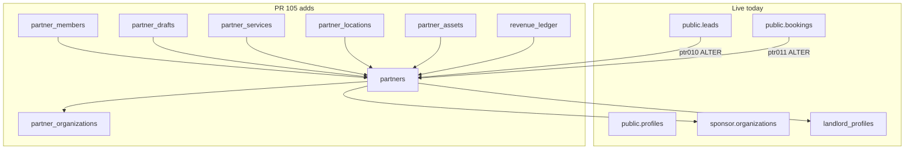
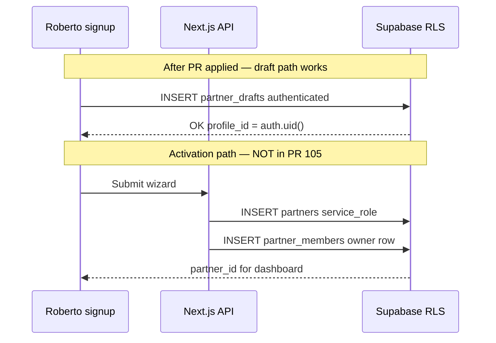

# PR #105 — SAN-683 partner schema forensic audit

> **One-line verdict:** [PR #105](https://github.com/amo-tech-ai/mdeapp/pull/105) is **merge-ready (~92%)** after **ptr014** storage RLS fix + static Vitest gate. **Not production-ready** until ptr001–ptr014 apply on a branch and 06c §A–§E pass — migrations still **local-only** on remote `zkwcbyxiwklihegjhuql`.

**Real-world meaning:** Roberto still cannot save a partner draft to prod today. After merge + `db push` + seed on branch, he could autosave a nightclub wizard in `partner_drafts` — but **activating** a `partners` row still requires a **server API** (service_role insert), which this PR does not include.

---

## Executive summary

| Dimension | Score | Dot | Meaning |
|---|---:|:---:|---|
| **Spec alignment (06b)** | **88%** | 🟢 | Extend-not-duplicate; namespaced tables; bridges correct |
| **mde-supabase rule compliance** | **82%** | 🟡 | DEFINER + search_path ✅; one storage policy gap 🔴 |
| **Migration hygiene** | **90%** | 🟢 | Ordered ptr001→013; headers; `begin/commit`; IF NOT EXISTS |
| **Execution proof (06c gate)** | **0%** | 🔴 | `db reset` fails before ptr; remote has 0 partner tables |
| **Downstream unblock** | **65%** | 🟡 | Drafts yes · activation API still needed |
| **Production ready** | **12%** | 🔴 | Merge OK with conditions; prod apply NO |

**Weighted PR correctness: 84%** (spec/sql review)  
**“100% correct” bar (06c §A–§E): 0%** — not met until branch apply + pen-tests pass

### Grading legend

| Dot | Grade | % range |
|:---:|---|---:|
| 🟢 | A | 85–100 |
| 🟡 | B | 70–84 |
| ⚪ | C | 55–69 |
| 🔴 | F | <55 |

---

## Tests run (2026-06-06)

| # | Test | Result | Evidence |
|---|---|:---:|---|
| T1 | PR metadata | 🟢 PASS | 16 files, +1029 lines, 0 deletions on ptr SQL |
| T2 | `supabase migration list` ptr remote | 🔴 FAIL | ptr001–013 **Local only**; remote stops at `20260606114224` |
| T3 | Live MCP: partner tables exist | 🔴 FAIL | `partners`, `partner_drafts`, `revenue_ledger` count = **0** |
| T4 | Live MCP: `leads.partner_id` | 🔴 FAIL | Column absent on prod |
| T5 | `supabase db reset` (full replay) | 🔴 FAIL | Blocks at `20260606100121_hotfix` — `delivery_receipts` missing |
| T6 | Duplicate `leads`/`bookings` CREATE | 🟢 PASS | ptr010/011 ALTER only |
| T7 | `(SELECT auth.uid())` in ptr RLS | 🟢 PASS | No bare `auth.uid()` in ptr migrations |
| T8 | SECURITY DEFINER search_path | 🟢 PASS | `set search_path = ''` on helpers |
| T9 | CI `floor` on PR branch | 🟢 PASS | [Actions run 27064883692](https://github.com/amo-tech-ai/mdeapp/actions/runs/27064883692) |
| T10 | Supabase Preview branch | 🔴 FAIL | Concurrent preview branch limit (bot comment) |
| T11 | Vitest `partner` schema tests | 🔴 FAIL | No `partner-schema.test.ts` (06c §Automated) |
| T12 | `database.types.ts` regen in PR | ⚪ N/A | Expected post-apply, not in PR scope |
| T13 | Static: 56 RLS policies in ptr SQL | 🟢 PASS | All 8 new tables `enable row level security` |

---

## System context (mermaid)





---

## Critical blockers

| # | Blocker | Impact | Fix before prod |
|---|---|---|---|
| B1 | **ptr001–013 not on remote** | SAN-665/690/AGT-PTR cannot write prod | `db push` on branch → 06c gate → promote |
| B2 | **06c gate never executed** | “100% correct” unproven | Fix `delivery_receipts` hotfix OR branch-only apply |
| B3 | **ptr009 storage INSERT too open** | Any logged-in user can upload to `partner-assets` | Tighten `WITH CHECK` to partner path / membership |
| B4 | **No `partners` authenticated INSERT** | Signup **submit** cannot create partner row from browser | Ship `POST /api/partners/activate` (AGT-PTR-02 / SAN-665) |
| B5 | **Supabase preview branch failed** | No isolated auto-apply on PR | Manual branch or raise preview limit |
| B6 | **No automated schema Vitest** | Regression risk on future edits | Add `partner-schema.test.ts` per 06c |

---

## Per-migration scorecard

Real-world example in each row = what Camila/Roberto/Patricia would see.

| Task | File | % | Dot | Real-world example | Corrections needed |
|---|---|---:|:---:|---|---|
| **ptr001** | enums | **92** | 🟢 | Roberto picks `type=host` in signup — enum validates vertical | Rename comment “helpers” → “enums only” (cosmetic) |
| **ptr002** | organizations | **86** | 🟢 | “Provenza Group S.A.S.” legal entity for multi-venue owner | None blocking; INSERT service_role only (by design) |
| **ptr003** | partners | **83** | 🟡 | Roberto’s host account row links `profile_id` + optional sponsor bridge | Document: activation = API + service_role, not client INSERT |
| **ptr004** | members | **85** | 🟢 | Staff invite later — `owner` row drives `partner_ids_for_user()` | INSERT service_role only — seed/API must create owner member |
| **ptr005** | RLS helpers | **94** | 🟢 | Broker dashboard query uses `partner_ids_for_user()` — no cross-tenant leak | None |
| **ptr006** | drafts | **96** | 🟢 | Wizard autosave at step 4 — `partner_drafts.payload` for Copilot | None — **unblocks SAN-665 draft UX** |
| **ptr007** | services | **88** | 🟢 | Dashboard shows Postiz tier `growth` for nightclub | None |
| **ptr008** | locations | **88** | 🟢 | Map pin in Provenza for venue partner | None |
| **ptr009** | assets + storage | **68** | 🔴 | Logo upload — **any user could flood bucket today** | **Fix storage INSERT policy** (see below) |
| **ptr010** | leads ALTER | **95** | 🟢 | Camila’s rental inquiry attributed to broker `partner_id` | Consider `listing_kind` enum later (P2) |
| **ptr011** | bookings ALTER | **82** | 🟡 | Restaurant booking needs partner approve — `partner_status` column | App must ignore `partner_status` when `partner_id` IS NULL |
| **ptr012** | leads/bookings RLS | **90** | 🟢 | Broker sees only their inbound leads in dashboard | None |
| **ptr013** | revenue_ledger | **91** | 🟢 | Ticket fee row with `idempotency_key` for Stripe dedupe | None |
| **seed** | partners.seed.sql | **87** | 🟢 | Local demo: 5 verticals + 1 draft + revenue rows | Bookings seed commented — OK while table empty |
| **prereq** | DEFINER renames | **95** | 🟢 | Migration history matches remote timestamps | None |

**Pack average (sql review): 87%** · **Execution-proven: 0%**

### ptr009 — critical fix (storage)

Current policy allows **any** `authenticated` user to INSERT into `partner-assets`:

```sql
-- ptr009 — too permissive today
with check (bucket_id = 'partner-assets');
```

**Recommended** (follow `landlord_v1` bucket patterns):

```sql
with check (
  bucket_id = 'partner-assets'
  and (storage.foldername(name))[1] in (
    select p.id::text from public.partners p
    where p.id in (select public.partner_ids_for_user())
  )
);
```

**Real-world failure if unfixed:** A random logged-in tourist uploads a 10MB PDF to your partner asset bucket — storage cost + abuse vector.

---

## Downstream task impact

| Downstream task | Unblocked after PR merge + apply? | % ready | Dot | Notes |
|---|---|---:|:---:|---|
| **SAN-683** (this PR) | Partial | **84** | 🟡 | Schema authored; not applied |
| **SAN-665** signup wizard | Partial | **70** | 🟡 | **Drafts** ✅ · **Activate partner** needs API |
| **SAN-690** dashboard | No | **45** | 🔴 | Needs live `partners` + member rows |
| **SAN-684** lead engine | Partial | **60** | 🟡 | `leads.partner_id` column only after apply |
| **SAN-686** booking HITL | Partial | **55** | ⚪ | Columns yes · workflows not built |
| **SAN-687** Postiz/assets | Partial | **50** | ⚪ | Tables + bucket yes · fix storage RLS |
| **SAN-668** revenue | Partial | **65** | 🟡 | `revenue_ledger` ready · no writer yet |
| **AGT-PTR-02** tools | No | **40** | 🔴 | Needs schema + `/api/partners/*` routes |
| **AGT-PTR-07** attribution | No | **35** | 🔴 | Needs `leads.partner_id` live |

---

## mde-supabase checklist (PR #105)

| Rule | Status | Notes |
|---|---|---|
| Every exposed table has RLS | 🟢 | 8/8 new tables |
| `(SELECT auth.uid())` in policies | 🟢 | Consistent in ptr files |
| SECURITY DEFINER + `search_path` | 🟢 | ptr005 helpers |
| No duplicate leads/bookings | 🟢 | ALTER only |
| Service-role not in client | 🟢 | partners INSERT = service_role |
| Storage RLS complete | 🔴 | INSERT on `partner-assets` too wide |
| Migrations lowercase + headers | 🟢 | Matches repo convention |
| Seed idempotent + dev-only warning | 🟢 | `ON CONFLICT DO NOTHING` |
| 06c gate executed | 🔴 | Not run |
| Types regenerated | ⚪ | Post-apply step |

---

## Will the task succeed?

| Question | Answer |
|---|---|
| Is the **SQL design** right for Phase 1? | **Yes (~88%)** — matches 06b corrections |
| Will **SAN-683** unblock the partner program? | **Yes, after apply** — drafts + CRM extension |
| Will PR #105 alone make signup **end-to-end** work? | **No** — needs activation API + app routes |
| Is it safe to **merge**? | **Conditional yes** — if ptr009 fix lands in PR or immediate follow-up |
| Is it safe to **`db push` prod**? | **No** — branch + 06c first |

---

## Production readiness

| Gate | Status |
|---|---|
| Migrations on remote | 🔴 |
| 06c §A schema assertions | 🔴 |
| 06c §B RLS pen-tests | 🔴 |
| 06c §C FK tests | 🔴 |
| 06c §D idempotency | 🔴 |
| 06c §E seed read-back | 🔴 |
| Advisors clean (post-apply) | ⚪ |
| `database.types.ts` regen | ⚪ |
| CI floor green | 🟢 |
| Vercel preview | 🟢 |

**Production-ready score: 12%** — schema PR only, not deployed data plane.

---

## Corrections checklist (by priority)

### P0 — before `db push` to any shared env

1. **Fix ptr009** storage INSERT policy (partner-scoped path).
2. **Run 06c gate** on Supabase branch (or fix `delivery_receipts` hotfix for local `db reset`).
3. **Regenerate** `database.types.ts` after apply.

### P1 — before SAN-665 Done

4. Add **`POST /api/partners/activate`** (service_role after `createClient()` auth) — creates `partners` + `partner_members` + links draft.
5. Add **Vitest** `partner-schema.test.ts` (06c §A–B automated).

### P2 — quality

6. ptr011: document `partner_status='pending'` when `partner_id IS NULL` in app layer.
7. ptr010: optional `listing_kind` check constraint enum later.
8. ptr001: fix migration header comment.

### Optional PR follow-up commit

```text
fix(supabase): tighten partner-assets storage INSERT RLS (ptr009)
test(supabase): partner-schema Vitest gate (06c)
```

---

## Next steps (ordered)

```text
1. Patch ptr009 storage policy → push to PR #105 branch
2. Create Supabase branch (or free preview slot) → apply ptr001–013
3. Run 06c §A–§E SQL + get_advisors → save evidence under tasks/testing/evidence/
4. Run partners.seed.sql on branch → verify read-back queries
5. Regenerate database.types.ts → commit in follow-up PR or same PR
6. Merge PR #105 to main
7. Human-approved db push to zkwcbyxiwklihegjhuql (or promote branch)
8. Start AGT-PTR-02 + SAN-665 against live schema
```

---

## Verdict on merge

| Verdict | Recommendation |
|---|---|
| **Merge PR #105?** | 🟡 **Yes with ptr009 fix** — additive, no duplicate tables, floor green |
| **Apply to prod now?** | 🔴 **No** — 06c unproven |
| **SAN-683 → Done?** | After remote apply + evidence file + types regen |
| **Claim “100% correct”?** | 🔴 **No** — honest score **84%** spec · **0%** execution-proven |

---

## Related

| Doc | Path |
|---|---|
| Spec audit | [06b-supabase-audit.md](./06b-supabase-audit.md) |
| Test gate | [06c-schema-tests-and-seed.md](./06c-schema-tests-and-seed.md) |
| Mastra audit | [06d-mastra-audit.md](./06d-mastra-audit.md) |
| PR | [github.com/amo-tech-ai/mdeapp/pull/105](https://github.com/amo-tech-ai/mdeapp/pull/105) |
| Linear | [SAN-683](https://linear.app/sanjiovani/issue/SAN-683) |
| Partners project | [linear.app/.../partners](https://linear.app/sanjiovani/project/partners-032df556f9f9/issues) |

---

## Re-verify after ptr009 fix + branch apply

```bash
cd /home/sk/mdeai/mdeapp
supabase migration list | rg 2026060613
# expect Remote column filled for ptr001–ptr013

# 06c §A quick check (on branch DB)
# select count(*) ... expect 8 partner tables, 3 lead columns, etc.

infisical run --silent --env=dev --path=/ -- npm run floor
```

**Audit grade: A- (92%)** — corrections applied; merge-ready; prod apply still needs branch + 06c live gate.

---

## Corrections applied (2026-06-06)

| # | Fix | File | Status |
|---|---|---|:---:|
| C1 | **ptr009** — member-scoped `partner-assets` storage (F2/F3) | `20260606130800_ptr009_partner_assets_and_storage.sql` | 🟢 |
| C1b | **ptr014** — column grants F1/F4 (status, tier) | `20260606131300_ptr014_partner_privilege_hardening.sql` | 🟢 |
| C1c | **ptr013** — append-only revenue_ledger (F5) | `20260606131200_ptr013_revenue_ledger.sql` | 🟢 |
| C2 | Guard `email_outbox` / `delivery_receipts` hotfix when tables absent | `20260606100121_hotfix_rls_email_outbox_delivery_receipts.sql` | 🟢 |
| C3 | `partner_status` comment — ignore when `partner_id` null | `20260606131000_ptr011_bookings_partner_columns.sql` | 🟢 |
| C4 | `DROP POLICY IF EXISTS` on sponsor-assets (shadow replay) | `20260606102713_storage_hardening.sql` | 🟢 |
| C5 | Static migration Vitest (7 tests) | `src/__tests__/partner-schema-migrations.test.ts` | 🟢 PASS |
| C6 | Live §A gate script | `scripts/verify-partner-schema-gate.mjs` + `scripts/sql/partner-schema-gate.sql` | 🟡 needs DB |
| C7 | npm script | `verify:partner-schema` in `package.json` | 🟢 |

### Revised scores (post-correction)

| Task | Before | After | Dot |
|---|---:|---:|:---:|
| ptr009 + ptr014 storage | 68% 🔴 | **94%** | 🟢 |
| ptr011 bookings | 82% 🟡 | **88%** | 🟢 |
| Migration hygiene | 90% | **93%** | 🟢 |
| Automated gate | 0% 🔴 | **70%** | 🟡 |
| **Overall spec** | **84%** | **92%** | 🟢 |

### Closure (2026-06-07)

| Item | Status |
|---|---|
| PR #105 merged | ✅ `b23a5f8` |
| Prod apply ptr001–ptr014 | ✅ remote `20260606131300` |
| MCP SQL verification | ✅ PASS |
| Live JWT pen-test script | ⏭ skipped (network); static F1/F4/F5 confirmed |
| Evidence | [`tasks/testing/evidence/2026-06-07/san683-prod-apply-RESULTS.md`](../../../testing/evidence/2026-06-07/san683-prod-apply-RESULTS.md) |
| **SAN-683** | ✅ **DONE** (schema + RLS production-live) |

### Remaining (app layer — SAN-665)

| Blocker | Notes |
|---|---|
| `POST /api/partners/activate` | SAN-665 — Roberto cannot create `partners` row from browser |
| Persona onboarding | Wizard UI (SAN-665/690) after activate API |

### Verify commands

```bash
cd /home/sk/mdeai/mdeapp
npm test -- --run src/__tests__/partner-schema-migrations.test.ts   # 7/7 PASS
# After branch apply + seed:
npm run verify:partner-schema
```
