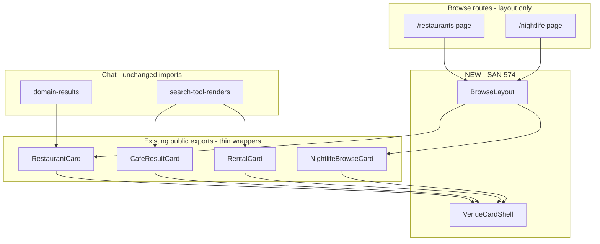

**SAN-574 plan ready for review — no code written.**

Below is the forensic audit and implementation plan. One scope tension up front: D-08 mentions `MapColumn`, but current browse pages have **no map**, and you + Linear both forbid map changes. The plan treats map as an **optional slot, unwired in this task** (deferred to SAN-577 / D-11).

---

## 1. Card audit — similarities & differences

### Shared shell (Restaurant ≈ Café)

Both use the same horizontal card pattern:

| Layer | Pattern |
|-------|---------|
| Root | `<article>` · `rounded-lg border bg-card shadow-sm` · selected ring |
| Data attrs | `data-testid`, `data-result-kind`, `data-pin-id`, `data-selected` |
| Body | `flex gap-3 p-3` · **left** 96×96 image · right content |
| Header row | eyebrow · `h3` title · ★ rating (right) |
| Meta | `Badge` chips (type, price, hours) |
| Blurb | `line-clamp-2 text-xs text-muted-foreground` |
| Footer | `border-t px-3 py-2` · map links left · CTAs right |
| Interaction | `onSelect` on hover/focus · `onOpenDetails` on body click · `CardInteractionProps` |

### Café-only extras

- `rank` ("Match #N"), `openNow`, Places photo proxy + attribution
- Google-verified / Place ID / field-mask chips
- **Reviews** link + **Request** booking CTA
- Photo testids: `grounded-card-photo*` (not `restaurant-card-photo*`)

### Restaurant-only

- `cuisineLabel()` helper · `avgPricePerPerson` / `priceTier`
- `aiSummary` blurb · simpler map links (no reviews)
- Optional `onOpenDetails` (browse page **does not pass it today** → no Details button on `/restaurants`)

### Rental — structural outlier

| Dimension | Rental vs venue pattern |
|-----------|-------------------------|
| Image | **Right** side, 200×120, `hidden sm:block` |
| CTAs | **Inline in body** (Details · Schedule · Save) — no footer row |
| Maps | None |
| `onSelect` | `(id: string) => void` — not `CardInteractionProps.onSelect` |
| Hover sync | No `onMouseEnter`/`onFocus` preview |
| Unique UI | Featured badge, price pills, benefits, `matchReason` |
| Photo placeholder | No dedicated testid (plain "Photo" div) |

### Nightlife browse — 4th card (not in your read list, in scope)

`nightlife-browse-card.tsx` is a **stripped-down** restaurant shell:

- Placeholder only (no image URL path)
- No rating, no map-sync props, no Details
- Directions-only footer · no `selected` / pin sync
- Used only on `/nightlife` browse (not chat)

### Consumption map

| Component | Browse | Chat |
|-----------|--------|------|
| `RestaurantCard` | `/restaurants` | `domain-results.tsx` |
| `CafeResultCard` | — | `search-tool-renders.tsx` (café + nightlife chat) |
| `RentalCard` | — | `search-tool-renders.tsx` |
| `NightlifeBrowseCard` | `/nightlife` | — |

**EventCard** is separate — **out of scope** for SAN-574.

---

## 2. Implementation plan

### Phase 0 — Branch & guardrails (no behavior change)

```bash
git checkout main && git pull
git checkout -b ai/san-574-d-08-shared-browse-system
```

Pre-flight grep gate — fail PR if any of these change:

```bash
rg -l 'chat-nav-rail|EXPLORE_ITEMS' mdeapp/src/components/chat/
rg 'href: null' mdeapp/src/components/chat/chat-nav-rail.tsx  # must still have events/cafes/rentals null
git diff --name-only | rg 'src/mastra/|api/copilotkit|api/.+/search|chat-nav-rail|app/.+/page\.tsx'
```

---

### VenueCard API (proposed)

**Design:** Extract a **shell + slots** model. Keep domain wrappers as thin adapters (preserves imports + testids).

```typescript
// mdeapp/src/components/browse/venue-card-types.ts

export type VenueCardVertical =
  | "restaurant"
  | "cafe"
  | "nightlife"
  | "rental";

export type VenueCardMediaProps = {
  src?: string | null;
  alt?: string;
  placeholderLabel: string;
  /** Preserve legacy testids per vertical — do NOT unify in SAN-574 */
  photoTestId: string;
  placeholderTestId: string;
  attribution?: React.ReactNode;
  /** SAN-574: keep 96×96 square to match today; 16:10 is D-09 follow-up */
  aspect?: "square" | "wide";
  position?: "left" | "right";
};

export type VenueCardShellProps = {
  vertical: VenueCardVertical;
  testId: string;
  resultKind: ResultKind;
  pinId?: string;
  selected?: boolean;
  ariaLabel: string;
  className?: string;
  /** Map-sync preview — rental may omit */
  onPreview?: () => void;
  onOpenDetails?: () => void;
  media: VenueCardMediaProps;
  eyebrow?: React.ReactNode;
  title: string;
  rating?: React.ReactNode;
  badges?: React.ReactNode;
  blurb?: React.ReactNode;
  metaRow?: React.ReactNode;        // café verified chips, rental price row
  footerLeft?: React.ReactNode;     // map links
  footerRight?: React.ReactNode;    // CTAs
  /** Rental: CTAs live in body — slot instead of footer */
  bodyActions?: React.ReactNode;
  layout?: "standard" | "rental";
};
```

**Exported surface:**

```typescript
// VenueCard.tsx — low-level shell (internal + tests)
export function VenueCardShell(props: VenueCardShellProps): JSX.Element;

// Optional convenience — NOT required for rental/café wrappers initially
export function VenueCard(props: VenueCardProps): JSX.Element;
```

**Principle:** `RestaurantCard`, `CafeResultCard`, `RentalCard` **remain the public exports**; they compose `VenueCardShell` internally. Call sites unchanged.

---

### BrowseLayout API (proposed)

Extract duplicated structure from `restaurant-browse-view.tsx` / `nightlife-browse-view.tsx`:

```typescript
export type BrowseLayoutProps = {
  testId: string;                    // e.g. "restaurants-browse"
  title: string;
  subtitle: string;
  backHref?: string;                 // default "/"
  conciergeHref?: string;            // default "/"
  filterBar: React.ReactNode;
  notice?: React.ReactNode;          // nightlife safety banner
  error?: { message: string; retryHref: string } | null;
  empty?: { testId: string; title: string; description: string; icon: React.ReactNode } | null;
  children: React.ReactNode;         // results grid
  /** Optional — NOT wired in SAN-574 (no map changes) */
  mapSlot?: React.ReactNode;
  mapMode?: "hidden" | "stacked" | "split";
};
```

**SAN-574 default:** `mapMode="hidden"` everywhere. Slot exists for D-11; no `<Map>`, no pin wiring, no `mapId` changes.

**FilterBar:** stay as **route-specific** child nodes (neighborhood/cuisine/vibe chips). Do not centralize filter enums in BrowseLayout — avoids touching URL/filter logic.

---

### Migration strategy (incremental, one card at a time)

| Step | Work | Verify after each step |
|------|------|------------------------|
| **1** | Add `components/browse/venue-card-shell.tsx` + Vitest (shell only, no consumers) | `npm test -- venue-card --run` |
| **2** | Refactor `RestaurantCard` → compose shell; **zero prop/API change** | `npm test -- restaurant-card --run` · `SCREEN-023` e2e subset |
| **3** | Refactor `CafeResultCard` → compose shell; preserve all café testids | `npm test -- cafe-result-card --run` · chat card e2e |
| **4** | Refactor `RentalCard` → shell with `layout="rental"`; preserve `(id) => void` onSelect | `npm test -- rental-card --run` |
| **5** | Replace `NightlifeBrowseCard` body with shell OR make it thin wrapper over shared media/body/footer | `SCREEN-022` e2e |
| **6** | Add `BrowseLayout`; migrate `RestaurantBrowseView` + `NightlifeBrowseView` | e2e browse specs · visual diff |
| **7** | Before/after screenshots (375 / 768 / ≥1280) | evidence doc |

**Explicit non-goals in migration:**

- Do not change `search-tool-renders.tsx` / `domain-results.tsx` imports (they keep importing copilot cards).
- Do not add `onOpenDetails` to browse restaurant cards (would change CTA visibility).
- Do not unify photo testids (`restaurant-card-photo` vs `grounded-card-photo` stays).
- Do not adopt 16:10 / blur-up in same PR unless screenshot gate passes — D-03 target can land in SAN-575 (D-09 re-skin).

---

### Risk assessment

| Risk | Severity | Mitigation |
|------|----------|------------|
| E2E testid break (`restaurant-card-*`, `grounded-card`, `rental-schedule-cta`) | **P0** | Wrapper preserves testids; run full card e2e suite before merge |
| Rental layout regression (right image, mobile hide) | **P0** | `layout="rental"` branch + dedicated Vitest snapshots |
| Chat map pin sync (`onSelect` / hover) | **P0** | Keep preview handlers on restaurant/café; don't "fix" rental hover in this PR |
| Visual drift from D-03 16:10 target | **P1** | Defer aspect ratio; document as D-09 follow-up |
| BrowseLayout refactor breaks filter URLs | **P1** | Copy-paste structure only; no logic move into layout |
| Accidental map column / pin changes | **P0** | `mapSlot` unused; grep gate on `MapPanel`, `AdvancedMarker`, `tool-pins-sync` |
| Scope creep into EventCard / PlaceResultCard | **P1** | Out of scope list in PR description |
| `npm run floor` red (unrelated ESLint) | **P2** | Primary gate: `typecheck` + `build` + targeted Vitest + browse e2e |

---

### Test plan

**Unit (Vitest):**

| File | Cases |
|------|-------|
| `browse/__tests__/venue-card-shell.test.tsx` | selected ring, placeholder vs image, footer slots, keyboard a11y |
| Existing `restaurant-card.test.tsx` | must pass unchanged |
| Existing `cafe-result-card.test.tsx` | must pass unchanged |
| Existing `rental-card-copy.test.tsx` | must pass unchanged |
| New `browse/__tests__/browse-layout.test.tsx` | error/empty/grid regions, sticky header testid |

**E2E (must stay green):**

- `e2e/screens/SCREEN-023-restaurant-listings.spec.ts`
- `e2e/screens/SCREEN-022-nightlife-browse.spec.ts`
- `e2e/card-unification.spec.ts`
- `e2e/restaurant-card-fast-path.spec.ts`
- `e2e/prod-synthetic-smoke.spec.ts` (restaurant card selectors)

**Browser evidence (SAN-574 AC):**

- `/restaurants`, `/nightlife`, `/` chat (rental + café prompts)
- Viewports: 375 · 768 · ≥1280
- Save under `tasks/testing/evidence/YYYY-MM-DD/san-574/`

---

### Rollback plan

1. **Branch rollback:** revert PR / `git revert` merge commit — cards are self-contained under `components/copilot/` + new `components/browse/`.
2. **Partial rollback:** if one card regresses, revert only that wrapper commit; shell can stay.
3. **Runtime rollback:** no feature flags needed — no API, route, or nav changes.
4. **Prod risk:** low — UI refactor only on existing LIVE routes; sidebar still greyed for cafés/rentals/events.

---

## 3. Constraint verification (pre-code)

| Constraint | Status | Evidence |
|------------|--------|----------|
| No map changes | ✅ Plan | `mapSlot` unwired; no edits to `map-panel`, `tool-pins-sync`, `AdvancedMarker` |
| No route changes | ✅ Plan | No `app/**/page.tsx` edits |
| No sidebar/nav changes | ✅ Plan | `chat-nav-rail.tsx` untouched; `events/cafes/rentals href: null` preserved |
| No CopilotKit changes | ✅ Plan | No `useCoAgent`, `useCopilotAction`, `/api/copilotkit` |
| No Mastra changes | ✅ Plan | No `src/mastra/**` |
| No API changes | ✅ Plan | No `src/app/api/**` |

---

## 4. Architecture review



**Layering rule:** `browse/` owns **presentation shell** only. Domain formatting stays in existing libs (`places-display`, `rental-display`, `nightlife-browse`). Cards stay in `copilot/` for import stability.

---

## 5. File tree (expected diff)

```
mdeapp/src/components/browse/
├── BrowseLayout.tsx              NEW
├── VenueCardShell.tsx            NEW
├── venue-card-types.ts           NEW
└── __tests__/
    ├── browse-layout.test.tsx    NEW
    └── venue-card-shell.test.tsx NEW

mdeapp/src/components/copilot/
├── restaurant-card.tsx           MODIFY (thin wrapper)
├── cafe-result-card.tsx          MODIFY (thin wrapper)
├── rental-card.tsx               MODIFY (thin wrapper)
└── __tests__/*                   UNCHANGED assertions

mdeapp/src/components/nightlife/
├── nightlife-browse-card.tsx     MODIFY or DELETE→wrapper
└── nightlife-browse-view.tsx     MODIFY (use BrowseLayout)

mdeapp/src/components/restaurants/
└── restaurant-browse-view.tsx    MODIFY (use BrowseLayout)

NOT TOUCHED:
├── app/**/page.tsx
├── components/chat/chat-nav-rail.tsx
├── platform/maps/**
├── mastra/**
└── app/api/**
```

**Estimated blast radius:** ~8–12 files · ~400–600 LOC net (mostly moves, not new features).

---

## 6. D-08 acceptance criteria validation

| AC | Plan coverage | Notes |
|----|---------------|-------|
| VenueCard consolidates 3 patterns | ✅ | Shell + wrappers; nightlife is 4th |
| BrowseLayout: FilterBar · Results · MapColumn | ⚠️ Partial | FilterBar + Results yes; **MapColumn slot only, unwired** |
| Image slot per D-03 | ⚠️ Deferred | Keep 96×96 for parity; 16:10 in D-09 |
| Card click → detail sheet | ⏭️ Out | Browse doesn't have it today; don't add |
| CTAs preserved | ✅ | Explicit per-wrapper mapping |
| testids preserved | ✅ | Legacy ids per vertical |
| Empty image state | ✅ | Shell placeholder slot |
| No route/sidebar activation | ✅ | Grep gate |
| No new API calls | ✅ | |
| No mastra/copilotkit | ✅ | |
| mapId where map exists | N/A | No map work |
| Vitest + screenshots | ✅ | Test plan above |

---

## 7. Recommended review decisions (need your OK before coding)

1. **Map column:** Confirm **slot-only, unwired** for SAN-574 (map work stays SAN-577).
2. **Image aspect:** Confirm **keep 96×96** for this PR; D-03 16:10 moves to SAN-575.
3. **NightlifeBrowseCard:** Migrate to shared shell in same PR (recommended — avoids two browse card patterns).
4. **Detail sheet AC:** Treat as **out of scope** — preserve today's Directions-only browse behavior.

---

**Next blocker after plan approval:** implementation on branch `ai/san-574-d-08-shared-browse-system`.

Reply with approve / adjust on the four decisions above and I'll start Step 1 (shell only, no consumer migration yet).