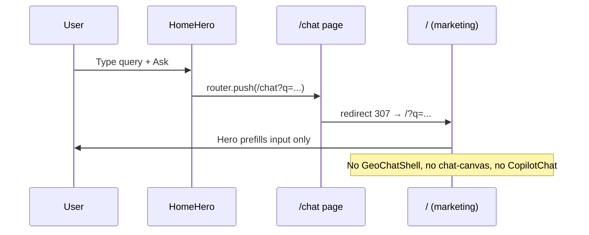
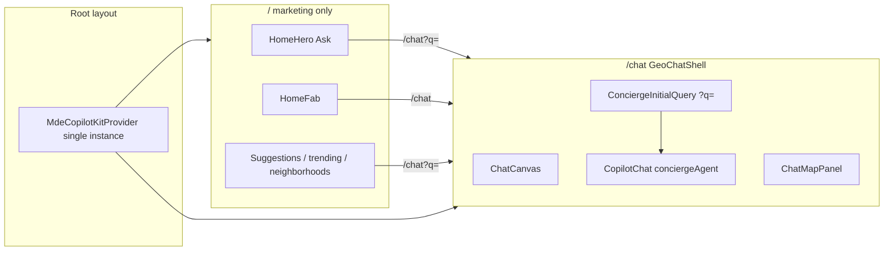

# Executive verdict

**Root cause:** D-13 (SAN-579) moved the marketing home to `/` and left `/chat` as a **redirect stub** to `/` (or `/?q=`). The full concierge stack (`GeoChatShell` → `ChatCanvas` → `CopilotChat`) was **never remounted** on any route.

**Good news:** Smoke test **2026-06-08** confirms the **original `GeoChatShell` still works** when mounted on `/chat` — rentals, cards, map pins, nav rail, all verticals intact. No rewrite needed.

**Remaining work:** `?q=` auto-send from home, e2e helper rename, docs, prod deploy.

**URL note:** `/chats` does **not exist** (404). Canonical concierge route = **`/chat`**.

---

# 0. GeoChatShell smoke test (verified 2026-06-08)

Mount tested locally by replacing `src/app/chat/page.tsx` redirect with pre-D13 pattern (`410ddc8`):

```tsx
<MapContextProvider>
  <GeoChatShell />
</MapContextProvider>
```

## Results

| Check | Result | Evidence |
|---|---|:---:|
| `GET /chat` → 200 (no redirect) | 🟢 PASS | curl; URL stays `/chat` |
| `data-testid="chat-canvas"` in DOM | 🟢 PASS | curl HTML |
| `aria-label="Concierge chat"` | 🟢 PASS | Chrome MCP snapshot |
| Nav rail: Rentals, Events, Cafés, Restaurants, Nightlife | 🟢 PASS | Browser snapshot |
| CopilotChat input (`.copilotKitInput`) | 🟢 PASS | "Type a message…" textbox |
| Map panel loads | 🟢 PASS | "Map is ready" region |
| Rental query end-to-end | 🟢 PASS | `"1BR in Laureles under $80/night"` → **8 rental cards** + **8 map pins** |
| Home "Start exploring" → `/chat` | 🟢 PASS | SPA nav; shell loads |
| Home FAB "Ask the concierge" | 🟢 PASS | `href="/chat"` (same destination) |
| Playwright `gotoHome` on `/` | 🔴 FAIL | Expected — still targets `/` not `/chat` |
| `?q=` auto-send from home Ask | 🔴 NOT YET | Lands on `/chat` but query not auto-sent (Step 2) |

**Conclusion:** Original concierge is **healthy**. D-13 only broke **routing**, not the component.

---

# 0b. Implementation plan (ordered steps)

| Step | Task | Status | Verify |
|:---:|---|:---:|---|
| **1** | Mount `GeoChatShell` on `/chat` (`MapContextProvider` wrapper) | ✅ **Done** (smoke test) | `GET /chat` 200 + `chat-canvas` visible |
| **2** | Add `ConciergeInitialQuery` — read `?q=`, auto-send once CK ready, strip param | ⬜ Todo | Home Ask → message sent without manual Enter |
| **3** | Redirect `/?q=foo` → `/chat?q=foo` on marketing home (back-compat) | ⬜ Todo | `curl -I '/?q=test'` → `location: /chat?q=test` |
| **4** | Update `e2e/helpers/maps-layout.ts`: `gotoConcierge()` → `/chat` | ⬜ Todo | `concierge-new-chat.spec.ts` passes |
| **5** | New e2e `home-concierge-launch.spec.ts` (hero → chat → cards) | ⬜ Todo | Playwright green |
| **6** | Update `sitemap.md` + DESIGN-INVENTORY (`/` marketing, `/chat` concierge) | ⬜ Todo | Docs match disk |
| **7** | Optional: `/chats` → redirect `/chat` | ⬜ Deferred | `GET /chats` 307 → `/chat` |
| **8** | Prod deploy + Tier 1–2 validation | ⬜ Todo | `www.mdeai.co/chat` 200, not 307 |

### Step 1 detail (complete)

File: `src/app/chat/page.tsx` — mirrors `410ddc8:src/app/page.tsx`:

- `"use client"` page
- `CopilotKitCSSProperties` primary color on `<main>`
- `MapContextProvider` → `GeoChatShell`
- **No** second `MdeCopilotKitProvider` (root layout already provides one)

### Step 2 detail (next)

File: `src/components/chat/concierge-initial-query.tsx` (new)

1. `useSearchParams().get("q")` on mount
2. Wait for `data-testid="copilot-chat-ready"` or `useCopilotChat` idle
3. Reuse fast-path order from `ConciergeChatInput.send()` (rental → event → grounded → restaurant → `onSend`)
4. `router.replace("/chat")` after send (prevent re-send on refresh)

Mount in `geo-chat-shell.tsx` inside `ConciergeSessionProvider`.

### Step 4 detail

```ts
// e2e/helpers/maps-layout.ts
export async function gotoConcierge(page: Page) {
  await page.goto("/chat", { waitUntil: "domcontentloaded" });
  await page.locator('[data-testid="chat-canvas"]').waitFor({ state: "visible" });
  ...
}
// Keep gotoHome as alias → gotoConcierge during migration, then remove
```

---

# 1. Root cause

## What broke (timeline)

| When | Commit | Change |
|---|---|---|
| Pre-D13 | `410ddc8` | `/` rendered `MapContextProvider` + `GeoChatShell` — full concierge |
| D-13 | `a77b926` | `/` → marketing bands (`HomeHero`, `HomeFab`, …); comment says “chat lives at `/chat`” |
| Same slice | `src/app/chat/page.tsx` | **Never got `GeoChatShell`** — only `redirect("/")` or `redirect("/?q=…")` |

## Broken request flow (today)



## Evidence

| Check | Local (`:3001`) | Prod (`www.mdeai.co`) |
|---|---|---|
| `GET /chat` | 307 → `/` | 307 → `/` |
| `GET /chat?q=rooftop` | 307 → `/?q=rooftop` | 307 → `/?q=rooftop` |
| `GET /chats` | **404** | **404** |
| `[data-testid="chat-canvas"]` on `/` or `/chat` | **absent** | **absent** |
| `[aria-label="Concierge chat"]` | **absent** | **absent** |
| `GeoChatShell` imported in `src/app/**` | **0 imports** | same |
| Chrome MCP: `/chat?q=rooftop bars` | lands `/?q=…`, hero prefilled, no chat | same |
| Playwright `concierge-new-chat.spec.ts` | **FAIL** — `gotoHome` timeout waiting `chat-canvas` on `/` | incompatible |

## Misleading docs

`sitemap.md` still claims:

- `/` = “hero + concierge entry” ✅ LIVE
- `/chat` = “Alias → / (canonical concierge is home)” ✅ LIVE

**Both are false on prod.** DESIGN-INVENTORY repeats the same contradiction (see `08-june-audit.md`).

---

# 2. Component to reuse (one concierge system)

Do **not** create a new chat UI or second `<CopilotKit>`.

## Global (already correct — single instance)

```
Root layout (src/app/layout.tsx)
  └── MdeCopilotKitProvider          ← one CopilotKit, agent "conciergeAgent"
        └── ThreadNavProvider
              └── children (all routes)
```

## Concierge surface (orphaned — mount this)

```
GeoChatShell                          src/components/chat/geo-chat-shell.tsx
  └── ChatCanvas                      data-testid="chat-canvas"
        ├── ChatNavRail / ChatNavDrawer
        ├── ChatCenterPanel           aria-label="Concierge chat"
        │     ├── ChatQueryBar
        │     └── CopilotChat
        │           ├── Input: ConciergeChatInput   (.copilotKitInput)
        │           └── Messages: ConciergeChatMessages
        └── ChatMapPanel
```

**Required wrapper** (pre-D13 pattern from `410ddc8`):

```tsx
<MapContextProvider>
  <GeoChatShell />
</MapContextProvider>
```

`MapContextProvider` lives at `src/platform/maps/map-context.tsx`.

## What is NOT the bridge today

| Artifact | Role | Why it doesn't fix home launch |
|---|---|---|
| `concierge-pending-store.ts` | Thinking indicator before `inProgress` | No URL `?q=` handling |
| `HomeHero.initialQuery` | Prefill marketing search input | Does not open or send in concierge |
| `/chat` redirect | Back-compat alias | Sends users **away** from concierge |

---

# 3. Homepage entry points (all already target `/chat`)

| Surface | File | Behavior today | After fix |
|---|---|---|---|
| Hero query + **Ask** | `home-hero.tsx` | `router.push('/chat?q=…')` → redirect → prefill | Lands on `/chat` with shell + auto-send |
| **Start exploring** CTA | `home-hero.tsx` | `href="/chat"` → redirect → marketing | Opens concierge shell |
| **Ask the concierge** FAB | `home-fab.tsx` | `href="/chat"` | Opens shell |
| Suggestion cards | `home-suggestions.tsx` | `/chat?q=…` | Shell + auto-send |
| Map teaser pins | `home-map-teaser.tsx` | `/chat?q=…` | Shell + auto-send |
| Trending carousel | `home-trending.tsx` | `/chat?q=…` | Shell + auto-send |
| Neighborhood cards | `home-neighborhoods.tsx` | `/chat?q=…` | Shell + auto-send |
| Discovery rows | `home-discovery-rows.tsx` | `/chat?q=…` | Shell + auto-send |
| How it works CTA | `home-how-it-works.tsx` | `href="/chat"` | Opens shell |

**No home link changes required** if `/chat` renders `GeoChatShell` — CTAs are already correct.

---

# 4. Recommended fix (smallest diff)

## Phase A — Restore concierge route (P0)

**Replace** `src/app/chat/page.tsx` redirect with a client page that mounts the existing shell:

```tsx
// Pattern from 410ddc8 — concierge route only
"use client";
import { CopilotKitCSSProperties } from "@copilotkit/react-ui";
import { GeoChatShell } from "@/components/chat/geo-chat-shell";
import { MapContextProvider } from "@/platform/maps/map-context";

export default function ChatPage() {
  return (
    <main id="main-content" className="min-h-screen bg-background text-foreground"
      style={{ "--copilot-kit-primary-color": "var(--primary)" } as CopilotKitCSSProperties}>
      <MapContextProvider>
        <GeoChatShell />
      </MapContextProvider>
    </main>
  );
}
```

Constraints:

- **One** `CopilotKit` (root layout only).
- **One** `CopilotChat` (inside `ChatCenterPanel` only).
- Do **not** mount `GeoChatShell` on `/` (avoids duplicate chat on marketing home).

## Phase B — `?q=` auto-send bootstrap (P0)

Home submits to `/chat?q=…` expecting the prompt to **run**, not just prefill.

Add a small client helper, e.g. `src/components/chat/concierge-initial-query.tsx`:

1. Read `useSearchParams().get("q")` once on mount.
2. Wait for CopilotKit ready (`data-testid="copilot-chat-ready"` or `useCopilotChat` not loading).
3. Reuse the same send path as `ConciergeChatInput.send()`:
   - Fast-path hooks: rental → event → grounded → restaurant
   - Else `appendMessage` / `onSend` via `useCopilotChat`
4. `router.replace("/chat", { scroll: false })` after send to strip `q` (no re-send on refresh).

Mount inside `GeoChatShell` or `ChatCenterPanel` (sibling to `CopilotChat`).

## Phase C — Back-compat redirects (P1)

| From | To | Why |
|---|---|---|
| `/?q=foo` | `/chat?q=foo` | Old bookmarks / shared links after D-13 |
| `/chats` | `/chat` (optional) | User-requested URL; route does not exist today |

Implement `/?q=` redirect in `src/app/page.tsx` **server-side** before rendering marketing home.

## Phase D — Docs truth (P1)

Update `sitemap.md`:

- `/` → marketing home (no concierge shell)
- `/chat` → concierge (`GeoChatShell`) ✅ LIVE
- `/chats` → optional alias or 404 until added

---

# 5. Files to change

| Priority | File | Change |
|---|---|---|
| **P0** | `src/app/chat/page.tsx` | Remove redirect; mount `MapContextProvider` + `GeoChatShell` |
| **P0** | `src/components/chat/concierge-initial-query.tsx` | **New** — consume `?q=`, auto-send once |
| **P0** | `src/components/chat/geo-chat-shell.tsx` OR `chat-center-panel.tsx` | Mount `ConciergeInitialQuery` |
| **P1** | `src/app/page.tsx` | Redirect `?q=` → `/chat?q=` (optional strip from marketing) |
| **P1** | `src/app/chats/page.tsx` | **Optional** — `redirect("/chat")` |
| **P1** | `sitemap.md` | Fix `/` and `/chat` status rows |
| **P1** | `docs/DESIGN-INVENTORY.md` (if applicable) | Align concierge rows with prod |
| **P1** | `e2e/helpers/maps-layout.ts` | `gotoHome` → `gotoConcierge` targeting `/chat` |
| **P2** | All e2e specs importing `gotoHome` | Point at `/chat` (20+ specs) |

**Do not change:**

- `src/components/copilot/copilot-kit-provider.tsx` (already global)
- `src/components/home/*` link targets (already `/chat`)
- Agent / Mastra / tool definitions

---

# 6. Tests to add / update

## E2E (Playwright)

| Spec | Purpose |
|---|---|
| **New:** `e2e/home-concierge-launch.spec.ts` | Hero Ask → `/chat` → `chat-canvas` visible → user message appears |
| **New:** `e2e/chat-initial-query.spec.ts` | Direct `GET /chat?q=1BR+in+Laureles` → auto-send → rental/event card or assistant reply |
| **Update:** `e2e/helpers/maps-layout.ts` | `gotoConcierge(page)` → `/chat` + wait `chat-canvas` |
| **Update:** existing concierge specs | Replace `gotoHome("/")` with `gotoConcierge("/chat")` |

## Unit (Vitest)

| Test | Purpose |
|---|---|
| `concierge-initial-query.test.tsx` | Parses `q`, sends once, strips URL |
| Optional: redirect test for `chat/page` | No longer exports redirect |

## Prod / smoke (manual + scripted)

```bash
# Tier 1 — quick
curl -sI https://www.mdeai.co/chat | grep -E 'HTTP|location'   # expect 200, not 307→/
curl -sI "https://www.mdeai.co/chat?q=test" | grep location      # expect stay on /chat

# Tier 2 — browser
# Navigate / → type prompt → Ask → assert [data-testid="chat-canvas"] on /chat

# Tier 3 — Playwright prod synthetic (after fix)
PROD_SMOKE_BASE_URL=https://www.mdeai.co npx playwright test e2e/prod-synthetic-smoke.spec.ts
```

---

# 7. Test results (investigation run — pre-fix)

| Test | Environment | Result | Notes |
|---|---|:---:|---|
| Chrome MCP navigate `/chat` | Local | 🔴 | Ends on `/` marketing |
| Chrome MCP `/chat?q=rooftop bars` | Prod | 🔴 | Ends `/?q=…`; hero prefilled only |
| `concierge-new-chat.spec.ts` | Local `:3001` | 🔴 | Timeout — no `chat-canvas` on `/` |
| `curl GET /chat` | Prod | 🔴 | 307 → `/` |
| `curl GET /chats` | Prod | 🔴 | 404 |
| `curl GET /` ×10 | Prod | 🟢 | 10/10 → 200 |
| Partner unit tests | Local | 🟢 | 66/66 (see `08-june-audit.md`) |
| `chat-smoke.mjs` empty CK POST | Prod | 🟡 | 401 — separate from shell bug |

---

# 8. Production validation (post-fix checklist)

Run before marking Done / flipping SAN-579 follow-up:

| # | Check | Pass criteria |
|---|---|---|
| 1 | `GET /chat` | 200, `chat-canvas` in DOM |
| 2 | Home hero Ask | Navigates to `/chat`, prompt sent, cards or reply |
| 3 | FAB “Ask the concierge” | `/chat` shell loads |
| 4 | `GET /chat?q=salsa+events` | Auto-send without manual Enter |
| 5 | Map panel | Pins appear after vertical query (not “No pins yet” stuck) |
| 6 | CK POST budget | &lt;8 POSTs per query (LESSONS.md storm guard) |
| 7 | Prod synthetic smoke | `prod-synthetic-smoke.spec.ts` green |
| 8 | `chat-smoke.mjs` | Rentals/events APIs OK (CK 401 tracked separately) |

Evidence path: `tasks/testing/evidence/YYYY-MM-DD/concierge-launch-RESULTS.md`

---

# 9. Architecture diagram (target state)



---

# 10. Out of scope (this slice)

- Mounting concierge on `/` (would duplicate marketing + chat or require query-gated hybrid — more complex)
- New chat component or second CopilotKit provider
- SAN-690 partner dashboard
- Fixing `chat-smoke` empty POST → 401 (auth middleware — separate ticket)
- Renaming `/chat` → `/chats` unless product explicitly wants the URL (alias is enough)

---

# 11. Implementation order (when approved)

1. `chat/page.tsx` — mount shell → verify `chat-canvas` on localhost `/chat`
2. `concierge-initial-query.tsx` — wire `?q=` auto-send
3. `/?q=` → `/chat?q=` redirect on marketing home
4. Update `maps-layout.ts` + one new e2e spec
5. Run floor + Playwright subset + prod Tier 1–2
6. Update `sitemap.md` + evidence doc

**Estimated diff:** ~4–6 files, &lt;200 lines (excluding e2e mass `gotoHome` rename).

---

# 12. Decision for user

| Question | Recommendation |
|---|---|
| `/chats` vs `/chat`? | Use **`/chat`** (exists, all links already point here). Optional `/chats` → `/chat` redirect. |
| Navigate after home Ask? | **Yes** — already `router.push('/chat?q=…')`; just make `/chat` real. |
| Second CopilotKit? | **No** — root provider is sufficient. |
| Block SAN-690? | **Yes** — concierge P0 first (per `08-june-audit.md`). |

*Plan only — no code changes in this document. Implementation awaits approval.*
