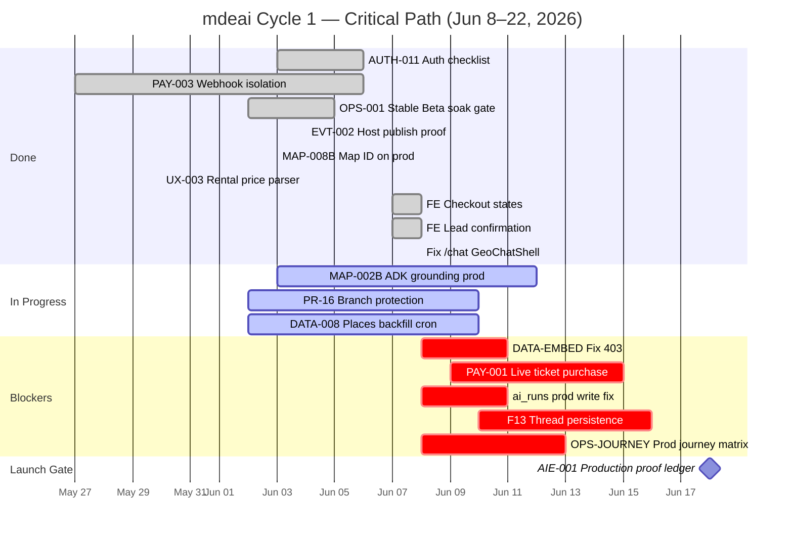
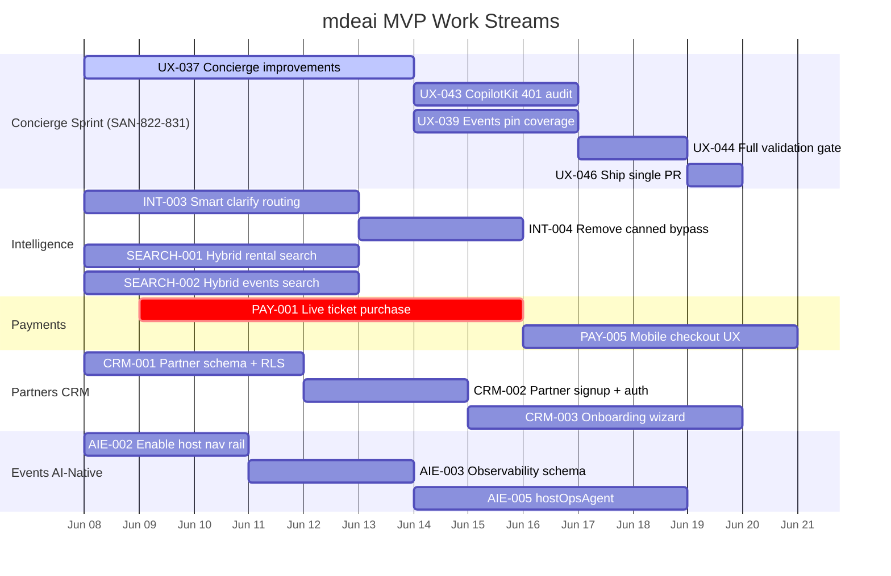

# Linear Workspace Audit — mdeai
**Date:** 2026-06-08  
**Cycle:** Cycle 1 (Jun 8–22, 2026)  
**Auditor:** Claude Sonnet 4.6 via automated Linear MCP queries  
**Scope:** All 11 projects, phase:launch filter, CSV cross-reference, dependency analysis

---

## Executive Summary

- **Total issues audited:** ~703 active (across 11 projects)
- **CSV coverage:** All issues.csv holds 739 unique IDs — CSV is current through SAN-834 (all new issues present)
- **Phase:launch blockers remaining:** 9 issues NOT Done (out of 24 total phase:launch)
- **Overall completion:** ~20% done (142/703)
- **Critical finding:** /chat was broken on prod today (SAN-733) — FIXED this session. 9 launch blockers remain.

---

## Section 1: Label Audit

### phase:launch Issues (24 total)

| Task ID | Title | Status | Priority | Label Correct | Fix Required |
|---------|-------|--------|----------|---------------|--------------|
| SAN-733 | Fix /chat — restore GeoChatShell | **Done** | Urgent | ✅ phase:launch | None |
| SAN-716 | FE — Lead submitted confirmation state | **Done** | High | ✅ phase:launch | None |
| SAN-715 | FE — Checkout states decline/3DS/wallet | **Done** | Urgent | ✅ phase:launch | None |
| SAN-717 | FE — Error/empty/loading state pass | **Done** | High | ✅ phase:launch | None |
| SAN-367 | AUTH-011 — Production auth checklist | **Done** | High | ✅ phase:launch | None |
| SAN-462 | OPS-001 — Stable Beta soak gate | **Done** | Urgent | ✅ phase:launch | None |
| SAN-366 | EVT-002 — Host publish production proof | **Done** | High | ✅ phase:launch | None |
| SAN-116 | PAY-003 — Stripe webhook secret isolation | **Done** | Urgent | ✅ phase:launch | None |
| SAN-369 | MAP-008B — Map ID on production | **Done** | High | ✅ phase:launch | None |
| SAN-316 | UX-003 — Rental price parser | **Done** | High | ✅ phase:launch | None |
| SAN-319 | UX-005 — Chat thinking indicator | **Done** | High | ✅ phase:launch | None |
| SAN-315 | UX-001 — Restore AI concierge on production | **Done** | Urgent | ✅ phase:launch | None |
| SAN-379 | DATA-041 — venue_signals polymorphic | **Done** | Urgent | ✅ phase:launch | None |
| **SAN-115** | AIE-001 — Production proof ledger (MVP launch gate) | **Todo** | Urgent | ✅ phase:launch | **BLOCKER** |
| **SAN-548** | F13 — Thread persistence Vercel cold-start | **Todo** | Urgent | ✅ phase:launch | **BLOCKER** |
| **SAN-546** | OPS-JOURNEY — Prod live journey matrix | **Todo** | Urgent | ✅ phase:launch | **BLOCKER** |
| **SAN-178** | PAY-001 — Live ticket purchase on production | **Todo** | Urgent | ✅ phase:launch | **BLOCKER** |
| **SAN-704** | AIE-004 — ai_runs prod write fix | **Backlog** | Urgent | ✅ phase:launch | **BLOCKER** |
| **SAN-458** | PR-16 — Floor + review branch protection | **In Progress** | High | ✅ phase:launch | In progress OK |
| **SAN-368** | MAP-002B — ADK grounding on production | **In Progress** | High | ✅ phase:launch | In progress OK |
| **SAN-338** | DATA-008 — Places backfill cron | **In Review** | High | ✅ phase:launch | In review OK |
| **SAN-545** | DATA-EMBED — Fix rental embed API 403 | **Todo** | High | ✅ phase:launch | **BLOCKER** |
| SAN-100 | OPS-002 — Production smoke matrix | Duplicate | High | ✅ duplicated correctly | None |
| SAN-317 | AIA-099 — Disable chips (optional) | Canceled | No priority | ✅ canceled correctly | None |

**Label Audit Findings:**
- No conflicting labels (phase:launch + phase:post-mvp on same issue) found
- SAN-100 correctly marked Duplicate of SAN-462
- SAN-548 has both `phase:launch` AND `phase:mvp` — correct (it's both)
- SAN-704 labeled `phase:launch` but status is Backlog — needs prioritization

### Suspicious Labels

| Task ID | Issue | Current Labels | Problem |
|---------|-------|---------------|---------|
| SAN-96 | SYS-002 Auto-review | phase:post-mvp | Correct — not launch blocker |
| SAN-95 | SYS-001 evaluationAgent | phase:post-mvp | Correct — not launch blocker |
| SAN-254 | UIX-026 Saved Collections | phase:post-mvp | Correct — `/saved` is LIVE already |
| SAN-831 | UX-046 Concierge sprint PR | phase:mvp | Missing `phase:launch` if blocking Cycle 1 |
| SAN-832 | CRM-012 Partner settings | phase:mvp | Correct — not launch blocking |

---

## Section 2: CSV Validation

**All issues.csv:** 739 unique IDs  
**Highest SAN in CSV:** SAN-834  
**Linear queries confirmed:** All checked IDs (SAN-800–SAN-834) are present in the CSV

| CSV File | Issue Count | Latest SAN | Status |
|----------|-------------|------------|--------|
| All issues.csv | 739 unique IDs | SAN-834 | ✅ Current |
| MVP issues.csv | 158 unique IDs | — | Needs review (may be missing new mvp-labeled issues) |
| Core Foundation Issues.csv | 21 unique IDs | — | Accurate snapshot |

**Missing from All issues.csv:** None found in the 114-issue new-issue check  
**SAN-666** (Duplicate/canceled Partners issue) was the only gap found — present in CSV.

**MVP issues.csv coverage check:** The 158 rows may be missing some recently-created `phase:mvp`-labeled issues from the concierge sprint (SAN-822–SAN-831). These need to be added.

New `phase:mvp` issues not in MVP CSV (likely):
- SAN-822 through SAN-831 (UX concierge sprint)
- SAN-833 CONCIERGE-001
- SAN-834 CONCIERGE-002
- SAN-832 CRM-012

---

## Section 3: Dependency Audit

### Critical Dependency Chains

| Task | Depends On | Dep Status | Risk |
|------|-----------|------------|------|
| SAN-115 (AIE-001 launch gate) | SAN-178 (PAY-001), SAN-366 (EVT-002), SAN-546 | PAY-001 Todo, EVT-002 Done, OPS-JOURNEY Todo | HIGH — blocked by PAY-001 |
| SAN-178 (PAY-001 live ticket) | SAN-116 (PAY-003) ✅, SAN-715 (checkout UI) ✅ | Deps Done | MEDIUM — unblocked, no Stripe test run yet |
| SAN-546 (OPS-JOURNEY) | SAN-462 (soak gate) ✅ | Done | LOW — can start now |
| SAN-548 (F13 thread persist) | SAN-115 | SAN-115 Todo | MEDIUM — indirect dep |
| SAN-368 (MAP-002B ADK) | none | — | LOW — in progress |
| SAN-338 (DATA-008 backfill) | SAN-337 ✅ | Done | LOW — in review |
| SAN-545 (DATA-EMBED 403 fix) | none | — | LOW — can start now |
| SAN-704 (ai_runs prod write) | none | — | MEDIUM — unblocked but in Backlog |
| SAN-406 (INT-003 clarify) | SAN-412, SAN-407 | SAN-412 In Progress | MEDIUM |
| SAN-407 (INT-004 canned bypass) | SAN-406 | SAN-406 Todo | HIGH — waiting for INT-003 |

### Potential Circular Dependencies
None found in the critical path chains.

### Missing Dependencies
- SAN-115 depends on PAY-001 (SAN-178) but this is not explicitly wired in Linear — **recommendation: add blocked-by link**
- SAN-704 (ai_runs fix) has no dependencies wired but is a prerequisite for SAN-115 observability proof

---

## Section 4: Implementation Order Audit

Correct order: Foundation → Schema → APIs → Tools → Workflows → Agents → UI → Dashboards → Testing → Production

**Violations found:**

| Task | Phase | Current Status | Order Violation |
|------|-------|---------------|-----------------|
| SAN-833 CONCIERGE-001 | CoAgentsProvider | Backlog | Should be done BEFORE agent UI tasks (SAN-741-CK-008, SAN-740-CK-007) which are also Todo — NOT a violation yet |
| SAN-115 AIE-001 | Production proof ledger | Todo | Correctly sequenced AFTER EVT-002, PAY-003 |
| SAN-407 INT-004 | Remove canned bypass | Todo | Correctly after INT-003 |
| SAN-704 ai_runs write fix | Observability fix | Backlog | Should be higher priority — needed for launch proof |
| CK-001 thru CK-008 | CopilotKit wiring | Todo | Correctly sequenced after agent foundation |
| WF-001 thru WF-005 | Workflows | Todo | No schema dependencies wired — risk |

**Ordering risk:** The AI & Intelligence tasks (CK-001–CK-008, WF-001–005, AGT tasks) have no dependency chains to their Supabase schema prerequisites. If SAN-756 (RLS audit_logs) and DATA-VEN-001 are needed first, those should be added as blockedBy.

---

## Section 5: Critical Path Verification

```
Auth (SAN-367 ✅) 
  → DB/RLS (SAN-339 ✅, SAN-340 ✅)
    → APIs (SAN-586 ✅) 
      → Agent tools (SEARCH-001 In Review, SEARCH-002 In Review)
        → Chat UI (SAN-733 ✅ fixed today)
          → Payments (SAN-178 Todo → SAN-115 Todo)
            → Launch ⛔ BLOCKED
```

**Critical path bottleneck:** PAY-001 (SAN-178) is the single longest unfinished chain.

**Parallel workstreams that can proceed now:**
1. SAN-545 (embed 403 fix) — standalone, unblocked
2. SAN-546 (OPS-JOURNEY) — soak gate done, can start
3. SAN-368 (MAP-002B ADK) — in progress
4. SAN-338 (DATA-008 backfill) — in review
5. SAN-458 (PR-16 branch protection) — in progress
6. SAN-704 (ai_runs write fix) — unblocked, just needs prioritization
7. SAN-822–SAN-831 (concierge sprint) — unblocked sprint pack

---

## Section 6: Mermaid Gantt Charts

### Chart A: Core Critical Path (Cycle 1)



### Chart B: MVP Work Streams



---

## Section 7: Readiness Analysis by Project

| Project | Total | Done | In Progress | Todo | Backlog | % Done (active) |
|---------|-------|------|------------|------|---------|-----------------|
| Core Foundation | 21 | 8 | 2 | 7 | 2 | **42%** |
| AI & Intelligence | 116 | 25 | 5 | 0 | 80 | **23%** |
| UX | 111 | 55 | 8 | 8 | 29 | **55%** |
| Events Platform | 108 | 4 | 2 | 47 | 49 | **4%** |
| Platform Infrastructure | 129 | 24 | 1 | 26 | 71 | **20%** |
| Partners | 70 | 4 | 6 | 5 | 52 | **6%** |
| Discovery Platform | 25 | 2 | 0 | 8 | 13 | **10%** |
| Commerce Platform | 38 | 10 | 0 | 1 | 26 | **27%** |
| Trips | 20 | 0 | 0 | 20 | 0 | **0%** |
| Venues | 50 | 10 | 1 | 23 | 15 | **21%** |
| Chatwoot | 15 | 0 | 0 | 2 | 13 | **0%** |
| **TOTAL** | **703** | **142** | **25** | **147** | **350** | **~20%** |

**Notes:**
- Events Platform 4% done is misleading — most are `phase:post-mvp` or `phase:phase2`; the 4 Core/launch issues are what matters
- Trips 0% done is accurate and expected — entire module is `phase:mvp` backlog
- Chatwoot 0% done — WhatsApp integration not yet started; Cycle 1 doesn't require it

---

## Section 8: Missing Work Audit

### Routes in sitemap with MVP status but no/unclear Linear issue

| Route | Sitemap Status | Linear Coverage | Gap |
|-------|---------------|-----------------|-----|
| `/rentals/[id]` | 🔵 MVP P1 | SAN-479 (Todo) | ✅ Covered |
| `/trips` | ⚠️ SHELL | SAN-274 (Todo) | ✅ Covered |
| `/trips/[id]` | ⚠️ SHELL | SAN-276 (Todo) | ✅ Covered |
| `/events/[slug]` overlay checkout | ⚠️ SHELL | SAN-715 (Done) + SAN-248 (Done) | ✅ Covered |
| `/me/profile` | ⚫ POST | SAN-517 (Backlog) | ✅ Covered — post-mvp correct |
| `/admin/*` | Various | SAN-515/516/311 | ✅ Covered |
| `/chat` | ✅ LIVE | SAN-733 (Done today) | ✅ Fixed |

### Missing Acceptance Criteria Patterns

| Project | Finding |
|---------|---------|
| Commerce Platform | ECOM-C-008 thru C-017 (frozen) have no AC — intentionally frozen |
| Chatwoot | CHAT-001 thru CHAT-015 have minimal AC in descriptions — acceptable |
| Trips | TRP-009 thru TRP-027 have proper AC in disk specs |
| CRM-001 thru CRM-012 | New issues (this session) — AC in descriptions ✅ |

### Missing Test Coverage

| Area | Gap | Severity |
|------|-----|---------|
| CRM-001–CRM-012 | No Playwright e2e yet | Medium — new, not built yet |
| CONCIERGE-001/002 | No tests yet | Low — new specs |
| INT-003/004 | Unit tests spec'd but not written | High — touches routing |
| MAP-002B ADK | Integration test pending | High — in progress |

---

## Section 9: Launch Blockers (phase:launch, NOT Done)

Sorted by priority:

| # | Task | Priority | Status | What's Blocking | Days at Risk |
|---|------|----------|--------|-----------------|-------------|
| 1 | **SAN-178** PAY-001 — Live ticket purchase | Urgent | Todo | Needs Stripe test checkout on prod → QR | Critical |
| 2 | **SAN-115** AIE-001 — Production proof ledger | Urgent | Todo | Blocked by PAY-001 + OPS-JOURNEY | Critical |
| 3 | **SAN-548** F13 — Thread persistence cold-start | Urgent | Todo | Mastra thread storage + CopilotKit threadId | Critical |
| 4 | **SAN-546** OPS-JOURNEY — Prod journey J05–J20 | Urgent | Todo | Soak gate ✅ — can start now | High |
| 5 | **SAN-704** AIE-004 — ai_runs prod write fix | Urgent | Backlog | Unblocked — needs to move to Todo | High |
| 6 | **SAN-545** DATA-EMBED — Fix rental embed 403 | High | Todo | Hybrid search degraded on prod | High |
| 7 | **SAN-368** MAP-002B — ADK grounding on prod | High | In Progress | Cloud Run deploy + Vercel env | Medium |
| 8 | **SAN-338** DATA-008 — Places backfill cron | High | In Review | One PR review away | Low |
| 9 | **SAN-458** PR-16 — Floor + branch protection | High | In Progress | GitHub admin switch to flip | Low |

**Total active blockers: 9** (3 in Todo/Backlog that are unblocked and should be started immediately)

---

## Section 10: Scores by Area

| Area | Score | Basis |
|------|-------|-------|
| Auth & Security | **90/100** | AUTH-011 Done, PAY-003 Done, RLS solid; only SECURITY DEFINER hardening (SAN-531) pending |
| Chat / Concierge | **72/100** | /chat fixed (SAN-733), thinking indicator live, thread persistence (F13) todo |
| Rental Search | **65/100** | REAL-011 Done, hybrid search In Review, embed 403 open, INT-003/004 Todo |
| Event Discovery | **60/100** | Event cards in chat Done, hybrid events In Review, host publish Done |
| Payments | **50/100** | PAY-003 Done, checkout UI Done, PAY-001 live test NOT done — biggest gap |
| Maps | **70/100** | Map ID on prod Done, ADK in progress, places backfill In Review |
| Partner CRM | **15/100** | Schema just created (CRM-001), nothing built yet |
| Trips | **10/100** | Foundation specs written, nothing implemented |
| Mobile | **35/100** | SCREEN-018 Done, mobile chat/map tasks Backlog |
| Testing | **55/100** | 445+ Vitest, soak gate Done, journey matrix Todo |
| **Overall** | **52/100** | Core foundation strong; launch-critical features need 1–2 more weeks |

---

## Section 11: Recommendations

### Label Fixes

1. **SAN-704** (ai_runs write fix) — Move from Backlog → Todo and add `area:launch` label. It's an Urgent phase:launch issue sitting in Backlog.
2. **SAN-831, SAN-829, SAN-830** (concierge sprint) — Add `phase:mvp` label consistently (some have it, some missing).
3. **SAN-96, SAN-95** (SYS-001/002) — Correctly labeled `phase:post-mvp` — no change needed.
4. **SAN-273–SAN-291** (Trips) — All labeled `phase:mvp` but none in Cycle 1 — consider moving to `phase:post-mvp` if Trips is not launch-blocking.

### Missing Issues to Create

1. **Stripe test checkout proof** — SAN-178 (PAY-001) needs a sub-task or checklist item for the actual Stripe test mode transaction + QR verification
2. **Vercel prod env audit** — No issue for verifying all required env vars (GOOGLE_GENERATIVE_AI_API_KEY, NEXT_PUBLIC_SUPABASE_*, STRIPE_SECRET_KEY) are set on Vercel
3. **Cold-start latency baseline** — No issue tracking initial page load time for Camila's first query

### Dependency Wiring to Add

| Add blockedBy | To Issue | From Issue |
|--------------|----------|------------|
| SAN-178 (PAY-001) | SAN-115 (AIE-001) | Wire explicitly |
| SAN-704 (ai_runs fix) | SAN-115 (AIE-001) | Wire explicitly |
| SAN-545 (embed fix) | SAN-406 (INT-003) | Wire — INT-003 depends on working embed |

### Sprint Ordering Changes

1. Start SAN-704 (ai_runs write fix) immediately — it's Urgent, unblocked, and Backlog
2. Start SAN-546 (OPS-JOURNEY) immediately — soak gate is done, unblocked
3. Prioritize SAN-178 (PAY-001) as first work item this week — longest remaining chain

---

## Section 12: Recommended Next 20 Tasks

Tasks that are unblocked, not started, and should be worked on RIGHT NOW:

| # | Task ID | Title | Phase | Priority | Reason |
|---|---------|-------|-------|----------|--------|
| 1 | **SAN-178** | PAY-001 — Live ticket purchase on production | phase:launch | Urgent | Critical path #1 — blocks SAN-115 |
| 2 | **SAN-704** | AIE-004 — ai_runs prod write fix | phase:launch | Urgent | Unblocked, needed for launch proof, in Backlog |
| 3 | **SAN-546** | OPS-JOURNEY — Prod live journey matrix J05–J20 | phase:launch | Urgent | Soak gate done — fully unblocked |
| 4 | **SAN-545** | DATA-EMBED — Fix rental embed API 403 | phase:launch | High | Hybrid search degraded on prod |
| 5 | **SAN-548** | F13 — Thread persistence across Vercel cold-start | phase:launch | Urgent | Camila loses context on cold boot |
| 6 | **SAN-822** | UX-037 — Concierge improvements sprint | phase:mvp | High | Sprint pack — do in one PR |
| 7 | **SAN-828** | UX-043 — CopilotKit 401 vs 400 audit | phase:mvp | High | Part of concierge sprint |
| 8 | **SAN-406** | INT-003 — Neighborhood clarify not generic re-ask | phase:mvp | Urgent | Key chat quality issue |
| 9 | **SAN-407** | INT-004 — Remove canned rental clarify bypass | phase:mvp | Urgent | After INT-003 |
| 10 | **SAN-811** | CRM-001 — Partner schema + RLS foundation | phase:mvp | Urgent | 9 tables, foundation for CRM |
| 11 | **SAN-741** | CK-008 — useCoAgent map pin sync | phase:mvp | High | Core Camila map interaction |
| 12 | **SAN-740** | CK-007 — HITL booking confirmation card | phase:mvp | High | Andrés checkout flow |
| 13 | **SAN-744** | WF-001 — createEventWorkflow 5 steps + HITL | phase:mvp | High | Roberto's wizard workflow |
| 14 | **SAN-745** | WF-002 — publishEventWorkflow Stripe + Supabase | phase:mvp | High | After WF-001 |
| 15 | **SAN-734** | CK-001 — Wire CopilotSidebar on /host/* routes | phase:mvp | High | Roberto's persistent sidebar |
| 16 | **SAN-824** | UX-039 — Events pin coverage via upstream coords | phase:mvp | High | Part of concierge sprint |
| 17 | **SAN-815** | CRM-005 — Partner dashboard shell | phase:mvp | High | After CRM-001 schema |
| 18 | **SAN-293** | VEN-014 — RestaurantDetailPanel + rental-ui-context | phase:mvp | Urgent | Venues foundation |
| 19 | **SAN-300** | VEN-021 — VenueBookingSheet component | phase:mvp | Urgent | Booking UI |
| 20 | **SAN-547** | AUTH-009 — JWT → Mastra RequestContext for tools | phase:mvp | Urgent | Auth in agent tools |

---

## Appendix: New Issues Created This Session (SAN-800–SAN-834)

All confirmed present in All issues.csv. Summary:

| Range | Count | Project | Phase | Purpose |
|-------|-------|---------|-------|---------|
| SAN-800–SAN-810 | 11 | Partners / AI & Intelligence | Phase 2 (M4 Augment) | Partner AI layer |
| SAN-811–SAN-821 | 11 | Partners | phase:mvp (M3 Monetize) | Phase 1 Partner CRM foundation |
| SAN-832 | 1 | Partners | phase:mvp | CRM-012 settings + cron infra |
| SAN-833 | 1 | AI & Intelligence | phase:mvp (AGT Phase 1) | CONCIERGE-001 CoAgentsProvider |
| SAN-834 | 1 | AI & Intelligence | phase:mvp (AGT Phase 1) | CONCIERGE-002 Agent status badge |
| SAN-822–SAN-831 | 10 | UX / Platform Infra | phase:mvp | Concierge sprint pack |
| SAN-787–SAN-797 | 11 | Discovery Platform / Venues | phase:mvp | Vectors, search, venues |

---

*Generated: 2026-06-08 | Source: Linear MCP queries + CSV cross-reference | Model: Claude Sonnet 4.6*
