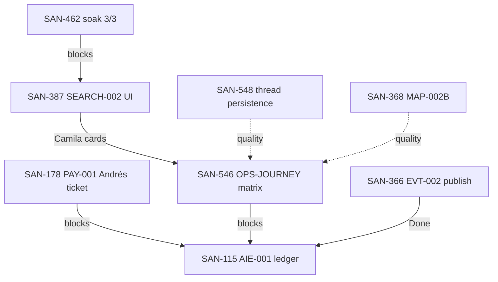

# Dependency graph audit

**Date:** 2026-06-09  
**Sources:** Linear API · CSV `Blocked by` columns · spec `depends_on` on disk  
**Caveat:** Full graph needs CSV re-export with relation columns

---

## Launch blocker chain



| Check | Status | Notes |
|-------|--------|-------|
| blockedBy exists for SAN-178 | 🟡 | Implicit — blocks revenue R2 import per `revenue.md` |
| parent exists for SAN-115 | ✅ | Parent SAN-757 AIE-000 (advanced — ledger is launch exception) |
| milestone exists | ✅ | Phase 1 — mdeai MVP launch |
| circular dependencies | ✅ None found in launch chain |
| launch blockers identified | ✅ SAN-178 primary |

---

## VEB prerequisite chain

```text
DATA-009 (SAN-331) + VEN-015 (SAN-298)
  → VEB-001 (SAN-492)
  → VEB-002 (SAN-493)
  → VEB-003…005 (SAN-494–496)
  → VEB-010 (SAN-501)
  parallel: VEB-006 (SAN-497) → VEB-007/008
  after EVP-010: VEB-009 (SAN-500)
```

| Check | Status |
|-------|--------|
| VEB parent epic | ❌ None — recommend VEB-000 |
| VEB-009 blocked by EVP-010 | ✅ Disk spec |
| VEB-010 blocked by VEN spine | 🟡 VEN-016–019 open |
| ADK prod for VEB-006 | SAN-368 In Progress |

**VEB not on launch critical path.**

---

## Known dependency risks

| SAN | Depends on | Risk |
|-----|------------|------|
| SAN-387 | SAN-462 soak 3/3 | PR #38 held — Camila event cards delayed |
| SAN-824 | SAN-828 | Event pin coverage blocked |
| SAN-115 | SAN-178, SAN-546, SAN-366 | Ledger open until G1+G2 |
| SAN-178 | Stripe prod env | Hard blocker |
| SAN-545 | DATA-EMBED 403 | Camila rental hybrid degraded |
| SAN-497 | VEB-001 | Agent tools before schema Done |

---

## Orphan dependency issues (no parent)

| SAN | Title | Should parent under |
|-----|-------|---------------------|
| SAN-492–509 | VEB-001…018 | VEB-000 epic (create) |
| SAN-757 | AIE-000 pack | Events Platform epic |
| SAN-822 | CHAT sprint epic | UX-037 (exists) |
| SAN-792–796 | Venue orphans | Cancel or VEN epic SAN-292 parent |

---

## Actions

| # | Action |
|---|--------|
| 1 | Create **VEB-000** parent · set `parentId` on SAN-492–509 |
| 2 | Link SAN-387 `blockedBy` → SAN-462 explicitly in Linear |
| 3 | Verify SAN-824 ↔ SAN-828 relation after export |
| 4 | Run circular-dep script post-export (CSV `Blocked by` column) |
