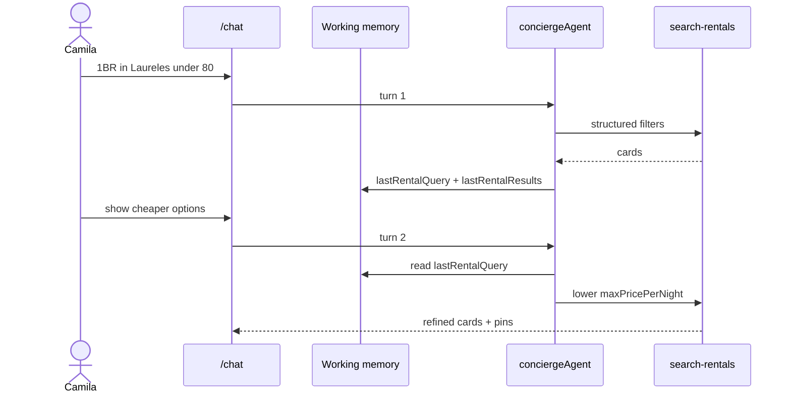
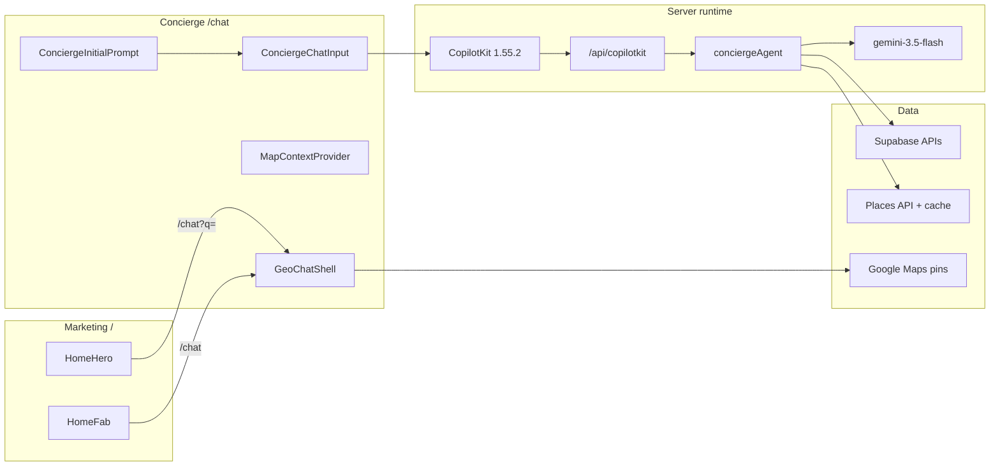
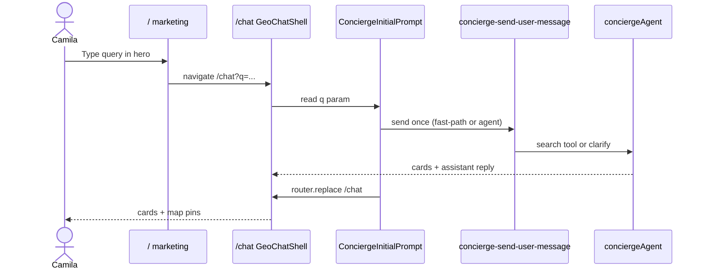
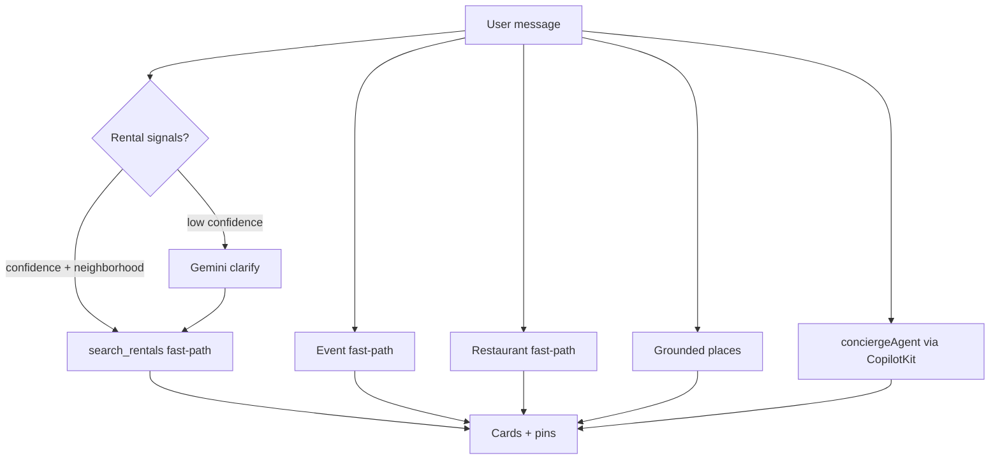
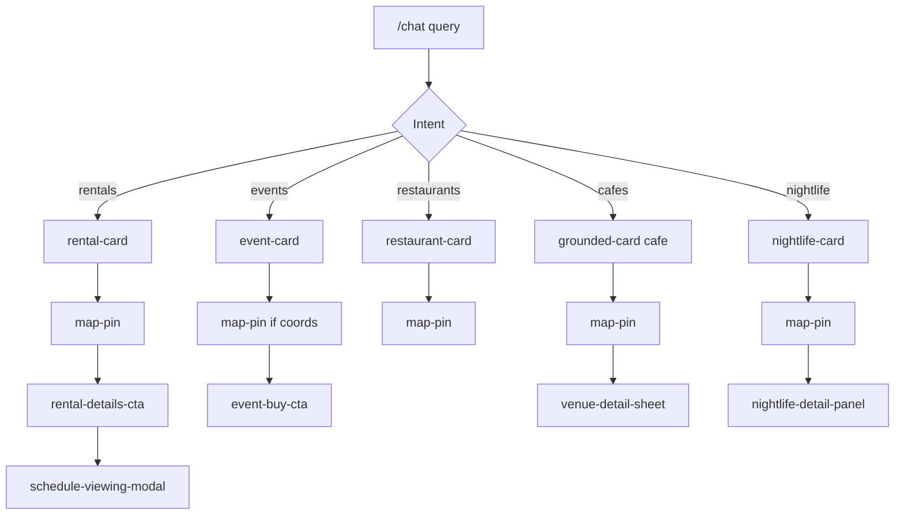
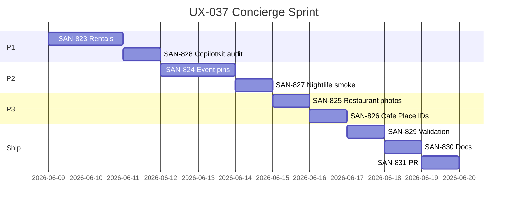
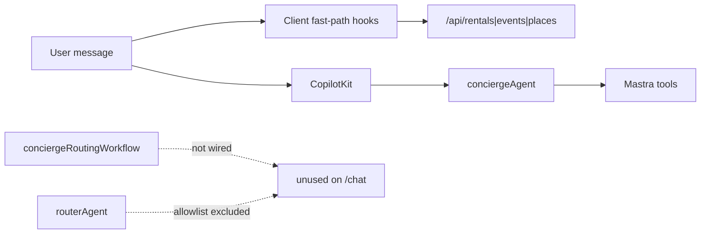
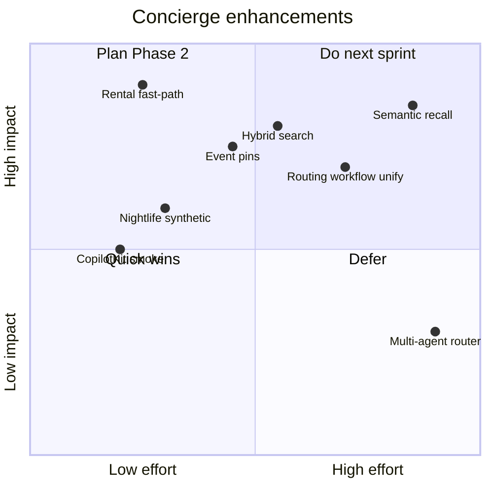

# 💬 CHAT — Concierge Sprint Tracker
> UX-037 · Cycle 1 Jun 8–22 2026 · Updated: 2026-06-08

**Linear view:** [CHAT](https://linear.app/sanjiovani/view/chat-5e4071d8144e) · Filter: `label:CHAT`  
**Epic:** [SAN-822](https://linear.app/sanjiovani/issue/SAN-822) · **Branch:** `ai/san-822-ux-037-concierge-improvements-sprint`

> **Scope:** This file tracks **UX-037 concierge sprint only** (10 issues). Other `label:CHAT` / `CHATW` issues — **SAN-612–626** (Chatwoot/WhatsApp epic CHAT-001–015) — live in [`ADV.md` § Integrations](./ADV.md#-integrations-chatwoot--whatsapp--a2a), not here.

**Legend:** 🟢 Complete · 🟡 In Progress · ⚪ Not Started · 🔴 Failed/Canceled

---

## 📊 Sprint Scorecard

> 10 issues · 🟢 1 done · ⚪ 9 not started · **Sprint Score: 28/100 F** · Launch Readiness: **8.3/10** → target ≥9.0

| Status | Order | ID | Title / Purpose | Persona | Tech | Priority | Score | Grade | Blocked By |
|--------|-------|----|-----------------|---------|------|----------|-------|-------|------------|
| 🟢 | — | [SAN-733](https://linear.app/sanjiovani/issue/SAN-733) | Fix /chat — restore GeoChatShell + `?q=` handoff | Camila | Next.js 16 | Urgent | 100 | A+ | — |
| ⚪ | 1 | [SAN-823](https://linear.app/sanjiovani/issue/SAN-823) | Rentals: pattern fast-path (neighborhood + intent) | Camila | CopilotKit 1.55.2 + Mastra | High | 20 | F | — |
| ⚪ | 2 | [SAN-828](https://linear.app/sanjiovani/issue/SAN-828) | CopilotKit: audit empty POST 401 vs 400 | Lucía | CopilotKit 1.55.2 + Next.js | High | 20 | F | SAN-823 |
| ⚪ | 3 | [SAN-824](https://linear.app/sanjiovani/issue/SAN-824) | Events: pin coverage ≥95% via upstream coords | Andrés | Google Maps JS + Mastra | High | 20 | F | SAN-828 |
| ⚪ | 4 | [SAN-827](https://linear.app/sanjiovani/issue/SAN-827) | Nightlife: add 5th prod-synthetic query | Tourist | Vitest + Playwright | Medium | 20 | F | SAN-824 |
| ⚪ | 5 | [SAN-825](https://linear.app/sanjiovani/issue/SAN-825) | Restaurants: measure placeholders, warm cache | Tourist | Google Maps JS | Low | 20 | F | SAN-827 |
| ⚪ | 6 | [SAN-826](https://linear.app/sanjiovani/issue/SAN-826) | Cafés: Place ID audit + graceful booking degrade | Tourist | Google Maps JS + Supabase | Low | 20 | F | SAN-825 |
| ⚪ | 7 | [SAN-829](https://linear.app/sanjiovani/issue/SAN-829) | Full validation gate (floor + E2E 7/7 + smoke) | Lucía | Vitest + Playwright | High | 20 | F | SAN-826 |
| ⚪ | 8 | [SAN-830](https://linear.app/sanjiovani/issue/SAN-830) | Documentation update (audit + readiness) | — | Markdown | Medium | 20 | F | SAN-829 |
| ⚪ | 9 | [SAN-831](https://linear.app/sanjiovani/issue/SAN-831) | Ship single PR · `Closes SAN-822` | — | Git + GitHub | High | 20 | F | SAN-830 |

**Execution chain:** `733 ✅ → 823 → 828 → 824 → 827 → 825 → 826 → 829 → 830 → 831`

---

**Docs index**

| Doc | Path |
|-----|------|
| Task index | `mdeapp/docs/notes/june-9-chat-tasks.md` |
| Sprint spec | `mdeapp/docs/notes/june-9-chat-improve.md` |
| Audit prompt | `mdeapp/docs/notes/june-9-prompt.md` |
| Disk spec | `tasks/ux/tasks/UX-037-concierge-improvements-sprint.md` |
| Concierge audit | `mdeapp/docs/audits/concierge-audit.md` |
| Launch readiness | `mdeapp/docs/audits/launch-readiness.md` |
| Evidence root | `tasks/testing/evidence/YYYY-MM-DD/chat-sprint/` |

**Skills per task:** `copilotkitV1` · `mastra` · `gemini` · `mde-maps` · `mde-supabase` · `task-verifier` · `mermaid-diagrams`

**AI & Intelligence project:** [80 issues](https://linear.app/sanjiovani/project/ai-and-intelligence-fe206edb90b2/issues) — consumer chat ~**72%** prod-ready; Mastra adoption ~**50%** of available features (intentional Phase 1 trim)

---

## User stories

| ID | As a… | I want… | So that… | Acceptance | Linear |
|----|-------|---------|----------|------------|--------|
| US-C1 | **Camila** | to search from `/` hero and land on `/chat` with results already loading | I don't repeat my query | `?q=` auto-send · cards <45s · URL strips to `/chat` | SAN-733 ✅ |
| US-C2 | **Camila** | `apartments in laureles` to return rentals without a clarify detour | vague-but-geographic queries feel instant | fast-path · `rental-card` · `map-pin` | SAN-823 |
| US-C3 | **Camila** | follow-ups like "show cheaper options" to keep rental context | the concierge doesn't reset | `lastRentalQuery` in working memory · same thread | INT-010 ✅ |
| US-C4 | **Camila** | to schedule a viewing from a rental card | I become a qualified lead | `rental-schedule-cta` → `schedule-viewing-modal` | TEST-002 |
| US-T1 | **Tourist** | quiet café / rooftop / nightlife queries to show grounded cards + pins | I trust map results | `grounded-card` / `nightlife-card` + pins | SAN-827 |
| US-T2 | **Tourist** | restaurant cards with real photos, not placeholders | listings look credible | placeholder rate <30% or fallback policy | SAN-825 |
| US-T3 | **Tourist** | café booking sheet only when Place ID is verified | I don't hit dead-end forms | degrade copy when no `placeId` | SAN-826 |
| US-A1 | **Andrés** | event cards from chat with venue pins when coords exist | I can orient on the map before buying | ≥95% pin coverage on result sets | SAN-824 |
| US-A2 | **Andrés** | `event-buy-cta` when tiers exist | I can purchase without leaving flow | ticket CTA on grounded events | INT-007 ✅ |
| US-L1 | **Lucía** | prod smoke + 5-query synthetic to catch regressions | launch isn't fake-done | floor · E2E 7/7 · smoke saved | SAN-829 |
| US-L2 | **Lucía** | CopilotKit empty POST to return documented status | monitors don't false-alarm | 400 or documented 401 | SAN-828 |

### Multi-turn memory journey (working memory — INT-010 ✅)



---

## Personas & surfaces

| Persona | Journey | Surface |
|---------|---------|---------|
| **Camila** | Rental / chat search | `/` → `/chat` |
| **Tourist** | Restaurants, cafés, nightlife | `/chat` |
| **Andrés** | Event cards + buy CTA | `/chat` → event detail |
| **Lucía** | E2E + prod smoke | CI + `mdeai.co` |

| Route | Status | Role |
|-------|--------|------|
| `/` | ✅ LIVE | Marketing home — hero, FAB, discovery |
| `/chat` | ✅ LIVE | Canonical concierge — `GeoChatShell` |

---

## Architecture (mdeapp Phase 1)



---

## User journey — Camila home handoff (SAN-733 ✅)



---

## Send pipeline — fast-path vs agent (SAN-823 target)



---

## Vertical journeys (post-handoff)



---

## Sprint execution (v2 order)



**Chain:** 823 → 828 → 824 → 827 → 825 → 826 → 829 → 830 → 831

---

## Issue tracker

> 11 issues · 🟢 1 done · ⚪ 10 not started · Sprint score: **42/100** · Launch: **8.3/10** → target **9.0**

| Status | Order | ID | SPEC | Title | Persona | Skills | Score | Done criteria |
|--------|------:|----|------|-------|---------|--------|------:|---------------|
| 🟢 | — | [SAN-733](https://linear.app/sanjiovani/issue/SAN-733) | — | Home → `/chat?q=` handoff | Camila | copilotkitV1 | 100 | PR #134 · prod `/chat` 200 |
| ⚪ | 1 | [SAN-823](https://linear.app/sanjiovani/issue/SAN-823) | UX-038 | Rentals pattern fast-path | Camila | mastra · copilotkitV1 · mde-supabase | 38 | `apartments in laureles` <45s · cards · pins · E2E |
| ⚪ | 2 | [SAN-828](https://linear.app/sanjiovani/issue/SAN-828) | UX-043 | CopilotKit 401/400 audit | Lucía | copilotkitV1 | 25 | smoke green or documented exception |
| ⚪ | 3 | [SAN-824](https://linear.app/sanjiovani/issue/SAN-824) | UX-039 | Event pin coverage ≥95% | Andrés | mde-maps · mde-supabase · mastra | 42 | pins on ≥95% event result sets |
| ⚪ | 4 | [SAN-827](https://linear.app/sanjiovani/issue/SAN-827) | UX-042 | Nightlife prod-synthetic #5 | Lucía | task-verifier | 44 | 5/5 prod-synthetic queries PASS |
| ⚪ | 5 | [SAN-825](https://linear.app/sanjiovani/issue/SAN-825) | UX-040 | Restaurant photo measure | Tourist | mde-maps | 50 | placeholder rate measured; fix if >30% |
| ⚪ | 6 | [SAN-826](https://linear.app/sanjiovani/issue/SAN-826) | UX-041 | Café Place ID audit | Tourist | mde-maps · mde-supabase | 57 | coverage % logged; degrade copy |
| ⚪ | 7 | [SAN-829](https://linear.app/sanjiovani/issue/SAN-829) | UX-044 | Full validation gate | Lucía | task-verifier | 43 | floor green · 7/7 E2E · smoke saved |
| ⚪ | 8 | [SAN-830](https://linear.app/sanjiovani/issue/SAN-830) | UX-045 | Documentation | — | mermaid-diagrams | 50 | audit + readiness updated |
| ⚪ | 9 | [SAN-831](https://linear.app/sanjiovani/issue/SAN-831) | UX-046 | Ship PR | — | — | 0 | PR merged · `Closes SAN-822` |
| ⚪ | — | [SAN-822](https://linear.app/sanjiovani/issue/SAN-822) | UX-037 | Sprint epic | — | — | 67 | all children Done |

---

## Per-task success criteria

### SAN-823 — Rentals
- [ ] `apartments in laureles` from home hero → cards without canned clarify
- [ ] `rental-card` ≥1 · `map-pin` ≥1 · URL `/chat` (no `?q=`)
- [ ] `rental-schedule-cta` opens `schedule-viewing-modal`
- [ ] Vitest `rental-query-parser` / fast-path tests green
- [ ] Evidence: `tasks/testing/evidence/YYYY-MM-DD/chat-sprint/san-823-rentals/`

### SAN-828 — CopilotKit API
- [ ] Document: 401 intentional vs bug (cite `route.ts` + CopilotKit v1 docs)
- [ ] `chat-smoke.mjs` PASS on localhost + prod **or** smoke updated with rationale
- [ ] No CopilotKit POST storm regression (<8 POSTs per query)
- [ ] Evidence: `.../san-828-copilotkit/`

### SAN-824 — Events
- [ ] `/api/events/search` returns lat/lng for ≥95% of pinned events
- [ ] Geocode fallback only for rows missing coords (`X-Goog-FieldMask` on Places)
- [ ] `e2e/home-to-chat` events case: cards; pins when coords present
- [ ] Evidence: `.../san-824-events/`

### SAN-827 — Nightlife
- [ ] `prod-synthetic-smoke.spec.ts` 5th query (nightlife) added
- [ ] `nightlife-card` + `map-pin` on prod/local
- [ ] VEN-025 routing: no `event-card` for bar queries
- [ ] Evidence: `.../san-827-nightlife/`

### SAN-825 — Restaurants
- [ ] Prod sample n≥20: placeholder % recorded in audit doc
- [ ] Code change only if >30% placeholders
- [ ] Evidence: `.../san-825-restaurants/`

### SAN-826 — Cafés
- [ ] Place ID coverage % in audit table
- [ ] Booking sheet shows clear degrade when `placeId` missing
- [ ] No synthetic Place IDs
- [ ] Evidence: `.../san-826-cafes/`

### SAN-829 — Validation gate
```bash
cd mdeapp && npm run lint && npm test -- --run
npm run typecheck && npm run floor
npx playwright test e2e/home-to-chat.spec.ts --project=chromium
node ../tasks/testing/scripts/chat-smoke.mjs --base https://www.mdeai.co
```
- [ ] All green or documented waivers in `chat-sprint/RESULTS.md`

### SAN-830 / SAN-831 — Docs + PR
- [ ] `concierge-audit.md` before/after table
- [ ] Launch readiness ≥ **9.0**
- [ ] PR: `feat(concierge): improve search quality, map coverage and reliability`

---

## Production readiness checklist

| Check | Local | Prod | Owner |
|-------|-------|------|-------|
| `GET /` → 200 | 🟢 | 🟢 | — |
| `GET /chat` → 200 (not 307) | 🟢 | 🟢 | SAN-733 ✅ |
| Home hero → `/chat?q=` → auto-send | 🟢 | 🟢 | SAN-733 ✅ |
| 5 vertical home-handoff E2E | 🟢 5/5 | — | SAN-829 |
| `chat-smoke.mjs` | 🟡 | 🔴 401 | SAN-828 |
| prod-synthetic 4-query | — | 🟢 | SAN-827 → 5-query |
| Rental vague query latency | 🔴 clarify | 🔴 | SAN-823 |
| Event pin coverage | 🟡 partial | 🟡 | SAN-824 |
| **Launch score** | — | **8.3/10** | target **9.0** @ SAN-831 |

### Tier 1 prod smoke (daily)
```bash
curl -s -o /dev/null -w "GET / -> %{http_code}\n" https://www.mdeai.co/
curl -s -o /dev/null -w "GET /chat -> %{http_code}\n" https://www.mdeai.co/chat
node /home/sk/mdeai/tasks/testing/scripts/chat-smoke.mjs --base https://www.mdeai.co
```

---

## Directory & naming conventions

| Artifact | Correct path | Wrong |
|----------|--------------|-------|
| Sprint evidence | `tasks/testing/evidence/YYYY-MM-DD/chat-sprint/san-NNN-slug/` | `mdeapp/tasks/...` |
| Disk task spec | `tasks/ux/tasks/UX-037-*.md` | under `mdeapp/tasks/` |
| App source | `mdeapp/src/...` | `/home/sk/mde/` (frozen) |
| Concierge route | `mdeapp/src/app/chat/page.tsx` | duplicate shell on `/` |
| E2E helpers | `mdeapp/e2e/helpers/maps-layout.ts` | — |
| Linear markdown | `mdeapp/linear/markdown/CHAT.md` | root `linear.md` only |
| Branch | `ai/san-822-ux-037-concierge-improvements-sprint` | per-issue branches until PR |

**Commit subjects:** `fix(rentals):` · `fix(events):` · `fix(api):` · `test(nightlife):` · `docs(concierge):` · final `feat(concierge):`

---

## Related (do not duplicate)

| ID | Focus |
|----|-------|
| [SAN-406](https://linear.app/sanjiovani/issue/SAN-406) | INT-003 clarify routing |
| [SAN-407](https://linear.app/sanjiovani/issue/SAN-407) | INT-004 canned bypass |
| [SAN-484](https://linear.app/sanjiovani/issue/SAN-484) | REAL-017 parser |
| [SAN-485](https://linear.app/sanjiovani/issue/SAN-485) | REAL-018 Gemini routing |

---

## Mastra utilization audit

**Verdict:** We use Mastra **well for Phase 1 launch** (one production agent, thread memory, tools, Postgres storage, telemetry) but **not to fullest extent** — workflows, secondary agents, scorers-in-loop, and semantic recall are deliberately parked.

| Mastra capability | Registered | Used on `/chat` | Grade | Notes |
|-------------------|------------|-----------------|-------|-------|
| **conciergeAgent** | ✅ | ✅ CopilotKit | 🟢 A | 7 search tools + `extractIntentSlots` · Gemini flash |
| **hostEventAgent** | ✅ | ✅ `/host/*` only | 🟢 A | HITL publish — not consumer chat |
| **routerAgent** | ✅ | ❌ not in allowlist | 🟡 C | Exists; [MASTRA-MIS-001](https://linear.app/sanjiovani/issue/SAN-426) = concierge-only prod |
| **rentalAgent / eventAgent** | ✅ | ❌ | 🟡 C | [AGT-rentalAgent](https://linear.app/sanjiovani/issue/SAN-750) / [AGT-eventAgent](https://linear.app/sanjiovani/issue/SAN-749) backlog |
| **evaluationAgent** | ✅ | ❌ | 🟡 C | Offline eval only |
| **conciergeRoutingWorkflow** | ✅ | ❌ | 🔴 D | Client fast-path hooks bypass workflow |
| **rentalSearchWorkflow** | ✅ | ❌ on `/chat` | 🟡 C | Router path unused in consumer UI |
| **Thread working memory** | ✅ | ✅ | 🟢 A | [INT-010](https://linear.app/sanjiovani/issue/SAN-413) Done · Zod `conciergeWorkingMemorySchema` |
| **Postgres storage (F13)** | ✅ | ✅ prod | 🟢 A | `getMastraStorage()` · survives Vercel redeploy |
| **Input processors** | ✅ | ✅ | 🟢 B+ | `getDefaultInputProcessors()` on concierge |
| **Scorers (faithfulness / grounding)** | ✅ | 🟡 ops only | 🟡 B | [AGT-00A/B](https://linear.app/sanjiovani/project/ai-and-intelligence-fe206edb90b2/issues) Done — not per-request gate |
| **Semantic recall (pgvector)** | ❌ | ❌ | ⚪ F | [AGT-08](https://linear.app/sanjiovani/issue/SAN-603) backlog |
| **Resource-scoped memory** | ❌ | ❌ | ⚪ F | [AGT-02](https://linear.app/sanjiovani/issue/SAN-597) backlog |
| **Memory processors** | ❌ | ❌ | ⚪ F | [AGT-13](https://linear.app/sanjiovani/issue/SAN-610) backlog |
| **Background grounding tasks** | ❌ | ❌ | ⚪ F | [AGT-09](https://linear.app/sanjiovani/issue/SAN-600) backlog |
| **Native tool approval (HITL)** | ✅ | 🟡 host only | 🟡 B | Consumer search has no money-risk HITL — correct |
| **ai_runs telemetry** | ✅ | ✅ | 🟢 A | [AGT-00C](https://linear.app/sanjiovani/issue/SAN-589) Done |

**Overall Mastra adoption for consumer chat: ~50%** — appropriate for launch; biggest gap is **routing split** (4 client fast-path hooks vs one Mastra workflow).



### Best practices (current — keep)

1. **One production agent on `/chat`** — `conciergeAgent` only ([SAN-426](https://linear.app/sanjiovani/issue/SAN-426) MASTRA-MIS-001).
2. **Fast-path before agent** when parser confidence is high — saves Gemini round-trip + CopilotKit POSTs ([INT-022 / SAN-425](https://linear.app/sanjiovani/issue/SAN-425) telemetry).
3. **Thread-scoped working memory** — follow-ups inherit `lastRentalQuery` / `lastEventQuery`; never reset on turn 2+.
4. **Tool instructions in agent** — nightlife vs restaurant vs event disambiguation lives in `concierge.ts`, not only client classifiers.
5. **MapUiState in memory** — pin counts/viewport mirror, not full pin arrays (cost + drift guard).
6. **Postgres memory on prod** — `DATABASE_URL` + pool limits; local `MASTRA_DEV_LIBSQL=1` for dev pool relief.
7. **Scorers for regression** — run faithfulness/grounding in CI or Studio, not inline on every user message (latency).
8. **CopilotKit POST budget** — <8 POSTs per query; fast-path when possible.

### Anti-patterns (avoid)

| Anti-pattern | Why it hurts | Instead |
|--------------|--------------|---------|
| Expose `routerAgent` to CopilotKit alongside concierge | Two agents · POST storm · v1 state drift | Keep router as workflow step or server pre-classifier |
| New agent per vertical | MASTRA-MIS-001 violation | Tools on `conciergeAgent` |
| Client-only routing with no agent mirror | Follow-ups in agent path miss fast-path context | Sync slots into working memory (INT-010 pattern) |
| Inline scorer on every turn | +2–5s latency | Batch eval + prod-synthetic |
| `file:` LibSQL on Vercel | ConnectionFailed on serverless | Postgres store (already fixed) |
| Skip `X-Goog-FieldMask` | Places cost blow-up | Every Places call masked |

---

## How to improve chat further

### Tier A — UX-037 sprint (Phase 1, this cycle)

Already in CHAT view — ship before new scope:

| Improvement | Impact | Issue |
|-------------|--------|-------|
| Rental pattern fast-path | Camila −30–90s on vague geo queries | SAN-823 |
| CopilotKit smoke contract | Lucía prod monitor green | SAN-828 |
| Event pin coverage | Andrés map trust | SAN-824 |
| Nightlife in prod-synthetic | Tourist regression net | SAN-827 |

### Tier B — AI & Intelligence (Phase 1 tail, no redesign)

Pull from [AI & Intelligence](https://linear.app/sanjiovani/project/ai-and-intelligence-fe206edb90b2/issues) after UX-037:

| Improvement | Mastra / CK lever | Linear | Persona |
|-------------|-------------------|--------|---------|
| Finish hybrid rental search wire | `hybrid_search_listings` + signals | [SEARCH-001](https://linear.app/sanjiovani/issue/SEARCH-001) In Review | Camila |
| Grounding assertion on agent output | Output processor | [AGT-04A](https://linear.app/sanjiovani/issue/SAN-606) | Tourist |
| Agent running status badge | `useCoAgent` state | [CONCIERGE-002](https://linear.app/sanjiovani/issue/SAN-834) | Camila |
| Server-side routing workflow | Wire `conciergeRoutingWorkflow` as API pre-step; reduce 4 duplicate client hooks | [AGT-routerAgent](https://linear.app/sanjiovani/issue/SAN-742) | Sofía |
| Rental lead workflow | `rentalLeadWorkflow` after schedule-viewing | [WF-003](https://linear.app/sanjiovani/issue/SAN-746) | Patricia |
| Map pin sync from agent tools | `useCoAgent` + tool renders | [CK-008](https://linear.app/sanjiovani/issue/SAN-741) | Camila |

**Do not yet:** [SAN-403](https://linear.app/sanjiovani/issue/SAN-403) multi-agent router · [CONCIERGE-001](https://linear.app/sanjiovani/issue/SAN-833) multi-domain CoAgents — conflicts with MASTRA-MIS-001 until CopilotKit v2.

### Tier C — Phase 2 (post-launch, ADV.md)

| Improvement | Feature | Linear |
|-------------|---------|--------|
| "The apartment I liked" recall | Semantic memory + pgvector | [AGT-08](https://linear.app/sanjiovani/issue/SAN-603) |
| Durable prefs across threads | Resource-scoped memory | [AGT-02](https://linear.app/sanjiovani/issue/SAN-597) |
| Slow web-grounding without blocking UI | Background tasks | [AGT-09](https://linear.app/sanjiovani/issue/SAN-600) |
| Progressive tool streaming | `context.writer` | [AGT-609](https://linear.app/sanjiovani/issue/SAN-609) |
| Rental preference ranking | pgvector + [SAN-487](https://linear.app/sanjiovani/issue/SAN-487) | ADV |

### Enhancement priority matrix



### AI & Intelligence — Done vs backlog (chat-relevant)

| Status | IDs | Chat value |
|--------|-----|------------|
| 🟢 Done | INT-006–008, INT-010, INT-021–022, SEARCH-003, MASTRA-MIS-001, AGT-00A–C, VEC-001, DATA-043 | Memory, telemetry, restaurant hybrid, routing hygiene |
| 🟡 In Review | SEARCH-001 | Rental hybrid — finish for better ranking |
| ⚪ Backlog (high leverage) | AGT-04A, AGT-13, CONCIERGE-002, WF-003, CK-008 | Quality gates + UX polish |
| 🔴 Defer | SAN-403, CONCIERGE-001, AGT-08 until v2 / Phase 2 | Scope creep vs one-agent rule |

---

## Hard rules (sprint)

1. One vertical at a time — tests green before next SAN
2. Separate commit per implementation task
3. One PR at [SAN-831](https://linear.app/sanjiovani/issue/SAN-831)
4. **No new agents** · **no UI redesign**
5. Production AI = **Gemini only** · CopilotKit **1.55.2 v1**
6. Every Places call: `X-Goog-FieldMask` · every pin: parent `Map` has `mapId`
7. `task-verifier` before any issue → Done
