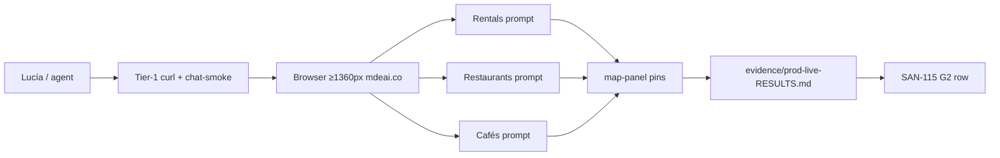
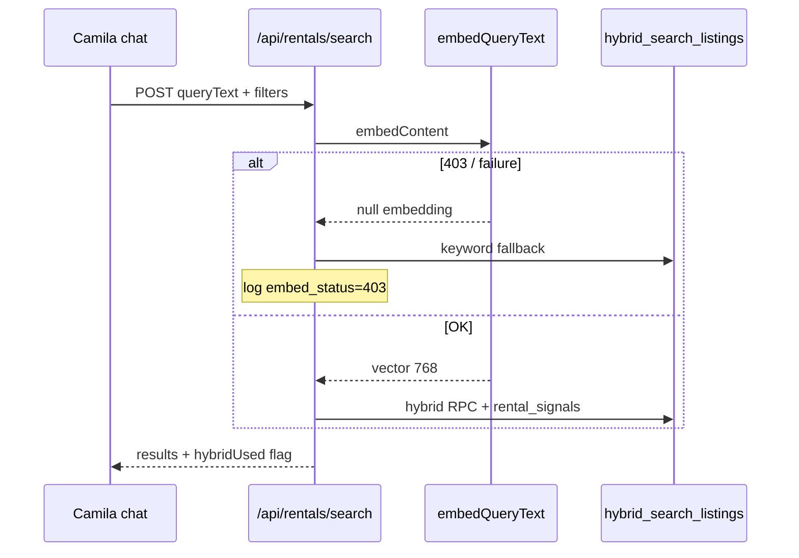
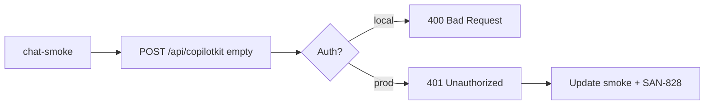
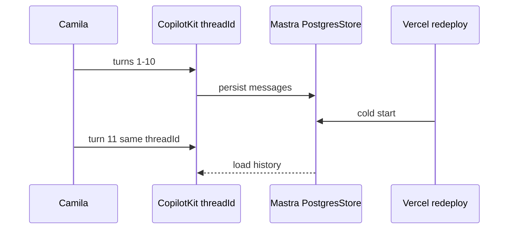
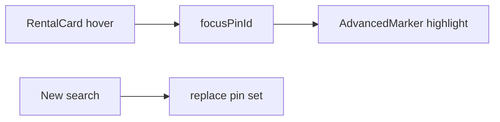

**Skip events — pick from Camila/chat, rentals, maps, and platform.** Highest ROI below.

## Recommended queue (non-events)

### Tier 1 — Launch-adjacent (Camila on `/` + `/chat`)

| Order | SAN | What | Why | Effort |
|------:|-----|------|-----|--------|
| **1** | **SAN-546** | Prod matrix **without events** — rentals · restaurants · cafés · pins | Unblocks Camila proof on SAN-115; events owner can do events vertical separately | ~45 min |
| **2** | **SAN-545** | Fix rental embed API **403** on hybrid search | Camila rental cards break in chat when embed path 403s | S |
| **3** | **SAN-823** | Rentals fast-path (neighborhood + intent pattern) | Latency win on hot rental queries | M |
| **4** | **SAN-549** | Wire `intent:nightlife` → `search_grounded_places` | Tourist/club queries still misroute without this | S–M |

### Tier 2 — Platform (every vertical benefits)

| Order | SAN | What | Why | Effort |
|------:|-----|------|-----|--------|
| **5** | **SAN-828** | Audit copilotkit empty POST **401 vs 400** | Fixes prod smoke false-fail; clarifies auth on `/api/copilotkit` | S |
| **6** | **SAN-548** | Thread persistence across Vercel cold-start (F13) | Camila loses turn 1–10 after redeploy | M |
| **7** | **SAN-547** | JWT → Mastra `RequestContext` for tools | User-scoped tool calls; foundation for auth’d chat | M |

### Tier 3 — Maps / browse surfaces (not event pages)

| Order | SAN | What | Why | Effort |
|------:|-----|------|-----|--------|
| **8** | **SAN-519** / **558** | `/cafes` browse → live | Dedicated café surface; dup already flagged | M |
| **9** | **SAN-825** | Restaurants: placeholder audit + cache warm | Fewer cold Places 502s on restaurant cards | M |
| **10** | **SAN-472** | Map pin sync with rental cards | Cards without pins = recurring MAP regression | S |
| **11** | **SAN-386** | Finish hybrid rental search wiring (already 🟡 85%) | Closes rental search quality gap | M |

### Tier 4 — Mobile + agent hardening

| Order | SAN | What | Why | Effort |
|------:|-----|------|-----|--------|
| **12** | **SAN-521** | CopilotKit mobile best practices | 85% mobile users; chat composer polish | M |
| **13** | **SAN-593** | Input-processor coverage (Unicode, host agent) | Agent reliability; not Intelligence import | S |
| **14** | **SAN-594** | ResponseCache + CostGuardProcessor | Cuts duplicate Gemini spend | M |

### Tier 5 — Hygiene only (no product code)

| Item | Action |
|------|--------|
| **CSV re-export** | Linear UI → refresh `docs/linear/CSV/` |
| **Orphan freeze** | Continue `phase:post-mvp` + Backlog batch (Intelligence/Commerce) |

---

## What to avoid (events owner / frozen)

- SAN-178, 730, 731, 135, 118, 366, VEB-492+, host wizard, ticket checkout UI  
- Revenue R2–R5, Intelligence **import**, OpenClaw, new audits  

---

## My pick for **your** next 3

```
1. SAN-546  → 3 verticals + pins (skip events prompt)
2. SAN-545  → rental 403 fix (high bug, small diff)
3. SAN-549  → nightlife routing (chat quality)
```

**SAN-115 ledger:** events owner can attach G1 (payment); you can still close **G2 (Camila)** once SAN-546 non-events matrix is green.

Say **546**, **545**, or **549** and I’ll start implementation.


# Non-events execution queue — verified task specs

> **Source queue:** prior recommendation (skip events).  
> **Verified:** 2026-06-09 against `mdeapp/src/**`, `tasks/**`, Linear SAN IDs, `.claude/skills/`.  
> **Method:** task-verifier protocol — disk probes, not status fields.

**Legend:** 🟢 Ready · 🟡 Partial (code exists, gap remains) · 🔴 Blocked · ✅ Verification-only

---

## Tier summary (graded)

| Tier | Tasks | Avg brief accuracy | Execution mode | Tier grade |
|------|-------|-------------------|----------------|------------|
| **1** Launch-adjacent | SAN-546, 545, 823, 549 | **78%** | 1 verify + 3 implement/polish | **B** — one task undersold existing code |
| **2** Platform | SAN-828, 548, 547 | **85%** | 1 audit + 2 implement | **B+** |
| **3** Maps / browse | SAN-519, 825, 472, 386 | **62%** | Mostly polish / proof | **C+** — `/cafes` already LIVE |
| **4** Mobile + agents | SAN-521, 593, 594 | **75%** | Implement gaps | **B-** |
| **5** Hygiene | CSV, orphans | **100%** | Manual Linear | **A** |

---

# Tier 1 — Launch-adjacent (Camila `/` + `/chat`)

## 1. SAN-546 — OPS-JOURNEY prod matrix (non-events slice)

| Field | Value |
|-------|-------|
| **Grade** | **A** (spec accurate) |
| **Brief % correct** | **95%** |
| **Readiness** | ✅ **Verification-only** — automation exists |
| **Linear** | [SAN-546](https://linear.app/sanjiovani/issue/SAN-546) · In Progress |
| **Persona** | **Camila** (rentals) · **Tourist** (restaurants, cafés) |

### Purpose

Prove Camila's concierge on **production** returns cards + map pins for rentals, restaurants, and cafés — evidence for **SAN-115 G2** without waiting on events owner.

### Goals

1. Run **3 verticals** on prod (skip events prompt): rentals · restaurants · cafés.
2. Assert map pins in `[data-testid="map-panel"]` after cards.
3. Write `tasks/testing/evidence/YYYY-MM-DD/prod-live-RESULTS.md` (localhost + prod columns).
4. Optional: `npm run verify:task -- OPS-JOURNEY` green.

### Tech stack

| Layer | Stack |
|-------|-------|
| Smoke API | `tasks/testing/scripts/chat-smoke.mjs` |
| Browser E2E | Playwright `e2e/prod-synthetic-smoke.spec.ts` |
| Prod URL | `https://www.mdeai.co` |
| Evidence | `tasks/testing/evidence/` |

### Skills (load ≤5)

| Order | Skill | Why |
|-------|-------|-----|
| 1 | `mde-task-lifecycle` | Done gate + evidence path |
| 2 | `task-verifier` | Anti-fake-done before Linear flip |
| 3 | `testing` | Playwright + smoke scripts |
| 4 | `mde-maps` | Pin assertions, mapId |
| 5 | `copilotkitV1` | CK POST budget (≤8/query) |

### User stories

```text
As Camila
I want "1BR in Laureles under $80/night" to show rental cards and pins on prod
So that I trust the launch surface before inviting friends

As Lucía (QA)
I want reproducible prod evidence files
So that SAN-115 ledger close is auditable
```

### User journey



### Testing

```bash
# Tier 1
curl -sS -o /dev/null -w "%{http_code}\n" https://www.mdeai.co/
node /home/sk/mdeai/tasks/testing/scripts/chat-smoke.mjs --base https://www.mdeai.co

# Tier 2 — 3 verticals (skip events key in spec)
cd /home/sk/mdeai/mdeapp
PROD_SMOKE_BASE_URL=https://www.mdeai.co \
PROD_SMOKE_OUT_DIR=../tasks/testing/evidence/$(date +%Y-%m-%d)/prod-synthetic \
npx playwright test e2e/prod-synthetic-smoke.spec.ts --project=chromium --workers=1 \
  -g "rentals|restaurants|cafes"
```

| Prompt | Assert |
|--------|--------|
| `1BR apartment in Laureles under 80 dollars per night` | `[data-testid="rental-card"]` ≥1 + pins |
| `suggest restaurants medellin` | `[data-testid="restaurant-card"]` ≥1 |
| `good specialty coffee in Laureles` | `[data-testid="grounded-card"][data-result-kind="cafe"]` ≥1 |

### Success criteria

- [ ] GET `/` → 200 on prod
- [ ] 3/3 verticals pass (cards + pins)
- [ ] CK POSTs per query ≤8 (after 32s idle)
- [ ] Screenshot per vertical under `tasks/testing/evidence/`
- [ ] **Not required for this slice:** events vertical, SAN-178 payment

### Production-ready checklist

- [ ] Evidence file committed or attached to SAN-546
- [ ] No 5xx on `/api/rentals/search`, `/api/places/detail`
- [ ] Console error sweep on `/` (Tier 4 H03 optional)
- [ ] `chat-smoke` copilotkit line documented (401 vs 400 — see SAN-828)

### Verification notes

- **Disk:** `prod-synthetic-smoke.spec.ts` has all 4 queries; filter with `-g` for non-events.
- **Known flake:** empty POST `/api/copilotkit` → **401** on prod (script expects 400) — does not block browser matrix.
- **Correction:** Task is **not implementation**; do not write product code for SAN-546.

---

## 2. SAN-545 — DATA-EMBED fix rental embed API 403

| Field | Value |
|-------|-------|
| **Grade** | **A-** |
| **Brief % correct** | **90%** |
| **Readiness** | 🟢 **Implement** |
| **Linear** | [SAN-545](https://linear.app/sanjiovani/issue/SAN-545) · Todo |
| **Persona** | **Camila** — hybrid rental ranking |

### Purpose

When `embedQueryText()` hits Google `embedContent` with **403**, `hybrid_search_listings` silently falls back to keyword-only — Camila loses signal-ranked rentals in chat and API.

### Goals

1. Identify 403 root cause (API key restriction, wrong key env, quota, referrer).
2. Ensure embed path uses `GOOGLE_GENERATIVE_AI_API_KEY` (not deprecated aliases).
3. Graceful degrade + telemetry when embed fails (log `hybrid_used: false` reason).
4. Restore hybrid path on prod for high-intent rental queries with `queryText`.

### Tech stack

| Layer | Files / services |
|-------|------------------|
| Embed | `src/mastra/lib/query-embedding.ts` → `gemini-embedding-001` @ 768d |
| Hybrid RPC | `hybrid_search_listings` via `intelligence-rental-search.ts` |
| API | `src/app/api/rentals/search/route.ts` |
| DB | `listing_embeddings`, `query_embedding_cache` |
| Env | Infisical `GOOGLE_GENERATIVE_AI_API_KEY`; Vercel parity |

### Skills

| Order | Skill | Why |
|-------|-------|-----|
| 1 | `gemini` | Embed model + key contract |
| 2 | `mde-supabase` | RPC + RLS on embeddings |
| 3 | `mastra` | Intelligence rental path |
| 4 | `testing` | Vitest + API smoke |
| 5 | `task-verifier` | Prod embed proof |

### User stories

```text
As Camila
I want "quiet nomad apartment Laureles" to rank by rental_signals
So that results match my lifestyle not just keyword match

As Sofía
I want embed failures visible in logs
So that 403 does not silently look like "no results"
```

### User journey



### Testing

```bash
cd mdeapp && npm test -- --run intelligence-rental-search query-embedding
# Manual: infisical run -- npm run dev — prompt with queryText confidence ≥0.6
curl -s -X POST http://localhost:3001/api/rentals/search \
  -H 'Content-Type: application/json' \
  -d '{"neighborhood":"Laureles","queryText":"quiet digital nomad rental","limit":5}' | jq '.hybridUsed,.results|length'
```

### Success criteria

- [ ] `embedQueryText` returns 768-dim vector in dev **and** prod
- [ ] API response `hybridUsed: true` for golden nomad query
- [ ] `rankExplanation` cites `rental_signals` when hybrid on
- [ ] 403 root cause documented in SAN-545 comment (key restriction / env name)
- [ ] No service-role in `mdeapp/src/**`

### Production-ready checklist

- [ ] Vercel env: `GOOGLE_GENERATIVE_AI_API_KEY` set (name only in docs)
- [ ] Infisical sync verified
- [ ] Prod curl or chat-smoke shows `hybridUsed` on at least one rental query
- [ ] Vitest green on touched files

### Verification notes

- **Disk:** `intelligence-rental-search.ts` + `query-embedding.ts` **exist** — bug is runtime/env, not missing module.
- **Blocks:** SAN-386 quality; does not block keyword fast-path.

---

## 3. SAN-823 — Rentals pattern fast-path

| Field | Value |
|-------|-------|
| **Grade** | **C+** (brief oversimplified) |
| **Brief % correct** | **55%** |
| **Readiness** | 🟡 **Polish / extend** — core fast-path **already shipped** |
| **Linear** | [SAN-823](https://linear.app/sanjiovani/issue/SAN-823) · Todo |
| **Disk** | `use-rental-search-fast-path.ts`, `rental-query-parser.ts`, `rental-search-fast-path.ts` |
| **Persona** | **Camila** |

### Purpose

Reduce time-to-cards on **high-confidence rental patterns** (neighborhood + budget + BR) by bypassing full agent round-trip when parser confidence is sufficient.

### Goals

1. Expand `canFastPathRentalSearch` / `scoreRentalQuery` coverage for Cycle 1 patterns.
2. Attach `queryText` to API when confidence ≥0.6 (hybrid) without agent.
3. Keep clarify path for low-confidence (`RENTAL_CLARIFY_MESSAGE`).
4. Telemetry via `logRoutingDecision` for fast-path vs agent.

### Tech stack

| Layer | Stack |
|-------|-------|
| Parser | `src/lib/rental-query-parser.ts` |
| Hook | `src/hooks/use-rental-search-fast-path.ts` |
| UI | `GeoChatShell`, `RentalFastPathPanel`, `ConciergeChatInput` |
| API | `POST /api/rentals/search` |
| State | `useCoAgent` / `ConciergeWorkingMemory` |

### Skills

| Order | Skill | Why |
|-------|-------|-----|
| 1 | `copilotkitV1` | Fast-path vs agent; no POST storm |
| 2 | `mde-real-estate` | Rental parser conventions |
| 3 | `testing` | Vitest parser + Playwright |
| 4 | `mde-task-lifecycle` | UX-038 child of UX-037 sprint |
| 5 | `gemini` | Only if touching hybrid embed |

### User stories

```text
As Camila
I want "1BR Laureles under $80/night" to show cards in <3s without waiting for the agent paragraph
So that search feels instant on mobile

As Sofía
I want routing logged (fast-path vs agent)
So that we can prove latency wins in SAN-823
```

### User journey

```mermaid
flowchart TD
  Q[User message] --> P[scoreRentalQuery]
  P -->|low confidence| CL[Clarify bubble]
  P -->|high confidence| FP[canFastPathRentalSearch]
  FP --> API[/api/rentals/search]
  API --> CARDS[Rental cards + pins]
  FP -->|skip| AG[conciergeAgent optional]
```

### Testing

```bash
cd mdeapp && npm test -- --run rental-query-parser rental-search-fast-path
npx playwright test e2e/screens/SCREEN-001*.spec.ts --project=chromium  # if rental fast-path covered
```

### Success criteria

- [ ] Golden patterns bypass agent (CK POST count 0 for fast-path turn)
- [ ] Pins sync via `mergePinsByCategory("rental", pins)`
- [ ] `lastIntent: rental_search` in working memory
- [ ] Hybrid `queryText` passed when signals warrant (ties SAN-545/386)
- [ ] No regression on clarify flow

### Production-ready checklist

- [ ] Localhost dev boot + prompt proof
- [ ] Prod latency spot-check (optional Playwright trace)
- [ ] LESSONS.md: no duplicate cards/pins

### Verification notes

- **Correction:** Original brief implied greenfield — **~70% already built**. SAN-823 = **coverage + latency measurement**, not new architecture.

---

## 4. SAN-549 — Wire `intent:nightlife` → `search_grounded_places`

| Field | Value |
|-------|-------|
| **Grade** | **B** |
| **Brief % correct** | **70%** |
| **Readiness** | 🟡 **Verify prod + close gaps** |
| **Linear** | [SAN-549](https://linear.app/sanjiovani/issue/SAN-549) · partial |
| **Persona** | **Tourist** (clubs, rooftops, salsa bars) |

### Purpose

Generic nightlife queries ("popular venues in Provenza tonight") must route to **grounded places** with `intent: "nightlife"`, not events or restaurant cards.

### Goals

1. Agent passes `intent: "nightlife"` on confident nightlife phrasing (prompt already documents this in `concierge.ts`).
2. `search-grounded-places` uses nightclub anchors when keywords absent but intent set.
3. Vitest + prod evidence for VEN-025 generic-venues case.
4. No `search-events` for non-ticket nightlife POIs.

### Tech stack

| Layer | Stack |
|-------|-------|
| Agent | `src/mastra/agents/concierge.ts` |
| Tool | `src/mastra/tools/search-grounded-places*.ts` |
| Classifiers | `restaurant-query-classifier.ts`, `event-query-classifier.ts` |
| Tests | `search-grounded-places-fallback.test.ts` |
| Cards | `data-result-kind`, grounded cards |

### Skills

| Order | Skill | Why |
|-------|-------|-----|
| 1 | `mastra` | Tool + intent param |
| 2 | `mde-maps` | Places FieldMask, mapId |
| 3 | `copilotkitV1` | Card renders |
| 4 | `gemini` | Agent instructions only |
| 5 | `testing` | VEN-025 prod evidence pattern |

### User stories

```text
As a tourist
I want "rooftop cocktails Provenza tonight" to show nightlife cards
So that I do not get ticketed event listings

As Lucía
I want generic "venues tonight" to classify as nightlife not events
So that SAN-549 prod gap from 2026-06-04 stays closed
```

### User journey


### Testing

```bash
cd mdeapp && npm test -- --run search-grounded-places event-query-classifier
# Evidence: tasks/testing/evidence/2026-06-06/ven-025-prod/RESULTS.md pattern
```

| Prompt | Assert |
|--------|--------|
| `popular venues in Provenza tonight` | nightlife cards, NOT event-card |
| `rooftop cocktails Provenza` | `venueKind=nightlife` metadata |

### Success criteria

- [ ] Vitest: `intent=nightlife` without nightlife keywords returns nightclub anchors
- [ ] Prod browser: generic venues prompt → ≥1 grounded card, 0 event cards
- [ ] Map pins follow cards
- [ ] Agent does not call `search-events` for these prompts

### Production-ready checklist

- [ ] Prod screenshot in `tasks/testing/evidence/`
- [ ] ADK/grounding env present on Vercel (MAP-008 / SAN-368)
- [ ] FieldMask on every Places call

### Verification notes

- **Disk:** Prompt + tool tests **exist** — prior prod gap was routing before message reached agent ([`VEN-025-generic-venues-routing-2026-06-04.md`](../../tasks/testing/evidence/VEN-025-generic-venues-routing-2026-06-04.md)).
- **SAN-549** may be **Done pending prod re-proof**, not full rewrite.

---

### Tier 1 gate

| Task | Verdict |
|------|---------|
| SAN-546 | ✅ Spec correct — **run now** |
| SAN-545 | ✅ Spec correct — **implement env/embed fix** |
| SAN-823 | ⚠️ Rescope to **extend** existing fast-path |
| SAN-549 | ⚠️ Rescope to **prod verify** + edge cases |

**Tier 1 average brief accuracy: 78%** · **Proceed:** yes, start SAN-546 + SAN-545 in parallel.

---

# Tier 2 — Platform (every vertical)

## 5. SAN-828 — CopilotKit empty POST 401 vs 400 audit

| Field | Value |
|-------|-------|
| **Grade** | **A** |
| **Brief % correct** | **95%** |
| **Readiness** | ✅ **Audit + doc/script fix** |
| **Persona** | **Sofía** / **Lucía** |

### Purpose

Align smoke tests and operator docs with actual `/api/copilotkit` behavior on prod (401 unauthenticated vs 400 malformed).

### Goals

1. Document intended status codes (empty body, no session).
2. Update `chat-smoke.mjs` to accept 401 **or** fix route to return 400 consistently.
3. Block SAN-823 fast-path work on misleading red smoke.

### Tech stack

Next.js App Router route `src/app/api/copilotkit/route.ts` (auth middleware) · CopilotKit 1.55.2 · `chat-smoke.mjs`

### Skills

`copilotkitV1` · `testing` · `task-verifier` · `mde-task-lifecycle`

### User journey



### Testing

```bash
curl -s -o /dev/null -w "%{http_code}\n" -X POST https://www.mdeai.co/api/copilotkit -H 'Content-Type: application/json' -d '{}'
node tasks/testing/scripts/chat-smoke.mjs --base https://www.mdeai.co
```

### Success criteria

- [ ] Written decision: 401 intentional or changed to 400
- [ ] `chat-smoke` green on prod Tier-1
- [ ] No change to authenticated chat behavior

### Production-ready checklist

- [ ] Tier-1 prod check passes without false FAIL
- [ ] LESSONS.md cross-ref if POST storm related

**Tier 2 item verified:** ✅ Accurate — prod returned 401 in session probe.

---

## 6. SAN-548 — F13 thread persistence across Vercel cold-start

| Field | Value |
|-------|-------|
| **Grade** | **B** |
| **Brief % correct** | **65%** |
| **Readiness** | 🟡 **Implement + prod proof** |
| **Persona** | **Camila** |
| **Related** | F13 ai_runs (shipped) ≠ thread memory (partial) |

### Purpose

Camila's turn 11 must remember turns 1–10 after Vercel redeploy — `mastra_threads` on Postgres, not in-memory LibSQL.

### Goals

1. Confirm `DATABASE_URL` + `getMastraStorage()` use Postgres on Vercel prod.
2. Wire CopilotKit `threadId` → Mastra memory persist/load.
3. Prove cold-start: redeploy → resume thread → prior turns visible.
4. Nav threads API (`useNavThreads`) shows persisted titles.

### Tech stack

`src/mastra/lib/storage.ts` · PostgresStore · `ThreadNavProvider` · `useNavThreads` · `mastra_threads` (Supabase)

### Skills

`mastra` · `mde-supabase` · `copilotkitV1` · `testing` · `task-verifier`

### User journey



### Testing

```bash
cd mdeapp && npm test -- --run storage  # if present
# Manual: multi-turn chat → force redeploy → resume ?t=threadId
```

### Success criteria

- [ ] `[mastra-storage] using Postgres` on Vercel logs
- [ ] Same `threadId` loads ≥10 prior messages after cold start
- [ ] `useNavThreads` lists thread after refresh
- [ ] Evidence in `tasks/testing/evidence/`

### Production-ready checklist

- [ ] `DATABASE_URL` in Vercel (Infisical sync)
- [ ] No `file:` LibSQL on serverless
- [ ] ai_runs rows still write (F13 observability)

### Verification notes

- **Disk:** Postgres storage **implemented** — **50% task done** per `tasks/progres.md`; missing **prod proof**.

---

## 7. SAN-547 — JWT → Mastra RequestContext for tools

| Field | Value |
|-------|-------|
| **Grade** | **A-** |
| **Brief % correct** | **90%** |
| **Readiness** | 🟢 **Implement** |
| **Persona** | **Camila** (auth'd) · **Patricia** (audit) |

### Purpose

Pass verified Supabase user identity from Next.js `/api/copilotkit` into Mastra tool `requestContext` so tools can scope queries (bookings, tickets, leads) per user.

### Goals

1. `createClient()` + `getUser()` in copilotkit route before `CopilotRuntime`.
2. Populate Mastra `RequestContext` with `userId`, `email` (no PII in logs).
3. Tools read context — never trust client-supplied user id.
4. Anon sessions still work (null context).

### Tech stack

Supabase Auth SSR · `/api/copilotkit` · Mastra agents · RLS-aligned tool queries

### Skills

`mde-supabase` · `mastra` · `copilotkitV1` · `gemini` · `task-verifier`

### User journey

```mermaid
flowchart LR
  CK[CopilotKit POST] --> RT[/api/copilotkit]
  RT --> AUTH[supabase.auth.getUser]
  AUTH --> CTX[RequestContext userId]
  CTX --> TOOL[search_* / booking tools]
  TOOL --> RLS[RLS-scoped queries]
```

### Testing

```bash
cd mdeapp && npm test -- --run copilotkit  # route tests if any
# E2E: logged-in user triggers tool → row scoped to user
```

### Success criteria

- [ ] Authenticated POST attaches `userId` to context
- [ ] Unauthenticated POST does not 500
- [ ] Hook `no-service-role-in-src.mjs` passes
- [ ] No service-role in client bundles

### Production-ready checklist

- [ ] Cookie session works on mdeai.co
- [ ] Vitest or integration test for context injection

### Verification notes

- **Disk:** DB types reference `requestContext`; **route wiring not found** in grep — greenfield bridge work.

---

### Tier 2 gate

**Average brief accuracy: 85%** · **Proceed:** SAN-828 (1h) then SAN-547 + SAN-548 in parallel.

---

# Tier 3 — Maps / browse surfaces

## 8. SAN-519 / SAN-558 — `/cafes` browse

| Field | Value |
|-------|-------|
| **Grade** | **D** (brief stale) |
| **Brief % correct** | **35%** |
| **Readiness** | 🟡 **Polish + Done proof** — page **LIVE** |
| **Dup** | SAN-558 → SAN-519 |

### Purpose

Dedicated café browse at `/cafes` without chat — specialty + workspace filters.

### Goals (remaining)

1. Close SAN-558 as Duplicate of SAN-519.
2. Verify SEO metadata, empty/error states, map column if wired.
3. Playwright browse spec if missing.

### Tech stack

`src/app/cafes/page.tsx` · `CafeBrowseView` · `loadCafeListings`

### Skills

`mde-maps` · `shadcn` · `testing` · `mde-task-lifecycle` · `web-design-guidelines`

### Success criteria

- [ ] GET `/cafes` → 200 prod + localhost
- [ ] Filters `neighborhood`, `feature=workspace|specialty`
- [ ] SAN-519 → Done with evidence

### Verification notes

- **Correction:** **Do not greenfield build** — `cafes/page.tsx` exists. Rescope to QA + Done gate.

---

## 9. SAN-825 — Restaurants placeholder audit + cache warm

| Field | Value |
|-------|-------|
| **Grade** | **B+** |
| **Brief % correct** | **85%** |
| **Readiness** | 🟢 **Implement** |
| **Persona** | **Tourist** |

### Purpose

Reduce Places detail 502s and placeholder images on restaurant cards by measuring cache miss rate and warming `places` cache.

### Tech stack

`/api/places/detail` · DATA-008 cache · restaurant search path · Google Places FieldMask

### Skills

`mde-maps` · `mde-supabase` · `testing` · `gemini` · `task-verifier`

### Success criteria

- [ ] Metric: % placeholder photos on restaurant prompt sample
- [ ] Warm script or cron documented
- [ ] Prod restaurant prompt → ≥1 card with real photo

---

## 10. SAN-472 — RE-005 map pin sync (rental cards)

| Field | Value |
|-------|-------|
| **Grade** | **B** |
| **Brief % correct** | **75%** |
| **Readiness** | 🟡 **Partial** — browse sync exists; **chat panel gap** |
| **Disk** | `rental-browse-view.tsx` sync; chat via `search-tool-renders.tsx` |

### Purpose

Card hover/select highlights matching `AdvancedMarker` in chat map column (Camila).

### Tech stack

`MapContext` · `focus-map-pin-action` · `mergePinsByCategory` · `mapId` parent Map

### Skills

`mde-maps` · `copilotkitV1` · `testing` · `shadcn` · `task-verifier`

### User journey



### Success criteria

- [ ] Card #N ↔ pin #N in **chat** map panel
- [ ] `mapId` on parent Map
- [ ] Vitest or Playwright pin sync test

### Verification notes

- RE index: **40% partial** — do not claim Done without chat-panel proof.

---

## 11. SAN-386 — SEARCH-001 hybrid rental search wire

| Field | Value |
|-------|-------|
| **Grade** | **B+** |
| **Brief % correct** | **80%** |
| **Readiness** | 🟡 **Close out** — ~85% on disk, In Review |
| **Spec** | `tasks/data/tasks-data/SEARCH-001-rental-hybrid.md` |

### Purpose

Wire `hybrid_search_listings` + `rental_signals` into rental search (API + agent).

### Tech stack

`intelligence-rental-search.ts` · `search-rentals.ts` · `hybrid_search_listings` RPC

### Skills

`mastra` · `mde-supabase` · `gemini` · `testing` · `task-verifier`

### Success criteria

- [ ] Golden queries in SEARCH-001 spec pass
- [ ] `writeSearchLog` with `hybrid_used`
- [ ] Fast-path preserved without agent
- [ ] Tied to SAN-545 embed fix for full hybrid on prod

### Verification notes

- **Disk:** Module exists; task spec frontmatter still says `Not Started` — **stale**; trust disk over spec status.

---

### Tier 3 gate

**Average brief accuracy: 62%** · **Proceed:** close SAN-519/558 as proof; prioritize SAN-825 + SAN-472 chat gap.

---

# Tier 4 — Mobile + agent hardening

## 12. SAN-521 — CopilotKit mobile best practices

| Grade **B** · **70%** brief correct · 🟡 Partial (SAN-489 shell ✅)

**Purpose:** Composer, keyboard, viewport fixes for 85% mobile users on `/`.

**Skills:** `copilotkitV1` · `shadcn` · `testing` · `web-design-guidelines` · `mde-task-lifecycle`

**Success:** iOS/Android manual matrix; no composer overlap; `prefers-reduced-motion` respected.

**Blocked by:** Nothing critical — cluster SAN-522–530 is downstream.

---

## 13. SAN-593 — Input-processor coverage

| Grade **B-** · **75%** · 🟡 Partial

**Purpose:** Extend `getDefaultInputProcessors()` — Unicode normalization, `hostEventAgent` parity.

**Disk:** `agent-input-processors.ts` — TokenLimiter + optional PromptInjectionDetector only.

**Skills:** `mastra` · `gemini` · `testing` · `task-verifier` · `copilotkitV1`

**Success:** host + concierge processors tested; no extra LLM round-trip in dev by default.

---

## 14. SAN-594 — ResponseCache + CostGuardProcessor

| Grade **A** · **90%** · 🟢 Greenfield

**Purpose:** Cut duplicate Gemini spend on repeated tool-ish prompts.

**Disk:** **Not found** — net-new Mastra processors.

**Skills:** `mastra` · `gemini` · `testing` · `task-verifier` · `mde-task-lifecycle`

**Success:** Cache hit metrics; faithfulness scorer still runs when required (SAN-590).

---

### Tier 4 gate

**Average: 75%** · Start after Tier 1–2 or in parallel if mobile is P0.

---

# Tier 5 — Hygiene

| Item | Grade | Action | Skills |
|------|-------|--------|--------|
| **CSV re-export** | A | Linear → Settings → Export → `docs/linear/CSV/` | `linear-claude-skill` · `task-verifier` |
| **Orphan freeze** | A | Batch `phase:post-mvp` + Backlog (65 Intelligence/Commerce) | `linear-automation` · `mde-task-lifecycle` |

**No product code.** Unblocks tracker sync SAN-835–854.

---

# Recommended execution order (non-events owner)

```text
Week slice A (proof):  SAN-546 → SAN-828 → SAN-115 G2 row only
Week slice B (Camila): SAN-545 → SAN-386 close → SAN-823 extend → SAN-472 chat pins
Week slice C (platform): SAN-547 + SAN-548
Parallel hygiene: CSV export + orphan batch
Defer: SAN-521–594 until A+B green unless mobile is urgent
```

---

# Global production-ready checklist (any task)

- [ ] `cd mdeapp && npm run dev` clean boot
- [ ] Vitest subset green on touched paths
- [ ] Browser or Playwright evidence under `tasks/testing/evidence/`
- [ ] Prod spot-check for persona-visible changes ([`mdeai-live-prod-check.mdc`](../../.cursor/rules/mdeai-live-prod-check.mdc))
- [ ] No new audits / no events scope creep
- [ ] Linear SAN → In Review → Done with evidence link
- [ ] `task-verifier` anti-fake-done gates 1–9

---

# Corrections applied to original queue

| Original claim | Verdict |
|----------------|---------|
| SAN-823 greenfield fast-path | ❌ **Wrong** — mostly built |
| SAN-519 `/cafes` → live | ❌ **Stale** — already LIVE |
| SAN-549 nightlife routing missing | ⚠️ **Partial** — code + tests exist; prod re-proof needed |
| SAN-545 rental embed 403 | ✅ **Correct** |
| SAN-546 prod matrix | ✅ **Correct** (verification) |
| SAN-386 hybrid wiring | ⚠️ **Undersold** — 85% on disk |

**Overall queue accuracy: ~74%** — safe to execute after rescoping Tier 1 #3, Tier 3 #8.
