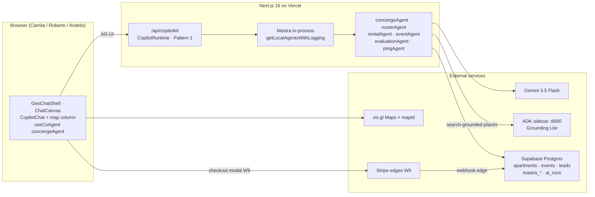

# mdeapp — Architecture (5-minute overview)

> 5-min onboarding for the new mdeai application. For depth, read [`/home/sk/mdeai/plan/prd.md`](../../plan/prd.md) and its 10 chunks under `plan/prd/`.  
> **Implementation order:** [`tasks/audit/22-task-order-audit.md`](../../tasks/audit/22-task-order-audit.md)

## 1. TL;DR

`mdeapp/` is a Next.js 16 (App Router + Turbopack + Tailwind v4 + React 19) **3-panel chat workspace** at **`/`**. CopilotKit **1.55.2** renders center **`CopilotChat`** + generative cards; Mastra (beta) runs agents in-process behind **`POST /api/copilotkit`** via **`getLocalAgentsWithLogging`**. Default product agent is **`conciergeAgent`** (`layout.tsx`). Gemini **3.5 Flash** + Supabase + ADK grounding sidecar (`:8000`) power search. **`/chat` redirects to `/`**.

**Phase 1 MVP slice:** Mindtrip chrome on `/` → rental/event cards + map pins → G2 lead modal → G1 ticket checkout → Roberto host wizard. Do not add legacy `ai-chat` edge or HttpAgent in the CopilotKit route.

## 2. System diagram



## 3. Data flow per surface

| Surface | Persona | Agent | Tools / workflows | Supabase / edges |
|---|---|---|---|---|
| **`/`** (canonical chat) | Camila / Tourist | **`conciergeAgent`** | `search_*`, `classify_intent`, workflows via router | `apartments`, `events`, `restaurants`, `mastra_*`, `ai_runs` |
| **`/chat`** | — | redirect → **`/`** | — | — |
| **`/login`** | All | none | auth only | `auth.users` |
| **`/host/event/new`** | Roberto | **`hostEventAgent`** (W3 — not built) | HITL publish tools | `events`, `approval_*` via F38 edge |
| **`/events/[slug]`** | Andrés | none — page | — | `events`, `event_tickets` (SCREEN-014) |
| **`/me/tickets`** | Andrés | none | — | `event_orders` (SCREEN-015) |
| **`/saved`**, **`/trips`** | Camila | memory tools (P2) | `save_place` | `saved_places`, `trips` (Phase 4) |
| **`/api/copilotkit`** | n/a | all registered agents | n/a | `ai_runs` via Pattern 1 logging |
| Lead modal (G2) | Camila | rentalAgent | — | **`chat-lead-capture` edge** (port pending) |
| Ticket checkout (G1) | Andrés | — | — | **`ticket-*` edges** (EVT-01 pending) |

**MVP note:** Camila's rental discovery lives on **`/`**, not a separate `/rentals` route (F41 deferred).

## 4. Registered Mastra agents (2026-05-24)

| Key | Role | UI wired |
|-----|------|----------|
| `conciergeAgent` | Default on `/` | ✅ `layout.tsx` + `map-ui-sync.tsx` |
| `routerAgent` | Intent classify + workflow dispatch | via concierge |
| `rentalAgent` | Rental search + workflow | F49 cards on `/` |
| `eventAgent` | Event discovery + workflow | generic render; F25 pending |
| `evaluationAgent` | Scorers (W8) | not prod |
| `pingAgent` | W1 echo / fallback | registered, not default |
| `hostEventAgent` | Roberto wizard | ❌ F34 |

Workflows: `rentalSearchWorkflow`, `eventDiscoveryWorkflow`, `conciergeRoutingWorkflow`.

## 5. Invariants (hard rules — break = revert)

1. **Agent name match.** `useCoAgent({ name })` = key in `Mastra({ agents })` = `<CopilotKit agent=` prop.
2. **Single pin writer.** Map pins from agent/generative UI path only (`MapContext.mergePins`) — PRD RUNTIME-008.
3. **Gemini only in production.** Model id **`gemini-3.5-flash`** (`src/mastra/lib/models.ts`).
4. **No service-role keys in `src/**`.** Edge functions only.
5. **CopilotKit pinned at 1.55.2.** No v1/v2 mix in one file.
6. **No HttpAgent / legacy ai-chat.** Mastra in-process only; ADK via HTTP sidecar from Mastra tools.
7. **Every Places call** includes `X-Goog-FieldMask` (MAP-004+). Every **AdvancedMarker** parent Map has **mapId**.
8. **Mindtrip map UX (MAP-030):** Lightweight `CategoryMapMarker` on the map; all photos and editorial UI in `SelectedPlaceOverlayCard` via `InfoWindow` — per [store locator best practices](https://developers.google.com/maps/solutions/store-locator/best-practices) and mde-maps [`maps-js-api.md`](../../.agents/skills/mde-maps/references/maps-js-api.md).

## 6. CopilotKit patterns (Phase 1)

| Pattern | Where | Task |
|---------|-------|------|
| `CopilotChat` center column | `chat-center-panel.tsx` | MAP-007B |
| `useCopilotAction` + `render` | `search-tool-renders.tsx` | F49 |
| `useCoAgent` map sync | `map-ui-sync.tsx` | F50 |
| `useCopilotAction` frontend tool | `focus-map-pin-action.tsx` | CK-003 partial |
| `renderAndWaitForResponse` | host publish | F37 (pending) |
| `ExperimentalEmptyAdapter` | `api/copilotkit/route.ts` | F02 |

**Dev debugging:** CopilotKit Inspector on **`/`** — see CK-006 in [`tasks/copilotkit/BACKLOG-ck-gaps.md`](../../tasks/copilotkit/BACKLOG-ck-gaps.md).

## 7. Mastra PR gate (MASTRA-005)

Run before merge when touching `src/mastra/**` or CopilotKit agent wiring:

```bash
cd mdeapp && npm run check:mastra
# Strict storage after prod Postgres is required:
MASTRA_REQUIRE_PG=1 npm run check:mastra
```

Script: [`scripts/check-mastra.mjs`](../scripts/check-mastra.mjs) — agent name match, CopilotKit 1.55.2 pin, deprecated Gemini ids, no service-role in client components, `getLocalAgentsWithLogging` in route. Local `:memory:` LibSQL is allowed until `MASTRA_REQUIRE_PG=1`.

**Local dev pool safety:** If `.env.local` sets `DATABASE_URL`, also set `MASTRA_DEV_LIBSQL=1` so Mastra thread memory uses in-memory LibSQL instead of the Supabase transaction pooler (avoids `EMAXCONN` after repeated `npm run dev` / HMR). Production and Vercel ignore `MASTRA_DEV_LIBSQL`; catalog tools still use anon Supabase JS.

### Auth + Mastra Studio (AUTH-010)

- **Product chat:** Supabase session cookies → `POST /api/copilotkit` → `getUser()` → Mastra `RequestContext` (Pattern 1). No Bearer token in the browser.
- **Mastra dev Studio (`:4111`):** localhost-only in dev; **never** expose `:4111` on the public internet without `@mastra/auth-supabase` ([Mastra server auth](https://mastra.ai/docs/server/auth/supabase)).
- **Catalog tools:** `search-rentals` / `search-events` / `search-attractions` / `search-restaurants` use **anon** Supabase JS (RLS), not `DATABASE_URL` or service role.

Event grounding phases (web discovery post-MVP): [`plan/events/event-grounding-architecture.md`](../../plan/events/event-grounding-architecture.md).

## 7. Where do I add X?

| Adding… | Location | Skill | Test |
|---|---|---|---|
| **A new agent** | `src/mastra/agents/<name>.ts` + `src/mastra/index.ts` | `mastra`, `copilotkit-integrations` | `npm test` |
| **A new tool** | `src/mastra/tools/<name>.ts` | `mastra`, `mde-supabase`, `mde-maps` | Vitest |
| **A new workflow** | `src/mastra/workflows/<name>.ts` | `mastra` | Studio `:4111` |
| **A new page** | `src/app/<route>/page.tsx` | `nextjs` | Playwright W3+ |
| **Chat chrome** | `src/components/chat/*` | `copilotkit-develop` | `smoke:map-pins` |
| **Edge function** | `mdeapp/supabase/functions/<slug>/` | `mde-supabase` | curl + MCP deploy |
| **New table** | migration + RLS | `mde-supabase` | MCP schema + RLS audit |

## 8. Test contract

`npm run floor` = lint → typecheck → build → test → audit (all exit 0).

**Baseline (2026-05-24):** **91/91** Vitest · `smoke:map-pins` · `smoke:f50-pin-sync` · `verify:grounding`.

E2E Playwright: W3+ at `mdeapp/e2e/`. Chrome-devtools MCP for visual workshop checks.

## 9. Pointers

- **Task index:** [`tasks/INDEX.md`](../../tasks/INDEX.md) · **Screen order:** [`tasks/INDEX-SCREEN-FIRST.md`](../../tasks/INDEX-SCREEN-FIRST.md)
- **Maps order:** [`tasks/maps/INDEX.md`](../../tasks/maps/INDEX.md)
- **Order audit:** [`tasks/audit/22-task-order-audit.md`](../../tasks/audit/22-task-order-audit.md)
- **PRD:** [`plan/prd.md`](../../plan/prd.md)
- **Project rules:** [`CLAUDE.md`](../../CLAUDE.md)
- **Legacy freeze:** [`/home/sk/mde/FREEZE.md`](../../../mde/FREEZE.md)
