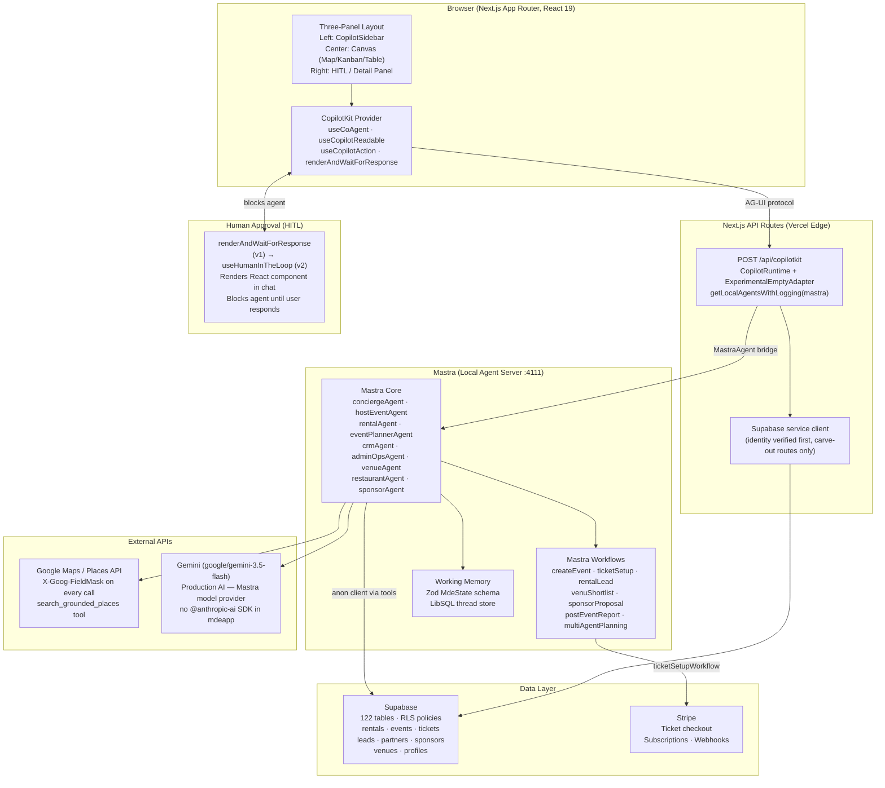

# mdeai AI-First Dashboard & Chat Platform Plan
### CopilotKit + Mastra Architecture Guide

> **Status:** Reference document — June 2026  
> **Audience:** Product, Engineering, AI leads  
> **Scope:** Replaces traditional dashboards across all mdeai product domains with AI-native UX

---

## 1. Executive Summary

**Best foundation:** `mastra-pm-canvas` — it is architecturally identical to mdeai's current stack (Mastra + CopilotKit v1 + `ExperimentalEmptyAdapter` + `getLocalAgentsWithLogging` + Zod `AgentStateSchema`). Everything in it can be applied directly without translation.

**Best AI dashboard architecture:** A **three-panel layout** — persistent AI chat sidebar (left) + main data canvas (center, adapts per route) + contextual action/detail panel (right). The chat sidebar reads page context via `useCopilotReadable` and can mutate state via `useCoAgent`. The right panel renders HITL approval cards and generative UI from agent tool calls.

| Decision | Answer |
|---|---|
| **Foundation repo** | `mastra-pm-canvas` (Score 97) |
| **Copy patterns from** | Travel Planner (maps), Strands CRM (HITL workflows), Chat-with-Data (analytics) |
| **Reference only** | Banking (v2 APIs to adopt in Phase 2), ADK Dashboard (Gemini sub-agent patterns) |
| **Defer** | Deep Agents, A2A Travel, Multi-Agent Canvas (Phase 2+) |
| **Avoid** | Any repo requiring Copilot Cloud or Python LangGraph for core Phase 1 features |

---

## 2. Ranked Repo Review Table

| Rank | Repo | URL | Purpose | Best mdeai Use Case | Core / Advanced | Score /100 | Grade | Decision |
|---:|---|---|---|---|---|---:|---|---|
| 1 | Mastra PM Canvas | https://github.com/CopilotKit/mastra-pm-canvas | Project management canvas with Mastra agent + CopilotKit v1 sidebar | Foundation for all Mastra + CopilotKit wiring | Core | 97 | A+ | **FOUNDATION** |
| 2 | Travel Planner | https://www.copilotkit.ai/examples/travel-planner | Map-first canvas, shared trip state, HITL, Google Maps from agent | Camila `/rentals` map — sidebar over full-screen map, AI pin placement | Core | 91 | A | **COPY PATTERN** |
| 3 | Strands CRM | https://github.com/CopilotKit/CopilotKit/tree/main/examples/showcases/strands-crm | Multi-page agentic CRM with kanban, quotes, HITL approval | Roberto event wizard HITL + CRM lead workflows for Patricia | Advanced | 82 | A- | **COPY PATTERN** |
| 4 | Banking | https://github.com/CopilotKit/CopilotKit/tree/main/examples/showcases/banking | Role-aware agent, rendered tool results, HITL card approval | v2 `useAgentContext` + `useFrontendTool` patterns for Phase 2 migration | Core | 78 | B+ | **REFERENCE ONLY** |
| 5 | ADK Generative Dashboard | https://github.com/CopilotKit/adk-generative-dashboard | Gemini ADK agent populating metric cards and charts | Patricia admin analytics panel; Gemini sub-agent composition patterns | Advanced | 74 | B | **REFERENCE ONLY** |
| 6 | Chat with Your Data | https://www.copilotkit.ai/examples/chat-with-your-data | `useCopilotReadable` + backend actions + theming | Patricia admin dashboard data Q&A, CSS variable theming | Core | 72 | B | **COPY PATTERN** |
| 7 | A2A Travel | https://github.com/CopilotKit/CopilotKit/tree/main/examples/showcases/a2a-travel | Agent-to-agent protocol, Gemini budget/weather agents, message flow viz | Phase 2 concierge → specialist agent routing | Advanced | 63 | C+ | **DEFER** |
| 8 | Deep Agents | https://github.com/CopilotKit/CopilotKit/tree/main/examples/showcases/deep-agents | Visible planning todos, file workspace, Python FastAPI + LangGraph | Multi-step wizard progress UI pattern only | Advanced | 55 | C+ | **DEFER** |
| 9 | Multi-Agent Canvas | https://github.com/CopilotKit/CopilotKit/tree/main/examples/showcases/multi-agent-canvas | Multi-agent routing, MCP config panel — requires Copilot Cloud | Phase 2 dynamic MCP server registration concept | Advanced | 48 | C | **DEFER** |
| 10 | Mastra PM Canvas (monorepo) | https://github.com/CopilotKit/CopilotKit/tree/main/examples/canvas/mastra-pm | Mirror of standalone — same code, slightly older | Cross-reference only — use standalone repo | Core | 45 | C | **AVOID** |

---

## 3. Best Repo by Product Domain

| mdeai Domain | Best CopilotKit Repo | URL | Why It Fits | Example Feature | Core / Advanced |
|---|---|---|---|---|---|
| **Real estate / rentals** | Travel Planner | https://www.copilotkit.ai/examples/travel-planner | Map-first canvas + shared state + HITL before confirming a property pin | Camila asks "find 2BR under $2k near Roma Norte" — agent places pins, user approves or refines | Core |
| **Events / ticketing** | Mastra PM Canvas | https://github.com/CopilotKit/mastra-pm-canvas | Kanban board + working memory + HITL — mirrors Roberto's `/host/event/new` wizard state machine | Roberto says "add a VIP tier at $150" — agent calls `add_ticket_tier`, HITL confirms, ticket card appears | Core |
| **Partners** | Strands CRM | https://github.com/CopilotKit/CopilotKit/tree/main/examples/showcases/strands-crm | Multi-page canvas with partner profile pages, deal stages, `STATE_SNAPSHOT` sync | Partner rep asks for onboarding proposal — agent generates deck, HITL to confirm before sending | Advanced |
| **Restaurants** | Chat with Your Data | https://www.copilotkit.ai/examples/chat-with-your-data | `useCopilotReadable` exposes restaurant data; backend action calls Places API | "Show me upscale Mexican restaurants near Polanco" — results render as generative cards | Core |
| **Cafes** | Chat with Your Data | https://www.copilotkit.ai/examples/chat-with-your-data | Same Places API pattern; `useCopilotReadable` exposes cafe hours/ratings | "Find a café with wifi open past 10pm in Condesa" — agent queries, renders filtered list | Core |
| **Nightclubs** | Travel Planner | https://www.copilotkit.ai/examples/travel-planner | Map-first discovery + HITL for adding to saved list | "Show nightclubs in La Roma open Fridays" — agent places pins on map, user taps to save | Core |
| **Venues** | Travel Planner + Strands CRM | https://www.copilotkit.ai/examples/travel-planner | Map pins for discovery + CRM-style shortlisting workflow with HITL | Venue shortlist for Roberto's event — map view + side panel of ranked venues with approval | Advanced |
| **Sponsors** | Strands CRM | https://github.com/CopilotKit/CopilotKit/tree/main/examples/showcases/strands-crm | Kanban pipeline + quote builder + `useHumanInTheLoop` for proposal confirmation | Sponsor account manager reviews AI-built proposal, approves before email is sent | Advanced |
| **CRM / leads** | Strands CRM | https://github.com/CopilotKit/CopilotKit/tree/main/examples/showcases/strands-crm | `useRenderTool` for inline lead cards, `STATE_SNAPSHOT`, deal stage mutations | Patricia opens leads dashboard — AI surfaces top 5 warm leads, one-click to move stage | Core |
| **Admin operations** | ADK Generative Dashboard + Chat-with-Data | https://github.com/CopilotKit/adk-generative-dashboard | Metric cards + charts populated by agent; `useCopilotReadable` for exception Q&A | Patricia asks "why did revenue drop Thursday?" — agent queries Supabase, renders chart inline | Advanced |
| **Maps / local discovery** | Travel Planner | https://www.copilotkit.ai/examples/travel-planner | Full-screen Google Maps + CopilotSidebar overlay, agent-driven pin placement | Tourist asks for "best tacos near Zócalo" — concierge places 5 ranked pins with ratings | Core |
| **Trips / itinerary** | A2A Travel | https://github.com/CopilotKit/CopilotKit/tree/main/examples/showcases/a2a-travel | Multi-agent trip plan: itinerary + restaurant + budget + weather specialists | Camila plans a weekend in Oaxaca — four specialist agents contribute one itinerary | Advanced |
| **Chat with data** | Chat with Your Data | https://www.copilotkit.ai/examples/chat-with-your-data | `useCopilotReadable` + backend data fetch actions + generative result rendering | "What were total event ticket sales last month?" — agent queries Supabase, answers inline | Core |
| **Multi-agent automation** | Multi-Agent Canvas + A2A Travel | https://github.com/CopilotKit/CopilotKit/tree/main/examples/showcases/multi-agent-canvas | Concurrent specialist agents with result merging and flow visualization | Post-event: analytics agent + CRM agent + marketing agent run in parallel, merge report | Advanced |

---

## 4. Traditional Dashboard vs AI-First Dashboard

| Area | Traditional Dashboard | AI-First CopilotKit Version | User Benefit |
|---|---|---|---|
| **Tables** | Static rows, manual filter/sort | `useCopilotReadable` exposes table data; user asks questions in natural language | Patricia asks "show only events with < 50% capacity sold" without touching a filter |
| **Forms** | User fills every field manually | Agent pre-fills from working memory + profile data; user reviews + confirms via HITL | Roberto opens event form — agent has already filled venue, date, and ticket tiers from prior chat |
| **Charts** | Static time-series, no explanation | Agent reads chart data, answers "why" questions, overlays annotations inline | "Why did rentals spike Tuesday?" — agent explains and highlights the anomaly |
| **Tasks / kanban** | Manual drag-drop, status updates | Agent mutates kanban state from chat commands + `useCoAgent` real-time sync | Camila says "move my Condesa lead to Viewing Scheduled" — board updates instantly |
| **CRM** | Manual notes, search, stage moves | Conversational lead enrichment, AI-suggested follow-ups, `useRenderTool` inline profiles | Lead card shows AI summary + suggested reply + one-click move to next stage |
| **Maps** | Static pin drop, manual search | Agent places pins from natural language query, HITL before saving to itinerary | "Find pet-friendly rentals near Coyoacán under $1,800" — pins appear, user swipes to approve |
| **Events** | Multi-form wizard, linear steps | HITL wizard where agent pre-fills each step and awaits Roberto's approval before proceeding | Roberto says "create a jazz night next Friday at 8pm" — agent fills entire draft, Roberto reviews |
| **Admin** | All rows, all alerts, manual triage | Agent surfaces only exceptions and P0 issues; user focuses on decisions not data scanning | Patricia sees: "3 payments failed, 1 event over-sold, 2 suspicious logins" — all actionable |
| **Sponsors** | Email + spreadsheet pipeline | Agentic proposal builder: AI researches sponsor, drafts proposal, HITL before sending | Agent researches brand fit, writes proposal, Patricia approves one-click send |
| **Search / discovery** | Keyword search + filters | Conversational discovery with intent understanding + generative result cards | "Romantic dinner spot, not too loud, takes reservations tonight" → ranked cards with map |
| **Notifications** | Chronological feed, all parity | Agent filters to what matters for your role; explains why each item needs attention | Roberto only sees: "Your event goes live in 2h — 3 actions needed" |
| **Reports** | Scheduled exports, static PDFs | Agent generates on-demand narrative reports + answers follow-up questions | "Generate last week's event performance report" — prose + charts + exportable in 10 seconds |

---

## 5. Core Feature Plan

| Feature | Description | Best Repo Pattern | Real-World Example | Priority |
|---|---|---|---|---|
| **AI chat sidebar** | Persistent `CopilotSidebar` on all dashboard routes; reads page context via `useCopilotReadable`; routes to correct specialist agent | Mastra PM Canvas — `CopilotSidebar` + `ExperimentalEmptyAdapter` | Camila on `/rentals` types "find 2BR in Condesa" — sidebar sends to `rentalAgent` which places map pins | P0 |
| **Three-panel dashboard layout** | Left: AI chat sidebar. Center: main data canvas (map / table / kanban). Right: contextual detail / HITL approval panel | Mastra PM Canvas layout + Banking right-panel pattern | Patricia on `/admin` — left chat asks questions, center shows KPIs, right panel shows flagged exception | P0 |
| **Generative cards** | `useCopilotAction(available:"disabled", render)` mirrors agent tool calls as inline UI cards in chat | Mastra PM Canvas `weatherTool` render + Strands CRM `useRenderTool` | Agent calls `search_rentals` → inline rental cards appear in chat with photos, price, map link | P0 |
| **AI-filled forms** | Agent pre-populates form fields via working memory; `useCopilotAction` + HITL confirmation before submit | Mastra PM Canvas working memory + Strands CRM HITL | Roberto opens `/host/event/new` — agent fills venue, date, capacity from previous chat context | P0 |
| **Event planner board** | Kanban board synced to `hostEventAgent` state via `useCoAgent`; chat commands mutate board | Mastra PM Canvas kanban + `useCoAgent` state sync | "Move Jazz Night to Confirmed" → board updates, ticket setup step unlocks | P0 |
| **Real estate lead assistant** | `rentalAgent` surfaces warm leads, suggests follow-ups, renders lead profile cards in chat | Strands CRM `useRenderTool` + `STATE_SNAPSHOT` | Patricia asks "which rental leads haven't been contacted in 7 days?" — 4 cards appear, one-click follow-up | P1 |
| **Venue finder** | `venueAgent` uses Places API + Supabase venue table; renders map pins + detail cards; HITL before shortlisting | Travel Planner map + Strands CRM shortlist pattern | Roberto asks "find a rooftop venue for 200 people in Polanco" — 5 pins placed, cards ranked by fit | P1 |
| **Restaurant / cafe / nightclub discovery** | `restaurantAgent` / `cafeAgent` / `nightlifeAgent` query Places API; render cards with hours, rating, photos | Chat with Your Data backend action + Travel Planner pins | Tourist asks "cozy café with wifi for 3 hours near Reforma" — 4 cards + map pins | P1 |
| **Sponsor CRM** | `sponsorAgent` tracks pipeline stages, AI-generates proposals, HITL before sending | Strands CRM full pattern | Patricia sees sponsor pipeline — AI highlights 2 hot prospects, one-click generates proposal | P2 |
| **Approval panels** | HITL via `renderAndWaitForResponse` (v1) — renders a React component in chat, blocks agent until user responds | Mastra PM Canvas + Travel Planner HITL | Roberto finalizes event — approval panel shows full event summary, "Publish" or "Edit" buttons | P0 |
| **Chat with data** | `useCopilotReadable` exposes Supabase query results; agent answers analytical questions inline | Chat with Your Data — `useCopilotReadable` + backend action | "How many tickets sold for each event last week?" — bar chart + prose answer in chat | P1 |
| **Admin exception summary** | `adminOpsAgent` queries anomaly signals, surfaces top N issues by severity; no noise | ADK Dashboard + Chat-with-Data pattern | Patricia opens `/admin` — agent shows: "2 failed payments, 1 oversold event, 1 high churn venue" | P1 |

---

## 6. Advanced Feature Plan

| Advanced Feature | Description | Best Repo Pattern | Real-World Example | When to Build |
|---|---|---|---|---|
| **Multi-agent canvas** | Multiple specialist agents run concurrently; results merge into single canvas view | Multi-Agent Canvas routing + A2A Travel orchestration | Roberto planning a festival: event agent + venue agent + marketing agent collaborate in one session | Phase 2 / W10+ |
| **Deep agents** | Agent creates visible plan (todo list), executes each step with status, shows intermediate results | Deep Agents — visible planning todos + `ToolCard` generative UI | "Plan our Q3 event calendar" — agent shows 8-step plan, executes each, shows results step by step | Phase 2 |
| **MCP apps** | Dynamic MCP server registration; tools loaded at runtime from third-party MCP endpoints | Multi-Agent Canvas MCP config panel | Connect a Typeform MCP for lead intake or a Mailchimp MCP for campaign execution | Phase 2 |
| **A2A travel planning** | Cross-framework agent-to-agent protocol: Mastra routes to specialist ADK/Gemini agents for sub-tasks | A2A Travel — orchestrator + heterogeneous specialist agents | Tourist plans Oaxaca weekend: Mastra concierge routes to ADK weather agent + restaurant agent | Phase 2 |
| **Automated sponsor outreach** | Agent researches sponsor brand fit, drafts personalized proposal, HITL approval, sends via integrated email | Strands CRM automated enrichment + HITL proposal flow | Agent identifies 3 sponsor fits from event attendance data, drafts 3 proposals, Patricia approves | Phase 2 |
| **Post-event reports** | `postEventAgent` collects ticket data, attendance, revenue, NPS; generates narrative report in one command | ADK Dashboard metric collection + Chat-with-Data narrative | "Generate Jazz Night report" → full PDF-ready report with charts, revenue, top 5 feedback themes | Phase 2 |
| **AI campaign generation** | `marketingAgent` generates event promotion copy, social posts, email sequences from event details | Strands CRM `generate_weekly_report` pattern | Roberto publishes event → agent auto-generates Instagram caption + email campaign + WhatsApp blast | Phase 2 |
| **WhatsApp / CRM automation** | Webhook-triggered workflow: incoming lead via WhatsApp → CRM enrichment → AI draft reply → HITL send | Strands CRM automation + Mastra workflow trigger | Lead texts "interested in venue for 300 people" → agent qualifies, drafts reply, Patricia approves | Phase 2 |
| **Personalized recommendations** | Agent builds user preference model from interaction history; proactively surfaces relevant venues/events | ADK Dashboard `before_model_callback` state injection | Camila returns to app — agent leads with "Based on your searches: new jazz venue in Roma just listed" | Phase 2 |
| **Agent-to-agent handoff** | `routerAgent` hands off mid-conversation to specialist agent with full context preserved in working memory | A2A Travel orchestration + Mastra `routerAgent` existing pattern | Camila starts in chat, asks about an event → concierge hands off to `eventPlannerAgent` seamlessly | Phase 2 |

---

## 7. Mastra Agents Recommendation

| Agent | Purpose | Tools Needed | Domains Served | Core / Advanced |
|---|---|---|---|---|
| **routerAgent** | Classifies user intent, routes to correct specialist agent, preserves context in handoff | `classify_intent`, `route_to_agent`, working memory read | All domains — entry point | Core |
| **conciergeAgent** *(exists)* | General discovery assistant for chat surface; maps, recommendations, Q&A | `search_grounded_places`, `search_rentals`, `search_events`, working memory | Maps, restaurants, cafes, nightlife, events, rentals | Core |
| **eventPlannerAgent** | Full event planning: venue shortlist, ticket setup, co-host invites, HITL publish | `search_venues`, `create_event_draft`, `add_ticket_tier`, `set_co_hosts`, `preview_and_publish` (HITL) | Events, venues, ticketing | Core |
| **hostEventAgent** *(exists)* | Roberto's `/host/event/new` HITL wizard agent | `set_event_basics`, `set_venue`, `add_ticket_tier`, `preview_and_publish` | Events, ticketing | Core |
| **ticketingAgent** | Manages ticket inventory, pricing rules, promo codes, waitlist | `get_ticket_inventory`, `update_pricing`, `create_promo_code`, `manage_waitlist` | Ticketing, events | Core |
| **rentalAgent** *(exists)* | Rental search, lead capture, inquiry drafting for Camila | `search_rentals`, `get_rental_details`, `submit_inquiry`, working memory | Real estate, rentals | Core |
| **venueAgent** | Venue discovery, shortlisting, capacity/availability check, Places API enrichment | `search_venues`, `get_venue_details`, `check_availability`, `shortlist_venue` (HITL) | Venues, events, nightlife | Core |
| **restaurantAgent** | Restaurant discovery, reservations inquiry, hours/rating from Places API | `search_restaurants`, `get_restaurant_details`, `check_hours`, `suggest_alternatives` | Restaurants, tourism | Core |
| **cafeAgent** | Café discovery with wifi/seating/hours filters; neighborhood clustering | `search_cafes`, `filter_by_amenity`, `get_neighborhood_clusters` | Cafes, remote work, tourism | Core |
| **nightlifeAgent** | Nightclub/bar discovery, event nights, dress code, cover charge info | `search_nightlife`, `get_event_nights`, `check_cover`, `search_nearby` | Nightclubs, bars, tourism | Core |
| **partnerAgent** | Partner onboarding, profile enrichment, contract stage tracking, document generation | `get_partner_profile`, `update_partner_stage`, `generate_onboarding_doc`, `send_welcome` (HITL) | Partners, CRM | Advanced |
| **sponsorAgent** | Sponsor pipeline management, proposal generation, brand-fit scoring, outreach HITL | `score_brand_fit`, `generate_proposal`, `update_sponsor_stage`, `send_proposal` (HITL) | Sponsors, marketing | Advanced |
| **crmAgent** | Lead qualification, follow-up scheduling, contact enrichment, pipeline visibility | `get_leads`, `qualify_lead`, `schedule_followup`, `enrich_contact`, `move_stage` | CRM, sales, admin | Core |
| **adminOpsAgent** | Exception surfacing, anomaly detection, cross-domain health check, daily digest | `get_payment_failures`, `get_capacity_alerts`, `get_auth_anomalies`, `summarize_exceptions` | Admin operations | Core |
| **analyticsAgent** | On-demand data Q&A, chart generation, trend explanation, export | `query_supabase`, `generate_chart`, `explain_trend`, `export_report` | Admin, events, rentals, all | Advanced |
| **mapsAgent** | Geographic clustering, heat maps, travel time, place ranking from user context | `cluster_places`, `get_travel_time`, `rank_by_proximity`, `generate_heatmap` | Maps, all discovery domains | Advanced |
| **marketingAgent** | Campaign copy generation, social post creation, email sequence drafting, HITL review | `generate_campaign_copy`, `create_social_posts`, `draft_email_sequence`, `approve_campaign` (HITL) | Marketing, events, partners | Advanced |
| **automationAgent** | Trigger-driven workflows: webhooks → enrich → act → notify; multi-step orchestration | `trigger_workflow`, `enrich_data`, `send_notification`, `log_action` | Automation, CRM, admin | Advanced |

---

## 8. Mastra Workflows Recommendation

| Workflow | Steps | Output | Domains Served | Core / Advanced |
|---|---|---|---|---|
| **createEventWorkflow** | 1. Validate event basics → 2. Search + shortlist venue → 3. Set ticket tiers → 4. HITL preview → 5. Publish to Supabase → 6. Trigger marketing | Published event record + ticket tiers in DB + confirmation to Roberto | Events, ticketing, venues | Core |
| **ticketSetupWorkflow** | 1. Parse ticket tier request → 2. Validate capacity vs venue → 3. Set pricing + promo rules → 4. HITL confirm → 5. Create Stripe price objects → 6. Activate tiers | Live ticket tiers with Stripe payment links | Ticketing, events, payments | Core |
| **rentalLeadWorkflow** | 1. Capture inquiry → 2. Enrich lead from Supabase profile → 3. Score fit vs rental criteria → 4. Draft reply → 5. HITL approve → 6. Log in CRM | Qualified lead with AI-drafted response in CRM, lead score | Real estate, CRM | Core |
| **venueShortlistWorkflow** | 1. Parse requirements (capacity, location, type) → 2. Places API search → 3. Supabase venue table match → 4. Score + rank → 5. Present top 5 (HITL) → 6. Save shortlist | Shortlisted venues with scores in working memory + displayed on map | Venues, events | Core |
| **restaurantDiscoveryWorkflow** | 1. Parse intent + constraints → 2. Places API search with FieldMask → 3. Filter by hours/rating → 4. Rank by user preference → 5. Render cards + map pins | Ranked restaurant cards with photos, hours, Google rating | Restaurants, tourism, chat | Core |
| **partnerOnboardingWorkflow** | 1. Receive partner application → 2. Enrich business profile → 3. Score partner fit → 4. Generate welcome doc → 5. HITL approval → 6. Create partner record → 7. Send welcome | Partner record in Supabase + onboarding email sent | Partners, admin | Advanced |
| **sponsorProposalWorkflow** | 1. Identify sponsor opportunity → 2. Research brand fit → 3. Pull event audience data → 4. Generate proposal deck → 5. HITL review → 6. Send via email integration → 7. Log outreach | Personalized proposal sent + CRM stage updated | Sponsors, marketing | Advanced |
| **crmLeadQualificationWorkflow** | 1. New lead trigger → 2. Enrich from Supabase + Places API → 3. Score (budget, timeline, fit) → 4. Route to correct owner → 5. AI-draft first touch → 6. HITL send | Qualified lead with score, owner assigned, first message drafted | CRM, sales, admin | Core |
| **adminExceptionWorkflow** | 1. Scheduled trigger (hourly) → 2. Query payment failures → 3. Check event over-capacity → 4. Check auth anomalies → 5. Rank by severity → 6. Surface to Patricia | Daily exception digest: top N issues with severity + recommended action | Admin operations | Core |
| **salesInsightWorkflow** | 1. Pull revenue data (Stripe + Supabase) → 2. Compute period-over-period trends → 3. Identify top/bottom performers → 4. Generate narrative → 5. Render chart + text in chat | Revenue narrative + chart in Patricia's admin chat | Admin, events, rentals | Advanced |
| **marketingCampaignWorkflow** | 1. Event published trigger → 2. Extract event metadata → 3. Generate copy variations (social, email, WhatsApp) → 4. HITL approve → 5. Schedule/send via integrations | Campaign copy approved + published across channels | Marketing, events, partners | Advanced |
| **postEventReportWorkflow** | 1. Event ends trigger → 2. Pull ticket sales, attendance, revenue → 3. Fetch NPS/feedback → 4. Compute benchmarks → 5. Generate narrative report → 6. Export PDF | Full event performance report with charts + narrative in admin | Admin, events, analytics | Advanced |
| **multiAgentPlanningWorkflow** | 1. Complex request received → 2. Router decomposes into sub-tasks → 3. Spawn specialist agents in parallel → 4. Collect partial results → 5. Merge + synthesize → 6. Present unified plan | Unified plan from N agents with attribution per section | All domains — Phase 2 | Advanced |

---

## 9. Recommended Architecture

**Ownership summary:**

| Concern | Owner | Key API |
|---|---|---|
| **UI rendering** | Next.js App Router + CopilotKit React | `CopilotSidebar`, `useCoAgent`, `useCopilotAction` |
| **Agent logic** | Mastra (`src/mastra/agents/`) | `Agent`, `createStep`, `Workflow`, working memory |
| **Database truth** | Supabase (122 tables, RLS-tight) | `createClient()` (anon) · service client (carve-out routes only) |
| **Payments** | Stripe + Mastra ticketSetupWorkflow | `price.create`, `checkout.session`, webhook handlers |
| **Maps / places** | Google Maps Platform + `mapsAgent` | Places API New + `X-Goog-FieldMask` + `mapId` on every `<Map>` |
| **Human approvals** | `renderAndWaitForResponse` (CopilotKit v1) | Renders React HITL card in chat; returns `respond(value)` to unblock |

---

## 10. Phased Implementation Plan

| Phase | Goal | Repos Used | Deliverables | Success Test |
|---:|---|---|---|---|
| **1. Foundation** | Three-panel layout shell wired to Mastra | Mastra PM Canvas | `ThreePanelLayout` component · `CopilotSidebar` persistent on all dashboard routes · `useCopilotReadable` for page context | `npm run dev` boots clean; sidebar opens on `/chat`; conciergeAgent responds |
| **2. AI chat shell** | Working chat with routing to specialist agents | Mastra PM Canvas + Chat-with-Data theming | `routerAgent` classifies intent · CSS variable theming matching DESIGN.MD · agent name shown in chat header | Chat on `/` routes correctly to `rentalAgent` vs `eventPlannerAgent` vs `conciergeAgent` |
| **3. Events dashboard** | Roberto's full event creation + kanban | Mastra PM Canvas kanban + Strands CRM HITL | `hostEventAgent` HITL wizard · `EventKanbanBoard` synced via `useCoAgent` · `createEventWorkflow` end-to-end | Roberto creates event from chat; event appears on `/host/events` kanban; ticket tiers in Stripe |
| **4. Real estate dashboard** | Camila's rental search + map + lead intake | Travel Planner map pattern | `rentalAgent` on `/rentals` · map pins from agent tool calls · `rentalLeadWorkflow` → CRM | Camila searches "2BR Condesa" in chat; map shows 5 pins; inquiry submits to CRM |
| **5. Venues / restaurants / cafes / nightlife** | Discovery surface for all hospitality domains | Travel Planner pins + Chat-with-Data cards | `venueAgent` · `restaurantAgent` · `cafeAgent` · `nightlifeAgent` · Places API with FieldMask | Tourist asks for "jazz café in Roma" → 4 cards + map pins; no Places API calls without FieldMask |
| **6. CRM + partners** | Patricia's leads pipeline + partner onboarding | Strands CRM full pattern | `crmAgent` on `/admin/leads` · `rentalLeadWorkflow` · `partnerOnboardingWorkflow` | Patricia moves lead stage from chat; partner onboarding doc generated; HITL send confirmed |
| **7. Sponsors** | Sponsor pipeline + AI proposal generation | Strands CRM proposal flow | `sponsorAgent` · `sponsorProposalWorkflow` · HITL approve before send | Agent generates sponsor proposal from event data; Patricia approves; proposal logged in CRM |
| **8. Admin operations** | Patricia's exception surface + data Q&A | ADK Dashboard patterns + Chat-with-Data | `adminOpsAgent` on `/admin` · `adminExceptionWorkflow` (hourly) · Supabase data Q&A via `useCopilotReadable` | Patricia opens `/admin`; sees top 3 exceptions; asks "why did revenue drop?" → chart + explanation |
| **9. Chat with data** | Full analytics Q&A across all domains | Chat-with-Data `useCopilotReadable` + backend action | `analyticsAgent` · `salesInsightWorkflow` · `postEventReportWorkflow` | "Show ticket sales for all events last month" → grouped bar chart + prose in chat |
| **10. Advanced multi-agent** | Parallel specialist agents + A2A handoff | Multi-Agent Canvas + A2A Travel | `multiAgentPlanningWorkflow` · Phase 2 `useAgentContext` migration · MCP server registration panel | Complex request decomposes to 3 parallel agents; results merge; attribution shown per section |

---

## 11. Risks and Blockers

| Risk | Severity | Why It Matters | Fix |
|---|---|---|---|
| **Wrong foundation repo** | Critical | Choosing a v2 or Python-LangGraph-first repo wastes all implementation work when mdeai is on Mastra + CopilotKit v1 | Foundation = `mastra-pm-canvas` only; verify with `CopilotKit/` monorepo clone at `examples/integrations/mastra/` |
| **Mixing too many frameworks** | High | ADK + LangGraph + Mastra + Strands in same Phase 1 sprint creates incompatible runtime assumptions | Phase 1: Mastra only. Phase 2: expand via A2A protocol with clear boundary |
| **CopilotKit version mismatch** | High | v2 APIs (`useHumanInTheLoop`, `useFrontendTool`, `useAgentContext`) are not backward-compatible with v1; mixing breaks runtime | Pin at `1.55.2` for Phase 1; track v2 migration as a named Phase 2 task; `LESSONS.md` hook guards this |
| **Overbuilding multi-agent before MVP** | High | `multiAgentPlanningWorkflow` and A2A travel are Phase 2 scope; building them now delays Andrés's ticket purchase and Camila's rental search | Gate multi-agent behind Phase 2 Linear label; current Cycle 1 = Phase 1 only |
| **AI hallucinated data** | High | Agent answers data questions from working memory that may be stale; users trust it and act on wrong info | All analytics Q&A must go through live Supabase query tools, not working memory; `useCopilotReadable` pulls fresh data |
| **Missing approval gates** | High | Agent mutates Supabase records (events, leads, sponsorproposals) without HITL; irreversible changes slip through | Every destructive or outward-facing tool call must use `renderAndWaitForResponse`; wire into `.claude/hooks/` |
| **Weak auth / RLS** | Critical | Service role key in client code → any user reads all rows; no RLS policy → data leaks across tenants | `no-service-role-in-src.mjs` hook must stay active; every new table needs RLS + ≥1 policy before merge |
| **Poor Supabase schema mapping** | Medium | Agent tools operate on stale or wrongly-typed table columns; queries return empty or error silently | Before any new agent tool touches a table, run `list_tables` + `execute_sql` to verify schema; add Zod validation at tool boundary |
| **Stripe payment risk** | High | Ticket creation workflow triggers Stripe price objects before Roberto approves; double-charges or orphan prices | `ticketSetupWorkflow` must HITL before any `price.create` call; Stripe idempotency keys on all checkout sessions |
| **Maps cost risk** | High | Places API New charges per field returned; agent tools that omit `X-Goog-FieldMask` burn budget silently | Every `search_grounded_places` and Places API call must include `X-Goog-FieldMask`; hook `maps-field-mask-check.mjs` guards this |
| **Slow UI from agent roundtrips** | Medium | Multi-step agent workflows block chat UI for 8-12 seconds; users think app is broken | Use streaming (`useCoAgent` incremental state updates); show skeleton cards during tool calls; set 30s Mastra tool timeout |
| **No test proof of Done** | High | Tasks flip Done without `npm run dev` boot proof or Playwright e2e coverage; issues reach prod | Anti-fake-done checklist (gate 9) required for every task; Playwright spec per new route before Done status |

---

## 12. Final Recommendation

### Best foundation repo
**`mastra-pm-canvas`** — the only repo in the list that uses Mastra + CopilotKit v1 + `ExperimentalEmptyAdapter` + `getLocalAgentsWithLogging`. mdeai's runtime wiring is already identical. It should be the primary reference for every new agent, route, and layout component built in Phase 1.

### Best repo per mdeai domain

| Domain | Repo |
|---|---|
| Events + ticketing | Mastra PM Canvas (kanban + HITL) |
| Rentals + real estate | Travel Planner (map canvas + sidebar) |
| Venues + discovery | Travel Planner + Chat-with-Data |
| Restaurants / cafes / nightlife | Chat-with-Data (Places API cards) |
| CRM + leads + partners | Strands CRM (pipeline + render tool) |
| Sponsors | Strands CRM (proposal HITL flow) |
| Admin ops + analytics | ADK Dashboard + Chat-with-Data |
| Maps / local AI | Travel Planner (map-first layout) |
| Multi-agent (Phase 2) | A2A Travel + Multi-Agent Canvas |

### Best MVP scope (Phase 1, Cycles 1–2)
1. Three-panel layout shell with `CopilotSidebar` persistent on all routes
2. `conciergeAgent` routing via `routerAgent` for intent classification
3. Roberto's `hostEventAgent` HITL event wizard (`/host/event/new`)
4. Camila's `rentalAgent` + map pins on `/rentals`
5. Patricia's `adminOpsAgent` exception surface on `/admin`
6. `crmLeadQualificationWorkflow` for rental inquiries

### Best advanced scope (Phase 2, W10+)
- `multiAgentPlanningWorkflow` with parallel specialist agents
- CopilotKit v2 migration (`useHumanInTheLoop`, `useFrontendTool`, `useAgentContext`)
- A2A protocol for heterogeneous agent frameworks (Mastra + ADK Gemini)
- MCP server registration panel for dynamic tool composition
- `sponsorProposalWorkflow` with email integration

### What not to build yet
- Any Copilot Cloud dependency (Multi-Agent Canvas requires it)
- Python LangGraph agents — Phase 1 is Mastra TypeScript only
- `@anthropic-ai/sdk` — production AI is Gemini only per hard rule
- Spanish i18n — Phase 2 (W7+), currently a regression
- `marketingCampaignWorkflow` with external send — HITL approval required, Phase 2

### Exact next 10 implementation tasks

| # | Task | Linear Label | Done When |
|---|---|---|---|
| 1 | Extract `ThreePanelLayout` shell component with slot props for sidebar / canvas / detail | phase:launch | All 3 panels render on `/admin`, `/rentals`, `/host/event/new` |
| 2 | Add `useCopilotReadable` to every dashboard route with page-specific context object | phase:launch | Agent responds with page-aware answers on each route |
| 3 | Wire `routerAgent` to classify intent and hand off to specialist agent with working memory preserved | phase:launch | "Find an apartment" routes to `rentalAgent`; "create event" routes to `hostEventAgent` |
| 4 | Build `venueShortlistWorkflow` (Places API → Supabase match → rank → HITL) | phase:mvp | Roberto asks for venue → 5 ranked pins on map → HITL confirms shortlist |
| 5 | Build `rentalLeadWorkflow` (inquiry → enrich → score → draft reply → HITL → CRM) | phase:mvp | Rental inquiry triggers workflow; Patricia sees qualified lead in CRM with AI draft reply |
| 6 | Implement `adminOpsAgent` exception digest on `/admin` | phase:mvp | Patricia opens `/admin`; sees top 3 P0 issues; no noise |
| 7 | Add `useCopilotReadable` data Q&A on `/admin` analytics panel | phase:mvp | "What were last week's ticket sales?" → chart + prose in 3 seconds |
| 8 | Build `crmAgent` stage-move commands via chat on `/admin/leads` | phase:mvp | "Move Camila González to Viewing Scheduled" → lead card updates in Supabase |
| 9 | Add Playwright e2e spec for Roberto's full event creation HITL flow | phase:launch | Test passes on `npm run dev`; event exists in Supabase after test run |
| 10 | Audit all existing agent tools for missing `X-Goog-FieldMask` + HITL on destructive calls | phase:launch | `maps-field-mask-check.mjs` hook passes; no destructive tool call lacks HITL |

---

*Last updated: June 2026 — cross-reference [`ARCHITECTURE.md`](../ARCHITECTURE.md), [`DESIGN.MD`](../../DESIGN.MD), [`sitemap.md`](../../sitemap.md), and [`LESSONS.md`](../../LESSONS.md) before implementing any section.*
