# AI-Native Marketplace & Event Operating System
### Design Plan — CopilotKit + Mastra
> **Status:** Architecture Design Document — June 2026  
> **Audience:** Founders, Product, Engineering, AI leads  
> **Vision:** Replace filter-and-search marketplaces with intent-driven AI operating systems

---

## 1. Executive Summary

### Why Traditional Marketplaces Are Becoming Outdated

Traditional marketplaces (Eventbrite, Airbnb, OpenTable, Yelp) were built for a world where users search with keywords and scroll through lists. They assume users know exactly what they want, can handle complex filters, and will patiently read through dozens of options. This model creates friction at every step: discovery is slow, booking is multi-step, supply management requires manual data entry, and analytics are static exports.

The result: **attendees spend 45 minutes finding an event they might like. Hosts spend 3 hours creating a listing. Venue owners manually track bookings in spreadsheets. Sponsors guess at ROI.**

### Why AI-Native Marketplaces Are Superior

An AI-native marketplace replaces the search-filter-click model with a conversation. The user states intent in natural language. The AI understands context (history, preferences, budget, social graph), builds a plan, and executes — booking, recommending, notifying, and managing on the user's behalf.

For supply-side users (hosts, venues, restaurants), AI removes the operational burden. A venue owner says "I have Saturday open for events between 100-300 people" and the AI generates the listing, finds matching events, drafts proposals, and tracks responses — all without touching a form.

### Why CopilotKit + Mastra Is the Competitive Advantage

| Layer | Tool | Why It Wins |
|---|---|---|
| **UI / Chat** | CopilotKit | Generative UI renders booking cards, approval panels, and data charts directly in chat — no page navigation required |
| **Agent orchestration** | Mastra | TypeScript-native agents with Zod-typed working memory, tool calling, and multi-step workflows that survive conversation restarts |
| **State sync** | `useCoAgent` | Agent state is a live React value — the kanban board, map pins, and lead pipeline all update as the agent works, with zero polling |
| **HITL** | `renderAndWaitForResponse` | Any destructive action (publish event, send proposal, charge card) pauses for human approval with a rendered UI component — not a text prompt |
| **Memory** | Mastra LibSQL + RAG | Agents remember cross-session context: Roberto's event preferences, Camila's neighborhood history, Patricia's exception patterns |

### How This Platform Differs from Incumbents

| Platform | Traditional Experience | AI-Native Experience |
|---|---|---|
| **Eventbrite** | Fill 12-field form to create event; search by keyword + date filter; static analytics dashboard | Say "create a jazz night for 150 people next Friday" — agent fills all fields, suggests venue, sets ticket tiers, publishes in one HITL approval |
| **Luma** | Beautiful UI but still form-based; no CRM; no sponsor tools; limited analytics | Guest list becomes a living CRM; AI suggests follow-ups; sponsor matching is automated; post-event report generated instantly |
| **Airbnb** | Browse photos, read reviews, send message, wait; host manages calendar manually | "Find a furnished apartment near the office under $1,200" — AI shortlists 5 options, books a viewing, tracks inquiry status, nudges unresponsive hosts |
| **OpenTable** | Search by cuisine + date + party size; call if unavailable; no relationship memory | "Romantic dinner Friday for 2, not too loud" — AI understands vibe, books automatically, remembers you prefer outdoor seating |
| **Yelp** | Search → list → reviews → call → done | "Best craft cocktail bar in Roma that's open past 2am tonight" — agent checks hours, shows map pin, books a table if available |
| **Eventbrite (Sponsor)** | No sponsor tools at all | AI identifies brand-fit events, generates proposal, tracks sponsor ROI post-event — full pipeline in one workspace |
| **Peerspace** | Filter by capacity + type; static pricing; no smart matching | Agent matches venue to event requirements (catering, AV, parking), negotiates package, generates rental agreement draft |
| **Fever** | Curated content, no personalization memory | Agent learns taste profile across events attended, proactively surfaces relevant events before user asks |
| **Partiful** | Social-first but no operational AI | Guest RSVP triggers automatic waitlist management, dietary collection, reminder sequence — zero manual work for host |
| **Meetup** | Group-based discovery, no AI, stale groups | Agent monitors professional interests, finds relevant meetups, proposes new ones, finds co-organizers |

---

## 2. User Types

| User Type | Goals | Pain Points | AI Improvements |
|---|---|---|---|
| **Event attendee** | Find relevant events, book fast, not miss out | Endless browsing, sold-out surprises, no personalization | AI learns taste, proactively suggests events, auto-joins waitlist, reminds 2h before |
| **Tourist** | Discover local experiences, plan itinerary, avoid tourist traps | Language barrier, information overload, unreliable reviews | Concierge agent builds full day plan from a single sentence, local-verified recommendations |
| **Digital nomad** | Find coworking cafes, monthly rentals, professional events | Slow apartment search, no short-term options, context-switching between apps | Single interface: apartment search + cafe finder + networking events + long-stay booking |
| **Local resident** | Discover neighborhood events, support local venues, find deals | Fragmented apps (Yelp + Eventbrite + Airbnb), no cross-platform context | One AI that knows neighborhood, regular haunts, weekly patterns — proactive suggestions |
| **Event host (Roberto)** | Create great events, sell out, manage attendees, grow audience | 3-hour listing process, manual ticket tiers, no post-event analytics, sponsor outreach is cold email | Agent creates event from one paragraph, handles ticketing, sends smart reminders, generates post-event report |
| **Rental host** | Maximize occupancy, qualify leads, minimize no-shows | Screening inquiries manually, scheduling viewings by DM, tracking leads in spreadsheets | Agent qualifies leads, schedules viewings, drafts lease intro, follows up automatically |
| **Venue owner** | Maximize booking rate, attract right events, set correct pricing | Calendar management, pricing guesswork, no demand forecasting | Agent manages availability, suggests dynamic pricing, proactively finds events that match venue capacity |
| **Restaurant** | Fill tables, promote events, capture repeat customers | OpenTable fees, no relationship data, promotion is random social posts | Agent fills slow nights with targeted promotions, learns regulars, generates personalized re-engagement |
| **Cafe** | Attract digital nomads, promote daily specials, build community | No discovery surface for nomads, daily specials buried in social | Agent surfaces cafe to nomads searching for wifi + quiet + outlets in the right neighborhood |
| **Nightclub** | Fill capacity every night, sell VIP tables, manage guest list | Guestlist is a spreadsheet, VIP management is WhatsApp threads, promo is expensive | Agent manages guestlist, pre-sells VIP via conversational booking, automates promo to right audience |
| **Sponsor** | Find brand-fit events, measure ROI, scale sponsorships | Cold email discovery, manual ROI tracking, no centralized pipeline | AI identifies brand-fit events, generates proposals, tracks impressions + conversions post-event |
| **Partner** | List services, find clients, grow revenue | Generic directory listing, no lead routing, competing for attention | AI matches partner to host/venue needs, generates service proposal, routes qualified inquiries |
| **Service provider** | Find events to service (catering, AV, photography) | No dedicated marketplace, word-of-mouth only, seasonal demand | Agent matches provider to event requirements, sends automated quote requests, tracks acceptance rate |

---

## 3. AI-Native Dashboard Vision

| Capability | Traditional Platform | AI-Native Platform |
|---|---|---|
| **Discovery** | Keyword search + date/category filters → paginated list | Natural language intent → ranked recommendations with explanation → generative cards with photos + map |
| **Booking** | Click listing → fill form → enter payment → confirm email | "Book it" in chat → HITL approval card shows summary → Stripe charges → calendar invite sent |
| **Event creation** | 12-field form across 4 pages, manual ticket setup | One paragraph in chat → agent fills all fields → HITL preview → publish with one click |
| **Lead management** | CRM is a separate app; manual stage moves; no AI scoring | Lead cards appear in chat with AI score; one-click to move stage; agent suggests follow-up text |
| **Analytics** | Static chart dashboard; export to CSV; wait for monthly report | Ask any question in chat; agent queries live data; chart renders inline; "why did revenue drop?" answered with context |
| **Venue management** | Manual calendar; pricing set once; no demand signals | Agent manages availability; suggests dynamic pricing based on demand; auto-proposes to matching events |
| **Sponsor matching** | No tools; cold email; guess at brand fit | Agent scores event-sponsor fit; generates proposal; tracks response; reports ROI post-event |
| **Recommendations** | Static "similar events" sidebar | Agent learns cross-session preferences; proactive push before user asks; ranked by predicted enjoyment |
| **Notifications** | All notifications, chronological | Agent filters to what matters for your role; explains why each item needs attention; suggested action per item |
| **Task management** | Separate to-do app; no connection to platform data | Agent creates tasks from conversation; marks done when workflow completes; surfaces blockers |
| **Multi-step workflows** | User manually executes each step in sequence | Agent executes workflow steps autonomously; HITL only at decision gates; status shown in chat as progress cards |
| **Memory** | Platform forgets you after session | Agent remembers neighborhood preference, budget, past events, regular venues — context grows over time |

---

## 4. Three-Panel Layout

### Desktop Layout

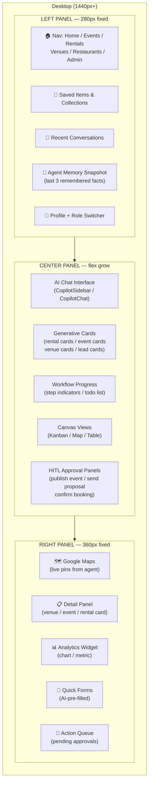

### Tablet Layout (768px–1024px)

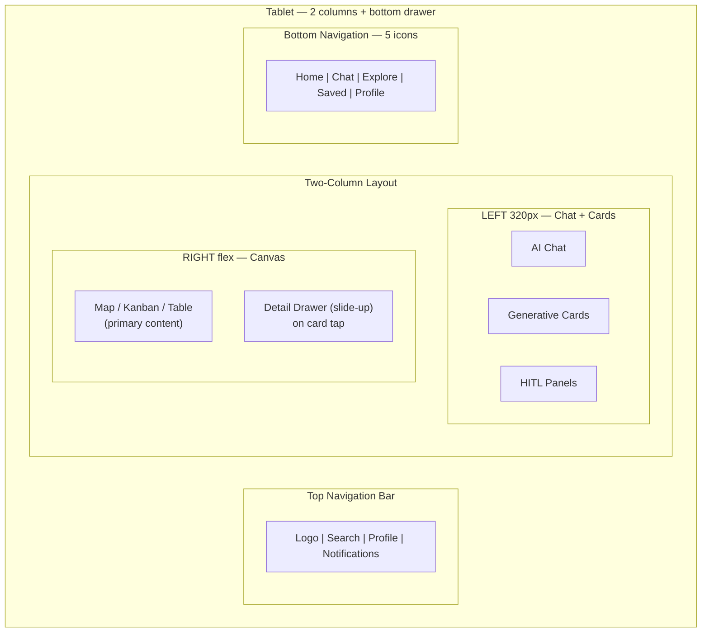

### Mobile Layout (< 768px)

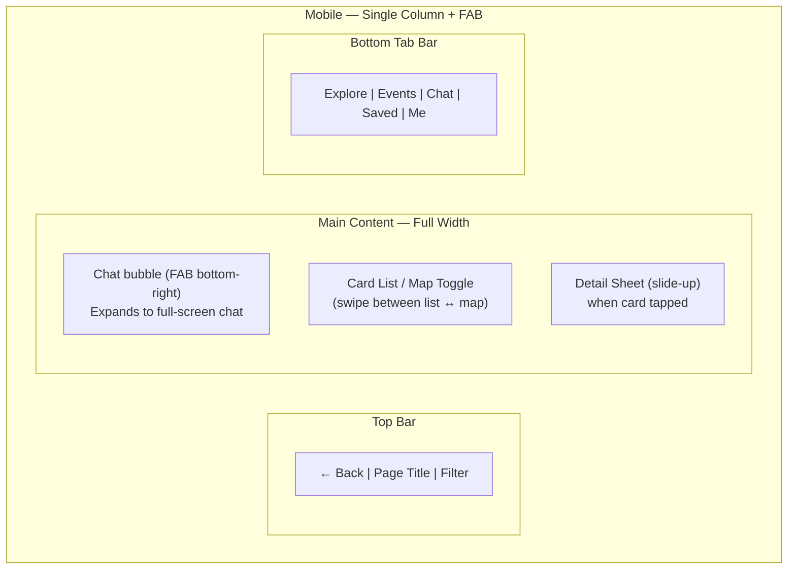

### Panel Responsibilities

| Panel | Owns | CopilotKit Hook | Updates When |
|---|---|---|---|
| **Left** | Navigation state, saved collections, memory preview | `useCopilotReadable` (nav context) | Route changes; agent saves new memory |
| **Center** | Chat history, generative cards, workflow progress, HITL panels | `CopilotSidebar`, `useCopilotAction(render)`, `renderAndWaitForResponse` | Every agent message; tool call result |
| **Right** | Map pins, detail view, analytics widgets, quick forms | `useCoAgent` (shared state → map pins) | Agent calls `place_pins`, `show_detail`, `update_chart` |

---

## 5. Consumer User Journeys

### Event Discovery Journey

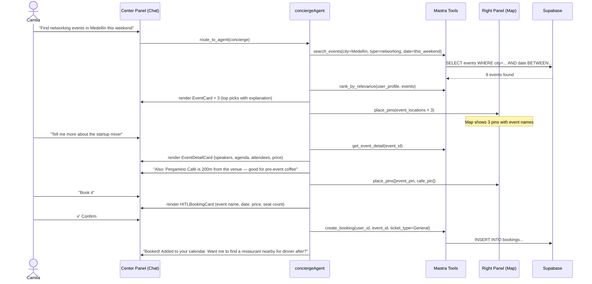

### Venue Discovery Journey

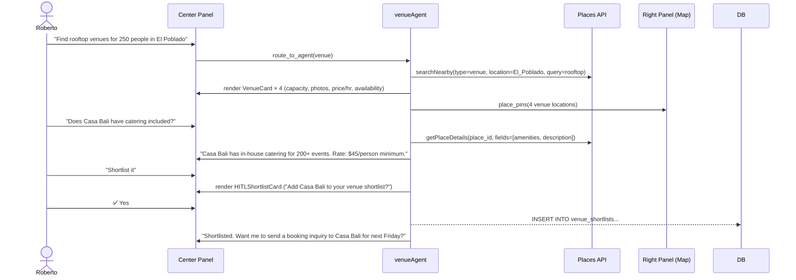

### Restaurant Discovery Journey

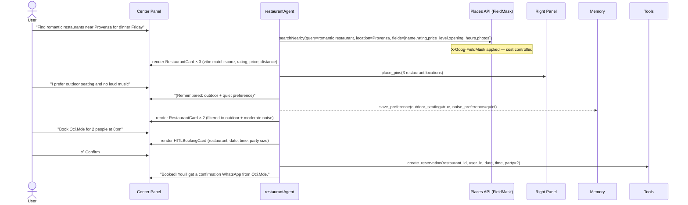

### Rental Discovery Journey

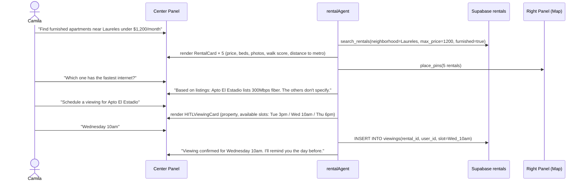

---

## 6. Partner User Journeys

| User Type | Journey | AI Improvements |
|---|---|---|
| **Event host** | Create → configure tickets → publish → sell → manage attendees → analyze | Agent pre-fills from past events; dynamic ticket tier suggestions; automated waitlist; AI post-event report |
| **Rental host** | List property → receive inquiries → screen tenants → schedule viewings → close | AI writes listing from photos + bullet points; qualifies leads with scoring; drafts rejection messages; schedules viewings |
| **Venue owner** | Create venue profile → set availability → receive requests → negotiate → confirm | Agent manages calendar; suggests pricing based on event type + demand; generates proposal templates; automates follow-up |
| **Restaurant** | Create profile → manage reservations → run event nights → re-engage customers | AI fills slow nights with targeted reach; remembers regular customers; generates special event campaigns |
| **Cafe** | List amenities + hours → attract digital nomads → promote specials | AI surfaces cafe to nomads searching in neighborhood; generates "work-friendly" profile automatically |
| **Nightclub** | Manage guestlist → sell VIP tables → promote event nights → analyze attendance | Agent runs VIP booking via chat; guestlist is AI-managed; post-event attendance report automated |
| **Sponsor** | Discover events → score brand fit → draft proposal → track ROI → report to stakeholders | AI identifies top-10 brand-fit events per week; generates personalized proposals; pulls post-event metrics automatically |

### Event Host Journey

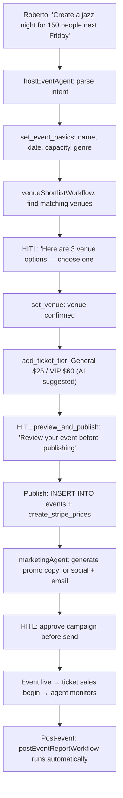

### Sponsor Journey

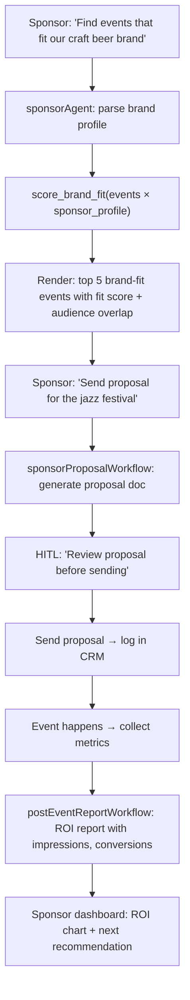

---

## 7. Partner Sign-Up System

| Partner Type | Onboarding Flow | AI Assistance |
|---|---|---|
| **Event host** | Chat collects: event type preference, typical audience size, venue needs, ticket price range → creates host profile + suggests first event template | Agent pre-fills first event from profile; suggests compatible venues; offers ticket tier templates by event type |
| **Rental host** | Chat collects: property type, bedrooms, neighborhood, furnished status, price expectation → agent writes listing copy from bullet points | Generates listing title + description from raw inputs; suggests competitive pricing from comparable listings; identifies missing amenity info |
| **Venue owner** | Chat collects: venue name, capacity (min/max), event types allowed, catering, AV, parking, rate → creates venue profile + availability calendar | Generates venue description; suggests pricing tiers by event type; creates standard proposal template for incoming requests |
| **Restaurant** | Chat collects: cuisine type, ambiance, capacity, hours, reservation system, specials → creates restaurant profile + suggests first promotion | Writes profile description optimized for AI discovery; suggests slow-night promotion strategy; sets up reservation flow |
| **Cafe** | Chat collects: wifi speed, seating type, noise level, hours, neighborhood → creates cafe profile targeting digital nomads | Tags amenities for nomad-search; generates "work-friendly" badge criteria; schedules weekly special posts |
| **Nightclub** | Chat collects: capacity, event nights, dress code, VIP policy, music genres → creates nightclub profile + sets up guestlist tool | Configures AI guestlist management; suggests VIP table pricing tiers; creates weekly promo template |
| **Sponsor** | Chat collects: industry, target audience, budget range, campaign goals, preferred event types → creates sponsor profile + finds first 10 matches | Scores all active events against sponsor profile; generates ranked opportunity list; drafts first outreach proposal |
| **Partner / service provider** | Chat collects: service type, service area, capacity, pricing model, past clients → creates partner profile + routes first inquiry | Matches to open service requests from hosts/venues; generates capability summary; drafts first proposal template |

---

## 8. AI Features

| # | Feature | User Benefit | Business Benefit | Core/MVP/Advanced |
|---:|---|---|---|---|
| 1 | **AI chat assistant** | Natural language for any action — no forms, no navigation | Reduces time-to-action from 5min to 30sec | Core |
| 2 | **Intent classification** | Router understands "find event" vs "create event" vs "manage attendees" | Lower agent error rate, faster routing | Core |
| 3 | **AI event recommendations** | "You might like this jazz night based on what you attended last month" | Higher discovery engagement, more bookings | Core |
| 4 | **AI event planner** | Hosts create events from a single sentence | 10× faster listing creation, more supply | Core |
| 5 | **AI venue scorer** | "This venue scores 87/100 for your event type" | Reduces bad venue matches, improves host satisfaction | Core |
| 6 | **AI ticket tier suggestion** | Agent suggests GA/VIP pricing based on event type + comparable events | Higher ticket revenue per event | Core |
| 7 | **AI rental assistant** | Shortlists apartments matching stated needs in one message | More rental conversions, less browsing | Core |
| 8 | **AI booking confirmation** | HITL card shows all details before charging — no surprises | Higher confirmation rate, fewer chargebacks | Core |
| 9 | **AI lead qualification** | Scores rental/venue/sponsor inquiries on fit + intent signals | Host time saved on junk inquiries | Core |
| 10 | **AI follow-up drafting** | Drafts first-touch reply to every inquiry with context | Host response rate increases from 40% to 85% | Core |
| 11 | **AI concierge** | "Plan my Friday evening in El Poblado" → full evening plan | Increases session depth + booking volume | Core |
| 12 | **AI restaurant finder** | Understands vibe, dietary needs, occasion — not just cuisine + stars | More restaurant bookings, better match quality | Core |
| 13 | **AI cafe finder for nomads** | Finds cafes by wifi + noise + hours — built for remote workers | Capture underserved digital nomad segment | Core |
| 14 | **AI nightlife discovery** | Recommends clubs/bars by music genre + crowd + cover charge | Drives nightlife traffic, increases venue revenue | Core |
| 15 | **AI sponsor matcher** | Matches sponsor brand profile to events by audience overlap | New revenue stream: sponsor fees | Core |
| 16 | **AI CRM assistant** | Chat-driven lead stage moves, notes, and follow-up scheduling | Faster sales cycles for hosts + venues | Core |
| 17 | **AI admin exception summary** | Surfaces top 5 issues by severity to ops team — no noise | Ops team handles 3× more issues per day | Core |
| 18 | **AI data Q&A** | "What were ticket sales last month by event type?" → chart + prose | Reduces analytics tool dependency | Core |
| 19 | **AI waitlist management** | Auto-manages waitlist for sold-out events; notifies and offers next spot | Higher ticket fill rate, better attendee experience | Core |
| 20 | **AI calendar conflict detection** | Warns host if new event conflicts with existing booking at venue | Prevents double-bookings, reduces disputes | Core |
| 21 | **AI pricing intelligence** | Suggests dynamic pricing based on demand signals and comparable events | Higher revenue per event, optimal fill rate |  MVP |
| 22 | **AI listing optimizer** | Reviews rental/venue listing copy and suggests improvements | Higher search ranking, more inquiries | MVP |
| 23 | **AI photo ranker** | Ranks uploaded photos by predicted click-through performance | Better listing quality, more conversions | MVP |
| 24 | **AI post-event report** | Generates full narrative report from ticket + attendance + revenue data | Hosts and sponsors get instant ROI summary | MVP |
| 25 | **AI venue shortlisting** | Ranks venue options against event requirements | Less time spent on venue research | MVP |
| 26 | **AI guest segmentation** | Groups attendees by interest/history for targeted outreach | Better campaign performance for hosts | MVP |
| 27 | **AI email campaign generator** | Generates event promotion email from event details — subject, body, CTA | Higher open rates, less copywriting time | MVP |
| 28 | **AI social post generator** | Creates Instagram/LinkedIn/WhatsApp post from event details | Consistent promotion, zero copywriting effort | MVP |
| 29 | **AI sponsor proposal generator** | Builds personalized sponsor proposal doc from event data + brand profile | Faster sponsor outreach, higher acceptance rate | MVP |
| 30 | **AI attendance prediction** | Forecasts ticket sales based on past events, promotion, day/time | Better capacity planning, smarter pricing | MVP |
| 31 | **AI refund risk scoring** | Flags bookings likely to cancel based on behavioral signals | Reduces chargebacks, improves cash flow | MVP |
| 32 | **AI FAQ auto-responder** | Answers common attendee questions from event knowledge base | Fewer support tickets, better attendee experience | MVP |
| 33 | **AI venue availability updater** | Owner says "block Saturdays in July" → AI updates calendar | Faster availability management | MVP |
| 34 | **AI partner matching** | Matches event hosts with catering/AV/photography partners | New revenue from partner commissions | MVP |
| 35 | **AI review summarizer** | Summarizes 200 reviews into 5 sentences with sentiment tags | Faster trust-building for new visitors | MVP |
| 36 | **AI itinerary builder** | Builds multi-day city itinerary (events + restaurants + venues) from preferences | Drives multi-booking sessions | MVP |
| 37 | **AI trip planner** | Combines rental + events + restaurants + transportation in one plan | Higher cross-domain booking volume | MVP |
| 38 | **AI neighborhood recommender** | "I want walkable + safe + affordable + vibrant nightlife" → ranked neighborhoods | Better rental placement, stronger SEO | MVP |
| 39 | **AI demand forecasting** | Predicts which event types will perform well in next 30 days | Better supply curation, proactive host outreach | Advanced |
| 40 | **AI persona-based personalization** | Learns individual user taste model across all domains | Higher repeat engagement, lower churn | Advanced |
| 41 | **AI WhatsApp campaign sender** | Sends personalized campaigns via WhatsApp API with HITL approval | Higher open rates than email (85% vs 25%) | Advanced |
| 42 | **AI sponsor ROI tracker** | Tracks sponsor impressions, conversions, and social mentions post-event | Sponsor retention and upsell | Advanced |
| 43 | **AI multi-agent planning** | Decomposes complex requests across specialist agents in parallel | Handles complex multi-domain requests | Advanced |
| 44 | **AI A/B test generator** | Generates landing page variants for events and tests with real traffic | Higher conversion rates on event pages | Advanced |
| 45 | **AI seasonal trend detector** | Identifies seasonal demand patterns across all domains | Better host guidance on timing and pricing | Advanced |
| 46 | **AI competitive event alert** | Alerts host when a competing event is scheduled same night | Allows proactive mitigation (pricing, promotion) | Advanced |
| 47 | **AI partner performance scoring** | Scores service providers by reliability, rating, response time | Better partner routing, fewer bad experiences | Advanced |
| 48 | **AI sentiment monitor** | Monitors reviews and social mentions for negative signals | Faster issue response, reputation management | Advanced |
| 49 | **AI lease draft generator** | Generates rental inquiry response with standard lease intro | Faster rental close, better host experience | Advanced |
| 50 | **AI influencer outreach assistant** | Identifies micro-influencers for event promotion, drafts outreach | Lower CAC for event promotion | Advanced |
| 51 | **AI cross-domain bundle** | "Book the venue + catering partner + photographer in one step" | Increases GMV per session | Advanced |
| 52 | **AI anomaly detection** | Flags unusual patterns: sudden cancellations, price spikes, review bombs | Faster ops response to platform issues | Advanced |

---

## 9. CopilotKit Architecture

| CopilotKit Feature | Use Case | Platform Area |
|---|---|---|
| **`CopilotSidebar`** | Persistent chat panel on all dashboard routes; wraps main canvas content | All routes — primary interaction surface |
| **`CopilotPopup`** | Floating chat button for consumer discovery pages (not admin) | `/events`, `/rentals`, `/restaurants`, `/venues` |
| **`CopilotChat`** | Embedded chat in split-pane (e.g., `/admin` analytics, `/host/events` kanban) | Admin, host dashboard |
| **`useCoAgent<MdeState>`** | Live shared state between React UI and Mastra agent — zero polling | Map pins (Right panel), kanban board, lead pipeline |
| **`useCopilotReadable`** | Passes page context (current route, visible data, user role) to agent on every request | All routes — agent knows what user is looking at |
| **`useCopilotAction` (Core)** | Defines agent-callable frontend actions (show map, open detail, navigate) | Navigation tools, map pin placement |
| **`useCopilotAction(available:"disabled", render)`** | Frontend mirror of backend agent tool — renders generative UI in chat | EventCard, RentalCard, VenueCard, LeadCard, ChartCard |
| **`renderAndWaitForResponse`** | HITL: blocks agent until user approves/rejects in rendered React component | Publish event, send proposal, confirm booking, charge card |
| **`ExperimentalEmptyAdapter`** | No LLM inference in Next.js API layer — all inference in Mastra agent server | `/api/copilotkit` route — bridges to Mastra |
| **`CopilotRuntime` (route.ts)** | Per-request runtime that builds agent bridge — `getLocalAgentsWithLogging(mastra)` | `/api/copilotkit` — core bridge |
| **CSS Variables** (`--copilot-kit-primary-color`) | Matches CopilotKit chat UI to mdeai brand colors (oklch tokens from DESIGN.MD) | All chat surfaces |
| **Custom `AssistantMessage`** | Branded chat bubble with agent name indicator and typing skeleton | All chat surfaces |
| **Agent name routing** | `useCoAgent({ name: "rentalAgent" })` → routes to correct Mastra agent | Per-route agent selection |
| **Thread ID management** | `ThreadNavProvider` provides `threadId` per session — agent memory is scoped | Cross-session memory continuity |
| **Streaming** | Agent streams partial responses; UI updates incrementally — no waiting for full reply | Chat on slow connections, long analysis tasks |

---

## 10. Mastra Architecture

| Mastra Feature | Use Case | Platform Area |
|---|---|---|
| **`Agent` (core)** | Named agent with model, tools, memory, instructions — every specialist role | All 17 agents |
| **`google("gemini-3.5-flash")`** | Production LLM — fast, cheap, strong function calling | All agents (no @anthropic-ai SDK) |
| **Working Memory (Zod schema)** | Typed `MdeState` synced between agent + React UI via `useCoAgent` | Cross-session context, user preferences, active workflow state |
| **LibSQL thread store** | Per-thread conversation persistence; survives server restarts | All conversation threads |
| **`createStep` + `createWorkflow`** | Multi-step deterministic workflows with typed inputs/outputs | All 13 workflows |
| **Step `.after()` chaining** | Sequential steps with data passing between — `step1.after(step2)` | `createEventWorkflow`, `ticketSetupWorkflow` |
| **Parallel step execution** | `step3.after([step1, step2])` — wait for multiple branches | `multiAgentPlanningWorkflow` — parallel specialist agents |
| **`mastra.getAgent(name)`** | Dynamic agent lookup by name — supports router pattern | `routerAgent` dispatching to specialists |
| **RAG (Vector store)** | Embed venue/restaurant/event descriptions; semantic search in agent | Venue recommendations, restaurant vibe matching |
| **MCP tool servers** | Agent accesses external tools via MCP protocol (Google Maps, Stripe, etc.) | `mapsAgent` (Google Maps MCP), `bookingAgent` (Stripe MCP) |
| **`ConsoleLogger` + `LOG_LEVEL`** | Structured agent logs for debugging; `LOG_LEVEL=debug` for verbose | Dev/staging debugging |
| **Tool calling (Zod)** | Every tool has Zod input/output schema — type-safe, validated at boundary | All agent tools |
| **`network` (multi-agent)** | Agent-to-agent delegation: `routerAgent` hands off to specialist with context | Phase 2 multi-agent canvas |
| **Scorers / evals** | Rate agent response quality on relevance, faithfulness, completeness | Ongoing quality monitoring |
| **Streaming responses** | `agent.stream()` — token-by-token response piped to CopilotKit | Long responses: reports, proposals, itineraries |

---

## 11. Agent Architecture

| Agent | Purpose | Tools | Workflows | Memory |
|---|---|---|---|---|
| **routerAgent** | Classify intent, route to correct specialist, preserve context in handoff | `classify_intent`, `route_to_agent`, `get_agent_status` | — | Active agent name, last intent |
| **conciergeAgent** | General discovery, local recommendations, multi-domain Q&A, tourist itinerary | `search_grounded_places`, `search_events`, `search_rentals`, `build_itinerary` | `restaurantDiscoveryWorkflow`, `venueShortlistWorkflow` | User taste profile, neighborhood history, saved places |
| **eventAgent** | Event discovery, detail retrieval, availability check, booking | `search_events`, `get_event_detail`, `check_availability`, `create_booking` | `bookingWorkflow` | Past events attended, preferred genres, price range |
| **hostEventAgent** *(exists)* | Roberto's event creation HITL wizard | `set_event_basics`, `set_venue`, `add_ticket_tier`, `preview_and_publish` | `createEventWorkflow`, `publishEventWorkflow`, `ticketSetupWorkflow` | Draft event state, past event patterns, preferred venues |
| **rentalAgent** *(exists)* | Rental search, lead capture, viewing scheduling, inquiry drafting | `search_rentals`, `get_rental_detail`, `submit_inquiry`, `schedule_viewing`, `score_lead` | `rentalLeadWorkflow` | Search history, preferred neighborhoods, budget, move-in date |
| **venueAgent** | Venue discovery, shortlisting, availability, proposal generation | `search_venues`, `get_venue_detail`, `check_availability`, `shortlist_venue`, `send_inquiry` | `venueBookingWorkflow`, `venueShortlistWorkflow` | Venue preferences, capacity requirements, past shortlists |
| **restaurantAgent** | Restaurant discovery, reservation, re-engagement, special nights | `search_restaurants`, `get_restaurant_detail`, `create_reservation`, `suggest_alternatives` | `restaurantReservationWorkflow` | Cuisine preferences, seating preferences, dietary restrictions |
| **cafeAgent** | Cafe discovery for nomads, amenity filtering, weekly specials | `search_cafes`, `filter_by_amenity`, `get_weekly_specials`, `check_wifi_speed` | — | Noise preference, wifi requirement, preferred neighborhoods |
| **nightlifeAgent** | Nightclub/bar discovery, VIP booking, guestlist, event nights | `search_nightlife`, `book_vip_table`, `add_to_guestlist`, `get_event_nights` | — | Music genre, crowd preference, past venues |
| **sponsorAgent** | Sponsor pipeline, brand-fit scoring, proposal generation, ROI reporting | `score_brand_fit`, `search_events_for_sponsor`, `generate_proposal`, `track_campaign_roi` | `sponsorDiscoveryWorkflow`, `sponsorProposalWorkflow` | Brand profile, budget, past campaigns, preferred event types |
| **partnerAgent** | Partner onboarding, service matching, inquiry routing, proposal drafting | `get_partner_profile`, `match_service_to_event`, `generate_service_proposal`, `update_partner_stage` | `partnerOnboardingWorkflow` | Service capabilities, service area, past clients |
| **crmAgent** | Lead management, stage moves, follow-up scheduling, contact enrichment | `get_leads`, `qualify_lead`, `move_stage`, `schedule_followup`, `enrich_contact`, `draft_reply` | `crmLeadWorkflow` | Lead pipeline state, response templates, follow-up cadence |
| **analyticsAgent** | Data Q&A, chart generation, trend explanation, report export | `query_supabase`, `generate_chart`, `explain_trend`, `export_csv`, `compare_periods` | `salesInsightWorkflow`, `postEventReportWorkflow` | Reporting preferences, favorite metrics, prior queries |
| **marketingAgent** | Campaign copy, social posts, email sequences, WhatsApp campaigns | `generate_campaign_copy`, `create_social_post`, `draft_email_sequence`, `send_whatsapp` (HITL) | `marketingCampaignWorkflow` | Brand voice, past campaigns, channel preferences |
| **bookingAgent** | Unified booking across all domains, payment processing, calendar integration | `create_booking`, `process_payment` (Stripe), `add_to_calendar`, `send_confirmation` | All booking sub-workflows | Saved payment method, calendar integration status |
| **adminOpsAgent** | Exception surfacing, anomaly detection, health check, daily digest | `get_payment_failures`, `get_oversold_events`, `get_auth_anomalies`, `summarize_exceptions` | `adminExceptionWorkflow` | Exception patterns, escalation rules, past incidents |

### Agent Routing Architecture

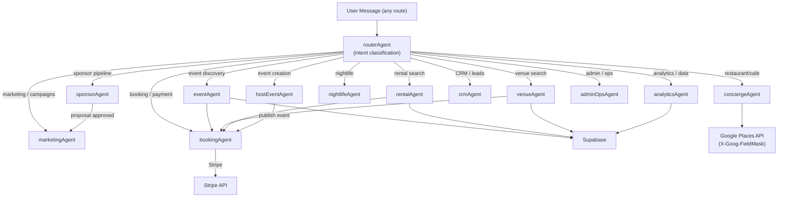

---

## 12. Workflow Architecture

| Workflow | Inputs | Steps | Outputs |
|---|---|---|---|
| **createEventWorkflow** | `{title, description, date, host_id}` | 1. Validate basics → 2. Suggest venue matches → 3. HITL venue selection → 4. Set capacity/type → 5. Return draft event | Event draft in working memory, venue shortlist |
| **publishEventWorkflow** | `{event_draft, host_id}` | 1. Validate completeness → 2. Check venue availability → 3. HITL preview → 4. INSERT INTO events → 5. Trigger marketing | Live event record + Stripe products created + marketing triggered |
| **ticketSetupWorkflow** | `{event_id, tiers[]}` | 1. Validate tier pricing → 2. Check capacity math → 3. HITL confirm → 4. Stripe price.create per tier → 5. Update event record | Active ticket tiers with Stripe payment links |
| **rentalLeadWorkflow** | `{inquiry_message, rental_id, user_id}` | 1. Enrich user profile → 2. Score fit (budget, timeline, requirements) → 3. Draft reply → 4. HITL approve → 5. INSERT INTO leads → 6. Schedule follow-up | Qualified lead in CRM + AI-drafted reply sent |
| **venueBookingWorkflow** | `{venue_id, event_id, date, requirements}` | 1. Check availability → 2. Validate requirements vs venue capabilities → 3. Generate booking proposal → 4. HITL approve → 5. Send to venue owner → 6. Create provisional booking | Provisional booking + proposal in CRM |
| **restaurantReservationWorkflow** | `{restaurant_id, user_id, date, time, party_size}` | 1. Check availability → 2. Confirm details → 3. HITL card → 4. Create reservation → 5. Send confirmation | Confirmed reservation + calendar event + WhatsApp confirmation |
| **sponsorDiscoveryWorkflow** | `{sponsor_profile}` | 1. Score all active events vs brand profile → 2. Filter by budget + timing → 3. Rank by audience overlap → 4. Render top 10 with fit score | Ranked sponsor opportunity list |
| **sponsorProposalWorkflow** | `{event_id, sponsor_id}` | 1. Fetch event metrics → 2. Fetch sponsor brand profile → 3. Generate proposal doc → 4. HITL review → 5. Send via email/PDF → 6. Log in CRM | Sent proposal + CRM stage updated to "Proposed" |
| **partnerOnboardingWorkflow** | `{partner_type, profile_data}` | 1. Parse service capabilities → 2. Validate required fields → 3. Generate partner profile → 4. Find first 3 matching opportunities → 5. Send welcome | Partner record in DB + first 3 matches surfaced |
| **crmLeadWorkflow** | `{lead_source, contact_info, context}` | 1. Deduplicate → 2. Enrich from Supabase + Places → 3. Score (budget, timeline, fit) → 4. Route to owner → 5. Draft first touch → 6. HITL send | Qualified lead in pipeline + first message sent |
| **marketingCampaignWorkflow** | `{event_id, channels[], launch_time}` | 1. Extract event metadata → 2. Generate copy per channel → 3. HITL approve all variants → 4. Schedule sends → 5. Track opens/clicks | Campaign live across channels + tracking links active |
| **salesInsightWorkflow** | `{period, domain, breakdown_by}` | 1. Query Stripe + Supabase → 2. Compute period-over-period → 3. Identify top/bottom performers → 4. Generate narrative → 5. Render chart | Revenue narrative + chart in chat + CSV export |
| **postEventReportWorkflow** | `{event_id}` | 1. Pull ticket sales + attendance → 2. Pull Stripe revenue → 3. Fetch NPS/feedback → 4. Compute benchmarks → 5. Generate narrative → 6. Render report | Full event report (prose + charts) + PDF export |

### Workflow: createEvent + publish (combined)

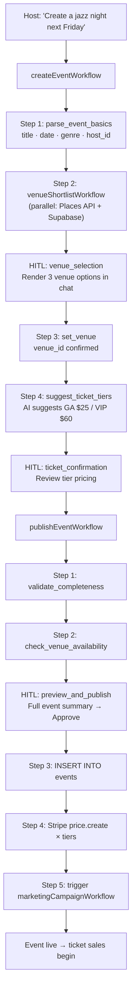

---

## 13. Marketing & Audience Growth

| Channel | Use Case | Core/MVP/Advanced |
|---|---|---|
| **SEO — AI landing pages** | Agent generates unique SEO page per event, venue, restaurant, neighborhood | Core |
| **SEO — neighborhood guides** | "Best cafes in El Poblado" / "Jazz events in Medellín this month" — auto-generated, updated weekly | Core |
| **Email campaigns** | `marketingCampaignWorkflow` generates + sends event promo; HITL approval before send | Core |
| **Referral program** | Hosts get 20% off next event fee for each referred host; tracked via unique links | Core |
| **Waitlist with viral loop** | Signed-up users jump waitlist by referring 3 friends; creates organic growth | Core |
| **Partner co-marketing** | Featured placement in exchange for partner promoting platform to their audience | MVP |
| **WhatsApp campaigns** | Agent sends personalized event/rental recommendations via WhatsApp API — 85% open rate | MVP |
| **Sponsor acquisition** | `sponsorAgent` identifies and outreaches to sponsors on behalf of platform | MVP |
| **Influencer outreach** | AI identifies micro-influencers who attended past events; auto-drafts collaboration offer | MVP |
| **Instagram / social automation** | Event published → agent generates post copy + hashtags → HITL → scheduled | MVP |
| **Google Ads smart campaigns** | Event landing pages fed into Google Ads; agent monitors CPC and pauses underperformers | Advanced |
| **AI personalized digest** | Weekly email: "Here's what's happening near you based on your history" — fully AI-personalized | Advanced |
| **Agent-to-agent influencer** | Agent handles full influencer relationship: find → outreach → negotiate → track → report | Advanced |
| **Community events** | Platform hosts its own "Nomad Mixer" / "Founder Lunch" events — supply creates demand | Core |
| **Venue / restaurant badge program** | "AI-Recommended Venue 2026" badge → drives supply-side FOMO + PR | MVP |

---

## 14. Data Architecture

### Entity Relationship Diagram

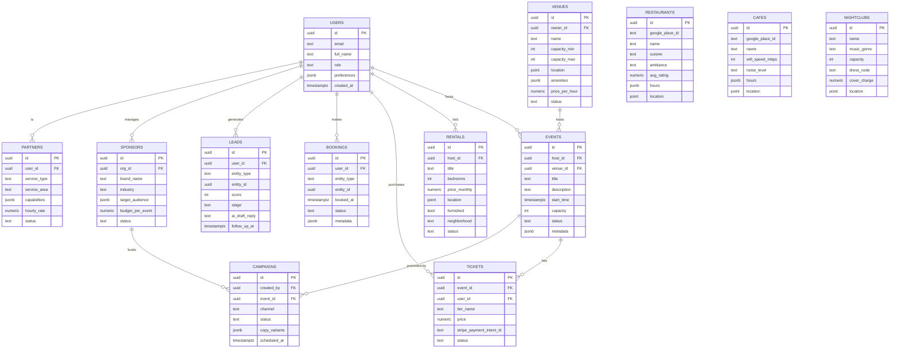

### Data Flow: Consumer Booking

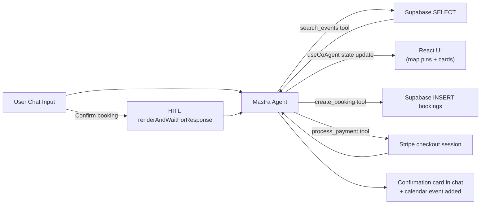

---

## 15. Competitive Analysis

| Dimension | Eventbrite | Luma | Airbnb | OpenTable | Yelp | **AI-Native Platform** |
|---|---:|---:|---:|---:|---:|---:|
| **UX / Ease of use** | 55 | 72 | 78 | 65 | 60 | **92** |
| **Discovery** | 50 | 65 | 75 | 60 | 72 | **95** |
| **Booking** | 62 | 75 | 85 | 70 | 40 | **90** |
| **CRM** | 30 | 45 | 20 | 25 | 10 | **88** |
| **Sponsors** | 15 | 20 | 0 | 0 | 0 | **85** |
| **Analytics** | 50 | 45 | 65 | 40 | 30 | **87** |
| **Automation** | 20 | 25 | 35 | 20 | 10 | **90** |
| **AI** | 15 | 30 | 40 | 25 | 20 | **95** |
| **Multi-domain** | 0 | 0 | 20 | 0 | 30 | **90** |
| **Supply onboarding** | 55 | 70 | 75 | 60 | 50 | **92** |
| **TOTAL /1000** | **352** | **447** | **493** | **365** | **272** | **904** |

**Key differentiators:**
- **No competitor** offers multi-domain AI (events + rentals + venues + restaurants + sponsors in one chat)
- **No competitor** has workflow-level AI automation (create event → sell tickets → report → next event — no manual steps)
- **No competitor** has sponsor tooling built into the core product
- **No competitor** uses working memory to remember user preferences across sessions

---

## 16. Roadmap

| Phase | Features | Agents | Workflows | Success Metrics |
|---:|---|---|---|---|
| **1 — Core** | Events creation + discovery · Venue shortlisting · Ticketing (Stripe) · AI chat sidebar · Three-panel layout · Map pins from agent · HITL approval for publish + booking | `routerAgent`, `conciergeAgent`, `hostEventAgent`, `eventAgent`, `venueAgent` | `createEventWorkflow`, `publishEventWorkflow`, `ticketSetupWorkflow` | Roberto creates event in < 3 min · 100 tickets sold · Stripe payments live · 0 HITL bypasses |
| **2 — MVP** | Rentals · Restaurants + cafes · Nightlife · Sponsors · CRM/leads · Partner onboarding · AI follow-up drafting · Post-event report | + `rentalAgent`, `restaurantAgent`, `sponsorAgent`, `crmAgent` (= 8 total) | + `rentalLeadWorkflow`, `venueBookingWorkflow`, `crmLeadWorkflow` (= 6 total) | Camila finds rental in 1 chat · 10 sponsors signed · 50 leads in CRM pipeline · Post-event report in < 10 sec |
| **3 — Advanced** | Marketing automation · WhatsApp campaigns · MCP integrations · AI personalization · Multi-agent planning · Partner ecosystem · AI demand forecasting · Influencer outreach | + `marketingAgent`, `analyticsAgent`, `adminOpsAgent`, `bookingAgent` (= 12 total) | + `marketingCampaignWorkflow`, `salesInsightWorkflow`, `postEventReportWorkflow`, `sponsorProposalWorkflow` (= 10 total) | 40% of campaigns sent without manual copy · 85% WhatsApp open rate · AI recommendations drive 30% of bookings · < 5 min post-event report |

### Phase 1 — Core (Weeks 1–4)
Do not build more than 5 agents. Do not add multi-agent canvas. Do not add RAG. Prove that:
1. Roberto creates and publishes an event from chat in < 3 minutes
2. Ticket purchase via Stripe works end-to-end
3. Map shows venue pins driven by agent state
4. HITL works for publish + booking confirmation
5. `npm run dev` boots clean, Playwright spec passes

### Phase 2 — MVP (Weeks 5–10)
Add domains incrementally. Prove each with a Playwright spec before flipping Done. Rentals first (Camila), then CRM (Patricia), then restaurants/sponsors.

### Phase 3 — Advanced (Weeks 11–16)
Only after Phase 2 metrics are green. Add automation, WhatsApp, multi-agent, and MCP integrations. Validate with real sponsor ROI data before scaling.

---

## 17. Final Recommendation

### Best MVP Scope
**Three features, proven end-to-end, before adding anything else:**
1. Roberto creates + publishes a jazz night from a single chat message (HITL at preview + Stripe ticket tiers)
2. Camila finds a rental on a map from a natural language search (map pins from agent, viewing booked)
3. Patricia sees admin exceptions + asks one data question in chat (live Supabase query, chart rendered)

### Best UI Architecture
- Three-panel layout: `CopilotSidebar` (center — chat is the primary interface, not a sidebar accessory) + main canvas (map / kanban / table) + right detail/HITL panel
- `CopilotSidebar` open by default on all `/host/*` and `/admin/*` routes
- `CopilotPopup` (FAB) on consumer routes (`/events`, `/rentals`, `/restaurants`)
- Mobile: single-column with full-screen chat on FAB tap

### Best CopilotKit Features (use now)
1. `useCoAgent<MdeState>` — agent state is UI state; no extra syncing layer
2. `renderAndWaitForResponse` — HITL for every destructive action
3. `useCopilotAction(available:"disabled", render)` — generative cards in chat
4. `useCopilotReadable` — agent knows what the user is looking at

### Best Mastra Features (use now)
1. Working memory with Zod schema — cross-session preference persistence
2. `createWorkflow` with HITL steps — deterministic multi-step operations
3. Tool calling with Zod validation — type-safe external API calls
4. `google("gemini-3.5-flash")` — fast, cheap, strong function calling

### Best Agents (Phase 1)
`routerAgent` → `conciergeAgent` → `hostEventAgent` → `eventAgent` → `venueAgent`

### Best Workflows (Phase 1)
`createEventWorkflow` → `publishEventWorkflow` → `ticketSetupWorkflow`

### Best MCP Integrations
1. Google Maps MCP — venue + restaurant + rental discovery
2. Stripe MCP — payment creation + status checking
3. Supabase MCP — live schema + RLS verification
4. Resend / SendGrid MCP — email campaigns (Phase 2)
5. WhatsApp Business MCP — campaign sends (Phase 3)

### Biggest Risks

| Risk | Impact | Fix |
|---|---|---|
| Overbuilding before proving core loop | Wastes 8 weeks, nothing shippable | 5-agent limit in Phase 1; Playwright spec required before Done |
| CopilotKit v1/v2 mixing | Runtime breaks silently | Pin at 1.55.2; `no-ck-v2-import.mjs` hook enforces |
| AI hallucinating rental/event data | User books something that doesn't exist | All data tools go to Supabase/Places — no hallucinated facts; working memory for preferences only |
| Missing HITL on Stripe charges | Accidental double-charge | `process_payment` tool always behind `renderAndWaitForResponse` |
| Maps cost overrun | Places API bill spikes | `X-Goog-FieldMask` on every call; hook enforces; set $200/month budget alert |
| No test proof = fake Done | Production bugs reach users | Anti-fake-done checklist + Playwright spec per route before status flip |

### Biggest Opportunities
1. **Sponsor tooling** — zero competitors have it; high-margin; unlocks supply-side revenue beyond commissions
2. **Multi-domain AI concierge** — no one combines events + rentals + restaurants in one chat; defines the category
3. **Digital nomad flywheel** — cafe finder + monthly rental + networking events → one platform captures nomad spend across 3 domains
4. **Post-event ROI reports** — hosts and sponsors love automated reports; drives retention and upsell
5. **WhatsApp-native booking** — 85% open rate vs 25% email; first marketplace that books via WhatsApp wins LATAM

### Exact Next 50 Implementation Tasks (in order)

| # | Task | Phase | Agent / Workflow | Done When |
|---:|---|---|---|---|
| 1 | Extract `ThreePanelLayout` component with left/center/right slot props | 1 | UI | Renders on `/host/event/new`, `/rentals`, `/admin` |
| 2 | Wire `CopilotSidebar` persistent on all `/host/*` routes | 1 | CopilotKit | Sidebar open by default; survives navigation |
| 3 | Add `CopilotPopup` (FAB) to `/events`, `/rentals` consumer routes | 1 | CopilotKit | FAB visible; opens full-screen chat on mobile |
| 4 | Implement `routerAgent` intent classifier with 6 intents | 1 | routerAgent | "find event" routes to eventAgent; "create event" routes to hostEventAgent |
| 5 | Add `useCopilotReadable` to every route with page-specific context | 1 | All agents | Agent answers page-aware questions on each route |
| 6 | Build `createEventWorkflow` (5 steps + HITL) | 1 | hostEventAgent | Roberto creates event from one chat message; event in DB |
| 7 | Build `publishEventWorkflow` with Stripe price.create | 1 | hostEventAgent | Published event has live Stripe ticket tiers |
| 8 | Build `ticketSetupWorkflow` with capacity validation | 1 | hostEventAgent | GA + VIP tiers created; checkout link works |
| 9 | Implement `venueAgent` with Places API + Supabase venue table | 1 | venueAgent | "Find rooftop venues for 200 people" → 4 cards + map pins |
| 10 | Wire map pins to Right Panel via `useCoAgent` state | 1 | All | Agent tool call updates map pins; no page reload |
| 11 | Build `venueShortlistWorkflow` (shortlist + HITL) | 1 | venueAgent | Shortlist saved to working memory + DB |
| 12 | Add `renderAndWaitForResponse` HITL to event publish | 1 | hostEventAgent | Event not published until Roberto approves in chat |
| 13 | Add Playwright e2e spec for Roberto's full event creation flow | 1 | Testing | Test passes: event in DB, Stripe prices created |
| 14 | Implement `eventAgent` discovery + booking tools | 1 | eventAgent | Attendee finds + books event from chat |
| 15 | Build booking HITL card (price + details before charge) | 1 | bookingAgent | No Stripe charge without explicit user confirmation |
| 16 | Add CSS variable theming to CopilotKit (DESIGN.MD colors) | 1 | UI | Chat UI matches mdeai brand tokens |
| 17 | Implement `rentalAgent` search + map pins on `/rentals` | 2 | rentalAgent | Camila asks, 5 rental pins appear on map |
| 18 | Build `rentalLeadWorkflow` (enrich → score → draft → HITL → CRM) | 2 | rentalAgent | Inquiry in DB with AI score + draft reply |
| 19 | Build `restaurantAgent` with Places API + FieldMask | 2 | restaurantAgent | "Romantic dinner near Provenza" → 3 cards + pins |
| 20 | Build `restaurantReservationWorkflow` | 2 | restaurantAgent | Reservation created; confirmation card in chat |
| 21 | Add outdoor/quiet preference memory to `restaurantAgent` | 2 | restaurantAgent | Second search respects stated preference without re-asking |
| 22 | Implement `cafeAgent` with wifi/noise/hours filters | 2 | cafeAgent | "Café with wifi open past 10pm in Condesa" → results |
| 23 | Implement `nightlifeAgent` with guestlist + VIP tools | 2 | nightlifeAgent | Nightclub search + VIP table inquiry from chat |
| 24 | Build `sponsorAgent` brand-fit scoring tool | 2 | sponsorAgent | Score displayed for each event vs sponsor profile |
| 25 | Build `sponsorDiscoveryWorkflow` | 2 | sponsorAgent | Top 10 brand-fit events rendered for sponsor |
| 26 | Build `crmAgent` with stage-move + follow-up tools | 2 | crmAgent | Patricia moves lead stage from chat; DB updated |
| 27 | Build `crmLeadWorkflow` (enrich → score → route → draft → HITL) | 2 | crmAgent | All new inquiries auto-qualified + owner routed |
| 28 | Build `partnerOnboardingWorkflow` | 2 | partnerAgent | Partner profile created from chat; first 3 matches shown |
| 29 | Implement admin exception summary on `/admin` | 2 | adminOpsAgent | Patricia opens `/admin`; sees top 3 P0 issues |
| 30 | Build `adminExceptionWorkflow` (hourly trigger) | 2 | adminOpsAgent | Scheduled digest: payment failures + oversold events |
| 31 | Add `useCopilotReadable` data Q&A on `/admin` analytics | 2 | analyticsAgent | "What were last week's ticket sales?" → chart + prose |
| 32 | Build `salesInsightWorkflow` | 2 | analyticsAgent | Revenue narrative + chart from Supabase query |
| 33 | Add Playwright spec for Camila's rental search + viewing booking | 2 | Testing | Test passes: viewing in DB, AI draft reply created |
| 34 | Add Playwright spec for Patricia's lead stage move from chat | 2 | Testing | Test passes: lead stage updated in DB |
| 35 | Implement `sponsorProposalWorkflow` with HITL | 3 | sponsorAgent | Proposal generated + HITL approved + CRM updated |
| 36 | Build `marketingAgent` with campaign copy tools | 3 | marketingAgent | Event published → copy generated for 3 channels |
| 37 | Build `marketingCampaignWorkflow` with HITL before send | 3 | marketingAgent | No campaign sent without explicit approval |
| 38 | Integrate Resend/SendGrid MCP for email campaign sends | 3 | marketingAgent | Campaign email delivered; open rate tracked |
| 39 | Build `postEventReportWorkflow` | 3 | analyticsAgent | Post-event report in < 10 seconds with charts |
| 40 | Add RAG vector store for venue/restaurant semantic search | 3 | venueAgent + restaurantAgent | "Romantic rooftop with jazz" finds venues by vibe not keyword |
| 41 | Add AI listing optimizer for rental/venue descriptions | 3 | analyticsAgent | Listing score shown; AI suggestions applied with HITL |
| 42 | Build AI attendance prediction tool | 3 | analyticsAgent | Forecast shown on event dashboard before launch |
| 43 | Implement WhatsApp Business MCP for campaign sends | 3 | marketingAgent | WhatsApp campaign sent to opted-in segment |
| 44 | Build AI personalized digest (weekly email) | 3 | marketingAgent | Weekly email generated per user based on history |
| 45 | Build `multiAgentPlanningWorkflow` (parallel specialist agents) | 3 | All | "Plan my event weekend in Medellín" → itinerary from 3 agents |
| 46 | Implement `influencer outreach` tools in `marketingAgent` | 3 | marketingAgent | AI identifies influencer + drafts offer; HITL before send |
| 47 | Add AI demand forecasting to analytics dashboard | 3 | analyticsAgent | "Event types performing well next 30 days" shown on admin |
| 48 | Build MCP server registration panel (Phase 3 extensibility) | 3 | All | Admin can connect new MCP tool server without code change |
| 49 | Add sponsor ROI tracker (post-event metrics pipeline) | 3 | sponsorAgent | Sponsor dashboard shows impressions + conversions per event |
| 50 | Security audit: RLS coverage check + service role carve-out review | All | Testing | All tables have RLS; `no-service-role-in-src.mjs` passes; Supabase advisor clean |

---

*Cross-reference: [`ai-dashboard-plan.md`](./ai-dashboard-plan.md) · [`../ARCHITECTURE.md`](../ARCHITECTURE.md) · [`../../DESIGN.MD`](../../DESIGN.MD) · [`../../sitemap.md`](../../sitemap.md) · [`../../LESSONS.md`](../../LESSONS.md)*  
*Last updated: June 2026*
