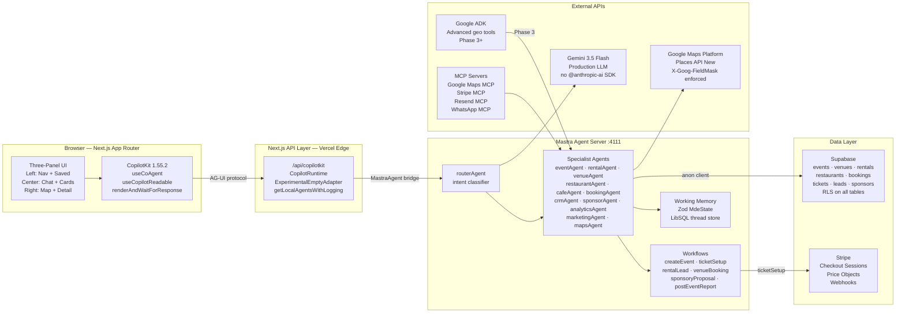
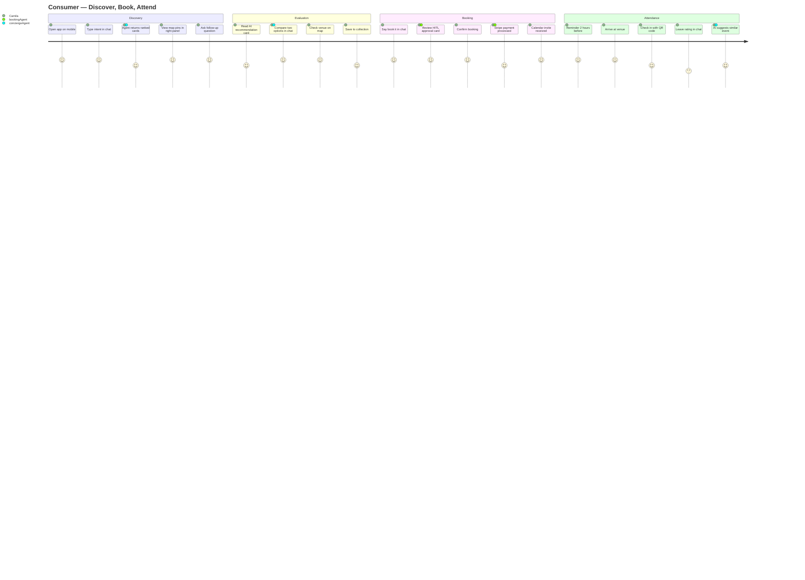
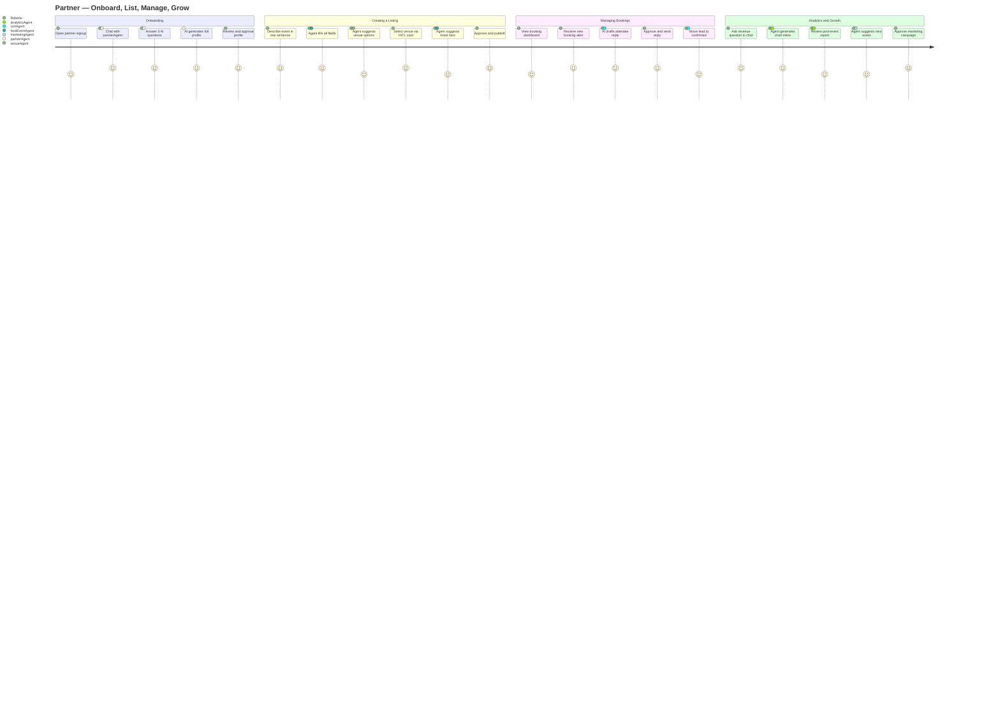
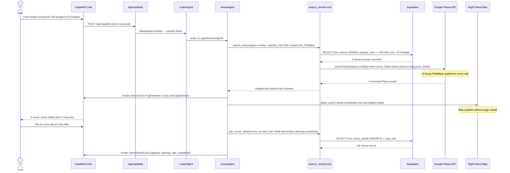
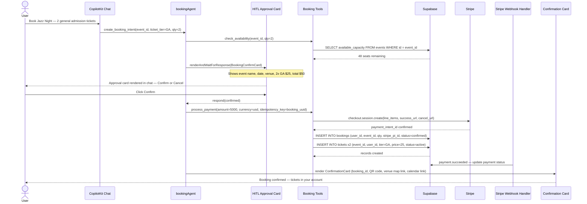
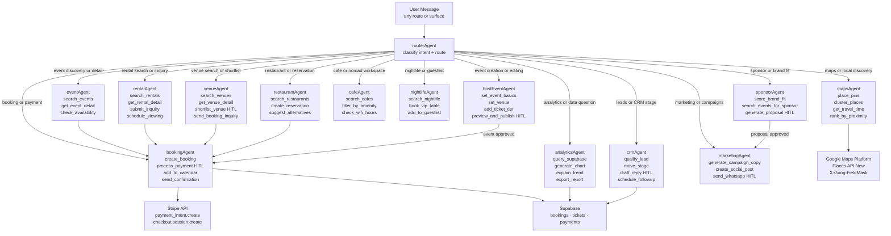
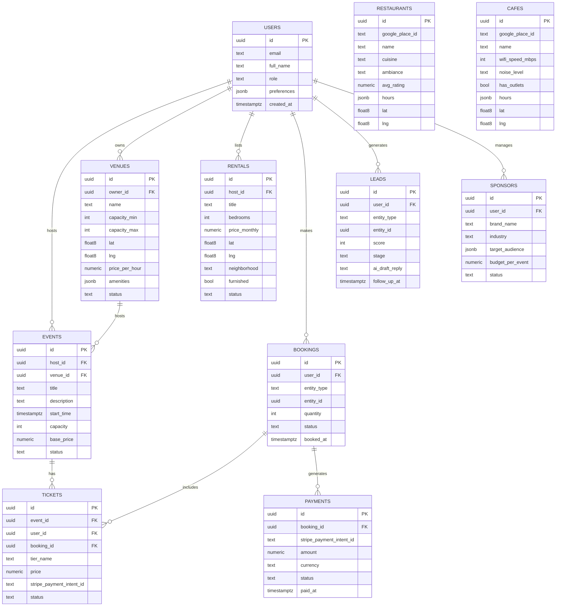
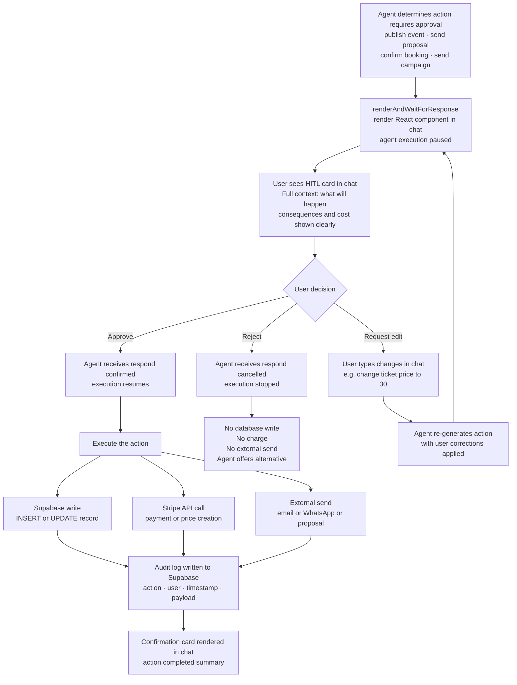
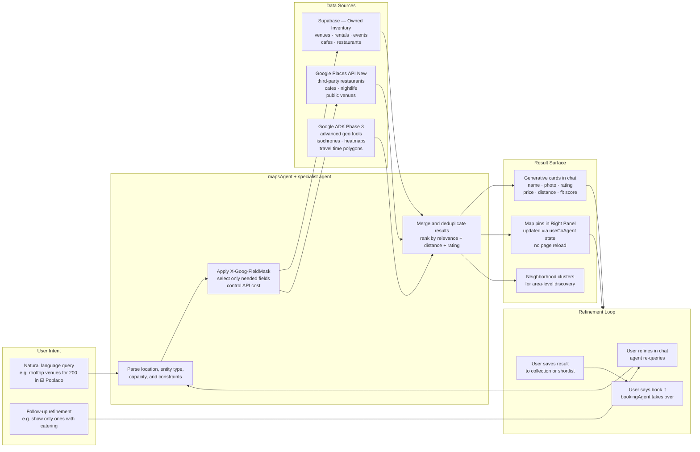
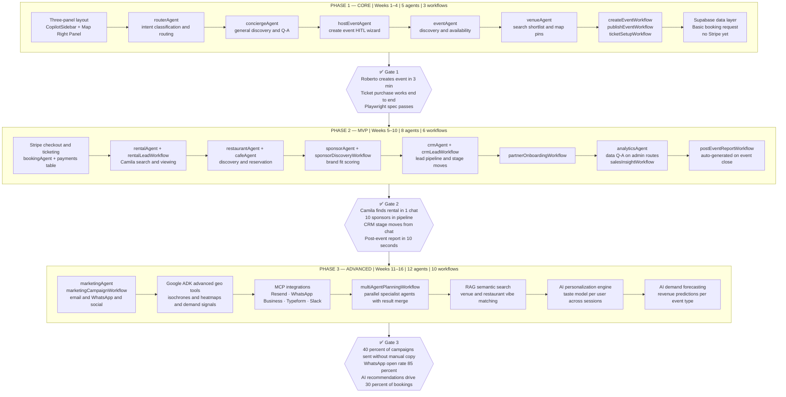

# AI-Native Marketplace — Mermaid Diagrams
> CopilotKit + Mastra + Supabase + Stripe + Google Maps + ADK

---

## Diagram 1 — Full System Architecture

---

## Diagram 2 — Consumer User Journey

---

## Diagram 3 — Partner User Journey

---

## Diagram 4 — Data Flow: Chat to Response

---

## Diagram 5 — Booking Flow: Request to Payment

---

## Diagram 6 — Agent Routing Workflow

---

## Diagram 7 — Data Model (ERD)

---

## Diagram 8 — Human Approval (HITL) Flow

---

## Diagram 9 — Maps and Location Intelligence Flow

---

## Diagram 10 — Product Roadmap: Core → MVP → Advanced

---

*Cross-reference: [`ai-native-marketplace-plan.md`](./ai-native-marketplace-plan.md) · [`ai-dashboard-plan.md`](./ai-dashboard-plan.md)*
