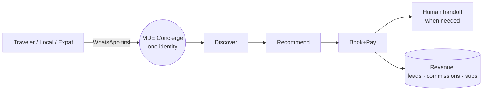
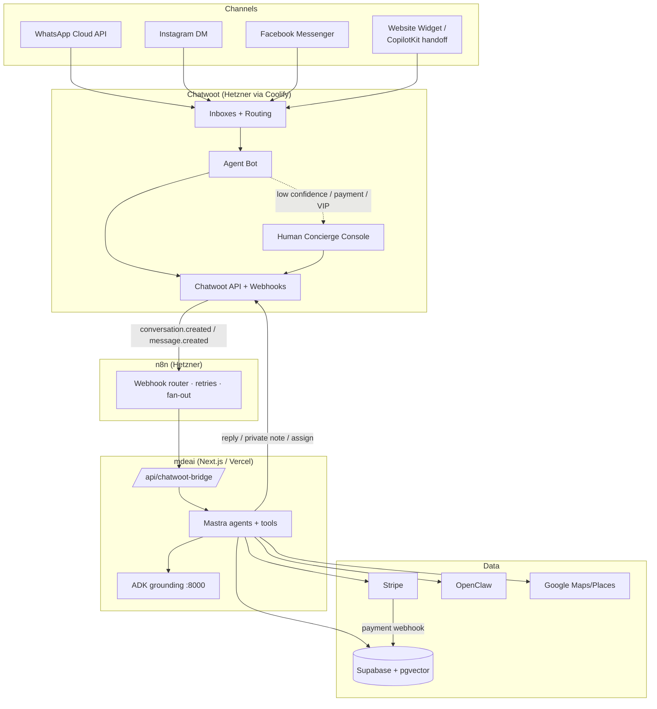
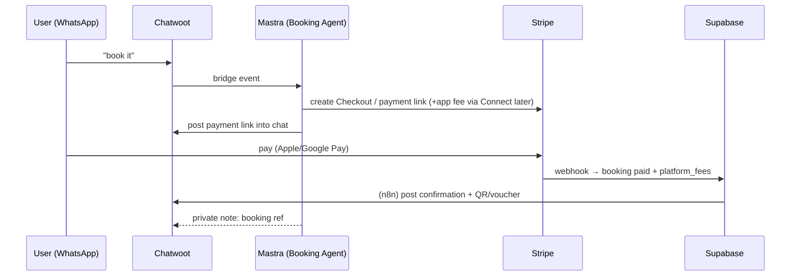

# PRD & Plan — Chatwoot Omnichannel Concierge for mdeai

> **What this is:** the complete strategy, architecture, PRD, workflows, agents, automations, and implementation plan for adding **Chatwoot** as the omnichannel conversation + human-handoff + CRM layer for mdeai — turning the existing AI concierge into a **GuideGeek-style, WhatsApp-first AI concierge** for rentals, restaurants, cafes, nightlife, events, trips, and relocation.
> **Grounded in the real codebase:** existing `whatsapp_*` tables + `wa_outbox`, `conciergeAgent` (+ rental/event/router agents), `chat-lead-capture` edge, G1 (ticket checkout) / G2 (lead capture) gates, `leads`, `sponsor.*`, Stripe ticketing. Pairs with [`strategic-audit.md`](../strategic-audit.md) and [`task-backlog.md`](../task-backlog.md).
> **Infra:** self-hosted Chatwoot on **Hetzner via Coolify**, glued with **n8n**, reasoning by **Mastra/Gemini**, data in **Supabase/pgvector**, payments via **Stripe**.

## Contents
1. [Executive Summary](#1-executive-summary) · 2. [Product Vision](#2-product-vision) · 3. [Architecture](#3-chatwoot-architecture) · 4. [Channel Strategy](#4-channel-strategy) · 5. [Core Features](#5-core-chatwoot-features) · 6. [Advanced Features](#6-advanced-chatwoot-features) · 7. [AI Agents](#7-ai-agent-architecture) · 8. [WhatsApp Workflows](#8-whatsapp-workflows) · 9. [Data Architecture](#9-data-architecture) · 10. [Revenue](#10-revenue-generation) · 11. [Booking Architecture](#11-booking-architecture) · 12. [OpenClaw](#12-openclaw-integration) · 13. [CopilotKit](#13-copilotkit-integration) · 14. [PRD](#14-prd) · 15. [Roadmap](#15-roadmap) · 16. [Implementation Order](#16-implementation-order) · 17. [MVP](#17-mvp-recommendation) · 18. [Competitive Analysis](#18-competitive-analysis) · 19. [Final Recommendations](#19-final-recommendations)

---

## 1. Executive Summary

| Question | Answer |
|---|---|
| **Role Chatwoot plays** | The **omnichannel front door + human-handoff + conversation CRM**. It receives WhatsApp/Instagram/Facebook/web messages, runs them through an **Agent Bot** (→ Mastra), and escalates to **human concierges** when AI confidence is low or money/trust is on the line. |
| **Why it's needed** | mdeai already has `whatsapp_*` tables but **no live send/receive loop, no human handoff, no agent console, no omnichannel inbox, no CSAT/SLA/routing**. Building that from scratch is months of undifferentiated work. |
| **Build vs buy** | **Buy (self-host).** Chatwoot is open-source (MIT-ish, self-hostable on Hetzner/Coolify → no per-seat SaaS fees, full data ownership). It ships the inbox, agent apps, routing, macros, CSAT, campaigns, audit logs, and a clean Agent-Bot/webhook API. **Building custom = 3–6 months; Chatwoot = days to a working inbox.** |
| **How it improves mdeai** | (1) Real WhatsApp-first concierge with human fallback; (2) every conversation becomes a tracked lead/contact; (3) operators/brokers get a console; (4) unlocks campaigns + re-engagement (the `wa_outbox` use case); (5) keeps the AI (Mastra) and the channel plumbing (Chatwoot) cleanly separated. |

**One-line thesis:** *Chatwoot is the channel + human layer; Mastra is the brain; Supabase is the memory; Stripe is the till. Don't rebuild the channel layer — own it via Chatwoot and point it at the brain you already have.*

---

## 2. Product Vision

**Build a GuideGeek-style, WhatsApp-first AI concierge for Medellín** — a single conversational identity ("MDE") reachable on WhatsApp/IG/FB/web that can discover, recommend, book, and hand off to humans across every vertical.

| Vertical | Concierge promise | Revenue hook |
|---|---|---|
| Rentals | "2BR Laureles under $1,500, viewing booked" | Lead fee, lease commission |
| Restaurants | "Table for 4 at 8pm, confirmed" | Reservation fee, retainer |
| Cafes | "Best specialty coffee near you, open now" | Featured, loyalty |
| Nightlife | "VIP table at X tonight, deposit paid" | 10–15% table fee |
| Events | "Salsa tickets, QR in your chat" | 5%+$0.40 commission |
| Trips | "3-day itinerary, all booked" | Bundle take-rate |
| Relocation | "Apartment + SIM + bank + tour, handled" | Premium package |
| Concierge | "Anything, anytime, in Spanish or English" | Premium subscription |

**How Chatwoot supports it:** it is the persistent thread where this identity lives across channels, retains context per contact, lets a human seamlessly step in (the trust differentiator vs pure bots), and records every interaction as CRM data the AI and operators reuse.



---

## 3. Chatwoot Architecture



| Component | Responsibility |
|---|---|
| **Channels** | Capture inbound across WhatsApp/IG/FB/web; deliver outbound replies |
| **Chatwoot inboxes** | One inbox per channel; route to teams/bot; persist thread + contact |
| **Agent Bot** | Default responder; calls the bridge; posts AI replies; can flag for handoff |
| **n8n** | Resilient webhook router (retries, dedupe, fan-out to Stripe/Supabase/notifications); keeps Next.js endpoints thin |
| **Bridge (`/api/chatwoot-bridge`)** | Maps Chatwoot events → Mastra agent run with contact context; maps Mastra output → Chatwoot reply/assign/label |
| **Mastra** | Reasoning + tools (search, grounding, checkout, lead capture) |
| **Supabase** | Source of truth for business data (leads/bookings/payments/listings) + `agent_memory` (pgvector) |
| **Stripe** | Checkout/Connect/Billing; payment links delivered into the chat |
| **OpenClaw** | Compliant discovery/aggregation where no API exists |
| **Human concierge** | Escalation target for trust/complex/high-value flows |

> **Source-of-truth rule:** Chatwoot owns the *conversation*; Supabase owns the *business object*. Sync via `contact.custom_attributes` (store `mde_contact_id`) and a `conversations` mirror table.

---

## 4. Channel Strategy

| Channel | Use cases | Workflow | Advantages | Conversion | Priority |
|---|---|---|---|---|---|
| **WhatsApp** | Primary concierge, bookings, leads, re-engagement | Inbound → Bot → Mastra → reply / payment link / handoff | Default channel in Colombia; 90%+ open rates; payment links inline | Highest — direct path to booking | **P0** |
| **Instagram DM** | Discovery from content, nightlife/events/fashion | Story/post reply → Bot → recommend → push to WhatsApp for booking | Visual verticals; younger audience | Medium — funnel to WA | **P1** |
| **Facebook Messenger** | Expat groups, events, older demo | Same bot pipeline | Expat community reach | Medium | **P2** |
| **Website widget / CopilotKit handoff** | Logged-in web concierge → human escalation | CopilotKit chat → "talk to human" → Chatwoot web inbox | Unifies web + messaging in one console | Supports high-intent web users | **P1** |

**Rules of engagement:**
- WhatsApp = transactional + opt-in marketing (official Cloud API, approved templates, honor STOP — reuse `whatsapp_subscriptions`).
- IG/FB = discovery → **always funnel to WhatsApp** for the booking/payment step.
- Web widget is *not* a replacement for CopilotKit — it's the **handoff destination** when the web concierge needs a human.

### 4.1 WhatsApp compliance requirements (mandatory — ban risk if ignored)

> These are production-blocking. Violating the 24-hour window is one of the most common causes of WhatsApp Business Account bans. Hardening detail in [`chatwoot-setup-review.md §2`](chatwoot-setup-review.md).

- **24-hour customer service window:** free-form replies are allowed only within 24h of the user's last inbound message. **Outside the window, send only Meta-approved templates.** The bot/bridge (§7) must check conversation window state before any free-form reply and fall back to a template (or suppress) when outside it.
- **Template approval:** submit re-engagement/proactive templates for Meta approval early (hours–days).
- **Opt-in:** proactive messaging requires documented opt-in — reuse `whatsapp_subscriptions` as the consent ledger (Ley 1581).
- **STOP handling:** honor unsubscribe immediately; suppress further messaging.
- **Rate-limit tiers:** new WABAs start at ~250 conversations/day and scale with quality rating — plan campaign volume accordingly.

---

## 5. Core Chatwoot Features (how mdeai uses each)

| Feature | mdeai usage |
|---|---|
| **Inboxes** | One per channel (WA / IG / FB / Web). Each routes to the Agent Bot first. |
| **Teams** | `Concierge`, `Rentals/Brokers`, `Events`, `Sales/Ops`. Handoffs route by intent label. |
| **Agents** | Human concierges + operator/broker seats (limited inbox access via custom roles). |
| **Labels** | `intent:rental/event/restaurant/nightlife/trip/relocation`, `stage:lead/qualified/booked`, `vip`, `needs-human`. Drives routing + analytics. |
| **Custom attributes (contact)** | `mde_contact_id`, `lang`, `budget`, `neighborhood`, `nomad`, `ltv`, `last_booking`. Feeds Mastra context. |
| **Custom attributes (conversation)** | `intent`, `listing_id`/`event_id`, `quote`, `payment_status`, `ai_confidence`. |
| **Contacts** | Unified profile across channels = the CRM contact; mirrors to Supabase `contacts`. |
| **Macros** | One-click human flows: "Send rental shortlist", "Send payment link", "Escalate to broker". |
| **Canned responses** | Bilingual templates for FAQs, deposit terms, viewing logistics. |
| **Business hours** | After-hours → bot-only + "a human replies at 9am"; SLA paused. |
| **Conversation status** | `open` (bot/human active) · `pending` (awaiting customer) · `snoozed` (follow-up) · `resolved` → triggers CSAT. |
| **Notes (private)** | Mastra posts reasoning/lead score as a private note for the human. |
| **Assignments** | Bot self-assigns; on `needs-human` reassign to team round-robin. |
| **Routing** | Label/intent → team; VIP/high-value → senior concierge. |
| **Webhooks** | `conversation.created`, `message.created`, `conversation.status_changed` → n8n → bridge. |
| **Automation rules** | "If label=rental & qualified → assign Brokers + notify"; "If 24h no reply → snooze + WhatsApp re-engage". |

---

## 6. Advanced Chatwoot Features — MVP vs Advanced

| Feature | Recommendation | When |
|---|---|---|
| **Agent Bots** | **MVP** — the core AI pipeline | P1 |
| **AI Agents (Captain)** | Advanced — evaluate; we use Mastra as the brain, not Chatwoot's native AI | Phase 4 |
| **SLA** | MVP-lite (response-time targets for human team) | Phase 2 |
| **Campaigns** | MVP for WhatsApp re-engagement (replaces `wa_outbox` cron) | Phase 3 |
| **CSAT** | MVP — measure concierge quality from day one | Phase 2 |
| **Custom dashboards** | Advanced — ops/revenue dashboards | Phase 4 |
| **Required conversation attributes** | MVP — force `intent` capture for routing/analytics | Phase 1 |
| **Audit logs** | MVP — compliance (Ley 1581) | Phase 1 |
| **Analytics** | MVP-lite → Advanced (custom) | Phase 2→4 |
| **Mobile apps** | MVP — concierges work from phones | Phase 1 |
| **API integrations** | MVP — the bridge depends on it | Phase 1 |

---

## 7. AI Agent Architecture

> Reuse/extend the existing Mastra agents. New agents map to the backlog's Sales/Lead/Marketing agents. Each runs behind the bridge with the Chatwoot contact + history as context.

| Agent | Responsibilities | Tools | Workflow | Data required | Handoff rules |
|---|---|---|---|---|---|
| **Router** `[exists]` | Classify intent, dispatch | `classify-intent`, `extract-intent-slots` | `concierge-routing` | message, contact attrs | n/a (internal) |
| **Rental** `[exists]` | Search, shortlist, schedule viewing | `search-rentals`, `capture_lead` | `rental-search` → G2 | apartments, neighborhoods | → Broker on qualified/price nego |
| **Restaurant** `[exists]` | Discover, reserve | `search-restaurants`, `book_request` | booking-request | restaurants, hours | → human on special requests |
| **Nightlife** `[gap]` | VIP tables, guest list | `search-venues`, `create_checkout` (deposit) | VIP booking | venues, signals | → human for large groups/VIP |
| **Event** `[exists]` | Discover, ticket | `search-events`, `create_checkout` | G1 ticketing | events, tickets | → human on group/refund |
| **Concierge** `[exists]` | General Q&A, multi-vertical orchestration | grounding tools | concierge-routing | all | → human on ambiguity/low confidence |
| **Booking** `[gap]` | Own checkout/payment-link lifecycle | `create_checkout`, `apply_promo` | checkout | pricing, Stripe | → human on payment failure/dispute |
| **Broker** `[gap]` | Operator-facing: lead routing, follow-up | `qualify_lead`, `enrich_contact` | lead qualify→bill | leads, landlord_inbox | human broker is the endpoint |
| **Memory** `[gap]` | Persist/recall preferences across sessions | `read/write_memory` (pgvector) | memory | agent_memory | n/a |
| **Operations** `[gap]` | Re-engagement, campaigns, SLA nudges | `wa_campaign`, `schedule_followup` | automation | conversations, outbox | escalate stuck convos |

**Handoff confidence model:** Mastra returns `{reply, confidence, intent, needs_human}`. If `needs_human || confidence < 0.6 || intent ∈ {payment_dispute, complaint, vip, complex_relocation}` → add `needs-human` label, assign team, post private note. Otherwise bot replies directly.

**WhatsApp window check (mandatory in the bridge):** before any free-form WhatsApp reply, the bridge must check the 24-hour customer-service window (§4.1). Inside the window → reply normally; outside → send an approved template or suppress. Never emit a free-form WhatsApp message outside the window.

---

## 8. WhatsApp Workflows

Legend per flow: **U**ser · **AI** (Mastra) · **CW** (Chatwoot) · **M**astra tools · **H**uman.

### 8.1 Rental inquiry
```text
U: "2BR Laureles under $1500"
CW: inbox→bot, create contact, label intent:rental
AI: Router→Rental; M: search-rentals (+grounding); reply 3 cards + photos
U: picks one → "can I see it Saturday?"
AI: capture_lead (G2) → Supabase leads; CW: label stage:qualified
CW automation: assign Brokers team + private note (lead score, budget)
H: broker confirms viewing; CW: status pending → resolved → CSAT
$$: qualified-lead fee billed (lead_billing)
```

### 8.2 Restaurant booking
```text
U: "table for 4 tonight 8pm, steak"
AI: Restaurant; M: search-restaurants; propose 2; book_request
CW: conversation attr listing_id, payment_status=n/a
AI: confirm via WhatsApp template; if no API → H confirms with venue
$$: reservation fee / retainer attribution
```

### 8.3 Nightlife concierge
```text
U: "rooftop bottle service tonight"
AI: Nightlife; propose venues + min spend
AI: Booking agent → create_checkout (deposit) → Stripe payment link in chat
U: pays (Apple/Google Pay) → webhook → booking confirmed
CW: label stage:booked, vip if spend>threshold → senior concierge note
$$: 10–15% table fee
```

### 8.4 Event ticketing
```text
U: "salsa tickets this weekend"
AI: Event; M: search-events; create_checkout (G1)
U: pays → ticket-payment-webhook → QR delivered into WhatsApp
$$: 5% + $0.40 commission; upsell VIP via Sales/Booking agent
```

### 8.5 Relocation assistance (premium)
```text
U: "moving to Medellín for 3 months, need apartment + essentials"
AI: Concierge orchestrates: Rental(lead) + Trip(bundle) + checklist
CW: label relocation, vip; assign senior concierge early (high-touch)
H: concierge manages multi-step; AI drafts, human approves
$$: relocation package ($300–$1,500) + rental commission
```

### 8.6 General concierge
```text
U: open-ended question
AI: Concierge + grounding; answer or route to a vertical agent
If ambiguous/low confidence → needs-human → CW assign
Memory agent stores prefs for next time
```

---

## 9. Data Architecture (Supabase)

> Chatwoot holds conversations; Supabase holds business objects + memory. Mirror minimal conversation metadata for joins/analytics.

| Table | Key columns | Relationships | Indexes | Vector |
|---|---|---|---|---|
| `contacts` `[gap/mirror]` | id, chatwoot_contact_id, channels[], lang, ltv, nomad | ←leads, bookings, conversations | chatwoot_contact_id (uniq), email/phone | — |
| `conversations` `[gap/mirror]` | id, chatwoot_conv_id, contact_id, intent, stage, assignee, status | →contacts | chatwoot_conv_id (uniq), (contact_id), (stage) | — |
| `leads` `[exists]` | id, contact_id, intent, listing_id, score, billed | →contacts, apartments | (contact_id),(stage),(billed) | — |
| `bookings` `[exists]` | id, contact_id, type, ref_id, amount, status, payment_intent | →contacts | (contact_id),(status) | — |
| `restaurants` `[exists]` | id, name, geo, hours, embedding | — | gist(geo) | restaurant_embeddings |
| `rentals/apartments` `[exists]` | id, neighborhood, price, geo, embedding | →leads | gist(geo),(neighborhood,price) | listing_embeddings |
| `events` `[exists]` | id, slug, date, geo, embedding | →bookings(tickets) | (date), gist(geo) | event_embeddings |
| `venue_signals` `[exists]` | venue_id, signal, score, ts | →venues | (venue_id) | — |
| `itineraries` `[gap]` (trips) | id, contact_id, items[], budget | →contacts, trip_items | (contact_id) | — |
| `payments` `[exists]` | id, booking_id, stripe_id, amount, fee | →bookings | (booking_id) | — |
| `concierge_requests` `[gap]` | id, contact_id, type, status, assignee, sla_due | →contacts | (status),(sla_due) | — |
| `agent_memory` `[gap]` | id, contact_id, kind, content, embedding | →contacts | (contact_id) | **embedding (pgvector)** |

**Vector search opportunities:** semantic listing/event/restaurant match (exists); **`agent_memory`** for "remember I hate reggaeton / I'm vegetarian / budget $1,200"; semantic FAQ/canned-response retrieval for the bot.

---

## 10. Revenue Generation

| Stream | Complexity | Revenue potential | MVP vs Advanced |
|---|---|---|---|
| Rental lead fees | Low | $$$ ($30–$200/qualified) | **MVP** |
| Broker subscriptions | Low–Med | $$ ($99–$299/mo) | **MVP** |
| Restaurant commissions/retainers | Low | $$$ ($300–$1,200/mo) | **MVP** |
| Nightclub commissions | Med | $$$ (10–15% table) | **MVP+** |
| Event commissions | Med | $$ (5%+fee) | MVP+ (G1 exists) |
| Featured placements | Low | $$ (90% margin) | **MVP** (use `sponsor.*`) |
| Sponsored listings | Low | $$ | MVP+ |
| Premium concierge | Med | $$ ($19–$29/mo consumer) | Advanced |
| Relocation packages | Med | $$$ ($300–$1,500) | Advanced (high-touch) |
| Subscriptions (business) | Med | $$$ recurring | MVP+ |

> **Fastest cash through Chatwoot:** rental lead fees + restaurant retainers + featured placements — all monetize conversations the bot already handles, no marketplace rail required.

---

## 11. Booking Architecture



| Booking type | Rail | Notes |
|---|---|---|
| Restaurant reservation | Request flow (often no payment) | confirm via template/human; fee on attribution |
| Rental viewing | Lead (G2), no payment | bill on qualify; deposit later via Connect |
| VIP table | Stripe Checkout **deposit** | 10–15% fee; refundable rules |
| Event ticket | Stripe Checkout (G1, exists) | QR into chat; webhook = truth |

**Rule:** payment links are generated by Mastra and **delivered inside the Chatwoot thread**; Stripe webhook (not the chat) flips booking state.

---

## 12. OpenClaw Integration

| Use | OpenClaw or API? | Recommendation |
|---|---|---|
| Restaurant/venue discovery | **API** (Google Places) | Use API; OpenClaw only for gaps |
| Event discovery | API + grounding first | OpenClaw for sites without feeds |
| Rental aggregation (Fincaraíz/Metrocuadrado-style) | **OpenClaw** (no public API) | Browser automation to populate listings — **compliant, rate-limited, attributed** |
| Influencer/business discovery | OpenClaw + opt-in | Feed agency pipeline |
| Booking automation on 3rd-party sites | OpenClaw (last resort) | Prefer partner APIs; legal review |

**Guardrails:** Ley 1581 (Habeas Data) + site ToS. OpenClaw is for **discovery/aggregation where no API exists**, never for scraping personal data or cold-contacting. Prefer official APIs and partner feeds; document lawful basis.

---

## 13. CopilotKit Integration

Chatwoot and CopilotKit **coexist**: CopilotKit is the rich **web** concierge (cards, maps, generative UI); Chatwoot is **messaging + human handoff**. They share the Mastra brain and Supabase memory.

| Surface | Tech | Behavior |
|---|---|---|
| Web chat experience | CopilotKit on `/` | Full AI concierge with cards/maps |
| Conversational search | Mastra tools (shared) | Same agents as WhatsApp |
| AI cards | CopilotKit generative UI | Rental/event/restaurant cards + CTA |
| Maps integration | vis.gl + single-pin-writer | Pins from agent path only |
| Recommendation UI | CopilotKit render | Comparison + insights |
| **Human handoff UI** | CopilotKit → Chatwoot web inbox | "Talk to a human" creates a Chatwoot conversation with full transcript; concierge replies in the same widget |

> **Shared-brain principle:** one set of Mastra agents/tools serves both CopilotKit (web) and the Chatwoot bridge (messaging). No duplicated logic.

---

## 14. PRD

**Goals:** (1) live WhatsApp-first concierge with human fallback; (2) every conversation → tracked lead/contact; (3) monetize via leads/retainers/commissions; (4) operator/broker console; (5) keep AI and channel layers decoupled.

**Users & personas:**

| Persona | Need |
|---|---|
| **Camila** (tourist/expat) | Fast bilingual recommendations + booking on WhatsApp |
| **Andrés** (local) | Events, nightlife, tickets |
| **Diego** (broker/operator) | Qualified leads + a console to respond |
| **Sofía** (human concierge) | One inbox, full context, easy handoff |
| **Roberto** (event host) | Reach + ticketing (existing) |

**Core features:** omnichannel inbox · Agent Bot → Mastra bridge · intent routing/labels · lead capture + scoring · payment links in chat · human handoff · CSAT · WhatsApp campaigns · contact CRM + memory.

**Functional requirements (selected):**
- FR1 Inbound from WA/IG/FB/web lands in Chatwoot and triggers the bot < 3s.
- FR2 Bot calls Mastra with contact + last-N messages; replies in user's language.
- FR3 `needs-human`/low-confidence escalates with private-note context.
- FR4 Booking/lead writes to Supabase; payment via Stripe webhook truth.
- FR5 All PII handling Ley-1581 compliant; opt-in + STOP honored.

**Success metrics / KPIs:**

| KPI | Target |
|---|---|
| Bot containment (no human needed) | > 60% |
| Median first response | < 5s (bot), < 5min (human, business hours) |
| Lead conversion (chat → qualified) | > 25% |
| Booking conversion (qualified → paid) | > 15% |
| CSAT | > 4.4/5 |
| Revenue / 100 conversations | track + grow |
| Re-engagement campaign CTR | > 10% |

---

## 15. Roadmap

| Phase | Objectives | Deliverables | Dependencies | Milestone | Risks |
|---|---|---|---|---|---|
| **1 — Core Foundation** | Stand up Chatwoot + WhatsApp + bot pipeline | Coolify/Hetzner deploy, WA Cloud API inbox, `/api/chatwoot-bridge`, contact mirror, audit logs | WA Business verification | First AI reply on WhatsApp | WA approval delays |
| **2 — MVP** | Real leads + handoff + quality | Rental + restaurant flows, G2 lead capture, human handoff, CSAT, SLA-lite, mobile apps | Phase 1 | First billed lead | Handoff UX rough edges |
| **3 — Monetization** | Turn convos into cash | Lead billing, restaurant retainers, featured (`sponsor.*`), payment links in chat, WhatsApp campaigns | Stripe Billing | First $ from chat | Pricing/packaging |
| **4 — Intelligence Layer** | Memory + analytics | `agent_memory` (pgvector), custom dashboards, confidence model tuning | Phase 2 data | Personalized replies | Memory quality |
| **5 — Automation Layer** | Hands-off ops | n8n automations, re-engagement, no-show/follow-up, Operations agent | Phases 2–3 | < 40% human load | Over-automation/spam |
| **6 — Advanced AI Concierge** | Full GuideGeek parity | Nightlife/event checkout via Connect, trip bundles, relocation packages, IG/FB scale | Connect (backlog M1) | Multi-vertical bookings | Marketplace complexity |

---

## 16. Implementation Order (Day 1 → production)

**Build first (Week 1–3):**
1. Deploy Chatwoot on Hetzner via Coolify (Postgres, Redis, object storage).
2. Connect **WhatsApp Cloud API** inbox + verify business.
3. Build **`/api/chatwoot-bridge`** (Chatwoot webhook → Mastra → reply). Start with **n8n** as the resilient router.
4. Mirror **contacts/conversations** to Supabase; set required `intent` attribute.
5. Wire **Router + Concierge + Rental** agents (already exist) to the bridge.

**Then (Week 3–6):**
6. **G2 lead capture** in the rental flow → `leads` → human handoff to Brokers team.
7. **Restaurant** flow + booking requests; canned responses + macros bilingual.
8. **CSAT** + business hours + audit logs.

**Delay:** Stripe Connect, nightlife/event checkout in chat (until G1 checkout tool is reused), custom dashboards, Chatwoot native "Captain" AI (we use Mastra).

**Don't build yet:** trip bundles, relocation packages, IG/FB scale, multi-city.

**Quick wins / highest ROI:** WhatsApp bot containment + rental lead billing + restaurant retainers + featured placements. All monetize existing conversations with no marketplace rail.

---

## 17. MVP Recommendation (smallest revenue-generating slice)

> **Chatwoot + WhatsApp + Mastra + Google Places + Supabase. One vertical: Rentals.**

```text
WhatsApp → Chatwoot inbox → Agent Bot → bridge → Mastra(Rental+grounding)
→ 3 listings → schedule viewing → G2 lead → Supabase → human broker handoff
→ bill qualified lead
```

**Why this MVP:**
- Uses the **strongest existing assets** (rental agent, grounding, `leads`, `chat-lead-capture`).
- **Generates real revenue immediately** (qualified-lead fees + broker subscriptions) with **no payment rail** beyond a Stripe invoice.
- Proves the **bot → human handoff** loop that differentiates from pure bots.
- One channel (WhatsApp), one vertical (rentals) = fastest to production, then clone the pattern to restaurants/events.

**Explicitly out of MVP:** IG/FB, in-chat card payments, Connect, trips, relocation, dashboards.

---

## 18. Competitive Analysis

| Platform | Model | Copy | Improve | They miss |
|---|---|---|---|---|
| **GuideGeek** (WhatsApp travel AI) | Free WA travel assistant; B2B licensing | WhatsApp-first UX, instant value, personality | Add **booking + payments + local supply** (they mostly inform) | Transactions, local marketplace, human handoff |
| **Airbnb messaging** | In-app host↔guest threads | Structured booking context, reliability | Cross-vertical concierge, proactive AI | Off-platform discovery, non-stay verticals |
| **Travel AI assistants** (Mindtrip/Layla etc.) | App-based itinerary AI | Itinerary UX, rich cards (CopilotKit already strong) | Be **WhatsApp-native + bookable + local** | WhatsApp distribution, real local supply, human trust layer |
| **Concierge platforms** (luxury) | Human + premium fee | High-touch trust | **AI-scale the human concierge** at SMB price | Scale, affordability, breadth |

**mdeai differentiation:** *WhatsApp-first (GuideGeek) + bookable/payments (Airbnb) + rich web UI (CopilotKit) + real local Medellín supply + AI-scaled human concierge (Chatwoot handoff) — in Spanish-first.* No competitor combines all five.

---

## 19. Final Recommendations

| Dimension | Score /10 | Note |
|---|---|---|
| Architecture | 9 | Clean separation: Chatwoot (channel) · Mastra (brain) · Supabase (memory) · Stripe (till). Reuses existing agents. |
| Scalability | 8 | Self-hosted Chatwoot + n8n on Hetzner scales; bridge is stateless; pgvector memory scales. |
| Complexity | 6 | Moderate — main effort is the bridge + handoff + WhatsApp approval; Chatwoot removes most channel work. |
| Implementation risk | 6 | WhatsApp Business approval + handoff UX are the real risks; mitigated by phasing. |
| Revenue potential | 9 | Monetizes the highest-intent surface (WhatsApp) with leads/retainers/commissions immediately. |

**Top priorities:** (1) Chatwoot+WhatsApp+bridge live; (2) rental lead MVP with human handoff; (3) lead billing + restaurant retainers + featured; (4) shared Mastra brain across CopilotKit + Chatwoot; (5) `agent_memory`.

**Biggest mistakes to avoid:**
- ❌ Rebuilding a channel layer instead of using Chatwoot.
- ❌ Duplicating AI logic between web (CopilotKit) and messaging — **one Mastra brain**.
- ❌ Letting Chatwoot become the business-data source of truth — **Supabase owns business objects**.
- ❌ Cold WhatsApp blasts / scraped contacts — instant ban + Ley 1581 liability.
- ❌ Building all channels/verticals at once — ship **WhatsApp + Rentals** first.
- ❌ Over-automating away the human handoff — it's the trust differentiator.

**Recommended final architecture:** *Self-hosted Chatwoot (Hetzner/Coolify) as omnichannel inbox + human handoff → n8n resilient bridge → stateless `/api/chatwoot-bridge` → shared Mastra agents/tools (also serving CopilotKit web) → Supabase (business objects + pgvector memory) + Stripe (in-chat payment links, webhook = truth) → OpenClaw only for API-less discovery.*

---

### Implementation checklist (Phase 1–2)
- [ ] Deploy Chatwoot via Coolify on Hetzner (Postgres, Redis, S3-compatible storage, backups).
- [ ] WhatsApp Cloud API inbox + business verification + templates approved.
- [ ] WhatsApp 24-hour window check in the bridge (§4.1) — template fallback outside the window.
- [ ] `/api/chatwoot-bridge` + n8n webhook router (retry/dedupe).
- [ ] Contact/conversation mirror tables + required `intent` attribute + audit logs.
- [ ] Wire Router/Concierge/Rental agents; bilingual replies.
- [ ] G2 lead capture → `leads`; handoff to Brokers team + private-note context.
- [ ] Confidence/handoff model (`needs_human`, `<0.6`, sensitive intents).
- [ ] CSAT + business hours + mobile app access for concierges.
- [ ] Lead billing (`lead_billing`) + first broker subscription.
- [ ] Ley 1581: privacy policy, opt-in, STOP handling.

> _Chatwoot Integration Plan v1 — pairs with [`strategic-audit.md`](../strategic-audit.md), [`task-backlog.md`](../task-backlog.md), [`revenue-engine-prd.md`](revenue-engine-prd.md). Ship WhatsApp + Rentals first._
