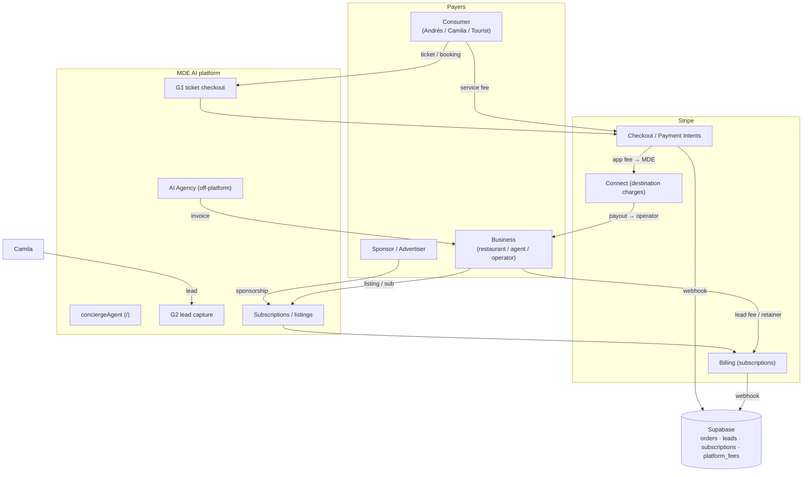
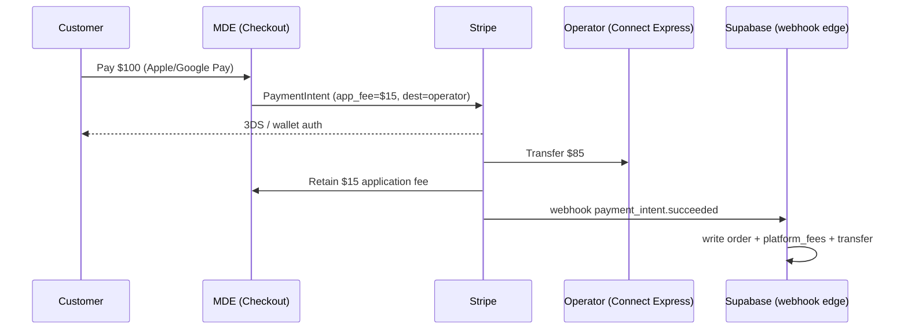

# PRD — MDE AI Revenue Engine, Monetization Workflows & State Transitions

> **Scope:** the monetization architecture for MDE AI mapped onto the *actual* platform — agents, gates (G1/G2), edges, tables, and Stripe. This is the **engineering/product** counterpart to the business strategy in [`revenue-strategy-v2.md`](../revenue-strategy-v2.md). Where strategy says *what to charge*, this PRD says *how the money moves, who pays, and what state changes*.
> **Grounded in:** [`docs/ARCHITECTURE.md`](../ARCHITECTURE.md) — `conciergeAgent` on `/`, gates **G1** (ticket checkout) + **G2** (lead capture), personas Camila / Roberto / Andrés, Stripe edges (W9), webhook → Supabase.
> **Currency:** USD; FX 4,000 COP/USD. Margins exclude Stripe fees unless noted (Stripe ≈ 2.9% + $0.30, or local Colombian rates).

## Contents
1. [Revenue architecture (the money-movement model)](#1-revenue-architecture)
2. [User-journey revenue maps + state transitions](#2-user-journey-revenue-maps--state-transitions)
3. [Stripe monetization architecture](#3-stripe-monetization-architecture)
4. [Subscription models](#4-subscription-models)
5. [OpenClaw revenue engine](#5-openclaw-revenue-engine)
6. [AI agency revenue](#6-ai-agency-revenue)
7. [Lead generation machine](#7-lead-generation-machine)
8. [MDE-specific monetization (concierge / maps / trips / venues)](#8-mde-specific-monetization)
9. [Financial model](#9-financial-model)
10. [Final deliverables: models, ranking, roadmap, paths](#10-final-deliverables)
11. [Data model & invariants for revenue](#11-data-model--invariants)

---

## 1. Revenue Architecture

### 1.1 Master revenue table

| Feature | User (persona) | Revenue Type | Who Pays | Frequency | Margin % | Surface / gate |
|---|---|---|---|---|---|---|
| Event tickets | Andrés (buyer) | Commission + service fee | Buyer (fee) + organizer (comm.) | Per ticket | 20–40% net | **G1** checkout |
| Restaurant bookings | Camila | Reservation fee / retainer | Restaurant | Per cover / monthly | 80–90% | Concierge → booking-request |
| Cafe bookings | Camila | Featured / loyalty sub | Cafe | Monthly | 85–95% | Concierge card |
| Nightlife reservations | Camila | VIP table fee / guest list | Venue (+ buyer) | Per booking | 85–95% | Concierge → booking-request |
| Rental leads | Camila | Lead fee | Agent / landlord | Per lead | 70–90% | **G2** lead modal |
| Rental bookings | Camila | Lease commission | Agent / tenant | Per lease | 80–90% | G2 → broker handoff |
| Tourism experiences | Tourist | Commission | Operator | Per booking | 15–20% take, ~80% margin on take | Concierge → booking |
| Fashion events | Attendee | Ticketing + booths | Organizer / vendor | Per event | 60–80% | G1 (fashion vertical) |
| Sponsors | Brand | Sponsorship | Sponsor | Per campaign | 90%+ | Map / concierge / event |
| Advertisers | Business | Ad / sponsored result | Advertiser | CPM / flat | 90%+ | Concierge result + map pin |
| Premium listings | Business | Featured placement | Business | Monthly | 90%+ | Map pin + card rank |
| AI services | Business | Setup + retainer | Business | One-off + monthly | 80–95% | Off-platform (agency) |
| WhatsApp automation | Business | Setup + retainer | Business | One-off + monthly | 75–90% | WhatsApp + Supabase |
| Marketplace transactions | All | Take-rate (Connect app fee) | Operator (from GMV) | Per transaction | 85% on take | Stripe Connect |

### 1.2 Money-movement diagram



### 1.3 Three revenue engines (by liquidity dependence)

| Engine | Liquidity needed? | Examples | Billing rail |
|---|---|---|---|
| **Services** (cash now) | No | AI agency, WhatsApp automation, retainers, premium listings | Stripe Billing / invoice |
| **Leads** (cash soon) | Low | Rental leads (G2), real-estate qualified leads, tourism leads | Stripe Billing (metered) |
| **Transactions** (cash at scale) | Yes | Tickets (G1), tours, nightlife, rentals, marketplace | Stripe Connect (app fee) |

> **Sequencing principle (from strategy):** stand up the **Services** and **Leads** engines first (revenue without liquidity), then the **Transactions** engine as GMV appears. The platform already has the surfaces — G2 for leads, G1 for transactions; this PRD wires money to them.

---

## 2. User-Journey Revenue Maps & State Transitions

Each journey shows: flow → revenue lines → **revenue state machine** → per-unit / per-month math.

### 2.1 Events (G1)

**Flow**
```text
Camila/Andrés: "Best salsa events this weekend"
→ conciergeAgent (intent: event_discovery)
→ eventAgent → search-events → Event cards + map pins
→ Event detail (/events/[slug])
→ G1 ticket checkout (booking-checkout-modal)
→ Stripe Checkout → Apple Pay / Google Pay
→ event_orders row + QR ticket (/me/tickets)
→ Event attendance (QR scan)
```

**Revenue lines:** ticket commission · buyer service fee · featured event fee · sponsor ads · VIP upgrades

**Revenue state machine**
```text
cart_created → checkout_started → payment_authorized → paid
  → ticket_issued → attended → settled (payout to organizer, app fee retained)
                              ↘ refunded / disputed (reverse app fee)
```

| Transition | Trigger | Side effects |
|---|---|---|
| `checkout_started → paid` | Stripe `payment_intent.succeeded` webhook | write `event_orders`, mint QR, record `platform_fees` |
| `paid → ticket_issued` | order webhook | email/WhatsApp QR |
| `paid → settled` | Connect transfer (T+n) | payout organizer minus app fee |
| `paid → refunded` | refund request | reverse transfer + app fee |

**Math (benchmarks: Eventbrite ~3.7%+$1.79; Fever/TicketTailor 2–5%; Luma free/Plus)**

| Metric | Value |
|---|---|
| Recommended take | **5% + $0.40 buyer-paid** |
| Revenue / $20 ticket | $1.00 + $0.40 = **$1.40** |
| + VIP upsell / featured | +$0.50–$2.00 effective |
| Revenue / 300-ticket event | ~$420 commission + $30–$120 featured = **~$450–$540** |
| Revenue / month (10 events) | **~$4,500–$5,400** |

### 2.2 Restaurants (booking request)

**Flow**
```text
Camila: "Best steakhouse in Medellín"
→ conciergeAgent (intent: restaurant_search) → search-restaurants
→ Restaurant card → detail panel
→ Reservation → booking_request → confirmation (WhatsApp)
```

**Revenue lines:** reservation fee · featured placement · sponsored listing · AI marketing package (retainer)

**State machine**
```text
request_created → sent_to_venue → confirmed → seated → billed
                                            ↘ no_show / cancelled
```

**Compare**

| Platform | Model | MDE position |
|---|---|---|
| OpenTable | $149–$449/mo + $1/cover | WhatsApp reservations, SMB-priced |
| Yelp | CPC ads | One AI answer that books |
| Tripadvisor | Ads + Viator comm. | AI planning vs static reviews |

> **Recommended:** lead with **free reservations** to win logos; monetize via **retainer ($300–$1,200/mo)** + **featured ($49–$199/mo)**. Reservation fee optional ($0.50/cover).

### 2.3 Rentals (G2)

**Flow**
```text
Camila: "2 bedroom apartment in Laureles under $1500"
→ conciergeAgent (intent: rental_search) → rentalAgent → search-rentals
→ Rental cards + map pins
→ Schedule Viewing (schedule-viewing-modal) → G2 lead capture
→ chat-lead-capture edge → leads row → broker handoff
→ Lease signed (commission event)
```

**Revenue lines:** lead fee · qualified-lead fee · lease commission · property marketing package

**State machine (the lead lifecycle — core to MDE)**
```text
lead_captured → enriched → qualified → delivered_to_broker → billed
   → viewing_scheduled → lease_signed → commission_invoiced
                                      ↘ disqualified (no charge) / expired
```

| Transition | Trigger | Billing event |
|---|---|---|
| `lead_captured → delivered` | G2 submit + enrichment | meter +1 raw lead ($10–$50) |
| `delivered → qualified` | budget + timeline + verified contact | bill qualified ($30–$200) |
| `qualified → lease_signed` | broker confirms close | invoice commission (50% first month) |

**Compare**

| Platform | Model |
|---|---|
| Zillow | Premier Agent leads (CPL/zip) |
| Realtor.com | Lead subscriptions |
| Airbnb / Booking | ~15% booking commission |

**Math:** 50 leads/mo × $100 avg = **$5,000/mo**; expat/nomad mid-term rentals are the high-WTP wedge.

### 2.4 Tourism (booking)

**Flow**
```text
Tourist: "Best coffee tour near Medellín"
→ conciergeAgent → search-attractions → Experience card
→ Booking → Stripe → confirmation (QR/voucher)
```

**Revenue lines:** experience commission (15–20%) · operator subscription · featured experiences

**State machine**
```text
booking_created → paid → voucher_issued → redeemed → settled (operator payout − app fee)
```

**Compare:** Viator ~25% · GetYourGuide ~20–30% · Airbnb Experiences ~20% → **MDE 15–20%** wins operators.

**Math:** 200 bookings × $50 × 15% = **$1,500/mo** take + transfers/featured upside.

### 2.5 Nightlife (booking request)

```text
Camila: "rooftop with bottle service tonight"
→ conciergeAgent → nightlife card → VIP table request → deposit (Stripe) → confirmed
```
**Revenue:** 10–15% of table min · guest-list $3–$8/head. 30 tables × $120 = **$3,600/mo**. Highest AOV line.

---

## 3. Stripe Monetization Architecture

### 3.1 Product mapping

| Stripe product | Use cases on MDE | Surface |
|---|---|---|
| **Checkout / Payment Intents** | Event tickets, experiences, fashion events, premium subscriptions, nightlife deposits | G1, booking modals |
| **Connect** | Pay out event organizers, tour operators, restaurants, rental agents | Marketplace transactions |
| **Billing** | Business subscriptions, retainers, metered leads | Subscriptions, agency |
| **Apple Pay / Google Pay** | Wallet acceleration on all Checkout flows | All consumer checkouts |

### 3.2 Connect charge-model decision

| Model | How | Pros | Cons | Fit for MDE |
|---|---|---|---|---|
| **Direct charges** | Charge on connected acct; MDE takes app fee | Operator owns dispute/PCI | Operator is merchant of record; weaker MDE control of UX | ❌ early |
| **Destination charges** | Charge on **MDE** account, auto-transfer to operator, retain `application_fee_amount` | MDE owns checkout UX + customer, single integration, easy app fee | MDE is merchant of record (dispute exposure) | ✅ **Recommended** |
| **Separate charges & transfers** | Charge customer, transfer to operators later | Multi-operator splits (guide + venue + MDE), delayed/condition payouts | More bookkeeping | ✅ for multi-party (trips, bundles) |

> **Recommendation:** **Destination charges with `application_fee_amount`** as the default (events, tours, nightlife, single-operator rentals). Use **separate charges & transfers** for **trip bundles** (multiple operators in one itinerary). Operators onboard via **Connect Express** (Stripe-hosted KYC).

### 3.3 Split-payment workflow ($100 example)

```text
Customer pays $100 (Checkout, Apple/Google Pay)
  → PaymentIntent on MDE account
  → application_fee_amount = $15  (MDE take)
  → transfer_data.destination = operator's connected account
  → Operator receives $85 (minus Stripe fee), MDE retains $15
  → webhook: payment_intent.succeeded
      → write event_orders / booking, platform_fees($15), connect_transfer($85)
```



### 3.4 Wallet conversion uplift

| Wallet | Mechanism | Expected uplift | MDE surfaces |
|---|---|---|---|
| **Apple Pay** | One-tap, biometric, no form | **+20–50%** mobile checkout conversion (Safari/iOS) | Tickets, reservations, tours |
| **Google Pay** | One-tap, saved cards | **+10–30%** Android/Chrome | Same |

> Enable both via Stripe Checkout / Payment Element automatically. Critical: MDE is mobile/WhatsApp-first and Medellín consumers are mobile-dominant → wallets materially lift G1 conversion. Always show wallet buttons above the card form.

### 3.5 Stripe invariants (revenue extension of ARCHITECTURE.md §5)

1. **Webhook is the source of truth.** Never mark an order `paid` from the client — only from the `payment_intent.succeeded` / `checkout.session.completed` webhook edge.
2. **No service-role keys in `src/**`.** Stripe secret + webhook handling live in **Supabase edge functions** only (matches existing invariant #4).
3. **Idempotency.** Every webhook handler keyed on Stripe event id; safe to replay.
4. **App fee recorded.** Every Connect charge writes a `platform_fees` row at webhook time.
5. **Reconciliation.** `platform_fees` + `connect_transfers` must reconcile to Stripe balance transactions nightly.

---

## 4. Subscription Models

### 4.1 Consumer

| Tier | Price | Features | Gate |
|---|---|---|---|
| **Free** | $0 | Full concierge, search, maps, booking, tickets | — |
| **Pro** | $5–$9/mo | Unlimited trip planning, saved collections, premium recommendations | `trips`, `saved_places` |
| **VIP** | $19–$29/mo | Concierge priority, exclusive events, no booking fees, partner perks | priority routing |

> Consumer subs are a **perks/loyalty layer**, never a paywall on discovery. Target expats/nomads with WTP.

### 4.2 Business

| Segment | Starter | Growth | Pro | Key features |
|---|---|---|---|---|
| Restaurant | $49 | $149 | $299 | Featured, analytics, lead dashboard, WhatsApp automation, AI marketing |
| Cafe | $29 | $79 | $149 | Featured, loyalty, promo blasts |
| Nightclub | $99 | $249 | $499 | VIP booking mgmt, guest list, sponsored placement |
| Tour Operator | $49 | $149 | $299 | Inventory, featured, booking automation |
| Rental Agency | $99 | $199 | $299 | Lead CRM, showing mgmt, AI qualification |
| Event Organizer | $49 | $149 | $299 | Ticket + attendee analytics, marketing automation |

Billing rail: **Stripe Billing**; annual prepay (2 months free); fair-use AI credits; dunning for involuntary churn.

---

## 5. OpenClaw Revenue Engine (discovery only)

> OpenClaw feeds the **supply + sales pipeline**; revenue is **indirect**. Compliance is non-negotiable (Colombia **Ley 1581/2012 Habeas Data**; Meta/Google ToS).

| Vertical | Discover | Revenue opportunity | Legal basis (allowed) | ROI |
|---|---|---|---|---|
| Restaurants | New venues, reviews, influencers | Agency leads; influencer brokerage ($200–$1k/campaign) | Google Places API, IG Graph API, opt-in | High (fills agency funnel) |
| Fashion | Designers, models, influencers | Talent sourcing fee; Colombiamoda intel | Public registries, opt-in | Medium |
| Events | Organizers, sponsors, venues | Ticketing supply; sponsor outreach | Public listings, opt-in | High |
| Real estate | Landlords, agents, brokers | Agent subscriptions; lead buyers | Cámara de Comercio, opt-in | High |

**Compliance requirements (build once):**
- Official APIs + public registries (RNT, Cámara de Comercio) + **opt-in lead magnets only**. **No scraping** against ToS.
- Privacy policy + registered processing purpose + documented lawful basis per record + deletion support.
- WhatsApp outreach: official Business API, opt-in, approved templates, honor STOP. **No cold blasts to discovered numbers.**

**Monetizable spin-offs:** market-intelligence reports ($500–$2,500), influencer/talent discovery brokerage, competitor-landscape dashboards (bundled in Pro/Enterprise).

---

## 6. AI Agency Revenue

Same stack as the product (CopilotKit · Mastra · Gemini/OpenAI · WhatsApp · Supabase) → near-zero marginal delivery cost.

| Service | Setup fee | Monthly | Margin | Difficulty |
|---|---|---|---|---|
| AI chatbots / concierge | $300–$1,000 | $199–$899 | 80–90% | Easy |
| WhatsApp automation | $200–$800 | $149–$699 | 75–90% | Easy |
| Review management | $50–$150 | $99–$299 | 85%+ | Easy |
| Lead qualification agent | $300–$1,000 | $199–$799 | 80%+ | Medium |
| Social media AI | $100–$300 | $149–$599 | 85%+ | Easy |
| Booking automation | $300–$1,200 | $149–$699 | 80%+ | Medium |
| Event marketing | $150–$600/event | — | 80%+ | Easy |
| Fashion marketing | $300–$1,500 | $199–$799 | 80%+ | Medium |
| Tourism marketing | $200–$1,000 | $199–$699 | 80%+ | Medium |

**Bundles:** Starter $249 · Growth $699 · Pro Agency $1,499 · Enterprise $2,500–$8,000/mo.
**Goal:** 10 clients × $500 = **$5,000 MRR** in weeks. This is the fastest cash and the supply-acquisition channel.

---

## 7. Lead Generation Machine

| Source | Type | Cost / lead | Close rate | Revenue potential |
|---|---|---|---|---|
| Google SEO + Maps SEO | Organic | $10–$40 | 3–6% | Very high |
| AI search (ChatGPT/Gemini, GEO) | Organic | Low | — | Rising |
| Programmatic SEO (venue/event/rental pages) | Organic | $10–$40 | 2–5% | Very high |
| Instagram / TikTok (dogfooded) | Social | $20–$80 | 1–3% | High |
| LinkedIn | Social | $60–$150 | 2–5% | Medium (B2B) |
| Hotels / coworking spaces | Partnership | rev-share | 10–25% | High |
| Universities / fashion schools | Partnership | Low | — | Medium |
| Meta Ads | Paid | $25–$70 | 2–4% | Medium |
| Google Ads | Paid | $40–$120 | 2–6% | Medium (high-AOV only) |
| WhatsApp referral loops | Owned | very low | 5–15% | High |

**Two funnels:** consumer (SEO/social → concierge → booking) and business (free AI audit → retainer). **Cheapest CAC = dogfooding** — every asset MDE generates for itself demos the agency product.

---

## 8. MDE-Specific Monetization

The platform's unique asset: **one conversational surface** (`conciergeAgent`) routing every vertical. Monetize the *conversation*, the *map*, the *trip*, and the *venue graph*.

### 8.1 AI Concierge — every conversation generates revenue

| Conversation outcome | Revenue hook | Mechanism |
|---|---|---|
| Recommendation | Affiliate / featured | Sponsored result + commission |
| Booking/reservation | Take-rate / reservation fee | G1 / booking-request |
| Ticket | Commission + service fee | G1 |
| Rental interest | Lead fee | G2 |
| Trip planning | Premium AI planning | Consumer Pro/VIP |
| "Find me X" | Lead routed to paying business | Lead billing |

> **Design rule:** every concierge result card carries a **monetizable CTA** (book / reserve / lead / ticket) and a **placement signal** (organic vs featured). The agent should always have at least one revenue-bearing next step.

### 8.2 Maps — Maps-first = placement marketplace

| Map asset | Revenue | Note |
|---|---|---|
| Sponsored pins | Featured placement $49–$149/mo | Honor single-pin-writer invariant (#2): featured flag flows through `MapContext.mergePins`, not a second writer |
| Featured venues | Top card rank + highlighted marker | Auctionable in high-demand windows |
| Featured neighborhoods | Sponsored zone (e.g. "El Poblado by X") | Brand/tourism-board sponsorship |
| Premium placement | Always-on-top in category | Subscription perk |

### 8.3 Trips — retention layer → revenue layer

| Trip feature | Revenue |
|---|---|
| Premium itineraries | Consumer Pro/VIP upsell |
| Concierge upgrades | VIP human+AI concierge |
| Booking bundles | Multi-operator basket → **separate charges & transfers** (one checkout, many payouts) |

> Trips are where **bundles** monetize: a 3-day itinerary = hotel + 2 tours + transfer + dinner → one Stripe checkout, app fee on each leg.

### 8.4 Venues — discovery → revenue engine

Restaurants/cafes/nightlife discovery monetizes through the stacked ladder: **free reservations (logo) → featured listing → retainer → take-rate on bookings**. Each venue moves up the ladder as ROI proves out (NRR > 110%).

---

## 9. Financial Model

**Formulas:** `MRR=Σ(subs×price)` · `ARR=MRR×12` · `LTV=(ARPA×GM%)/churn` · `CAC payback=CAC/(ARPA_mo×GM%)` · `EBITDA=GP−OpEx`.

| Metric | Yr1 Conservative | Yr2 Expected | Yr3 Aggressive |
|---|---|---|---|
| Paying business clients | 60 | 280 | 750 |
| Services/subscription rev | $150k | $760k | $2,400k |
| GMV | $250k | $1,800k | $7,500k |
| Take-rate rev (~12%) | $30k | $216k | $900k |
| Ads/sponsorship | $10k | $90k | $400k |
| **Total revenue** | **$190k** | **$1,066k** | **$3,700k** |
| Gross margin | 78% | 78% | 78% |
| **EBITDA** | **−$32k** | **+$212k** | **+$1,186k** |
| Exit MRR / ARR | $18k / $216k | $95k / $1,140k | $320k / $3,840k |

| Unit econ | Yr1 | Yr2 | Yr3 |
|---|---|---|---|
| ARPA/yr | $3,600 | $4,080 | $4,560 |
| Monthly churn | 6% | 5% | 4% |
| LTV | ~$3,900 | ~$5,304 | ~$7,410 |
| CAC | $250 | $200 | $180 |
| LTV:CAC | ~15:1 | ~27:1 | ~41:1 |
| CAC payback | ~1.1 mo | ~0.9 mo | ~0.7 mo |

> Risk #1 is **churn, not CAC**. Stress-test at 8–10% churn before quoting ratios externally.

---

## 10. Final Deliverables

### 10.1 Revenue architecture diagram → §1.2. Marketplace model → §3.2 (destination charges). Commission model → §1.1 + strategy v2.

### 10.2 Revenue-stream ranking

| Revenue Stream | Startup Friendly | Difficulty | Time to Revenue | Profit Margin | **Score /100** |
|---|---|---|---|---|---|
| AI Agency | ✅✅✅ | Easy | 1–2 wk | 95% | **98** |
| WhatsApp Automation | ✅✅✅ | Easy | 2–4 wk | 90% | **96** |
| Restaurant/Venue Marketing | ✅✅✅ | Easy | 2–4 wk | 90% | **95** |
| Real Estate Leads (G2) | ✅✅ | Medium | 1–2 mo | 85% | **94** |
| Nightlife VIP | ✅✅ | Easy | 1–2 mo | 90% | **93** |
| Tourism Experiences | ✅✅ | Medium | 1–3 mo | 80% (take) | **92** |
| Premium Listings / Sponsored Pins | ✅✅✅ | Easy | 2–4 mo | 95% | **92** |
| Event Tickets (G1) | ✅✅ | Medium | 1–3 mo | 35% | **88** |
| Business Subscriptions | ✅ | Hard | 3–6 mo | 90% | **87** |
| Cafes | ✅✅ | Easy | 2–4 mo | 90% | **86** |
| Stripe Connect Marketplace | ✅ | Hard | 6–12 mo | 85% | **86** |
| Fashion Marketplace | ✅ | Hard | 6–12 mo | 70% | **84** |

### 10.3 Cuts

| Question | Answer |
|---|---|
| **Best immediate revenue** | AI Agency, WhatsApp Automation, Restaurant marketing |
| **Best recurring revenue** | Business subscriptions, retainers, premium listings |
| **Highest margin** | Premium listings / sponsored pins (95%), AI services (80–95%) |
| **Most scalable** | Stripe Connect marketplace, business SaaS, ticketing |
| **Fastest path to profitability** | AI Agency MRR (near-breakeven Yr1 with 15–20 retainers) |

### 10.4 90-Day Revenue Plan

| Month | Build (engineering) | Sell | Goal |
|---|---|---|---|
| 1 | Stripe Billing for subs/retainers; WhatsApp automation templates | AI agency + WhatsApp (10 retainers) | **$3,000 MRR** |
| 2 | G2 lead billing (metered); featured-listing flag on map/cards | Real-estate + tourism leads; nightlife VIP pilot | **$7,500 MRR** |
| 3 | G1 Stripe Checkout + Connect Express + webhook edge; QR tickets | Event tickets + premium listings + cafes | **$12,500 MRR + first GMV** |

### 10.5 12-Month Roadmap

| Q | Theme | Engineering milestones | MRR |
|---|---|---|---|
| Q1 | Services + leads | Billing, G2 lead billing, featured placement | $10k |
| Q2 | Transactions | G1 Checkout + Connect destination charges, tours, nightlife | $20–25k |
| Q3 | SaaS + density | Subscription tiers, analytics dashboards, hotel concierge | $35–45k |
| Q4 | Marketplace + bundles | Separate charges & transfers (trip bundles), sponsorship, ads | $50–65k |

### 10.6 Paths

| Target | Composition |
|---|---|
| **$10k/mo** | Agency $5k + WhatsApp $2k + RE leads $2k + listings $1k |
| **$50k/mo** | Agency $15k + SaaS $10k + RE $10k + tourism $5k + events $5k + listings $5k |
| **$100k/mo** | Agency $20k + SaaS $25k + RE $20k + tourism $10k + events $10k + marketplace $15k |
| **$1M ARR (~$83k/mo)** | ~$45k services MRR + ~$30k take-rate + ~$8k listings/ads → matches Yr2 P&L; driver = NRR > 110% + GMV ramp |

---

## 11. Data Model & Invariants

### 11.1 New tables/edges to add (revenue layer)

| Object | Type | Purpose | Skill |
|---|---|---|---|
| `connect_accounts` | table | Operator Stripe Connect Express mapping | `mde-supabase` |
| `platform_fees` | table | App-fee ledger per transaction (reconciliation) | `mde-supabase` |
| `connect_transfers` | table | Payout ledger to operators | `mde-supabase` |
| `subscriptions` | table | Business/consumer plan state (Stripe Billing mirror) | `mde-supabase` |
| `lead_billing` | table | Metered lead events (G2 → invoice) | `mde-supabase` |
| `featured_placements` | table | Paid map pins / card rank, time-boxed | `mde-supabase` |
| `stripe-webhook` | edge | Source-of-truth handler (idempotent) | `mde-supabase` |
| `connect-onboarding` | edge | Express account link generation | `mde-supabase` |
| `lead-billing-meter` | edge | Increment `lead_billing` on G2 qualify | `mde-supabase` |

### 11.2 "Where do I add revenue X?" matrix

| Adding… | Location | Gate / surface | Webhook truth? |
|---|---|---|---|
| A ticket/booking charge | `supabase/functions/stripe-*` + G1 modal | G1 | ✅ webhook writes order |
| A lead fee | `chat-lead-capture` → `lead-billing-meter` edge | G2 | meter on qualify |
| A subscription | Stripe Billing + `subscriptions` mirror | account/settings | ✅ billing webhook |
| A featured placement | `featured_placements` + `MapContext.mergePins` flag | map/card | n/a (sub) |
| An operator payout | Connect destination charge + `connect_transfers` | checkout | ✅ transfer webhook |

### 11.3 Revenue invariants (extend ARCHITECTURE.md §5)

1. **Webhook is truth** — no client-side `paid` state.
2. **Edge-only secrets** — Stripe keys never in `src/**` (matches existing invariant #4).
3. **Single pin writer** — featured placement is a flag through `MapContext.mergePins`, not a second writer (matches invariant #2).
4. **Every app fee ledgered** — `platform_fees` row per Connect charge; nightly reconciliation to Stripe.
5. **Idempotent handlers** — keyed on Stripe event id.
6. **Leads bill on qualify, not capture** — raw capture is free signal; charge at `qualified` to align incentives and avoid junk-lead disputes.

> _Revenue Engine PRD v1 — pairs with [`revenue-strategy-v2.md`](../revenue-strategy-v2.md). Engineering owns §2–3 + §11; RevOps owns §4–10._
