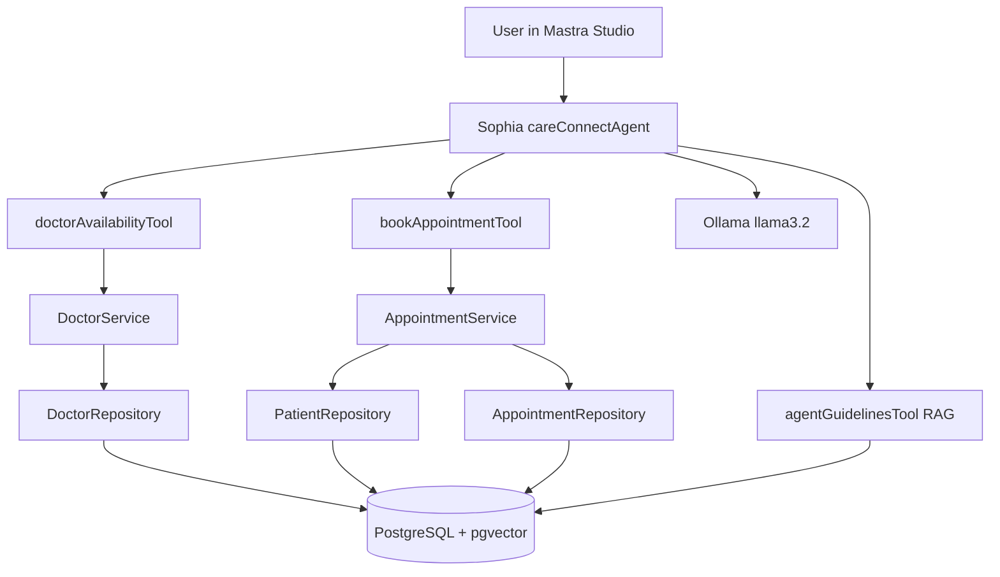
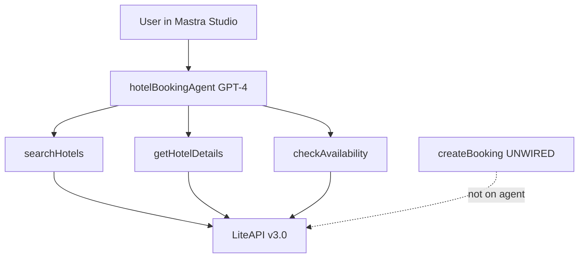
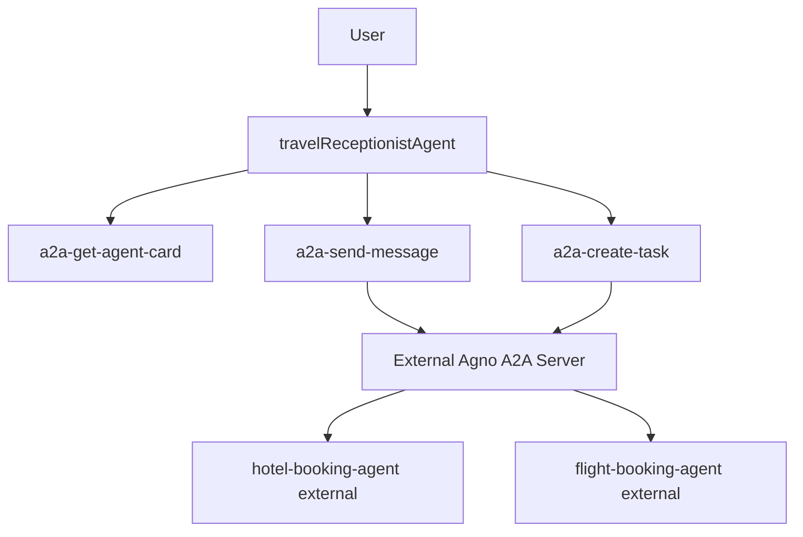
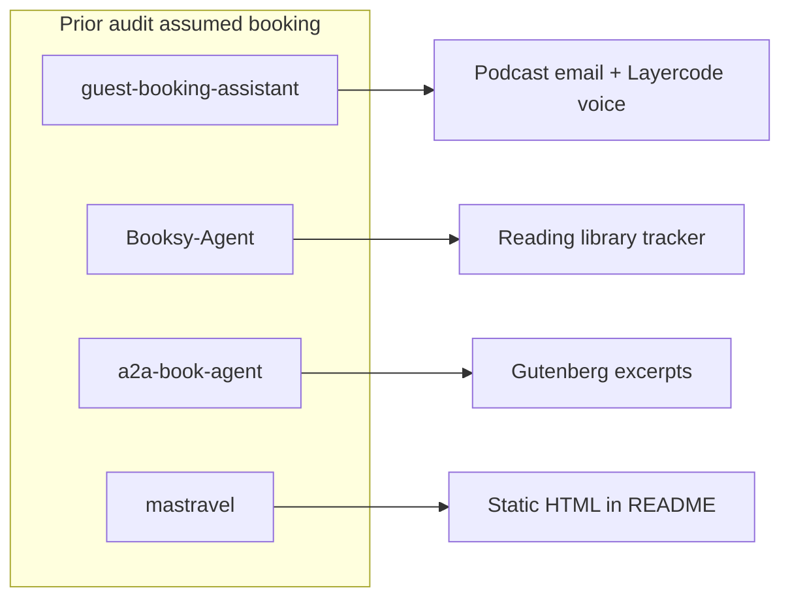
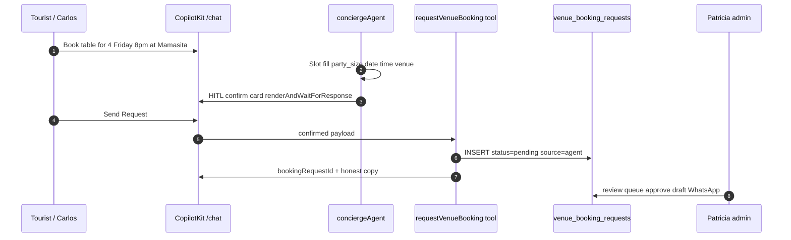
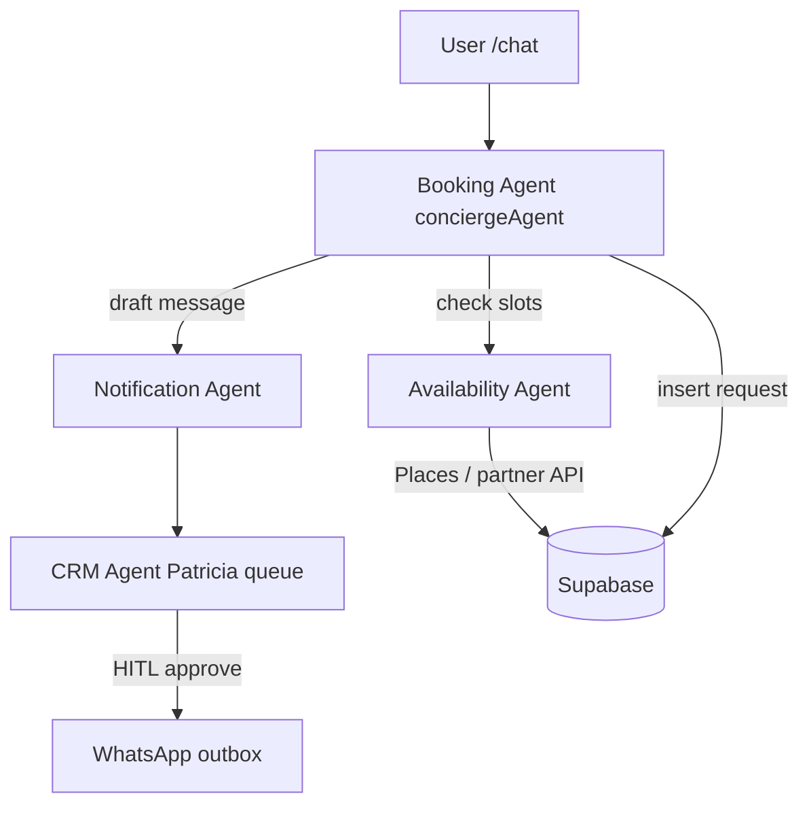
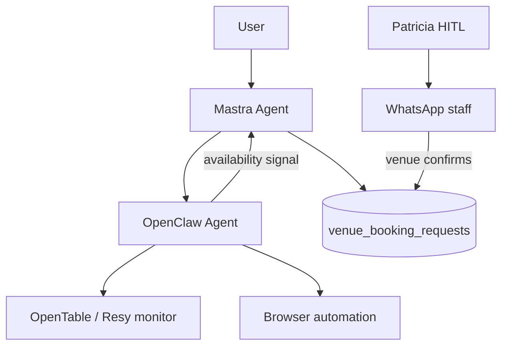
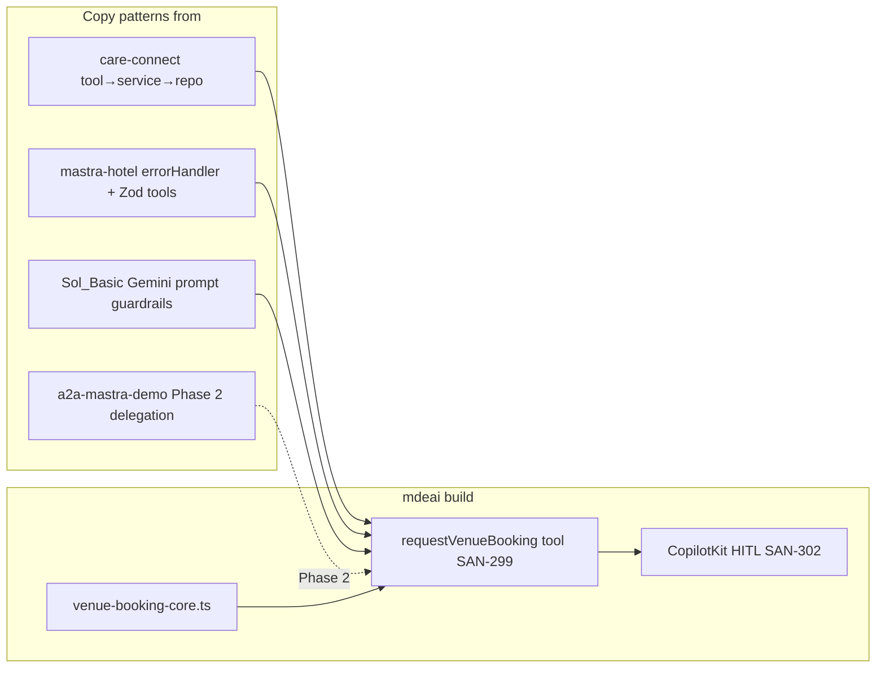

# Mastra Booking Audit — Architecture Diagrams

**Stack context:** mdeapp = Next.js 16 · CopilotKit 1.55.2 · Mastra in-process · Gemini 3.5 Flash · Supabase

---

## 1. Audited repos — actual architectures

### care-connect (closest booking pattern)

### mastra-hotel-booking-ai-agent (partial LiteAPI)

### a2a-mastra-demo (delegation only)

### Misnamed repos (not booking)

---

## 2. mdeai MVP — recommended (Phase 1)

Aligns with [`docs/tasks/venues/docs/02-booking-whatsapp.md`](../../tasks/venues/docs/02-booking-whatsapp.md).

---

## 3. mdeai Phase 2 — multi-agent (adapt from a2a-mastra-demo)

---

## 4. mdeai Phase 3 — OpenClaw automation

From [`docs/restaurant/04-openclaw.md`](../../restaurant/04-openclaw.md) — **post-MVP only**.

**Rule:** OpenClaw never auto-confirms without Patricia approval in Phase 1–2.

---

## 5. Component map — what to copy from which repo

