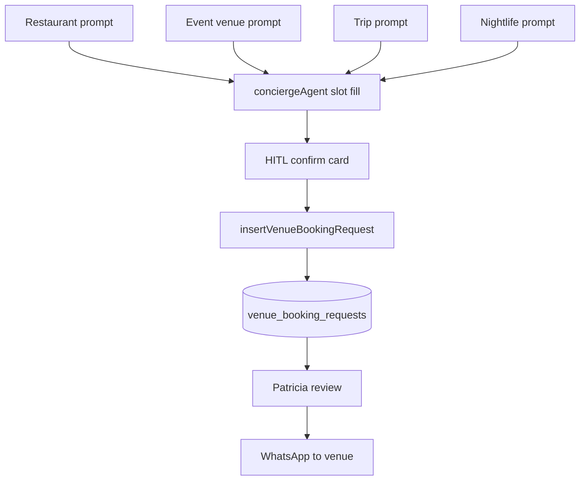

# Phase 4 — Real-World Use Cases

Step-by-step workflows mapped to mdeai personas. External repo inspiration noted; **implementation follows mdeai honest-request model**.

---

## 1. Restaurant booking — care-connect pattern + mdeai core

**Prompt:** "Book a table for 4 at Mamasita Friday 8pm"

| Step | Actor | Action |
|------|-------|--------|
| 1 | Tourist | Sends message in `/chat` CopilotKit sidebar |
| 2 | conciergeAgent | Parses intent; working memory holds partial slots |
| 3 | Agent | Missing contact? Ask: "What name and WhatsApp number?" |
| 4 | Agent | Summarize: restaurant, Fri 8pm, party 4 — **Confirm?** |
| 5 | CopilotKit | `renderAndWaitForResponse` booking card — user clicks **Send Request** |
| 6 | requestVenueBooking | Calls `insertVenueBookingRequest` → `venue_booking_requests` |
| 7 | UI | Chip: "Request received — we'll confirm by WhatsApp. Not a confirmed reservation." |
| 8 | Patricia | Admin queue reviews; drafts WhatsApp to restaurant |
| 9 | Restaurant | Replies via WhatsApp (manual Phase 1) |
| 10 | DB | Status → `confirmed` only after human verification |

**Repo inspiration:** care-connect slot-filling + book tool (adapted to request-not-confirm).

---

## 2. Event venue booking — Roberto + SAN-496 pattern

**Prompt:** "Birthday party for 30 guests at a rooftop in El Poblado"

| Step | Actor | Action |
|------|-------|--------|
| 1 | Roberto | `/chat` or venue explorer from event wizard |
| 2 | Agent | `search_grounded_places` or venue tools → shortlist cards |
| 3 | Roberto | Selects venue; opens HITL proposal modal (EVT-037) |
| 4 | Form | Date, headcount 30, budget, notes (birthday) |
| 5 | Tool | INSERT `venue_booking_requests` with `venue_kind=event_venue` |
| 6 | Patricia | Reviews proposal queue; may counter-offer |
| 7 | Venue | Manual confirm — no instant booking |
| 8 | Roberto | Sees status on `/host/events` or chat thread |

**Repo inspiration:** mastra-hotel multi-step search → detail (venue shortlist, not LiteAPI).

---

## 3. Trip booking — Medellín itinerary (Post-MVP)

**Prompt:** "Plan a 3-day Medellín trip with restaurants and salsa"

| Step | Actor | Action |
|------|-------|--------|
| 1 | Tourist | `/chat` or future `/trips` |
| 2 | conciergeAgent | `search_events`, `search_grounded_places`, rentals as needed |
| 3 | Agent | Builds itinerary in working memory (mastravel concept only — no code to copy) |
| 4 | Tourist | "Book dinner Day 2" → branches to restaurant flow above |
| 5 | Each booking | Separate `venue_booking_requests` rows — not one mega-booking |
| 6 | Phase 2 | Trip Agent coordinates multiple request rows |

**Repo inspiration:** a2a-mastra-demo orchestration (Phase 2); **not** mastravel repo (empty).

---

## 4. Nightlife — VIP table reservation

**Prompt:** "VIP table for 6 at Baia tonight"

| Step | Actor | Action |
|------|-------|--------|
| 1 | Tourist | `/chat` after nightlife card |
| 2 | Agent | Sets `venue_kind=nightlife`; captures bottle/min spend in notes |
| 3 | Agent | Slot fill: time, party size, contact WhatsApp |
| 4 | HITL | Confirm card — honest copy about manual confirmation |
| 5 | requestVenueBooking | INSERT with notes "VIP table, 6 guests" |
| 6 | Patricia | Higher-touch review; WhatsApp draft to club manager |
| 7 | Phase 3 OpenClaw | Monitor club IG/WhatsApp for table availability (optional) |

**Repo inspiration:** care-connect transactional insert; WhatsApp plan from VEN-003.

---

## 5. Cross-repo contrast — what would fail if copied verbatim

| Use case | If we copied guest-booking-assistant | If we copied mastra-hotel-booking |
|----------|--------------------------------------|-----------------------------------|
| Restaurant table | Agent sends **podcast email** to fake Hunter.io address | Agent searches **hotels in LiteAPI**, not Medellín restaurants |
| Event venue | No venue logic | Wrong vertical API |
| Nightlife VIP | Voice email outreach | USD hotel rates in Romania defaults |

---

## Workflow diagram — all verticals converge

**Invariant:** No repo provides this full stack — mdeai assembles from **internal core** + **care-connect tool pattern** + **existing VEN specs**.
