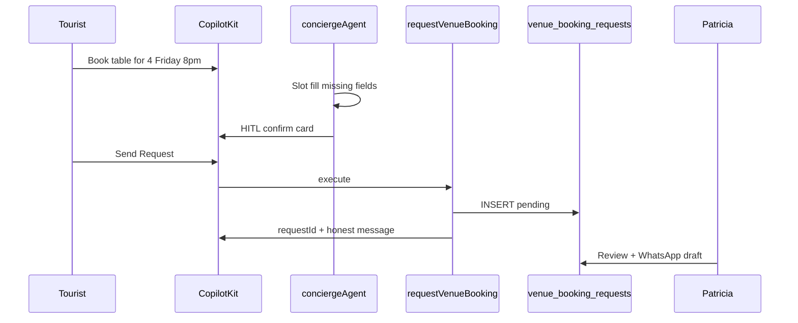

# Mastra Booking Plan — mdeai Restaurants, Venues, Events, Travel

**Class D · Plan · 2026-06-09**  
**Forensic audit:** [`../research/mastra-booking-audit/final-report.md`](../research/mastra-booking-audit/final-report.md)  
**Related:** [`05-mastra.md`](./05-mastra.md) · [`04-openclaw.md`](./04-openclaw.md) · [`../tasks/venues/docs/02-booking-whatsapp.md`](../tasks/venues/docs/02-booking-whatsapp.md)

---

## Verdict

**Do not fork external Mastra booking repos.** Prior docs ranked misnamed repos (#1 guest-booking-assistant = podcast email demo). Build MVP on **mdeai's existing `venue_booking_requests` + `venue-booking-core.ts`**, copying **care-connect's tool→service→DB pattern** only.

**Linear:** [SAN-299 · VEN-020 — requestVenueBooking Mastra tool](https://linear.app/sanjiovani/issue/SAN-299) is next after PR #156 — **no new Linear issues needed for MVP**.

---

## What Tourist sees today vs after MVP

| Today | After SAN-299 + SAN-302 |
|-------|-------------------------|
| Restaurant card → manual **Request Table** form | Same, **plus** chat: "Book Mamasita Friday 8pm for 4" |
| Form saves to `venue_booking_requests` | Agent slot-fills → HITL confirm → same table |
| Honest copy: not confirmed yet | Same honest copy — agent cannot claim confirmed |

---

## Repo audit — corrected top 3

| Rank | Repo | Real purpose | Use for mdeai |
|------|------|--------------|---------------|
| 1 | [care-connect](../research/mastra-booking-audit/repos/care-connect/) | Healthcare scheduling | ⭐ Copy tool→service→repo pattern |
| 2 | [mastra-hotel-booking-ai-agent](../research/mastra-booking-audit/repos/mastra-hotel-booking-ai-agent/) | LiteAPI hotel search | Error handling + Zod tools |
| 3 | [a2a-mastra-demo](../research/mastra-booking-audit/repos/a2a-mastra-demo/) | A2A travel delegation | Phase 2 multi-agent only |

**Do not use for booking:** guest-booking-assistant (podcast email), Booksy-Agent (reading library), a2a-book-agent (Gutenberg), mastravel (HTML only).

Full matrix: [`../research/mastra-booking-audit/features.md`](../research/mastra-booking-audit/features.md)

---

## MVP architecture (Phase 1)

```text
User (/chat)
  → CopilotKit conciergeAgent (Gemini 3.5 Flash)
  → slot fill: venue, date, time, party_size, contact
  → renderAndWaitForResponse (booking confirm card)
  → requestVenueBooking tool (SAN-299)
  → insertVenueBookingRequest (venue-booking-core.ts)
  → venue_booking_requests (status=pending)
  → Patricia review queue
  → WhatsApp to restaurant (manual Phase 1)
```



---

## Phase 2 — multi-agent + notifications

```text
User → Booking Agent
         ├→ Availability Agent (Places / partner API)
         ├→ requestVenueBooking → Supabase
         ├→ draftVenueWhatsApp (propose-only)
         └→ Notification Agent → Patricia → wa_outbox
```

Pattern: a2a-mastra-demo delegation + [`02-booking-whatsapp.md`](../tasks/venues/docs/02-booking-whatsapp.md)

Linear: [SAN-686 · PTR — Booking system](https://linear.app/sanjiovani/issue/SAN-686) (Backlog)

---

## Phase 3 — OpenClaw automation

```text
User → Mastra Agent → OpenClaw
  → OpenTable / browser / WhatsApp monitor
  → availability signal (NOT auto-confirm)
  → Patricia HITL → venue_booking_requests
```

See [`04-openclaw.md`](./04-openclaw.md). **Grade for launch: 65/100 — defer.**

---

## Real-world examples

### Restaurant — "Book table for 4 Friday 8pm"

1. Tourist asks in `/chat`
2. Agent resolves Mamasita from prior restaurant card context
3. Agent confirms party=4, Fri 8pm, WhatsApp number
4. HITL card → **Send Request**
5. Row in `venue_booking_requests`; UI shows pending message
6. Patricia contacts restaurant via WhatsApp

### Event venue — "Birthday party 30 guests"

1. Roberto uses venue explorer / chat
2. Shortlist → HITL proposal ([SAN-496 · EVT-037](https://linear.app/sanjiovani/issue/SAN-496))
3. Same `venue_booking_requests` table, `venue_kind` appropriate
4. Patricia negotiates with venue

### Nightlife — "VIP table for 6 tonight"

1. Same flow as restaurant with `venue_kind=nightlife`
2. Notes capture bottle/VIP intent
3. Higher-touch Patricia review

### Trip — "3-day Medellín itinerary"

1. Post-MVP — concierge builds itinerary in working memory
2. Each restaurant/event books via separate request rows
3. No external repo to copy (mastravel is empty)

---

## Implementation order

| Step | Work | Linear / PR | Effort |
|------|------|-------------|--------|
| 1 | Merge web Request Table form | PR #156 | — |
| 2 | Mastra `requestVenueBooking` tool | [SAN-299](https://linear.app/sanjiovani/issue/SAN-299) | 1–2 d |
| 3 | CopilotKit HITL booking card | [SAN-302](https://linear.app/sanjiovani/issue/SAN-302) | 1–2 d |
| 4 | Tool/action registry CI | [SAN-303](https://linear.app/sanjiovani/issue/SAN-303) | 0.5 d |
| 5 | Patricia admin booking queue | VEN admin specs | 2–3 d |
| 6 | WhatsApp draft tool | MSV-003 disk spec | Post-MVP |
| 7 | OpenClaw availability | Phase 3 | Post-MVP |

---

## What to copy vs avoid (from audit)

| Copy | Avoid |
|------|-------|
| care-connect: availability → book tool layering | guest-booking-assistant email tools |
| care-connect: Zod tool schemas | Booksy reading library |
| mastra-hotel: errorHandler taxonomy | LiteAPI instant confirm UX |
| Sol_Basic: "don't invent booking state" prompts | a2a-book-agent Gutenberg flow |
| Roberto HITL pattern (mdeapp native) | OpenClaw auto-book before MVP |

---

## Linear tasks — create new?

**No for MVP.** Verified 2026-06-09:

| Need | Existing issue |
|------|----------------|
| requestVenueBooking tool | ✅ SAN-299 (Todo, Urgent) |
| CopilotKit HITL | ✅ SAN-302 |
| Registry CI | ✅ SAN-303 |
| DB schema | ✅ SAN-298 Done |
| Full partner booking | ✅ SAN-686 Backlog |
| OpenClaw agent | ❌ Create when Phase 3 starts |

Detail: [`../research/mastra-booking-audit/phase6-linear-tasks.md`](../research/mastra-booking-audit/phase6-linear-tasks.md)

---

## Scores (post-audit)

| Area | Score | Blocks |
|------|------:|--------|
| DB + insert core | 100/100 | — |
| PR #156 web form | 92/100 | Merge |
| SAN-299 agent tool | 0/100 | Tourist chat booking |
| SAN-302 HITL card | 0/100 | Safe agent submit |
| OpenClaw Phase 3 | 65/100 fit | Launch — defer |
| **Overall MVP path** | **85/100** | SAN-299 after PR #156 |

---

## Audit artifacts

| Document | Path |
|----------|------|
| Final report | `docs/research/mastra-booking-audit/final-report.md` |
| Repo inventory | `docs/research/mastra-booking-audit/repo-summary.md` |
| Feature matrix | `docs/research/mastra-booking-audit/features.md` |
| Architecture diagrams | `docs/research/mastra-booking-audit/architecture-diagram.md` |
| Cloned repos | `docs/research/mastra-booking-audit/repos/` |

---

## Bottom line

1. **Merge PR #156** — web request path for Carlos/Tourist  
2. **Implement SAN-299** — study care-connect, wire `venue-booking-core.ts`  
3. **Implement SAN-302** — HITL before any agent insert  
4. **Skip** forking guest-booking-assistant / Booksy / a2a-book-agent  
5. **Defer** OpenClaw until honest request flow has localhost + prod proof  
6. **Do not create** duplicate Linear tasks — SAN-299/302/303 are ready
