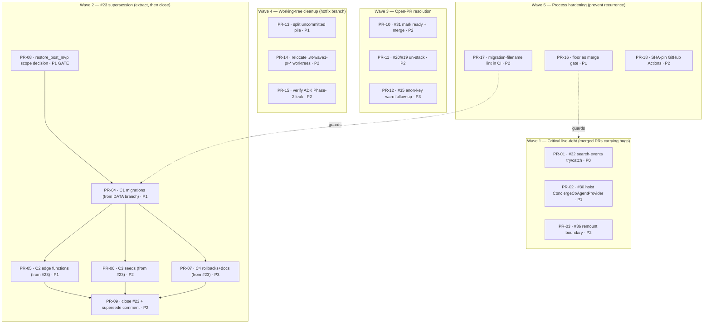

# PR Remediation Plan

> **What this is:** a single, dependency-ordered backlog turning the four audit notes in
> [`docs/`](./docs/) into atomic, shippable tasks. Each task carries the skill it should run under.
> Run any task with the lifecycle skill: *"work on PR-NN"* → `mde-task-lifecycle`.

## Provenance

This plan synthesizes four read-only audits already on disk:

| Note | Scope | Headline finding |
|------|-------|------------------|
| [01](./docs/01-33pr-notes.md) | `hotfix/g2d-cafe-fast-path` scope review | branch is **stale** (its work is in main as #33); 4 unrelated uncommitted workstreams + nested worktrees |
| [02](./docs/02-pr-audit.md) | 8-PR forensic audit | 4 merged with landed debt; **#32 critical** (no try/catch); #30/#20 merged/stand with no floor + review skipped |
| [03](./docs/03-notes.md) | #23 supersession (forensic) | #23 holds **26 files that exist nowhere else** (edge fns/seeds/rollbacks) — cannot just be replaced by the DATA branch |
| [04](./docs/04-notes.md) | #23 supersession (plain English) | extract → 4 small PRs → then close #23 |

## Audit-freshness correction (verified 2026-06-01 against live `main`)

The 8-PR audit ([02](./docs/02-pr-audit.md)) was a snapshot. Two PRs **postdate it** and change the picture:

- **#34 (MERGED)** — "events hybrid safety + live queryText wiring" — **already landed the try/catch + `source:'fallback'` path** the audit flagged as #32's critical gap. Verified: `src/mastra/tools/search-events.ts` on `main` wraps `searchEventsIntelligent` in `try{…}catch` (lines 224–257). **→ PR-01 is reduced from a P0 fix to a verify-and-close task.**
- **#38 (OPEN)** — "SEARCH-002 events live in concierge fast-path UI" — a *new* open PR not in the audit. Folded into Wave 3.

Re-verified still-valid: **PR-02** (`ConciergeCoAgentProvider` still mounted only in `geo-chat-shell.tsx:45`, not hoisted) and **PR-03** (`EventResultsPanel`/`CenterPanelMapResultsSlot` at `chat-center-panel.tsx:54–55` still outside the `key` boundary). Lesson: re-verify each audit claim against `main` at execution time — the merge train moves faster than the audit.

## Linear cross-reference (verified 2026-06-01)

Cross-checked all 18 tasks against the three Linear views the user provided — they map to labels in project **MDEAPP**:
`ux-tasks` = `label:track:ux` (34 issues) · `data` = `label:track:data` (46) · `intelligence` = `label:track:intelligence` (57).

**One task was wrong, two are in-flight duplicates, the rest are net-new or follow-ups.**

| PR | Linear reality | Verdict |
|----|----------------|---------|
| **PR-11** | **SAN-432 (UX-017) = Canceled**: *"Do not rebase, force-push, or merge #19. PR #19 is historical only."* Confirmed via `gh`: #19's "SEARCH-001/INT-002 hybrid search" was **superseded by merged #32** (`fix/search-001-002-clean` → main @ `3af7ea0`). #20 is `[DEFERRED]` and stacked on the obsolete #19. | **CORRECTED** — original "rebase #19 → merge" would re-land merged code. Rewritten to *close #19 obsolete + retire #20*. |
| **PR-04** | **SAN-446 (DATA-048) = In Progress**: 76 migration files realigned, collision already fixed, *"currently untracked … must be committed."* | **DUPLICATE-in-flight** — PR-04 *is* SAN-446's commit step. Don't open a new issue; update SAN-446. |
| **PR-08** | **SAN-445 (DATA-050) = In Progress, gated**: owns the B1–B4 base-table restore; landlord tables already authored as B1. | **OVERLAP** — make the keep-vs-defer call *with* SAN-445, not independently. |
| **PR-17** | The `20260520120000` collision is **already resolved** inside SAN-446. | Reframed **preventive-only** (stop the next collision); the guard itself is net-new. |
| **PR-15** | **SAN-444 (UX-018) = Backlog**: ADK prod URL not set (defaults to localhost → fails to fallback); *"No ADK service implementation."* | **Corroborates** the leak suspicion — ADK confirmed Phase-2/not-deployed. PR-15 (audit) is net-new; SAN-444 is the eventual enablement. |
| **PR-01** | No Linear issue tracks the try/catch guard; closest SAN-387 (SEARCH-002, In Review) is hybrid wiring, not the guard. | Premise rests on **git** (`search-events.ts:224–257`), not Linear. |
| **PR-02 / PR-03** | Follow-ups to **SAN-321 (UX-032, Done)** "new chat reset". | Untracked follow-ups to a shipped issue — fine. |

**Net-new, no Linear issue** (confirmed via label scan + targeted `query`): **PR-06, PR-07, PR-10, PR-12, PR-13, PR-14, PR-16, PR-18**. The only process-hardening issues in the workspace (SAN-303 registry CI test, SAN-95 Vercel deploy prep) match none of PR-16/17/18 — so the floor-gate / migration-lint / SHA-pin hardening is genuinely untracked.

## Operating rules (inherited from CLAUDE.md + session constraints)

- **Read-only until authorized.** This plan changes nothing. Each task says what it touches.
- **No auto-merge.** Every merge / force-push / branch-protection change is a **human-gated** step, called out per task.
- **One worktree, one PR.** Every fix is a fresh branch off *latest* `main` — never stacked, never off the messy hotfix tree.
- **Floor before ship.** `/verify-floor` (lint·typecheck·build·test·audit) green is the Done gate for every code task.
- **Migrations are one ordered sequence.** Never split the migration timeline across independently-merging PRs (re-introduces DATA-050 drift).
- **Localhost runtime proof required for Done** (CLAUDE.md anti-fake-done gate 9).

---

## The five waves (dependency-ordered)

### Recommended execution order

1. **PR-13** (do first — the messy working tree blocks clean new work; triage it before anything else gets PR'd from there).
2. **PR-01** (quick — verify #34 fully closed #32's gap, then mark resolved; ~5 min).
3. **PR-08 → PR-04 → PR-05/06/07 → PR-09** (the #23 supersession chain, strictly in this order).
4. **PR-02, PR-03** (merged-PR forward-fixes; independent, any time off main).
5. **PR-10, PR-11, PR-12** (open-PR cleanup — re-verify #20/#19/#31/#38 state at execution).
6. **PR-16, PR-17, PR-18** (process — land these so this never recurs).

---

## Task summary

| ID | Title | Pri | Skill(s) | Depends on | Source |
|----|-------|-----|----------|------------|--------|
| [PR-01](./tasks/PR-01-search-events-trycatch.md) | #32 verify try/catch fallback (likely already fixed by #34) | P2 | `mastra`, `vitest` | — | 02 |
| [PR-02](./tasks/PR-02-hoist-concierge-provider.md) | #30 hoist `ConciergeCoAgentProvider` to layout | P1 | `copilotkit`, `react-best-practices` | — | 02 |
| [PR-03](./tasks/PR-03-chat-remount-boundary.md) | #36 fix `key={sessionKey}` remount boundary | P2 | `react-best-practices` | — | 02 |
| [PR-04](./tasks/PR-04-c1-migrations.md) | C1 migrations PR from DATA branch (collision-free) · **= SAN-446 (DATA-048) commit step** | P1 | `mde-supabase` | PR-08 | 03 |
| [PR-05](./tasks/PR-05-c2-edge-functions.md) | C2 edge functions PR from #23 + JWT justification | P1 | `mde-supabase`, `security-reviewer` | PR-04 | 03 |
| [PR-06](./tasks/PR-06-c3-seeds.md) | C3 seeds PR from #23 | P2 | `mde-supabase` | PR-04 | 03 |
| [PR-07](./tasks/PR-07-c4-rollbacks-docs.md) | C4 rollbacks + README PR from #23 | P3 | `mde-supabase` | PR-04 | 03 |
| [PR-08](./tasks/PR-08-restore-postmvp-decision.md) | `restore_post_mvp_*` Phase-1 scope decision | P1 | `mde-supabase`, `mde-real-estate` | — | 03 |
| [PR-09](./tasks/PR-09-close-23-supersede.md) | Close #23 with supersede comment | P2 | `mde-worktree-pr-flow` | PR-05, PR-06, PR-07 | 03 |
| [PR-10](./tasks/PR-10-merge-31-analytics.md) | #31 mark ready + merge (Vercel analytics) | P2 | `mde-vercel` | — | 02 |
| [PR-11](./tasks/PR-11-unstack-20-19.md) | **Close obsolete #19 (superseded by #32) + retire deferred #20** | P2 | `mde-worktree-pr-flow` | — | 02 + SAN-432 |
| [PR-12](./tasks/PR-12-35-anon-key-warn.md) | #35 warn when anon keys absent | P3 | `mde-maps` | — | 02 |
| [PR-13](./tasks/PR-13-split-hotfix-pile.md) | Split uncommitted `hotfix/g2d` pile into clean PRs | P1 | `mde-worktree-pr-flow` | — | 01 |
| [PR-14](./tasks/PR-14-relocate-worktrees.md) | Relocate/remove nested `.wt-wave1-pr-*` worktrees | P2 | `mde-worktree-pr-flow` | — | 01 |
| [PR-15](./tasks/PR-15-verify-adk-phase2.md) | Verify `smoke-adk-grounding.mjs` isn't a Phase-2 leak | P2 | `mde-task-lifecycle` | — | 01 |
| [PR-16](./tasks/PR-16-floor-merge-gate.md) | Make floor + 1 review a `main` branch-protection gate | P1 | `testing`, `mde-vercel` | — | 02 |
| [PR-17](./tasks/PR-17-migration-filename-lint.md) | CI lint for migration-timestamp uniqueness | P2 | `mde-supabase` | — | 02 |
| [PR-18](./tasks/PR-18-sha-pin-actions.md) | SHA-pin all GitHub Actions repo-wide | P2 | `mde-vercel` | — | 02 |

See [`INDEX.md`](./INDEX.md) for the live status tracker.

---

## Risk gates (must not be skipped)

| Gate | Applies to | Rule |
|------|-----------|------|
| **Shadow-replay** | PR-04 | Migrations must replay clean on a disposable Supabase branch before the PR opens (reuse tasks #1–#16 method). No `db push` to prod. |
| **Scope decision** | PR-08 → PR-04 | The `restore_post_mvp_*` family blocks C1's final scope — decide *before* cutting C1 (their timestamps precede later migrations). |
| **Human-merge** | PR-09, PR-10, PR-11 | Closing #23, merging #31, and the #20/#19 rebase are shared-state actions — explicit user go required each time. |
| **No force-push** | PR-11 | Prefer clean-branch recreate + supersede comment over rebase/force-push (PR-recovery lesson). |
| **Backup** | PR-04 | The realigned migrations live only on an **unpushed local branch** — cutting + pushing C1 is also the backup. Do it early. |
| **Worktree safety** | PR-14 | Inspect each `.wt-wave1-pr-*` for in-progress work before removing (agent-branch-safety). |

## Definition of done (whole plan)

- All P0/P1 tasks shipped through lifecycle Phase 5 (three-record sync: `todo.md` + `CHANGELOG.md` + frontmatter `status: Done`).
- #23 closed with a supersede comment linking C1–C4.
- `main` has a floor + review branch-protection rule (PR-16).
- `supabase/` is version-controlled (PR-04 lands the schema history into git for the first time).
