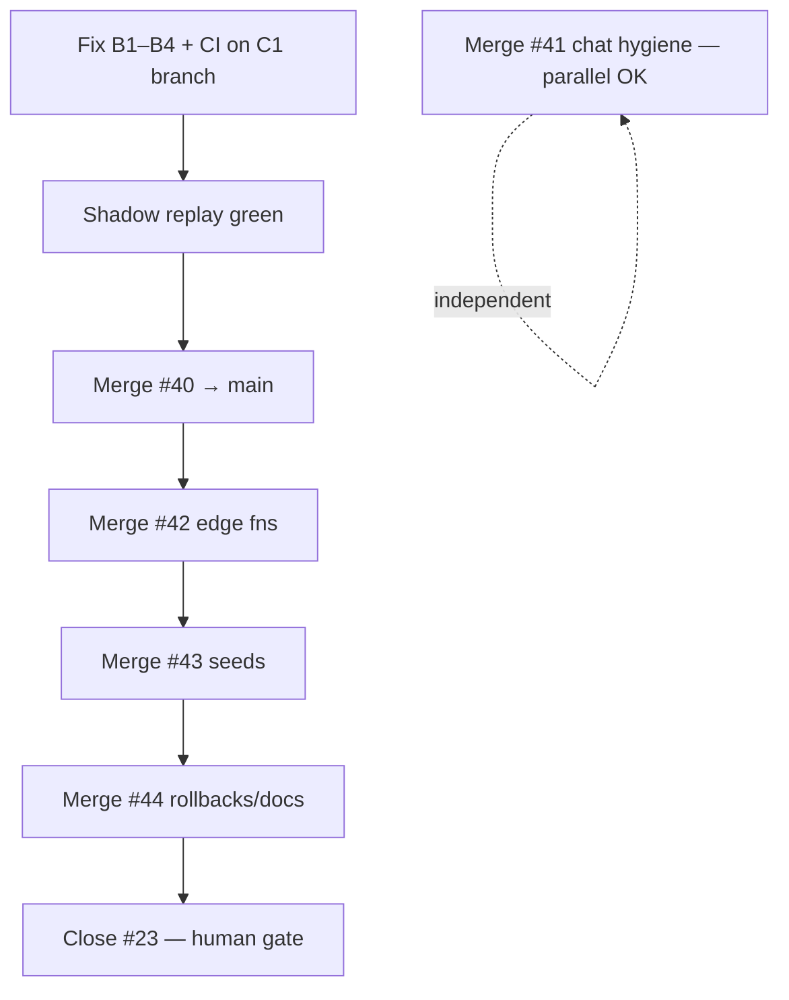

# DATA stack pre-merge audit — release engineer verdict

**Audit date:** 2026-06-01  
**Evidence:** local DATA-050 shadow replay (Docker), Supabase MCP `list_migrations`, GitHub CI, `tasks/data/evidence/DATA-050-base-table-backfill.md`

---

## Executive summary

**#40 = NO-GO.** Shadow replay fails on the first known B1 gap. C1 ships 76 migrations but **none** of the DATA-050 repair units (B1–B4) that were validated on `data/DATA-048-migration-realign` and documented in evidence.

**#42 → #43 → #44 = blocked** until #40 passes shadow + CI.  
**#41 = GO** (lint/test/build green; no migration surface).  
**#23 = keep open** until #40–#44 land.

---

## 1. DATA-050 shadow replay (disposable branch)

**Method:** `supabase db diff --from migrations --to "$DATABASE_URL" --use-migra` on branch `data/c1-supabase-migrations` (same as #40). Ephemeral Docker shadow — no live DDL.

**Result:** FAIL at migration **#27 of 76**

| Field | Value |
|--------|--------|
| **Failed migration** | `20260501204538_landlord_v1_response_metrics.sql` |
| **SQLSTATE** | `42P01` |
| **Error** | `relation "public.landlord_inbox" does not exist` |
| **Failing statement** | `CREATE OR REPLACE VIEW public.landlord_response_metrics … FROM public.landlord_inbox` |
| **Last clean migration** | `20260430130000_landlord_v1_fk_indexes.sql` |

**Log excerpt (captured):**

```
Applying migration 20260501204538_landlord_v1_response_metrics.sql...
ERROR: relation "public.landlord_inbox" does not exist (SQLSTATE 42P01)
  FROM public.landlord_inbox
       ^
```

**Supabase Preview on #40/#42/#43/#44:** FAIL/CANCELLED — consistent with preview DB replaying migrations from scratch (same B1 failure). Not a separate infra bug.

**Cloud branch:** Not created (cost gate). Local shadow replay matches DATA-050 evidence and is sufficient for blocker identification.

---

## 2. C1 migration apply status

| Check | Status | Evidence |
|--------|--------|----------|
| 76 SQL files on C1 | ✅ Present | `data/c1-supabase-migrations` @ `2a48750` |
| `supabase/config.toml` | ✅ Present | On C1 branch |
| Prod `schema_migrations` parity (existing 76) | ✅ Aligned | MCP lists same 76 versions through `20260601120800` |
| **B1** `20260430140000_landlord_v1_base_tables.sql` | ❌ **Missing** | Only stub in `_archive-not-on-remote/`; preserved copy at `tasks/PR/evidence/20260430140000_landlord_v1_base_tables.sql.preserved` |
| **B2** apartments `landlord_id` + `moderation_status` | ❌ Missing | Next failure after B1: `42703 column "landlord_id" does not exist` |
| **B3** 5 orphan tables | ❌ Missing | Blocks at `#54` restore + `data049` |
| **B4** timestamp reorder | ❌ Wrong order | `data045`=`20260601120700`, `data047`=`20260601120800` sort **after** `data049`=`20260531215952` |

**Expected failure chain after B1 fix (from DATA-050 §9, empirically proven with probes):**

```
#27  20260501204538  → 42703 apartments.landlord_id        (B2)
#54  20260524024118  → orphan event_media_assets            (B3)
#70  20260531215952  → orphans + inverted data045/data047   (B3 + B4)
data040              → apartments.moderation_status         (B2)
```

Full green replay requires **B1 + B2 + B3 + B4** (~2 new migrations + 2 renames per DATA-050 §9.7).

---

## 3. Destructive prod DDL — will it rerun?

**Verdict: No re-run risk on prod from merging #40 alone**, if team follows repair-not-push for new versions.

| Migration | Destructive content | Prod status | Re-run risk |
|-----------|---------------------|-------------|-------------|
| `20260524022749_mdeapp_canonical_schema_cleanup.sql` | 20+ `DROP TABLE IF EXISTS` (agent_*, trips, rentals, etc.) | ✅ Applied | **None** — already in `schema_migrations`; merge is VCS sync only |
| All other C1 migrations | CREATE/ALTER guarded | ✅ Applied | **None** without explicit `db push` |
| **New** B1–B3 migrations (once authored) | CREATE IF NOT EXISTS / ADD COLUMN IF NOT EXISTS | Objects **exist in prod** | **Must use `migration repair --status applied`** — never `db push` raw |

**Prod inversion note (B4):** Prod applied `data049` (`20260531215952`) **before** `data045`/`data047` (`20260601120700`/`20800`) because of timestamps. It worked only because those tables existed OOB. Renaming files for replay fixes **fresh envs**; prod keeps old version rows — do **not** delete/re-add those version IDs on prod.

**Rule honored:** No production DDL without shadow proof → **not met** for #40 as-is.

---

## 4. Blocker table

| ID | PR | Severity | Blocker | Fix | Owner action |
|----|-----|----------|---------|-----|--------------|
| **B-01** | #40 | 🔴 CRITICAL | B1 migration absent — replay 42P01 | Add `20260430140000_landlord_v1_base_tables.sql` from preserved/evidence | Commit to `data/c1-supabase-migrations` |
| **B-02** | #40 | 🔴 CRITICAL | B2 absent — 42703 after B1 | Add `20260430140500_apartments_landlord_id.sql` (+ `moderation_status`) | Same branch |
| **B-03** | #40 | 🔴 CRITICAL | B3 absent — orphan FK targets | Add early orphan recovery migration (5 tables, RLS) | Same branch |
| **B-04** | #40 | 🟠 HIGH | B4 timestamp inversion | Rename `data045`→`20260530120700`, `data047`→`20260530120800` | Same branch; prod history unchanged |
| **B-05** | #40 | 🟡 MEDIUM | CI lint fail | Remove unused `statSync` in `scripts/check-migration-timestamps.mjs` | 1-line fix |
| **B-06** | #40 | 🟡 MEDIUM | Supabase Preview red | Consequence of B-01–B-04 | Re-run after fixes |
| **B-07** | #40 | 🟡 MEDIUM | B1 not in prod migration history | After B1 lands: human-gated repair (below) | DBA / release engineer |
| **B-08** | #42–#44 | 🟠 HIGH | Stacked on broken C1 | Rebase after C1 green | Wait for #40 |
| **B-09** | #23 | 🟢 INFO | Superseded but open | Close only after #40–#44 merge | Per your rule |

**Non-blockers:** Vercel ✅ · CodeRabbit ✅ · #41 lint/test/build ✅

---

## 5. Migration risk score

| PR | Score | Rationale |
|----|-------|-----------|
| **#40** | **8.5 / 10 (HIGH)** | Replay broken at #27; 11 gaps documented; prod repair needed for new versions; B4 prod/history divergence |
| **#42** | **3 / 10 (LOW)** | Edge functions only — no new migrations; Preview fails inherited from base |
| **#43** | **2 / 10 (LOW)** | Seeds CSV/JSON — no DDL |
| **#44** | **4 / 10 (LOW–MED)** | Rollback SQL + docs; depends on C1 migration IDs being final |
| **#41** | **1 / 10 (MINIMAL)** | Chat hygiene — zero Supabase surface |

---

## 6. Repair commands (human-gated — DO NOT RUN without approval)

Objects **already exist in prod**. Register history **without** re-running DDL:

```bash
cd mdeapp

# After B1 file is committed and merged (tables exist in prod today):
supabase migration repair --status applied 20260430140000

# After B2 file is committed (column exists in prod):
supabase migration repair --status applied 20260430140500

# After B3 orphan recovery migration is committed (adjust version to actual filename):
supabase migration repair --status applied <B3_VERSION>

# B4 (renames): prod already has 20260601120700 + 20260601120800 applied.
# DO NOT repair new 20260530120700/20800 on prod — that would fork history.
# B4 is for fresh-replay ordering only.
```

**Pre-repair verification (read-only):**

```bash
# Confirm object exists before repair
supabase db diff --from migrations --to "$DATABASE_URL" --use-migra  # must exit 0 after B1–B4 land
```

---

## 7. Merge order



| Step | PR | Gate |
|------|-----|------|
| 0 | — | Land B1–B4 + lint fix on `data/c1-supabase-migrations` |
| 1 | **#40** | Shadow replay 76+N migrations, 0 apply errors · CI green · Supabase Preview green |
| 2 | **#42** | Rebase on main post-#40 · edge fn tests · Preview green |
| 3 | **#43** | Seeds only · no migration diff vs #40 |
| 4 | **#44** | Rollback docs match final migration versions |
| ∥ | **#41** | CI already green — merge anytime, **do not stack** with DATA |
| 5 | **#23** | Close only after #40–#44 on `main` |

---

## 8. Rollback plan

| Layer | Trigger | Rollback |
|-------|---------|----------|
| **#40 git merge** | Bad commit on main | `git revert` merge commit — **prod DB unchanged** (migrations already applied) |
| **Accidental B1 push without repair** | Duplicate-object errors | Low risk — migration uses `IF NOT EXISTS`; still run repair to align history |
| **Accidental full `db push`** | Destructive cleanup re-run | **PITR / Supabase backup restore** — treat as P0; cleanup has 20+ `DROP TABLE` |
| **#42 edge deploy** | Bad function | Redeploy prior revision from dashboard or revert commit + redeploy |
| **#43 seeds** | Bad seed data | Re-run seed scripts with corrected CSV; no schema impact |
| **#44 rollbacks** | Need to undo vec/data039 | Execute `supabase/migrations/rollbacks/*.sql` **only on non-prod** unless runbook approved |

---

## 9. PR-by-pr verdict

| PR | Verdict | Notes |
|----|---------|-------|
| **#40** | **NO-GO** | Shadow replay fails `20260501204538` (42P01). DATA-050 fixes not on branch. CI lint fail. |
| **#42** | **NO-GO** (blocked) | Edge fns look fine; wait for #40 + rebase |
| **#43** | **NO-GO** (blocked) | Seeds only |
| **#44** | **NO-GO** (blocked) | Rollbacks depend on final C1 versions |
| **#41** | **GO** | lint · test · build pass; independent of DATA stack |
| **#23** | **KEEP OPEN** | Superseded by #40–#44; do not close until stack lands |

---

## 10. Final go/no-go

| Gate | Status |
|------|--------|
| Shadow replay clean | ❌ FAIL @ `20260501204538` |
| No destructive prod DDL without proof | ❌ Replay not proven end-to-end |
| B1 repair plan documented | ✅ (above) |
| CI green | ❌ ESLint `statSync` unused |
| Supabase Preview | ❌ (replay) |
| DATA separated from UX | ✅ #41 independent |
| #23 preserved | ✅ still open |

### **FINAL: NO-GO on #40 and entire DATA stack (#42–#44)**

**Minimum ship list before re-audit:**

1. Commit B1 from `tasks/PR/evidence/20260430140000_landlord_v1_base_tables.sql.preserved`
2. Author B2 (`20260430140500`) + B3 (orphan recovery) per DATA-050 §9.8
3. Rename B4 files (`data045`/`data047` timestamps)
4. Fix `statSync` lint in `check-migration-timestamps.mjs`
5. Re-run shadow replay → expect 79/79 apply success
6. Human-gated `migration repair` for B1/B2/B3 on prod
7. Re-push #40, confirm Preview green, then stack #42 → #43 → #44

Want me to implement B1–B4 + the lint fix on `data/c1-supabase-migrations` and re-run shadow replay in this session?