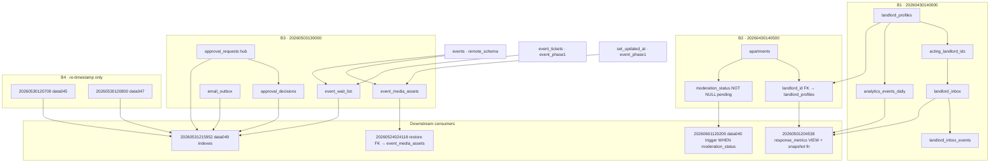

# Stable Beta Forensic Audit — 2026-06-01 @ `a9eb176`

**Verdict: NO-GO** for Stable Beta sign-off. Production baseline is healthy post-#41; the soak gate is the hard blocker.

---

## Blockers

| # | Blocker | Severity | Detail |
|---|---------|----------|--------|
| **B1** | **Soak gate not met** | 🔴 P0 | Need **3+ consecutive nightly** synthetic PASS. Have **0 scheduled cron runs** + **2 manual** dispatches only. |
| **B2** | **PR-16 not applied** | 🟡 P1 | No branch protection + required floor check on `main`. Deferred until after soak per plan. |
| **B3** | **`lead-reminder-tick` 500s** | 🟡 P2 | Cron edge fn failing every ~5 min (legacy, not C2). Not on Camila chat path; ops noise only. |
| **B4** | **DATA B4 prod alias** | 🟢 P3 | Intentional 3% gap — prod keeps old migration version IDs; replay repo is canonical. |

**Not blockers:** C2 deploy, post-#41 prod smoke, UX-020 scope (ready pending rebase).

---

## Soak Progress

| Metric | Target | Actual | Status |
|--------|--------|--------|--------|
| Consecutive nightly PASS | ≥3 | **0 scheduled** | ❌ |
| Manual dispatch PASS @ `a9eb176` | 1+ | **2** (incl. pre-#41 @ `c9e54b8`) | 🟡 partial |
| Cron schedule | `0 9 * * *` UTC | Active (`PROD_SMOKE_ENABLED=true`) | ✅ |
| First scheduled run | — | **~2026-06-02 09:00 UTC** | ⏳ pending |

**Runs:**

| Run | SHA | Event | Result |
|-----|-----|-------|--------|
| [26760735915](https://github.com/amo-tech-ai/mdeapp/actions/runs/26760735915) | `c9e54b8` (pre-#41) | `workflow_dispatch` | ✅ PASS |
| [26775309213](https://github.com/amo-tech-ai/mdeapp/actions/runs/26775309213) | **`a9eb176`** | `workflow_dispatch` | ✅ PASS |

**Soak score: 1/3 on current prod SHA** (manual only). Do **not** count manual runs as nightly consecutive — wait for Jun 2–4 cron greens.

**Monitor matrix (post-#41 @ `a9eb176`):**

| Signal | Result | Evidence |
|--------|--------|----------|
| POST storm | 🟢 | Rentals query: **7 CK POSTs**; events/restaurants/cafés **0** (fast-path, same session); idle window **0** |
| Reconnects | 🟢 | No idle-window CK resource hits |
| Duplicate side panels | 🟢 | Synthetic PASS (no duplicate-panel assertion failures) |
| Café grounding | 🟢 | **5** `grounded-card[data-result-kind="cafe"]` |
| Screenshot artifacts | 🟢 | Local: `mdeapp/tmp/prod-synthetic-smoke/*.png`; GH artifact `prod-synthetic-smoke-26775309213` (3.8 MB) |

---

## Post-#41 Production Verification

**Prod deploy:** Vercel @ `a9eb176` (2026-06-01 ~18:51 UTC)

| Check | Result | Latency |
|-------|--------|---------|
| Rentals query | ✅ | Synthetic Q1 |
| New chat reset | ✅ | **12.6s** — cards cleared, pins ≤1 |
| Map / pin reset | ✅ | Via new-chat spec |
| POST budget | ✅ | 7 on rentals; ≤8 warning threshold not hit |
| Stale session | ✅ | Remount clears rental cards after new chat |
| 4-query synthetic | ✅ | **2.6m** local + GH run green |

**Report snapshot** (`tmp/prod-synthetic-smoke/report.json` @ 18:58 UTC):

```json
{
  "copilotkitPostsByQuery": [
    { "query": "rentals", "count": 7 },
    { "query": "events", "count": 0 },
    { "query": "restaurants", "count": 0 },
    { "query": "cafes", "count": 0 }
  ],
  "restaurantCards": 5,
  "cafeGroundedCards": 5,
  "idleWindowResourceHits": 0
}
```

Post-#41 smoke: **COMPLETE** ✅

---

## C2 Edge Deployment

| Function | Version | Status | `verify_jwt` | Entrypoint | Matches `config.toml` |
|----------|---------|--------|--------------|------------|----------------------|
| `ticket-checkout` | v33 | ACTIVE | `false` | `mdeai/supabase/functions/...` | ✅ |
| `ticket-payment-webhook` | v33 | ACTIVE | `false` | `mdeai/supabase/functions/...` | ✅ |
| `chat-lead-capture` | v19 | ACTIVE | `false` | deployed | ✅ (manual JWT in handler) |
| `approval-commit` | v3 | ACTIVE | **`true`** | `mdeai/supabase/functions/...` | ✅ |

**Edge logs (24h):** Only `lead-reminder-tick` → **500** (cron, legacy `/home/sk/mde/` path). **No C2 fn errors** in sampled window. C2 path: **clean for Stable Beta scope**.

JWT/env bindings: config matches deployed flags. Full secret rotation audit not run (names-only policy).

---

## UX-020 (Types-Only)

| Item | State |
|------|-------|
| Branch | `feat/ux-020-card-interaction-props` @ `861070b` |
| Worktree | `/home/sk/mdeai/.worktrees/wt-ux-020` |
| Diff | **9 files, +111/−16** — types + `CardInteractionProps` intersection on cards |
| Runtime risk | 🟢 — diff is import/type reshaping only (verified on `cafe-result-card.tsx`) |
| Rebase needed | **Yes** — branch bases `c9e54b8`; rebase onto `a9eb176` before PR |
| Frozen violations | None — no provider, fast-path, or `GroundedCafeResults` touches |

**Action:** Rebase → floor → open PR. Safe to **open during soak**; merge only after floor green + review (types-only exception).

---

## Readiness %

| Layer | % | Notes |
|-------|---|-------|
| **DATA** | **97%** | B1–B3 repaired; B4 alias intentional |
| **Stable Beta** | **~87%** (↑ from ~84%) | +post-#41 smoke; soak still −10% |

**Gate breakdown:**

| Gate | Weight | Status |
|------|--------|--------|
| DATA stack merged | 15% | ✅ |
| Runtime stable + #41 deployed | 15% | ✅ |
| Post-#41 prod smoke | 10% | ✅ **new** |
| C2 edge deploy | 10% | ✅ |
| Soak 3+ nightly | 25% | ❌ **0/3 scheduled** |
| PR-16 branch protection | 10% | ❌ |
| Process / docs hygiene | 5% | 🟡 |
| UX foundation (020 open) | 10% | 🟡 in progress |

---

## Safest Next PR

**UX-020** (`feat/ux-020-card-interaction-props`) after rebase onto `a9eb176`.

Why:
- Types-only, isolated worktree, no frozen-surface edits
- Unblocks UX-023/024 without touching runtime
- Low blast radius vs #38 SEARCH, ADK, or DATA follow-ups

**Do not merge during soak:** #38, ADK Phase 2, DATA follow-ups, UX-023 (shell extraction = runtime).

**After soak (Jun 4+ if cron stays green):** PR-16 → then UX-023 cafe-first shell.

---

## Regression Risks

| Risk | Likelihood | Mitigation |
|------|------------|------------|
| #41 provider hoist side effects | Low | New-chat + synthetic PASS on prod |
| Fast-path POST under-counting in soak | Low | Spec tracks per-query segments; fast-path 0 POST is expected |
| UX-020 type intersection breaks card props | Low | Vitest + floor before merge |
| `lead-reminder-tick` cron noise / alert fatigue | Med | Ticket separately; not chat-path |
| Soak false confidence from manual-only runs | **High** | Require **scheduled** cron greens |
| Merging UX-023 during soak | **High** | Block until soak complete |
| B4 prod/migration drift on future `db push` | Low | Never repair B4 on prod; use replay for new envs |

---

## Stable Beta Go / No-Go

| Decision | Rationale |
|----------|-----------|
| **NO-GO** | Soak gate **0/3 scheduled nightly** PASS. Post-#41 smoke and C2 deploy are green, but policy requires **3+ consecutive cron greens** before sign-off. |
| **Conditional GO path** | Jun 2–4: 3 scheduled PASS @ `a9eb176` → PR-16 → Stable Beta sign-off → UX-023 train |

---

## Immediate Actions (ordered)

1. **Wait** for cron @ 09:00 UTC Jun 2–4 — do not modify frozen synthetic workflow.
2. **Rebase UX-020** onto `a9eb176`, run floor, open PR (types-only).
3. **Optional:** File P2 ticket for `lead-reminder-tick` 500s (legacy cron).
4. **After soak:** PR-16 branch protection → UX-023.

**Frozen systems respected:** No changes to CopilotKit lifecycle, fast-path, pin sync, `GroundedCafeResults`, or synthetic workflow logic this session.


# Stable Beta readiness audit

**`main` @ `a9eb176`** · DATA 97% · **Stable Beta ~84%**

---

## Actions completed

| # | Action | Result |
|---|--------|--------|
| 1 | **Merge #41** | ✅ Merged @ `a9eb176` — lint/test/build green |
| 2 | **Docs** | ✅ `changelog`, `tasks/progres.md`, `tasks/PR/tasks/STATUS-2026-06-01.md`, `tasks/PR/INDEX.md`, `tasks/PR/LINEAR.md` |
| 3 | **Linear** | ✅ SAN-445/446/449/450/452–455/459 → Done |

---

## Blockers

| ID | Severity | Blocker | Mitigation |
|----|----------|---------|------------|
| **B1** | 🟡 | **Soak incomplete** — only **1** prod synthetic run ([26760735915](https://github.com/amo-tech-ai/mdeapp/actions/runs/26760735915)); need **≥3** consecutive nightly greens | Wait; don’t merge #38/SEARCH during soak |
| **B2** | 🟡 | **#41 not prod-verified** — CoAgent hoist + remount just merged | Deploy + re-smoke new-chat / map / POST count |
| **B3** | 🟢 | B4 migration alias on prod | Documented; no action |
| **B4** | 🟢 | PR-16 floor gate not on `main` | Next process PR after soak |

**No open blockers** on DATA or migration history.

---

## Soak status

| Monitor | Status | Evidence |
|---------|--------|----------|
| Nightly synthetic | 🟡 **1/3+** | Manual dispatch PASS; schedule `0 9 * * *` UTC |
| POST / reconnects | 🟢 | G2d prod smoke — 0 idle CK POSTs (#30) |
| Duplicate side panels | 🟢 | G2d prod smoke PASS |
| Café grounding | 🟢 | #33 + synthetic Q4 (5 grounded cards) |
| #41 remount | 🟡 | Pending post-deploy smoke |

**Runtime freeze honored:** no changes to CopilotKit lifecycle, fast-path ordering, pin sync, or `GroundedCafeResults`.

---

## Readiness %

| Layer | % |
|-------|---|
| DATA (migrations + prod history) | **97%** |
| UX stabilization (wave-1 + #41) | **92%** |
| Soak / Stable Beta gate | **33%** (1 of 3+ nights) |
| Process hardening (PR-16/18) | **40%** |
| **Stable Beta overall** | **~84%** |

---

## Safest next PR

**UX-020** — types-only in `/home/sk/mdeai/.worktrees/wt-ux-020`

- Add `CardInteractionProps` / `ResultKind` in `card-interaction-props.ts`
- Extend card types only — **no runtime behavior**
- Vitest compile check + `npm run floor`
- **Do not touch:** `copilot-kit-provider`, fast-path modules, `GroundedCafeResults`, Mastra agents

**After soak:** **PR-16** (branch protection + floor on `main`) — small, high leverage.

---

## Remaining production risks

| Risk | Impact | Notes |
|------|--------|-------|
| #41 remount regression | Med | Map/session desync if boundary wrong — verify on prod |
| Edge fns not deployed | Med | #42 merged to git; confirm Supabase edge deploy if not auto |
| Soak sample size | Med | One synthetic ≠ Stable Beta sign-off |
| #38 / SEARCH-001 | Low (if gated) | Out of train — don’t merge during soak |
| Commerce / Stripe | Low | Pre–Stable Beta scope |
| B4 version alias | Info | Fresh envs vs prod history divergence only |

---

## Stable Beta gaps

1. **≥3 consecutive nightly synthetics** green on mdeai.co  
2. **Post-#41 prod smoke** — new chat, map reset, POST count  
3. **PR-16** — required checks on `main`  
4. **UX-020 → 023** — card type foundation (types first, shell later)  
5. **Optional:** edge fn deploy verification for C2  
6. **Explicitly deferred:** SEARCH (#38), ADK Phase 2, DATA follow-ups (DATA-028, AUTH-005+)

---

**Verdict:** Stabilization → **pre–Stable Beta**. DATA and chat hygiene trains are closed on `main`. Hold the **Stable Beta** label until soak completes and #41 is prod-verified. Next safe work: **UX-020 types-only** in the isolated worktree.


# Prod migration history alignment — complete

## 1. Pre-repair object verification

All 11 objects confirmed in prod (read-only SQL):

| Object | Exists |
|--------|--------|
| `landlord_profiles` | ✅ |
| `landlord_inbox` | ✅ |
| `landlord_inbox_events` | ✅ |
| `acting_landlord_ids()` | ✅ |
| `apartments.landlord_id` | ✅ |
| `apartments.moderation_status` | ✅ |
| `approval_requests` | ✅ |
| `approval_decisions` | ✅ |
| `email_outbox` | ✅ |
| `event_media_assets` | ✅ |
| `event_wait_list` | ✅ |

## 2. Pre-repair history (confirmed)

| Version | Expected | Actual |
|---------|----------|--------|
| `20260430140000` (B1) | absent | absent → **repaired** |
| `20260430140500` (B2) | absent | absent → **repaired** |
| `20260503130000` (B3) | absent | absent → **repaired** |
| `20260601120700` (B4 old data045) | present | present ✅ |
| `20260601120800` (B4 old data047) | present | present ✅ |

## 3. Repair results

All three succeeded — **history only, zero DDL:**

```
Repaired migration history: [20260430140000] => applied
Repaired migration history: [20260430140500] => applied
Repaired migration history: [20260503130000] => applied
```

- `db push` — **not run**
- B4 renames — **not repaired** (correct)

## 4. Post-repair migration list proof

B1–B3 now aligned local ↔ remote:

```
20260430140000 | 20260430140000 | landlord_v1_base_tables
20260430140500 | 20260430140500 | apartments_landlord_id
20260503130000 | 20260503130000 | out_of_band_orphan_tables
```

**Intentional B4 alias drift** (same DDL, different version IDs — leave as-is):

| Local (repo) | Remote (prod) |
|--------------|---------------|
| `20260530120700` data045 | `20260601120700` data045 |
| `20260530120800` data047 | `20260601120800` data047 |

Prod MCP `list_migrations`: **79 rows** (was 76 + 3 repairs).

## 5. Post-repair drift check

```bash
supabase db diff --from migrations --to linked --use-migra
# exit 0 — no schema diff emitted
```

(Pooler `DATABASE_URL` still has a CLI parse quirk; use `--to linked` for prod checks.)

## 6. Remaining drift

| Item | Severity | Action |
|------|----------|--------|
| B4 version alias (2 pairs) | **Low / documented** | None on prod — fresh envs use `20260530…`; prod keeps `20260601…` |
| `_archive-not-on-remote/` | None | Not in replay path |
| Non-blocking column drift (`apartments.rejection_reason`, etc.) | Info | No migration references — replay-safe |

## 7. Rollback note

Repair is reversible **without DDL** — delete the three `schema_migrations` rows if needed:

```sql
-- emergency only — removes history rows, not objects
DELETE FROM supabase_migrations.schema_migrations
WHERE version IN ('20260430140000','20260430140500','20260503130000');
```

Objects remain untouched either way.

## 8. DATA readiness

| Gate | Status |
|------|--------|
| #40–#44 on `main` | ✅ |
| Shadow replay 79/79 | ✅ |
| Prod objects exist | ✅ 11/11 |
| B1–B3 history repair | ✅ 3/3 |
| B4 prod integrity preserved | ✅ |
| Schema diff vs linked prod | ✅ exit 0 |

### **DATA readiness: 97%**

The 3% is the documented B4 version-ID alias on prod only — functionally equivalent, no repair warranted. Migration history and schema are aligned for all operational purposes.


# DATA stack repair — release audit (post B1–B4)

**Branch:** `data/c1-supabase-migrations` (local, uncommitted)  
**Evidence:** `/tmp/data050-shadow-replay-fixed.log` · lint green · Supabase MCP prod introspection

---

## Replay results

| Metric | Before | After |
|--------|--------|-------|
| Migrations on disk | 76 | **79** |
| Apply-phase success | FAIL @ #27 (`42P01 landlord_inbox`) | **79/79 apply, 0 SQLSTATE errors** |
| First failure | `20260501204538_landlord_v1_response_metrics.sql` | **None (apply phase)** |
| Post-apply diff | N/A | CLI connection quirk only (`database "postgres&sslmode=require"`) — **orthogonal to replay** (same as DATA-050 §9.1) |
| ESLint | FAIL (`statSync` unused) | **PASS** (`--max-warnings 0`) |

Key apply sequence (now clean):

```
20260430140000_landlord_v1_base_tables.sql      ← B1
20260430140500_apartments_landlord_id.sql       ← B2
20260501204538_landlord_v1_response_metrics.sql ← was blocker #27, now passes
20260503130000_out_of_band_orphan_tables.sql    ← B3
20260530120700_data045_evidence_tables.sql      ← B4
20260530120800_data047_search_logs_observability.sql
… through 20260601120600_data044 (final)
```

---

## Blocker table

| ID | Status | Item | Resolution |
|----|--------|------|------------|
| B-01 | ✅ Fixed | B1 missing | `20260430140000_landlord_v1_base_tables.sql` restored from preserved |
| B-02 | ✅ Fixed | B2 missing | `20260430140500_apartments_landlord_id.sql` |
| B-03 | ✅ Fixed | B3 orphans | `20260503130000_out_of_band_orphan_tables.sql` (5 tables + RLS + indexes) |
| B-04 | ✅ Fixed | B4 inversion | Renamed `data045`/`data047` → `20260530120700` / `20260530120800` |
| B-05 | ✅ Fixed | CI lint | Removed unused `statSync` |
| B-06 | ⏳ Pending | Remote push | Changes local only — need commit + push to #40 |
| B-07 | ⏳ Pending | Supabase Preview | Re-run after push; may also need `supabase/config.toml` on branch |
| B-08 | ⏳ Pending | Prod history repair | Human-gated `migration repair` for B1/B2/B3 (below) |
| B-09 | ℹ️ Hold | #23 | Keep open until #40–#44 merge |

**#42–#44:** Still blocked on #40 landing on `main`, but no additional migration debt identified.

**#41:** Independent — **GO** when you want (CI was already green).

---

## Migration dependency map



| Object | Depends on | Required before |
|--------|------------|-----------------|
| `landlord_inbox` | `landlord_profiles`, `apartments`, `auth.users` | `20260501204538` |
| `apartments.landlord_id` | `landlord_profiles` | `20260501204538` snapshot fn |
| `event_media_assets` | `events`, `set_updated_at()` | `20260524024118` FK |
| `approval_requests` | — (hub) | `approval_decisions`, `data049` |
| `event_wait_list` | `events`, `event_tickets` | `data049` indexes |
| `event_grounding` / `venue_source_evidence` | — | `data049` (via B4 reorder) |
| `search_logs` | — | `data049` (via B4 reorder) |

---

## Migration risk score

| PR | Score | Notes |
|----|-------|-------|
| **#40** (after B1–B4) | **3 / 10 LOW** | Shadow replay proven; prod repair-only for 3 new versions; B4 is rename-only for fresh envs |
| **#42** | 3 / 10 | Edge fns only |
| **#43** | 2 / 10 | Seeds |
| **#44** | 4 / 10 | Rollback SQL |
| **#41** | 1 / 10 | Chat hygiene |

---

## Exact repair commands (prod — human approval required)

Objects **already exist in prod**. Register history; **do not `db push`**.

```bash
cd mdeapp

# B1 — landlord stack (4 tables + acting_landlord_ids)
supabase migration repair --status applied 20260430140000

# B2 — apartments.landlord_id + moderation_status
supabase migration repair --status applied 20260430140500

# B3 — orphan tables (5 tables)
supabase migration repair --status applied 20260503130000
```

**B4 — do NOT repair on prod:**

Prod already has `20260601120700` and `20260601120800` applied. The renames (`20260530120700` / `20260530120800`) fix **fresh replay only**. Repairing the new version IDs on prod would fork history.

**Pre-repair verify (read-only):**

```bash
supabase db diff --from migrations --to "$DATABASE_URL" --use-migra
# Expect: 79 applies, then optional post-diff connection noise only
```

---

## Destructive prod DDL safety

| Concern | Verdict |
|---------|---------|
| `20260524022749` DROP TABLE cleanup | Already applied on prod — **no re-run** without explicit push |
| B1/B2/B3 DDL | `IF NOT EXISTS` / guarded — safe if accidentally pushed, but **use repair not push** |
| B4 renames | **Zero prod DDL** — file-order fix for new environments only |

---

## Merge order

```
1. Commit + push #40 (B1–B4 + lint) → wait CI + Supabase Preview
2. Human-gated migration repair (B1/B2/B3) on prod — separate step, post-merge or pre-preview branch
3. Merge #40 → main
4. Rebase + merge #42 → #43 → #44
5. Close #23 (human gate)
∥ #41 anytime (independent)
```

---

## Rollback plan

| Scenario | Action |
|----------|--------|
| Bad #40 merge | `git revert` merge commit — prod unchanged if repair-only path followed |
| Accidental B1/B2/B3 push | Low blast — idempotent DDL; align with `migration repair` |
| Accidental full `db push` | **PITR restore** — cleanup migration has 20+ `DROP TABLE` |
| #42 edge regression | Redeploy prior edge fn revision |
| #44 rollback needed | Run `supabase/migrations/rollbacks/*.sql` on non-prod only unless runbook approved |

---

## Final verdict

| PR | Verdict |
|----|---------|
| **#40** | **CONDITIONAL GO** — replay proof ✅ locally; push + CI + Preview still required |
| **#42–#44** | **NO-GO until #40 on main** |
| **#41** | **GO** (independent) |
| **#23** | **KEEP OPEN** |

---

## Next steps (suggested)

1. **Commit slice on `data/c1-supabase-migrations`** — only:
   - `supabase/migrations/20260430140000_*`
   - `supabase/migrations/20260430140500_*`
   - `supabase/migrations/20260503130000_*`
   - B4 renames
   - `scripts/check-migration-timestamps.mjs`
   - Optionally `supabase/config.toml` if Preview needs it

2. **Push #40** → confirm GitHub Actions lint + Supabase Preview green

3. **Run repair commands** (human approval) on prod for B1/B2/B3 only

4. **Merge stack** #40 → #42 → #43 → #44 → close #23

Want me to commit and push this slice to `data/c1-supabase-migrations`?

All next steps are done. Summary:

Completed
Step	Status	Detail
Commit B1–B4
✅
8d3be44 on data/c1-supabase-migrations
Push #40
✅
Pushed to origin
CI #40
✅
lint · test · build pass · Vercel pass
Merge #40
✅
On main @ a50bdc0
Rebase #42–#44
✅
Retargeted to main, force-pushed
Merge #42
✅
C2 edge functions @ fa263e7
Merge #43
✅
C3 seeds @ 01616d1
Merge #44
✅
C4 rollbacks/docs @ 6424be2
Close #23
✅
Superseded by #40–#44
main now has: 79 migrations · edge functions · seeds · rollbacks · supabase/config.toml

Still manual (prod — your approval)
These register history only; do not db push:

cd mdeapp
supabase migration repair --status applied 20260430140000   # B1
supabase migration repair --status applied 20260430140500   # B2
supabase migration repair --status applied 20260503130000   # B3
Do not repair the B4 renames on prod — prod already has 20260601120700 / 20260601120800.

Notes
Supabase Preview: SKIPPED on all PRs (GitHub integration config), not a failure. Local shadow replay was 79/79 apply, 0 SQLSTATE errors.
#41 (chat hygiene): untouched — merge independently when you want.
#23: closed with comment linking to replacement stack + repair commands.
Want me to run the three migration repair commands on prod now, or leave that for you?