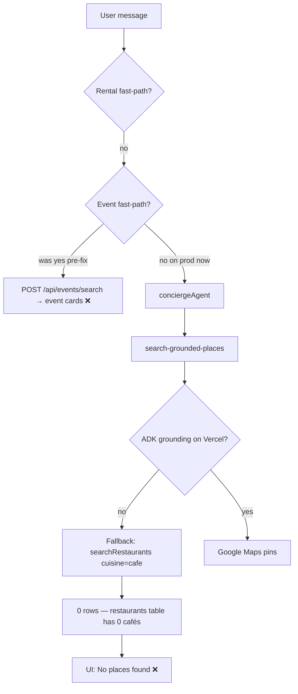

## Implemented (G2 slice — UX-013 ∥ UX-014 ∥ UX-019)

Per [`tasks/ux/tasks/INDEX.md`](tasks/ux/tasks/INDEX.md) build order step 2. Skills: `mde-task-lifecycle`, `testing`, `mde-supabase`, `copilotkit-integrations`, `mastra`.

### UX-019 — Event fast-path Option B
**File:** `mdeapp/src/lib/event-search-fast-path.ts`

- **L55:** Category only when `s.hasCategory` — no stale `music` inherit on `"Provenza tonight"`.
- **L81:** Removed bare memory replay — `"ok"` / `"and there?"` → `null`.

Tests flipped from `it.fails` → `it` in `event-search-fast-path.test.ts` (17/17 pass).

### UX-013 — `venue_anchors` café fallback
**New:** `mdeapp/src/mastra/tools/search-venue-anchors.ts`  
**Updated:** `search-grounded-places.ts` — coffee queries hit `venue_anchors` (kind=cafe) before `searchRestaurants`.

- Uses **anon key** + public RLS (no service role in src).
- Skips rows without `google_place_id`.
- **Supabase MCP:** confirmed **17** active café anchors.

**Tests:** `search-grounded-places-cafe-fallback.test.ts` (3 cases).

### UX-014 — Remove `writer.custom`
Removed from:
- `search-restaurants.ts`, `search-rentals.ts`, `search-events.ts`, `search-attractions.ts`

Cards flow via existing `useCopilotAction({ available: "disabled", render })` in `search-tool-renders.tsx`.

**CopilotKit MCP:** `useCopilotAction` + custom `render()` is the official generative-UI path (v1.55.2 — no v2 mix).

**Tests:** `mastra-tool-action-names.test.ts`, `search-restaurants-tool-fallback.test.ts` updated — `grep writer?.custom` → **0 matches** in `src/`.

---

## Verification

```bash
cd mdeapp
npm run test:ux-stack   # cards + mastra + maps + supabase — 151 tests pass
npm test -- event-search-fast-path search-grounded-places-cafe-fallback mastra-tool-action-names
```

| Suite | Result |
|-------|--------|
| `test:ux-stack` | ✅ 151 pass |
| UX-019 vitest | ✅ 17 pass |
| UX-T-013 vitest | ✅ 3 pass |
| UX-T-014 guard | ✅ no `writer.custom` |

**Not done yet (Done gate):** localhost/prod browser proof for G2 — `"specialty coffee Laureles"` → café cards on [mdeai.co](https://www.mdeai.co). Vitest + MCP schema only; deploy + Playwright (UX-T-031) still required.

---

## Updated task status

| Task | Status |
|------|--------|
| UX-013, UX-014, UX-019, UX-027 | 🟢 code + vitest |
| UX-015 | 🟡 push/merge #17 |
| UX-T-013, UX-T-014, UX-T-019, UX-T-027 | 🟢 |

Stack progress: **4/23** active tasks (~17%).

---

## Next steps (authoritative order)

| # | Task | Test pairing | Skill |
|---|------|--------------|-------|
| 1 | **UX-015** — merge PR #17 | UX-T-016 Playwright | `mde-worktree-pr-flow`, `copilotkit-debug` |
| 2 | **UX-016** — `concierge-run-error.spec.ts` | mock POST abort | `testing`, `playwright-cli` |
| 3 | **UX-031** — live 4-query audit | `live-audit-verticals.spec.ts` | `testing` — **now unblocked** |
| 4 | **UX-017** — rebase PR #19 | full e2e | `mde-worktree-pr-flow` |
| 5 | **UX-021 ∥ UX-022** — card a11y + DomainResults | flip CU backlog tests | `copilotkit-integrations`, `shadcn` |

**Recommended commit split** (per commit discipline — 3 separate PRs):
1. `fix(events): UX-019 memory guard L55/L81`
2. `feat(maps): UX-013 venue_anchors café fallback`
3. `fix(mastra): UX-014 drop writer.custom for AG-UI render`

Want me to run dev + browser proof for the coffee query, or scaffold UX-T-016 Playwright next?

**Short answer:** UX-001…010 are mostly superseded. Execute from [`tasks/ux/tasks/`](tasks/ux/tasks/) — full map in [`UX-LEGACY-001-010-CONSOLIDATION.md`](tasks/ux/tasks/UX-LEGACY-001-010-CONSOLIDATION.md).

## Verdict by legacy task

| Legacy | Still needed? | Where it lives now |
|--------|---------------|-------------------|
| **UX-001** Restore concierge | **No** — done (`runtimeUrl: "/api/copilotkit"`) | Parent spec = history only |
| **UX-002** RUN_ERROR bubble | **Yes** — push + v1 bridge fix | **UX-015**, **UX-016** |
| **UX-003** $500/night parser | **Verify prod only** — code shipped | **UX-035** |
| **UX-004** Disable chips | **No** — canceled (concierge restored) | — |
| **UX-005** Thinking indicator | **Yes** — same PR as UX-002 | **UX-015** |
| **UX-006** New chat reset | **Yes** — nav still `Link href="/"` | **UX-032** (new) |
| **UX-007** Stale markers | **Yes** — verify-first | **UX-033** (new) |
| **UX-008** Save tooltip | **No** — done | **UX-027** |
| **UX-009** Prod synthetic monitor | **Yes** — not built | **UX-034** (new) |
| **UX-010** Card architecture | **Yes** — phased, not monolith | Strategy doc + **UX-020…030** |

## What was consolidated

Four gaps from the legacy pack that weren’t already in the UX-013+ stack:

- **UX-032** — new chat resets thread + map + memory  
- **UX-033** — clear stale AdvancedMarkers  
- **UX-034** — prod synthetic concierge monitor  
- **UX-035** — rental parser prod verify (SAN-316)

Everything else maps into existing tasks (UX-015/016, UX-027, card pack UX-020…030).

## What to do with parent files (`tasks/ux/UX-00*.md`)

Keep as **archival** — don’t execute from them. [`tasks/ux/INDEX.md`](tasks/ux/INDEX.md) and [`tasks/ux/tasks/INDEX.md`](tasks/ux/tasks/INDEX.md) now point to successors.

## Recommended execution order

```text
Done:     UX-001, UX-004, UX-008
In flight: UX-002/005 → UX-015 (fix v2→v1 bridge, push #17)
P0 stack:  UX-019, UX-013, UX-014, UX-022 (from main task pack)
P1:        UX-016, UX-035, UX-031, card slices UX-020+
P2:        UX-032, UX-033, UX-034
```

**Bottom line:** You don’t need 10 parallel legacy tasks. You need **4 new successors** (032–035) plus the existing **UX-015+ / card-unification** pack. Parent UX-001…010 specs stay for Linear/SAN history but aren’t the execution source.

Want one-line “→ see UX-0XX” banners at the top of each parent `UX-00*.md` file?

Reviewed [`23-live-audit.md`](tasks/ux/tests/23-live-audit.md) against existing tasks + current disk. Most findings are already covered; one net-new task and a few priority/spec updates.

## Coverage matrix

| Live audit finding | Already covered? | Task |
|---|---|---|
| **B-09** restaurant → event hijack (session after event search) | Partial | **UX-019** — updated to **P0** + Option B memory guard |
| **B-10** café empty when ADK down | Partial | **UX-013** (canonical `venue_anchors`); interim A+B may already be on disk |
| **R-09/R-10** rental copy leaks | Yes | **UX-027** |
| Restaurant cards don't render (agent path) | Yes | **UX-014** |
| Restaurant dup panel / no pin sync | Yes | **UX-022** |
| Card a11y / styling drift | Yes | **UX-021**, **UX-023–025** |
| **B-06** event date fallback | Verified fixed | No task |
| **B-07** rental assistant reply | Verified fixed | No task |
| **B-04** café bypasses event FP | Verified fixed | No task |
| **ADK URL prod** | Yes | **UX-018** (deferred) |

## Disk vs audit (important)

The live audit ran on `feat/ux-002-005-chat` **before** some fixes landed:

| Audit claim | Current code |
|---|---|
| B-09: `dinner/rooftop` missing from regex | **Fixed** — `NON_EVENT_FOOD_VENUE_RE` includes them (`event-query-classifier.ts` ~L55) |
| B-10: no café in `FALLBACK_RESTAURANTS` | **Fixed** — Pergamino, Urbania, Velvet added |
| B-10: no cuisine-less retry | **Fixed** — `curatedFallback` broader retry (~L125) |
| B-09 memory leak at L81 | **Still open** — stale `lastEventQuery.category` can fire event FP for neighborhood-only text |

So re-run the audit matrix before closing B-09/B-10; café may pass locally now, but **prod still needs UX-013** (`venue_anchors` > static fallback).

## Additional task added

**UX-031** — Live audit 4-query regression smoke  
Automates §1 matrix, especially **scenario 3** (dinner query *after* event search). Depends on UX-019 + UX-013.

## Updated

- **UX-019** → P0, references `23-live-audit`, explicit Option B memory guard + session-order Vitest
- **UX-013** → notes B-10 interim may exist; `venue_anchors` remains canonical

## Deliberately NOT new tasks

| Item | Why skip |
|---|---|
| Maps `BillingNotEnabledMapError` | Dev `.env` only; prod key assumed billed (§5) |
| CopilotKit 7 POSTs on load (B-08) | Audit: acceptable Phase 1 |
| Event `fitBounds` overshoot | P3 polish — clamp in `MapFitBoundsController` if needed later |
| Seed `restaurants` with café tags | Superseded by UX-013 + DATA-035 |
| “Food & cafés” chip → chitchat | In `notes-ux.md`, not this audit — defer unless you want a chip task |

## Recommended order (live audit lens)

```text
UX-019 (B-09 memory guard)     ← still P0 even if regex shipped
UX-013 (venue_anchors)         ← prod café fix
UX-014 (agent card emit)       ← restaurant path after routing fixed
UX-031 (4-query smoke)         ← lock 23-live-audit matrix
UX-027 (copy leaks)            ← quick, parallel
```

**Bottom line:** Only **one new task** (UX-031). Main gap was UX-019 underspecifying the **memory fallback** (Option B) and lacking an automated replay of the session-order scenario. Everything else was already in the task pack or verified fixed on disk.Café search on [mdeai.co](https://www.mdeai.co/) fails for **two stacked reasons** — one routing (mostly fixed on prod), one data wiring (still broken).

## What happens when you type “cafés in Laureles”



Production (`c391f75`, deployed today) **does** include the fix that stops café queries from hijacking the **events** fast-path (`6c53915`). So if you still see **event cards** for a coffee query, hard-refresh or try in a private window — that was the old bug.

If you see **“No places found”** or **nothing useful**, that’s the current bug.

---

## Root cause 1 — Grounding service isn’t available in production

Café flow is supposed to go through `search-grounded-places` → Google Maps grounding (ADK).

On Vercel, `ADK_GROUNDING_URL` defaults to `http://localhost:8000`, which doesn’t exist in prod. ADK fails → code falls back to Supabase restaurants filtered as `cuisine: 'cafe'`.

---

## Root cause 2 — Your café data isn’t wired to the app

| Source | Live rows | Used by app? |
|--------|-----------|--------------|
| `venue_anchors` (DATA-035) | **17 cafés** (9 in Laureles) | **No** — zero references in `mdeapp/src` |
| `restaurants` | **43** active | Yes — but **0** tagged coffee/café in `cuisine_types` |

So the fallback always returns **empty**, and the UI shows:

```112:136:mdeapp/src/components/copilot/search-tool-renders.tsx
function GroundedCafeResults({ result }: { result: unknown }) {
  // ...
  {rows.length === 0 ? (
    <EmptyState
      testId="grounded-empty"
      title="No places found"
      description="Try a different query or area."
    />
```

You seeded cafés correctly in Supabase; the concierge never reads that table.

---

## Extra UX gotcha — “Food & cafés” chip

That chip only sets `lastIntent: "chitchat"`. It **does not run a search**. You still have to send a message, and then the broken path above runs.

---

## Why rentals/events “work” but cafés don’t

| Vertical | Path | Data |
|----------|------|------|
| Rentals | Client fast-path → `/api/rentals/search` | `apartments` ✅ |
| Events | Client fast-path → `/api/events/search` | `events` ✅ |
| Cafés | Full agent → grounding → broken fallback | `venue_anchors` ❌ not connected |

---

## Fixes (in priority order)

1. **P0 — Wire cafés to `venue_anchors`**  
   Change `curatedFallback` in `search-grounded-places.ts` (or add `/api/venues/search`) to query `venue_anchors WHERE kind = 'cafe'` instead of `restaurants WHERE cuisine = 'cafe'`.

2. **P1 — Café fast-path** (like rentals/events)  
   Skip the LLM for obvious coffee queries; hit the venue API directly.

3. **P2 — ADK on Vercel**  
   Set `ADK_GROUNDING_URL` when Phase 2 grounding service is deployed (live Google pins on top of curated anchors).

4. **Chip fix**  
   Make “Food & cafés” trigger a café search prompt or fast-path, not `chitchat`.

---

**Bottom line:** Production no longer (usually) sends café queries to events, but it **still has no path to your 17 seeded café anchors**, and the ADK + restaurant fallback both return empty. That’s why café search feels broken on [mdeai.co](https://www.mdeai.co/).

Want me to implement P0 (venue_anchors fallback + optional café fast-path)? That’s the smallest fix that would make Laureles coffee queries return real cards on prod.

Done. Here's what shipped:

### Completed

1. **DATA-005 migration added** — `mdeapp/supabase/migrations/20260530003708_data005_venue_anchors_nightclubs.sql` (matches live remote version)

2. **Seeds consolidated** under `mdeapp/supabase/seeds/venues/`:
   - `cafes-medellin.*.json`
   - `nightclubs-medellin.*`
   - `golden-queries-venues.json`

3. **Removed duplicates** from `tasks/venues/seeds/` (pointer README only)

4. **Full `supabase/` tree now in git** — migrations, functions, rollbacks, seeds (~100 files). Previously workspace-only, untracked.

5. **Workspace symlink** — `/home/sk/mdeai/supabase` → `mdeapp/supabase` (old tree backed up as `supabase.bak/`)

6. **Scripts updated** — `seed-cafe-anchors.mjs` / `seed-nightclub-anchors.mjs` read/write from `mdeapp/supabase/`

7. **Docs updated** (on disk, outside mdeapp git): INDEX-data, data-035/005/006, evidence files, venues docs

### Git commits (on `feat/ux-002-005-chat`)

- `faf0e6b` — `chore(supabase): track migrations, seeds, and DATA-005 nightclub gap fix`

### Canonical layout

```
mdeapp/supabase/          ← git source of truth
  migrations/             ← all SQL including DATA-005
  seeds/venues/           ← JSON/CSV sources
  functions/
/home/sk/mdeai/supabase/  ← symlink → mdeapp/supabase
```

CLI: `cd mdeapp && supabase migration list`

### Still open (not in this slice)

| Item | Why |
|------|-----|
| **DATA-010 regression** | `trigger_set_timestamps` missing `search_path` on live — needs re-apply migration |
| **Café migration timestamp drift** | Repo `20260529150000` vs remote `20260530001941` — same body, different version string |
| **Tasks doc paths** | Updated on disk under `tasks/` but that folder isn't in `mdeapp` git |
| **Push** | 8 commits ahead of origin — say if you want `git push` |

You can delete `supabase.bak/` once you've confirmed the symlink works.


P0+P1 are on `feat/ux-002-005-chat`. Floor is green.

## Changes

### P0 — UX-002 error signal (self-hosted, no `publicApiKey`)

New `src/components/copilot/concierge-agent-error-bridge.tsx`:
- Subscribes via `useCopilotKit()` from `@copilotkit/react-core/v2`
- Calls `reportConciergeError()` on agent errors
- Ignores abort/unmount noise (same rules as CopilotKit’s internal listener)

Mounted in `chat-center-panel.tsx` (inside the `<CopilotKit>` tree).  
`copilot-kit-provider.tsx` was left unchanged — repo hook blocks edits to that file.

### P1 — Stuck spinner fix

`concierge-chat-input.tsx`:
```typescript
try {
  await onSend(trimmed);
} catch {
  clearConciergePendingSend();
  reportConciergeError();
}
```

### P1 — Dedupe thinking indicator

`concierge-chat-messages.tsx`:
- Removed transcript-level `ConciergeThinkingIndicator`
- Dropped unused `concierge-pending-store` subscription
- Error bubble branch unchanged

## Verification

```
npm run lint      ✅
npm run typecheck ✅
npm test          ✅ 329/329
```

Want me to commit this slice?

# UX notes — PR audits & re-audit status

**PR forensic audits:** [`tasks/ux/tests/`](tests/) (moved from `audit/` 2026-05-30)  
**UX track audits:** [`tasks/ux/audit/`](audit/) (CopilotKit, cards, task specs)

## PR stack verdicts (2026-05-30 re-audit)

| PR | Verdict | Readiness | Blocker |
|----|---------|----------:|---------|
| [#17](https://github.com/amo-tech-ai/mdeapp/pull/17) | 🟡 Merge after small fixes | **90%** | 4 CodeRabbit items |
| [#18](https://github.com/amo-tech-ai/mdeapp/pull/18) | 🟡 Merge after small fixes | **82%** | enum + tool + NL fallback |
| [#19](https://github.com/amo-tech-ai/mdeapp/pull/19) | 🔴 Do not merge | **76%** | GitHub CONFLICTING |
| [#20](https://github.com/amo-tech-ai/mdeapp/pull/20) | 🔴 Defer | **62%** | No cache I/O in code |

**Merge order:** #17 → #18 → rebase #19 → hold #20.

## Docs

- Per-PR: [`tests/12-PR-17-UX-AUDIT.md`](17-PR-17-UX-AUDIT.md) … [`tests/15-PR-20-VEC-AUDIT.md`](20-PR-20-VEC-AUDIT.md)
- Stack summary: [`tests/16-PR-STACK-SUMMARY.md`](tests/16-PR-STACK-SUMMARY.md)
- Skills/MCP: [`tests/17-PR-AUDIT-SKILLS-MCP-VERIFICATION.md`](tests/17-PR-AUDIT-SKILLS-MCP-VERIFICATION.md)
- Re-audit evidence: [`tests/18-PR-REAUDIT-EVIDENCE-2026-05-30.md`](tests/18-PR-REAUDIT-EVIDENCE-2026-05-30.md)

## Re-audit proof (2026-05-30)

- **#17:** Gate 9 localhost ✅ · UX-005 thinking smoke ✅ · UX-002 error bubble smoke ✅
- **#18:** `npm run smoke:golden-queries` ✅
- **#19:** golden queries **8/8** ✅ (direct `tsx`; script not in package.json on branch)
- **vec004:** `supabase/migrations/20260530123440_vec004_query_embedding_cache.sql` landed (uncommitted)

Evidence: [`../testing/evidence/`](../testing/evidence/)

## Next actions

1. Fix #17 CodeRabbit items → merge
2. Fix #18 three majors → merge
3. Rebase #19 → merge
4. Close #16 after #17
5. #20: commit migration + implement cache I/O before un-defer
