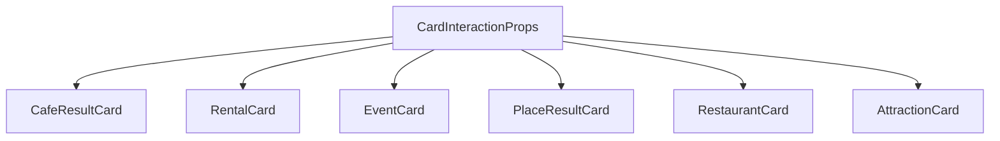

# UX-020 — CardInteractionProps + shared types

## Purpose

Single source of truth for map-sync props (`pinId`, `onSelect`, `onOpenDetails`, `selected`, `testId`, `resultKind`) used by all search result cards.

## Affected files

| Action | Path |
|--------|------|
| Create | `mdeapp/src/components/cards/card-interaction-props.ts` |
| Create | `mdeapp/src/components/cards/index.ts` (barrel) |
| Create | `mdeapp/src/components/cards/__tests__/card-interaction-props.test.ts` |
| Modify | `cafe-result-card.tsx`, `rental-card.tsx`, `event-card.tsx`, `place-result-card.tsx`, `restaurant-card.tsx`, `attraction-card.tsx` — extend type only |

## Implementation

1. Add types per strategy §3 (`UX-010-CARD-UNIFICATION-STRATEGY.md`).
2. Export `DEFAULT_TEST_IDS` + `defaultTestId(kind)`.
3. Re-export from `components/cards/index.ts`.

## Tests

- Vitest: `card-interaction-props.test.ts` — `defaultTestId` per `ResultKind`.

## Acceptance

- [x] Six domain cards extend `CardInteractionProps` (cafe, rental, event, place, restaurant, attraction).
- [x] No runtime behavior change in this task alone.
- [x] `npm run lint` + `npm test -- card-interaction-props` + `npm run build` green on branch @ `9123e14`.

## Testing & proof

**Persona:** Camila / Tourist — no visible change; types-only foundation for UX-023 shell.

**Pre-ship (worktree `wt-ux-020`):**

```bash
cd mdeapp  # or .worktrees/wt-ux-020
npm run lint
npm test -- card-interaction-props cafe-result-card rental-card
npm run build
```

**Implementation proof (2026-06-02):**

| Check | Evidence |
|-------|----------|
| `card-interaction-props.ts` exists | `0a326ad` — 57 lines, `ResultKind`, `CardInteractionProps`, `DEFAULT_TEST_IDS` |
| Six cards wired | `grep CardInteractionProps src/components/copilot/*-card.tsx` |
| Café testId stable | `DEFAULT_TEST_IDS.cafe` = `grounded-card` (matches existing `cafe-result-card.test.tsx`) |
| PR scope | **9 files only** — no CoAgent / chat shell (PR-02/03 stays separate) |

## Task-verifier (2026-06-02)

| Phase | Result |
|-------|--------|
| Spec vs UX-010 §3 | 🟢 Types match; `resultKind` optional on cards for backward compat |
| Disk (pre-merge) | 🟢 On branch `feat/ux-020-card-interaction-props` @ `0a326ad` |
| Scope | 🟢 Types-only; rebased onto `main` `9123e14` (dropped bundled PR-02/03) |
| Depends / blocks | 🟢 Blocks UX-023/024 correctly |
| Soak | 🟢 Safe to merge during soak (no frozen surfaces) |

**Spec score:** 92/100 — updated "five cards" → six; added restaurant/attraction to affected-files table.

## Flow diagram



## Next steps

1. **UX-023** — `ResultCardShell` extraction (after soak gate or when approved).
2. **UX-024** — hover→pin parity on rental/event.
