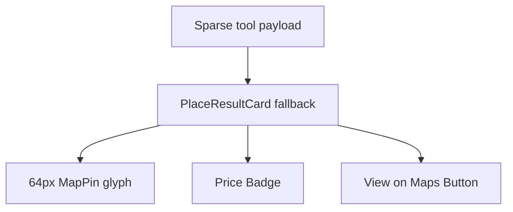

# UX-028 — PlaceResultCard fallback upgrade

## Purpose

Bridge quality gap for unknown/sparse categories and interim restaurant path.

## Changes

- 64×64 `bg-muted` + `MapPin` icon placeholder
- `priceLabel` → `<Badge variant="outline">`
- Maps link → `<Button size="sm" variant="outline">View on Maps</Button>`
- `overflow-hidden` on root
- Optional `onOpenDetails` for future panel

## Acceptance

- [ ] Fallback card visually closer to café cards.
- [ ] Used only when no domain-specific card (document in comment).
- [ ] Tests updated.

## Flow diagram

## Shipped scope (2026-06-01) — SAN-440 / PR #35

Restaurant **hero photos** via Places `id,photos` + `/api/places/photo` proxy on `POST /api/restaurants/search` (not full PlaceResultCard UI polish).

| Gate | Result |
|------|--------|
| PR #35 merged `d9ce40c` | ✅ |
| Prod API El Poblado sample | ✅ PROXY URLs (not empty `imageUrl`) |
| Prod visual `01-restaurants.png` | ✅ [`visual-cards-prod/`](../../testing/evidence/visual-cards-prod/) |
| `restaurantPhotoPlaceholders` (synthetic) | ✅ 0 |

## Verification (2026-05-31) — original spec scope

| Claim | Result |
|-------|--------|
| Interim until UX-025 | ✅ Correct scope |
| Required testId today | 🔴 no default — fix in UX-021 |
